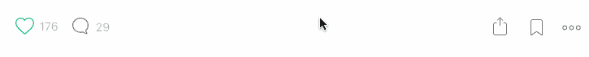

# 2018 创业新闻包

> 原文：<https://medium.com/swlh/2017-startup-news-kit-20bbb4fb5438>

在纽约创始人协会的每个新成员开始时，我都喜欢和新成员分享一些我最喜欢的新闻来源。对于许多刚起步的创业者来说，从正确的来源获取正确的消息真的可以帮助你融入全球创业和技术社区。

如果那句老话，“你是和你相处时间最长的五个人的平均值。”是真的，那么互联网的一个令人难以置信的优势是，你可以定制你决定花最多时间与谁的意见和知识。

下面的列表可能有数百个链接，但为了简单起见，我将把重点放在我每天阅读的核心建议上。我还将主要关注新闻来源。我可能会写另一篇博文，主题是具体的博客和未来要关注的个人。欢迎在下面的评论中添加更多你喜欢的新闻来源，并投票选出最好的！

# 对所有人:

这是我最喜欢的新闻来源！Nuzzel 的算法从你的个人网络中找到热门文章。更棒的是，它们还能让你很容易地看到影响者网络中的热门文章。

[Techmeme](https://www.techmeme.com/)——如果你想知道整个行业在任何一天都在谈论什么，那么这就是你的一站！由编辑和优秀算法组合策划的重要科技新闻。

[发布代号](https://www.launchticker.com/stories)——高效的科技新闻，被分解成原文最重要的三句话摘要。真正擅长从新闻中提取最重要、最本质、最相关的信息，为你节省时间。

[黑客新闻](https://news.ycombinator.com/) —专注于计算机科学、技术和创业的社会新闻网站。

从华尔街到沙丘路，丹·普里马克的每日时事通讯披露了关于交易和交易者的新闻。

[《财富》条款清单](http://fortune.com/gettermsheet/) —《财富》关于风险资本交易和交易撮合者的每日时事通讯。

[产品搜索](https://www.producthunt.com/)——因为它是互联网上最有趣的网站之一！因为产品搜索是最好的新产品的策展，每天都有。你几乎总是会带着新的和令人兴奋的东西离开网站。

天使名单(Angel List)——如果你想在创业世界中“存在”,那么你需要活跃在 AngelList 上。你可以找到热门公司，进行招聘，[投资辛迪加，](https://angel.co/l/YHKdo)联系其他创始人，等等。他们最近还收购了 Product Hunt！

# 对纽约人来说:

[数字纽约之声](http://www.digital.nyc/voices)——来自纽约商业和政府领导的建议和想法。

AVC——唯一一个上榜的博客，因为弗雷德·威尔逊富有洞察力的帖子已经成为每日必读。来自社区的评论通常和原始内容一样好。

[NYC Innovation collection](http://www.nycinnovationcollective.com/)—这是一份半月刊时事通讯，是纽约市 70 多家创业加速器、孵化器和创新项目聚集在一起共享资源和新闻的副产品！

[Gary’s Guide](http://www.garysguide.com/)—每周收集纽约发生的所有创业和科技事件。Gary 每周在管理信息方面做得非常好，哦，顺便说一下，他戴着一条红色领带，你可以在 IRL 上做广告！

[查理·安东内尔的每周时事通讯](http://www.thisisgoingtobebig.com/the-newsletter/)——每周一上午纽约市创新社区活动的策划列表。

[哥特风](http://gothamist.com/)——再也不要错过任何一个纽约文化。从 cronut 上的突发新闻，到市长苏打税丑闻，到地铁系统的变化，到班克斯中央公园的弹出式看台，Gothamist 一直在报道你！

*还有，这些中帖只是冰山一角。如果你喜欢这篇文章，请订阅下面的* [*我的简讯*](http://www.siskar.co/) *以获得更多的资源和知识。还有，一定要听我的播客，* [*今日雄心*](http://www.siskar.co/ambitiontoday/) *来学习最有野心的人是如何建立他们成功的商业帝国的。*

