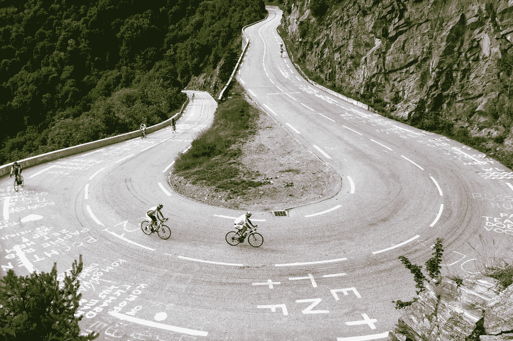
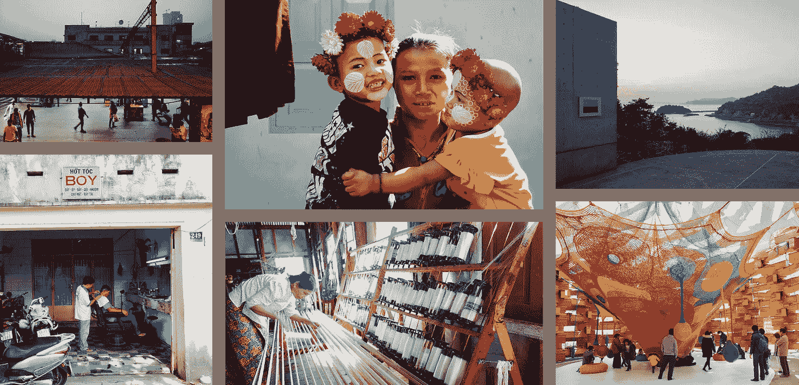
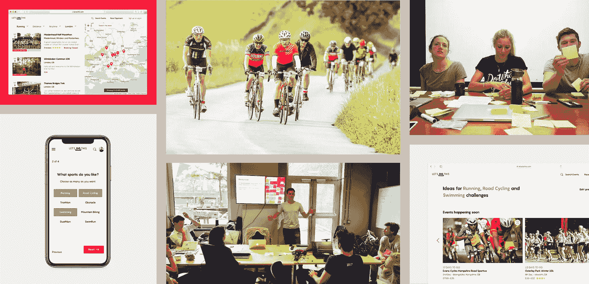
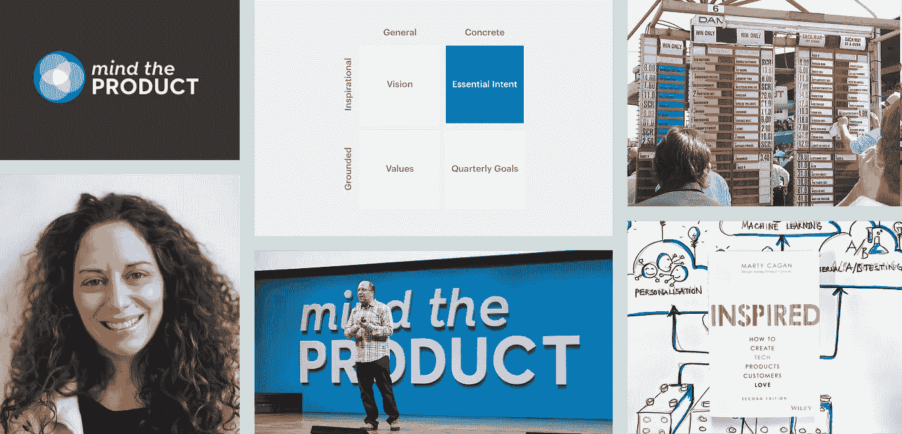

# 2018——设计的一年

> 原文：<https://medium.com/swlh/2018-a-year-in-design-19921520fd86>

## 亚洲最好的设计，全身心投入到一个产品角色，并找到一个教练。这是拥抱变化的一年。

[The hairpin challenges of Alpe d’Huez](https://www.theguardian.com/sport/gallery/2015/jul/25/alpe-dhuez-history-heroes-tour-de-france-in-pictures)

从我记事起，我就喜欢三样东西。我步行去学校时，三人一组数着步数。我吃了三个麦芽饼。我甚至曾经[做了一个 app，让人们分享三个链接](https://laughingsquid.com/3-up-collect-and-share-3-links-with-people-youre-interested-in/)。

当想到回顾过去的一年时，很自然地会想到三件事:

*   我放下工作去探索亚洲
*   我从一个宽泛的设计角色转变为一个产品角色
*   我优先考虑找一个教练来支持我的发展

不过，这一年开始时并没有这么明朗。[去年年底](/inside-design/2017-a-year-in-design-b751ff59f355)从纽约搬到伦敦后，我和妻子 2018 年唯一的计划就是 1 月 1 日飞往孟买。从那里开始，我们要找出我们前进的道路。

## 休息一会儿去探索亚洲

它始于维杰。他年近 50，满头银发，穿着灰色的裤子和衬衫。他是我们的导游，好心地在凌晨 4 点接我们，带我们逛孟买的市场。当花、蔬菜和鱼在我们周围进行物物交换时，我们看到了这些景象。我们对世界上最繁忙和人口最多的城市之一的介绍以在小路上喝一杯马萨拉茶而结束——一种甜而辣的味道让我们为接下来的一天做好准备。

从一月到三月底，我们从印度旅行到日本，访问了中间的几个国家。欢迎你过来看幻灯片。我会告诉你在 Wayanad 的咖啡种植园醒来，在 Ella 的山上徒步旅行和在家做饭，到茵莱湖上的漂浮村庄和我们在 Phú Quốc.的日常 pia coladas。从这里我会注意到亚洲最令人印象深刻的设计实际上是香港的[市内值机](https://www.businessinsider.com/hong-kong-solves-airport-problem-2014-8?r=US&IR=T)，这是一种地铁服务，省去了我们在这个城市的最后一天拖着行李到处跑的麻烦。我可能会通过确认我们在东京试图重现《迷失东京》中的卡拉 ok 场景来结束我们的故事。

休息是什么感觉？我感觉自己正在兑现一个长期的承诺，满足自己对东方文化的好奇心。结果，世界感觉稍微变小了，在某种程度上，我对塑造他人生活的事物有了更大的欣赏。虽然长时间的旅途比我想象的要辛苦，但这次旅行让我脱离了在纽约时建立起来的永不停歇的日常生活。在我们休息的时候，我挑战自己重新评估我想如何使用我的能量。我发现自己在阅读像大卫·鲍依这样的人如何在他的职业生涯中改变方向，以及冲绳的 T2 人如何让每一天都有意义。我把这个灵感带到了我的日记中，在那里我开始思考在美国工作了近八年后，我将如何重新找回我对设计的热情和我的祖国。

## 深入了解产品

我回到了伦敦，带着一份我想与之交谈以帮助我找到人生道路的人的名单。幸运的是，人们接受了我的邀请，美式聊天开始了。我的主要目标是更好地了解伦敦的风景。代理机构提供的服务有哪些特点？内部团队是如何构建产品的？这些学习帮助我描绘出我如何才能最好地做出贡献，以及这些环境将如何塑造我的未来发展。为了帮助我更好地了解团队，我开始着手新的项目。

这是我的第四个项目，当时我出现在钱瑟里巷的一家 WeWork，这是我之前从未体验过的城市区域。我是来帮助一家名为[的体育创业公司的，让我们开始吧](https://www.letsdothis.com/)。简而言之，该公司列出并出售耐力运动赛事的门票——从伦敦的 5 公里赛跑到洛杉矶艰难的泥地障碍赛，再到悉尼的铁人三项赛。我的工作是观察产品团队的结构和方法，并介绍以用户为中心的实践，以帮助确定我们可以在哪里以及如何为客户创造价值。当我们测试启动项目和计划练习的新方法时，团队是开放和信任的。我们还开启了发现阶段，并与新老顾客的不同群体合作，以了解他们在考虑事件时的动机和行为。

我们合作得越多，我就越开始考虑追求一个以产品为中心的角色。除了创建早期公司的兴奋之外，我之前学到的一些经验让我对这个决定充满信心。在渗滤液工作期间，我在塑造品牌、产品和员工体验方面发展了广泛的技能。回想起来，我成为了一个多面手，在这个世界上，我最感兴趣的是我们如何利用技术来改善我们的社区和我们周围的服务。其次，我亲眼看到了[产品管理的商业导向](https://twitter.com/johnmaeda/status/970360493344018432?lang=en)在与设计和工程合作开发软件时的价值。为了积累这些知识，是时候让我承担起一个角色，在这个角色中，我可以发展沟通产品管理和设计所需的技能。对我来说，好消息是团队支持我的计划，我在 10 月份成为全职员工。为了支持我从设计到产品的转变，我在公司外部寻找可以指导我成长的人。

## 寻找蔻驰

在都柏林呆了几天后，我在回伦敦的飞机上，注意到坐在我旁边的女人正在读一本关于产品开发的书。我知道在某个时候我会问她这本书是否值得一读。我等待我的时间，最有可能的支持椒盐卷饼和杜松子酒和滋补品。然后我们聊了聊。我记不起她对这本书的看法，但她是一名顾问，正在参加一个会议后回家的路上。原来她正在和我的朋友[罗布·博耶特](https://medium.com/u/14bb8e32e402?source=post_page-----19921520fd86--------------------------------)合作一个项目。在我告诉她罗布的秘密后，我们谈到了我的情况以及我对下一个角色的期望。这让她把我介绍给了凯特·勒托。

我渴望见到凯特。她在雅虎等公司的经历。Moo 以及最近作为教练和顾问的经历似乎好得令人难以置信。我们从埃克斯茅斯市场的莫里托餐厅开始午餐。在几个小盘子里，我们交换了纽约和伦敦的故事，凯特问了我几个问题，关于我为什么决定进入产品角色，以及我希望从与教练的合作中获得什么。我觉得这是化学测试。我们的动机会一致吗？对于跨职能团队如何更好地合作，我们有共同的观点吗？我首先谈到了我对技术变革的热情，以及对如何更好地理解如何将产品战略与业务增长联系起来的兴趣。我还分享了我在渗滤液中学到的一课。我解释说，回想起来，我相信我会受益于外部视角，帮助我把握在我们发展产品和业务时遇到的机遇和障碍。展望未来，对我来说重要的是找到一个人，他不仅能指导我渴望发展的新技能，还能不带偏见地挑战我们将要做出的决定。在接下来的几个问题之后，我很高兴地告诉大家，我们已经开始计划行程了。

我们每月开一次工作会议，然后在中间的几周通过电子邮件讨论话题。我们仔细分析了我以前在[产品轮框架](https://www.romanpichler.com/tools/product-management-framework-3/)方面的经验，看看我的优势在哪里，以及我们可以努力的领域。这有助于放大主题，包括从产品功能思维转移到[运行实验](https://www.mindtheproduct.com/2017/03/get-team-experimenting-using-one-little-word/)，如何[测量用户行为](https://www.mindtheproduct.com/2017/08/product-metric-matters-josh-elman/)，以及理解[基本意图](https://www.gsb.stanford.edu/insights/greg-mckeown-pursue-only-what-essential)如何帮助我们采取更有纪律的方法。我希望我能早点找到一个教练。虽然我们的合作才刚刚开始几个月，但能接触到凯特的智慧和建议让我觉得比任何薪水都要丰富。

2018 年是拥抱变化的一年，我们从美国搬到了伦敦。与设计和技术社区的重新联系有时感觉很熟悉，但当我发现新的景观时，有些感觉很陌生。这是自省的一年，我在评估哪些事情对我的下一章至关重要，哪些事情应该放弃。作为一个众所周知会选择跑步路线以[描绘曼哈顿](https://www.instagram.com/p/34IIGDDHPq/)的人，我爱上“让我们做这个团队”和他们的任务可能并不奇怪。我有一种感觉，我会反思过去的一年，作为一名设计师，这一年发生了很多变化。通过进入产品角色，我的前进之旅将走上一条不同的道路。

这也是我生命中新声音的一年。从[我读过的书](https://byrslf.co/reading-amongst-the-noise-d4f8e07f5664)到那些给我建议帮助我接受新挑战的朋友。我很高兴能与我的团队和 Kate 一起解决新的学习课题，从我们的市场商业模式到产品开发的实验方法。最重要的是，我一直在思考如何最好地利用我过去的经验，同时对新的思维和工作方式保持开放。

在 [*原则*](https://www.principles.com/) — *“进化是宇宙中唯一最伟大的力量；这是唯一永恒的东西，它驱动着一切。”我期待着 2019 年将带来的新挑战，这些挑战将有助于我自己和我们公司的发展。我还计划在新的一年里抽点时间享受英国美食，比如美酒和乘坐红色巴士。祝大家新年快乐。*

## 这篇文章发表在 [The Startup](https://medium.com/swlh) 上，这是 Medium 最大的创业刊物，拥有+405，714 名读者。

## 在此订阅接收[我们的头条新闻](http://growthsupply.com/the-startup-newsletter/)。

