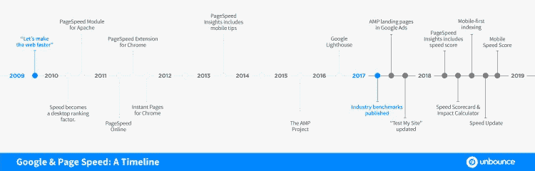
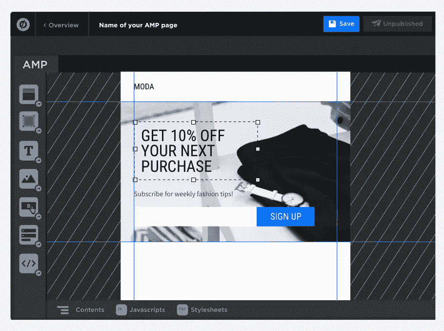

# 2019 年是页速之年。你准备好了吗？

> 原文：<https://medium.com/swlh/2019-is-the-year-of-page-speed-are-you-ready-a5269eca80b>

*由* [*科林·拉夫兰*](https://twitter.com/colinloughran) *，内容创建者在拆封时*

页面速度很重要。

我们已经听了很多年了，尽管我们中的任何一个人听之任之都是可以原谅的。

毕竟，还有其他更重要的事情。营销人员一直忙于确保内容符合 GDPR 标准。我们已经安装了 SSL 证书，确保我们的页面是移动响应的，并进行了转换优化实验。

我们中的一些人有孩子要抚养。(还有人，狗。)

但谷歌最近发出了一些严重的信号，表明缓慢的加载是一个你不能再睡大觉的问题。

事实上，如果我们看看谷歌的行动，不可否认的是， **2019 年将是页面速度之年**，闪电之年。今年，快内容和慢内容的区别变成了在搜索结果中出现(无论是付费的还是有机的)还是完全消失的区别。

不服气？让我们一起探索证据。

# 谷歌一直说速度很重要

营销人员没有认真对待谷歌关于页面速度的最新信息的原因之一是，该公司要求我们加快速度至少有十年了。

早在 2009 年 6 月，谷歌启动了其[“让网络更快”](https://googleblog.blogspot.com/2009/06/lets-make-web-faster.html)计划，旨在实现联合创始人拉里·佩奇“像翻杂志一样快地浏览网页”的愿景

“Let’s make the web faster” video posted on June 22, 2009 (via [YouTube](https://www.youtube.com/watch?v=IWWBnJEsUtU))

这些不仅仅是空话。这一举措标志着谷歌活动的爆发，包括:

*   让速度成为桌面搜索的排名因素(2010)
*   发布火狐(2009)和 Chrome (2011)的页面速度工具
*   增加了向 Chrome 预加载第一个搜索结果的功能(2011)

但那是将近十年前的事了，谷歌紧随其后……几乎一无所获。数字营销人员和网络开发人员认为他们专注于其他事情是安全的。

然后，在 2017 年 2 月，谷歌大规模地回到了速度的主题，发布了一份行业基准报告[,从那以后一直被广泛分享。](https://web.archive.org/web/20170822182411/https://www.thinkwithgoogle.com/marketing-resources/data-measurement/mobile-page-speed-new-industry-benchmarks/)

基准测试的第一个版本发现**平均移动登录页面需要 22 秒来加载**。

这个平均值在 2018 年下降到 **15.3 秒，但仍然是一个重大问题。(如果你想发自内心地提醒自己，为什么平均 15 秒的等待仍然是个大问题，那么就屏住呼吸等那么久。)**

虽然 2009 年的核心信息“速度很重要”是一样的，但谷歌现在在报告中警告说，“消费者比以往任何时候都要求更高。能够提供快速、顺畅体验的营销人员将从中受益。”

# 谷歌和页面速度:时间线

基准报告敲响了警钟。就像“让网络更快”一样，它先于谷歌的一系列活动，这一次激光聚焦于移动页面速度。以下是一些你应该关注的更重要的时刻:

## 2017 年 5 月:谷歌向 AdWords 引入 AMP 登陆页面

AdWords(现在的谷歌广告)的这一更新使广告商可以将他们的移动搜索广告指向加速移动页面(AMP)，这是一种网页的超轻标准，旨在不到一秒钟内在移动设备上加载。这是迄今为止最强烈的迹象，表明**谷歌希望你大力支持 AMP。**

## 2017 年 6 月至 2018 年 2 月:谷歌使其工具更加坚持

在这个时期，像 PageSpeed Insights 和“Test My Site”这样的性能工具开始对速度的提高做出更有力的声明。今年 2 月，谷歌甚至宣布了两款新工具。[移动速度记分卡](https://www.thinkwithgoogle.com/feature/mobile/)可以让你对比十个竞争对手来衡量你的域名的加载时间。并且[影响计算器](https://www.thinkwithgoogle.com/feature/mobile/)产生一个你通过加速你的网站看到的收入影响的估计。

## 2018 年 7 月:谷歌“速度更新”下降

虽然速度自 2010 年以来一直是桌面搜索结果的排名因素，但“速度更新”对移动搜索应用了更强的标准。除了移动优先的索引之外，这给网站创建者带来了新的压力，他们需要确保他们的移动登录页面体验是快速和吸引人的。

## 2018 年 7 月:移动速度评分加入谷歌广告

虽然移动速度分数对你的每次点击成本(CPC)没有直接影响，但加载时间已经影响了你的质量分数，因为它们决定了登陆页面的体验。通过隔离移动加载时间，谷歌广告现在使得“诊断和提高你的移动网站速度变得更加容易。”提示，提示。

# 谷歌正在强制提高手机页面速度…

自 2009 年以来，谷歌一直在提出的一个论点是——通过发布 PageSpeed Insights、Lighthouse、“测试我的网站”、速度记分卡、影响计算器和移动速度分数等工具和指标——速度很重要。

然而，自 2017 年以来，这一论点变得更加响亮。虽然这个时间线上没有一个单独的行动或公告会让你惊慌失措，但值得记住的是，谷歌温和的提醒或多或少会成为强制性的。

例如，在 2016 年，你可以安全地将 SSL 认证放在你的“最好拥有”列表中，因为谷歌承诺的只是加密网站在搜索排名中的小幅提升。不错，有，但不重要。2018 年，谷歌 Chrome 开始主动将非 HTTPS 网站标记为“不安全”

这就是谷歌鼓励变革的方式:[先是胡萝卜，然后是大棒](https://www.theregister.co.uk/2018/02/08/google_chrome_http_shame/)。

# …但是营销人员对此做了些什么呢？

Unbounce 想知道，如果有的话，数字营销人员正在做些什么来满足谷歌的新绩效标准。因此，在今年[行动号召会议](https://calltoactionconference.unbounce.com/recap-2018/)的“打开内部”帐篷里，我们对与会者进行了一次非正式调查。

参与者可以选择他们想要的任何页面。我们一起通过谷歌的“测试我的网站”工具运行选定的页面，并记录结果。

An attendee uses “Test My Site” at CTAConf 2018\. Unbounce wanted to know, how fast are you?

我们的数字远远超过基准。考虑到 CTAConf 是一个数字营销会议，这并不令人震惊。平均加载时间为 **10.27 秒**，比谷歌 2018 年的基准测试快 5 秒。

但这并不全是好消息，情况有多糟糕让我们吃惊:

> 我们在 CTAConf 上测试的 188 个与会者登录页面中，只有 1.6%在三秒内加载。我们测试过的没有一个能比它加载得更快。

这很让人恼火，尤其是因为谷歌说 53%的访问者在三秒钟后就弹回来了。

这意味着即使是精明的营销人员也没有转换的机会，因为大多数潜在客户在内容加载之前就已经反弹了。

想象一下，当你为按钮的颜色或标题的长度感到紧张时，却发现大多数点击你广告的人根本不会看到最终的登陆页面。

# 我们的宣言，或者说页面速度意味着什么

作为登录页面的市场领导者，Unbounce 认识到，能够以极快的速度登录是我们客户的一大优势。

我们很高兴将它作为我们 2019 年的优先事项。同时，虽然，我们也想消除一些障碍，以建立更快的登陆页面。

## 技术挑战

在过去的几个月里，我们的开发人员一直在为谷歌的 PageSpeed Insights 提出的建议优化 Unbounce 页面。这一系列技术改进(我们称之为**速度提升**)自动处理了许多[技术细节](https://developers.google.com/speed/docs/insights/rules)，这些技术细节可能是提高性能的障碍，尤其是如果开发时间很紧或者(现实一点)不存在的话。

## 速度与美丽

关于加速的另一个症结是，很少有营销人员愿意为了更快的加载时间而牺牲视觉效果。图像文件的大小已经增加，以匹配现代移动设备更大的显示分辨率和更高的像素密度，这是过去三年平均页面大小翻了一番的原因之一。

通过增加对超轻 SVG 图像的支持，以及最近在 Unbounce builder 中集成免费的 Unsplash 图像库，我们正在帮助营销人员在不影响登录页面的情况下保持事物看起来流畅。

我们正努力在不久的将来创造更多的优化机会。结果将是猎豹速度——不，不，是背上绑着火箭的猎豹速度——但不需要牺牲视觉诱惑或创造性控制。

# 打开+ AMP 登录页面

然而，在提高移动设备的页面速度方面，加速移动页面(AMP)设立了黄金标准，它提供的加载时间在 3G 连接下通常要快得多，在 4G 连接下不到一秒。

AMP 的实施也有民主化的效果。考虑到世界上 70%的人使用 3G 或更慢的连接，以及[网络中立的废除意味着更多的美国互联网用户可能会发现自己处于慢车道](https://phys.org/news/2017-12-fast-lanes-web-net-neutrality.html)，为旧设备设计和更慢的连接速度意味着连接更多的人。

但是 AMP 也很难。正如 Unbounce 的 Larissa Hildebrandt 在最近的一篇文章中所说，“AMP 框架创建快速页面的原因是它太严格了。”

实现它通常需要了解 AMP 专用标记的细微差别，包括 HTML 的限制性版本和截短的 JavaScript 库。页面由 Google AMP Cache 提供，这是一个基于代理的 CDN，可以帮助页面加载得更快。总而言之，验证需要严格遵循 AMP 项目制定的严格设计原则[。](https://www.ampproject.org/about/amp-design-principles/)

> 如果这一切听起来像是正在形成的致命头痛，那么你是对的。

虽然 Unbounce 对支持 AMP，**非常感兴趣，但我们希望确保我们的客户能够快速轻松地实施。**因此，当 Unbounce 在 2019 年初推出对 AMP 登录页面的支持时，您将能够使用我们的拖放构建器立即创建 AMP 登录页面。

我们也不希望你牺牲创造性的控制，所以 Unbounce 允许包含 AMP 兼容的定制 CSS、JavaScript 和 HTML。只要它通过验证，您就可以包含它。发疯吧。我们喜欢我们的社区在我们的平台上创新。

最终，无论你采取什么方法，没有一个营销人员能够在 2019 年忽视页面速度。移动速度可以对付费广告支出和你的转化率产生巨大影响，谷歌迄今的行动表明，该搜索引擎正在打击所有设备的下载速度慢的问题。网络将会提速瘦身，那些不符合新范式的将会被甩在后面。

谢天谢地，如果 **2019 年是页面速度之年**，那么你还有一些机会开始提速。

*在*[*unbounce.com*](https://unbounce.com/landing-pages/2019-is-the-year-of-page-speed/)*阅读全文，原载于 2018 年 10 月 22 日。*

[*脸书*](https://www.facebook.com/Unbounce/)*|*[*LinkedIn*](https://ca.linkedin.com/company/unbounce)*|*[*Twitter*](https://twitter.com/unbounce)*|*[*insta gram*](https://www.instagram.com/unbounce/)

## 这篇文章发表在 [The Startup](https://medium.com/swlh) 上，这是 Medium 最大的创业刊物，有+ 381，862 人关注。

## 在这里订阅接收[我们的头条新闻](http://growthsupply.com/the-startup-newsletter/)。

