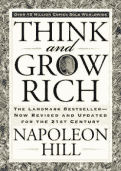

# 2019 千禧一代创业者必读书籍

> 原文：<https://medium.com/swlh/2019-must-read-books-for-millennial-entrepreneurs-51f45634eecc>

我的藏书正在疯狂增长。

以每周阅读 1 本为目标，我读过的最值得读的书似乎仍然是 2017 年开始时的书。而像《不给一个 F*ck 的微妙艺术》这样的新版本是很好的读物，提供了很好的观点。它们要么看起来是原版书的副本，要么不太切中要害。

下面的列表是我收获最大并一直用到今天的书。它们也是你在 2019 年需要读的书！

# [1。泰坦巨人的工具——蒂姆·菲利斯](https://www.booktopia.com.au/tools-of-titans-tim-ferriss/prod9781785041273.html)

**相信我，如果你还没有读的话，请读一下……**

这本书没有充满蒂姆的想法。这是几十个人就他们专业的话题提出的一些建议。

它被分成几类:健康、富有、聪明，就像《玩具总动员》的书一样(真的很好)。

你也可以阅读“导师部落”,本质上是完全一样的东西。尽管如此，我认为《泰坦的工具》更好。

# [2。钩住—近红外 Eyal](https://www.booktopia.com.au/hooked-nir-eyal/prod9780241184837.html)

你如何让人们迷上你的产品并不断回来购买更多？

Hooked 带你了解整个循环，以及人们从潜在客户到客户再到回头客的不同步骤。

如果你正在开始一项电子商务业务，并且不知道你在做什么，从这本书开始吧。

# [3。一件事——加里·凯勒](https://www.booktopia.com.au/the-one-thing-gary-keller/prod9781848549258.html)

如果你想摆脱所有日常杂念，比如:电子邮件、信息、会议等，提高生产力。

它将带你了解如何确定你需要做的唯一一件事来达到下一个层次。它告诉你如何选择一件你需要在一天中完成的事情，以及如何忽略所有其他实际上不会让你有任何进展的任务。

如果你想最大化你的生产力，你应该读这本书。

# [4。思考致富——拿破仑·希尔](https://www.booktopia.com.au/think-and-grow-rich-bevelled-edge-edition--napoleon-hill/prod9781585424337.html)

如果你没读过这本书。你需要。

这是激励我在 2017 年初开始写回的书。

它会带你经历推动你开始的确切步骤，而不是想着开始。

我的解释不公平，请相信我说的话。读吧，现在就读！

# [5。埃隆·马斯克——阿什莉·万斯](https://www.booktopia.com.au/elon-musk-ashlee-vance/prod9780062301253.html)

我喜欢传记。他们给你从别人的错误和/或成功中学习的能力，并把它们应用到你自己的生活中。

在我读过的所有书中，这本是最好的。不仅仅是因为我认为埃隆·马斯克是不可思议的，它还提供了一个关于他如何开始的真正深入的叙述。

# [6。不可动摇——托尼·罗宾斯](https://www.booktopia.com.au/unshakeable-tony-robbins/prod9781471164934.html)

这本书非常关注美国，围绕美国股票市场/金融业。尽管我来自澳大利亚，我仍然发现这本书非常有帮助，尤其是在复利方面。

从这本书里，我了解到，考虑到我存的钱的数量，如果我在未来的 20 年里每月存 1000 美元，我会是一个百万富翁。不费吹灰之力，我所要做的就是存一点钱。

用这本书来为你已经拥有或想要开始的事业设定财务目标。

# [7。脸书效应——大卫·柯克帕特里克](https://www.booktopia.com.au/the-facebook-effect-david-kirkpatrick/prod9781439102121.html?source=pla&gclid=EAIaIQobChMIy9K3p8yq3wIVkAsrCh2BDQKDEAQYASABEgLUI_D_BwE)

虽然这本书没有提供任何关于如何成功的提示或诀窍。它会带你了解现代世界最鼓舞人心的故事之一。

一个在宿舍里彻底改变了多个行业的男孩。

它还无意中向你展示了如何克服你在创业和扩大业务时将面临的障碍。

# [8。冲刺——杰克·纳普](https://www.bookdepository.com/Sprint-Jake-Knapp/9780593076118?redirected=true&utm_medium=Google&utm_campaign=Base1&utm_source=AU&utm_content=Sprint&selectCurrency=AUD&w=AF45AU9SQBBSDRA80CZ3AC88&pdg=kwd-536431263272:cmp-680104063:adg-32696820702:crv-151943499815:pid-9780593076118:dev-c&gclid=CjwKCAiApo3SBRA4EiwAty8i-qjYoiXw7xYw4-daIpGGKDa1IyZ4qYXteM-nj499PFjj9349aQL86BoCExIQAvD_BwE)

这本书通常不会出现在我的顶级书籍中，因为我没有使用过它直接教授的内容。

但对于想要创业的千禧一代来说，这是必不可少的。

当发布产品或服务时，你将不得不在整个过程中做出多种改变。这本书将带你经历一周的过程，你需要用这个过程来测试新的想法，以确保它们有效。

# [9。如何赢得朋友并影响他人——戴尔·卡内基](https://www.booktopia.com.au/search.ep?keywords=how+to+win+friends+%26+influence+people+(miniature+edition)&productType=917504&suggested=L)

从标题，你可以知道这本书的目的是什么。它为你提供了如何变得更讨人喜欢的建议，实习生，利用这些来实现你的目标。

这本书通过引用亚伯拉罕·林肯、拿破仑三世和其他著名人物的例子，着眼于倾听的重要性，利用赞美来达到你的目的，以及让人们谈论自己的力量。

我已经尝试了这本书提出的一些建议，每次我使用它们，它们都有效。

这本书是另一个必须阅读的人谁正在开始一项新的业务，或者如果你在你的成功之旅，你将能够使用概述的技术来帮助你更接近你的目标。

在 2019 年，如果你想在开始时更接近你的目标，请确保你阅读了这份名单上的每本书！

## 感谢阅读！

## 如果你喜欢这个故事，给它一个掌声或 50…这样更多的人可以看到它；)

*原载于 2018 年 12 月 19 日*[*【jessekerema.com】*](https://jessekerema.com/2019-must-read-books-for-millennial-entrepreneurs/)*。*

## 这篇文章发表在 [The Startup](https://medium.com/swlh) 上，这是 Medium 最大的创业刊物，拥有+401，714 名读者。

## 在这里订阅接收[我们的头条新闻](http://growthsupply.com/the-startup-newsletter/)。

