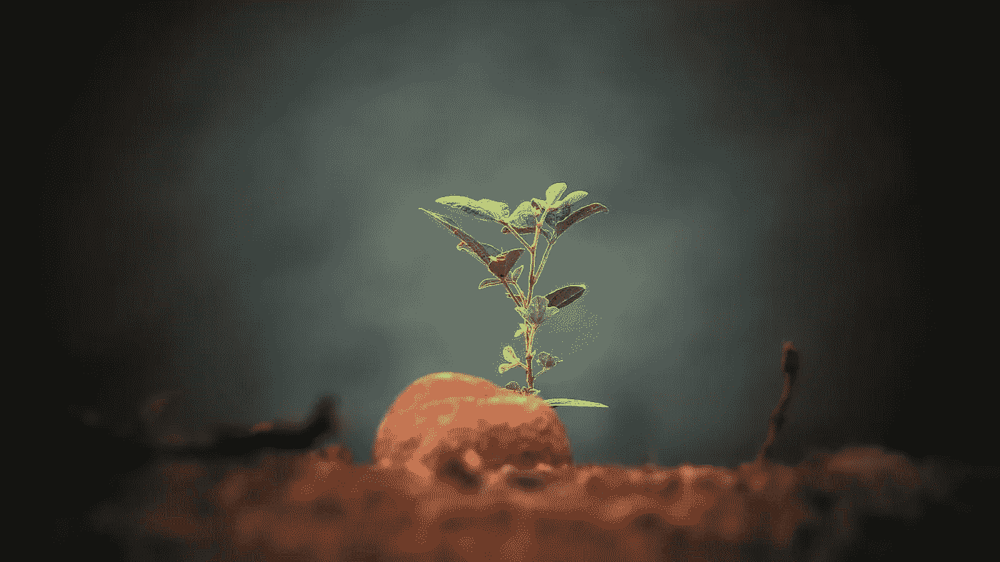

# 2020 年趋势:耕作和农业的未来

> 原文：<https://medium.com/swlh/2020-trending-the-future-of-farming-agriculture-bb2f7029e950>

Photo by [Sushobhan Badhai](https://unsplash.com/photos/LrPKL7jOldI?utm_source=unsplash&utm_medium=referral&utm_content=creditCopyText) on [Unsplash](https://unsplash.com/search/photos/plant?utm_source=unsplash&utm_medium=referral&utm_content=creditCopyText)

## 这就是为什么搬到室内可能是不可避免的。

想象一下这个场景:你走下伦敦南部喧嚣的街道，走进一个金属笼子，笼子在地下 100 英尺的地方拍摄。着陆后，你被黑暗和蜿蜒的隧道网络所包围。时间消失了，因为阳光无法穿透前二战防空洞…