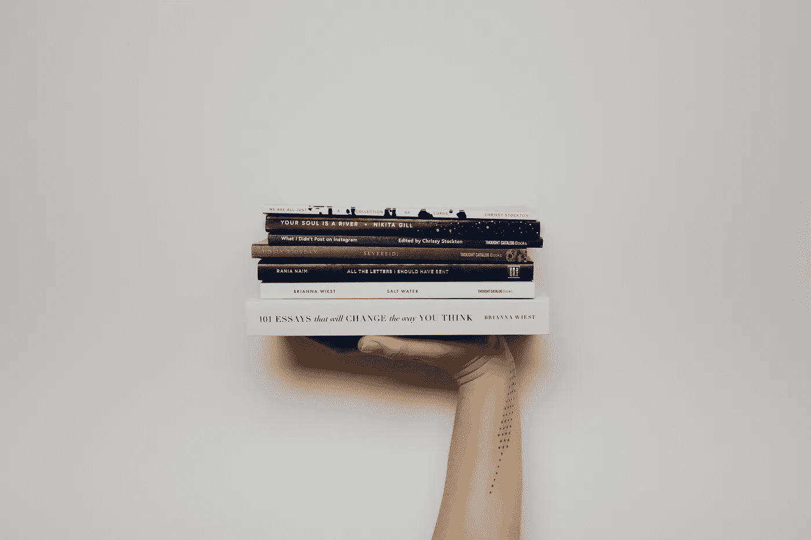

# 当你生来就是一个企业家，但你没有 MBA 学位时，要读的 21 本书

> 原文：<https://medium.com/swlh/21-books-to-read-when-you-were-born-an-entrepreneur-but-you-dont-have-an-mba-d1c08d910a5a>

These are not a picture of the books in this article. It’s just a cool 📷 by [Thought Catalog](https://unsplash.com/photos/o0Qqw21-0NI?utm_source=unsplash&utm_medium=referral&utm_content=creditCopyText) on [Unsplash](https://unsplash.com/search/photos/books?utm_source=unsplash&utm_medium=referral&utm_content=creditCopyText)

## 我 14 岁的时候乞求一台复印机作为圣诞礼物。

没有人感到惊讶。我总是有点古怪，所以这是意料之中的事。当其他孩子都在要游戏、玩具、衣服、运动器材时，我不得不有一台复印机。

我的计划是画漫画书，然后用复印机成为出版商，卖我的漫画。我会成为漫威最大的威胁。

好吧，也许不是，但我确实梦想过，也许他们会以某种方式注意到我，给我提供一份工作或什么的。

不幸的是，这个计划并不顺利。

这将是许多创业努力的第一步，但当时我并不认为自己是一个商人。我是一名艺术家，这只是从我的艺术中赚钱的一种方式。

# 没人教你做生意时，你会犯很多商业错误。

An actual photo of what I look like when I finish reading an amazing book.

让我的催眠治疗/心理护士硕士学位的母亲非常沮丧的是，我选择去艺术学校。我学到的技能很有价值，但这绝不是商业教育。

自从离开学校，我已经开始了许多业务，我不得不学习了很多。我提交这些书是因为它们帮助我弥合了教育和创业精神之间的鸿沟——希望它们也能帮助你。

你会注意到，它们不全是“商业”书籍。成为一名成功的企业主，很大程度上是因为[理解人性和动机](/swlh/every-great-entrepreneur-knows-that-marketing-is-about-four-simple-words-4a73d64dab6d)。

## *排名不分先后:*

*   [巅峰/罗伯特·普尔，安德斯·埃里克森](https://www.amazon.com/Peak-Secrets-New-Science-Expertise-ebook/dp/B011H56MKS)
*   [胡克/尼尔·埃亚尔、瑞安·胡佛](https://www.amazon.com/Hooked-How-Build-Habit-Forming-Products/dp/1591847788)
*   [关于硬东西的硬东西/本·霍洛维茨](https://www.amazon.com/Hard-Thing-About-Things-Building/dp/0062273205)
*   [狼之道/乔丹·贝尔福特](http://jordanbelfort.com/way-of-the-wolf/)
*   [零比一/彼得·泰尔，布莱克·马斯特斯](https://www.amazon.com/Zero-One-Notes-Startups-Future/dp/0804139296)
*   [与勒克/克莱顿·M·克里斯坦森、卡伦·狄龙、塔迪·霍尔、大卫·s·邓肯竞争](https://www.amazon.com/Competing-Against-Luck-Innovation-Customer/dp/0062435612)
*   [迪普/塞思·戈丁](https://www.amazon.com/Dip-Little-Book-Teaches-Stick/dp/1591841666)
*   [永不妥协/克里斯·沃斯，塔尔·拉兹](https://www.harpercollins.com/9780062407801/never-split-the-difference)
*   [每个人都撒谎/塞思·斯蒂芬斯-达维多维茨](http://sethsd.com/everybodylies/)
*   好策略/坏策略/理查德·p·鲁梅尔特
*   [品牌的 22 条不变法则/阿尔赖兹，劳拉·里斯](https://www.amazon.com/22-Immutable-Laws-Branding/dp/0060007737/ref=pd_lpo_sbs_14_img_0?_encoding=UTF8&psc=1&refRID=N2G80M3YWGKR45C6MX9Y)
*   [盐、糖、脂肪/迈克尔·莫斯](https://www.amazon.com/Salt-Sugar-Fat-Giants-Hooked/dp/0812982193)
*   [简单法则/约翰·梅达](http://lawsofsimplicity.com/)
*   [设计的普遍原则/威廉·利德威尔、克里蒂娜·霍尔登、吉尔·巴特勒](https://www.amazon.com/Universal-Principles-Design-William-Lidwell/dp/1592530079)
*   [搜索/约翰·巴特利](https://www.penguinrandomhouse.com/books/292894/the-search-by-john-battelle/9781591841418/)
*   [蓝海战略/ W. Chan Kim，renée maoborgne](https://www.amazon.com/Blue-Ocean-Strategy-Expanded-Uncontested/dp/1625274491/ref=sr_1_2?ie=UTF8&qid=1417408285&sr=8-2&keywords=blue+ocean+strategy)
*   眨眼/马尔科姆·格拉德威尔(还有格拉德威尔的《引爆点》、《离群值》和几乎任何东西)
*   [魔鬼经济学/史蒂文·d·莱维特，斯蒂芬·J·杜布纳](https://www.amazon.com/dp/0060731338/ref=cm_sw_su_dp?tag=authorweb-20)
*   [顾客想要什么/ Anthony Ulwick](https://www.amazon.com/What-Customers-Want-Outcome-Driven-Breakthrough/dp/0071408673)
*   主页可用性/雅各布·尼尔森，玛丽·塔希尔
*   [触发器/约瑟夫·舒格曼](https://www.amazon.com/Triggers-Joseph-Sugarman/dp/1891686054/ref=sr_1_5?s=books&ie=UTF8&qid=1522204332&sr=1-5&keywords=triggers)

这些不是附属链接，如果你购买，我不会得到任何报酬。别有用心:)

如果你还没有读过清单上的任何一本书，我强烈推荐从[格拉德威尔](http://gladwell.typepad.com/)或[克里斯滕森](http://www.claytonchristensen.com/ideas-in-action/books/)开始。他们所有的书都很优秀。

我知道我在这里错过了许多标题，但随着时间的推移，我会尽量更新列表。与此同时，请在下面的评论中提出你的建议——我很乐意为我的图书馆增加一些新书！

## 这个故事发表在 [The Startup](https://medium.com/swlh) 上，这是 Medium 最大的创业刊物，有 310，538+人关注。

## 订阅接收[我们的头条新闻](http://growthsupply.com/the-startup-newsletter/)。

