# 21 种改变游戏规则的新工具，适用于企业家和初创公司创始人

> 原文：<https://medium.com/swlh/21-game-changing-new-tools-for-entrepreneurs-startup-founders-b35cb65f8774>

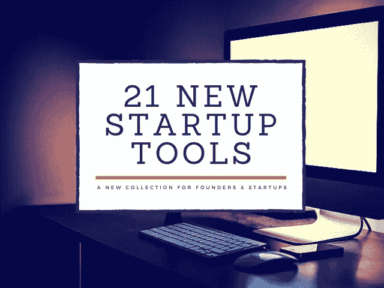

不久前，我们开始了一个新的 ListHunt 系列，从过去的一周里为初创公司和创始人寻找最好的新工具。这个新系列背后的主要驱动力是我们找到了一堆很棒的工具，但它们不适合我们每天的列表搜索所迎合的人群。

我们的观众由许多创始人和创业社区的人组成，所以开始这个新系列是一个很容易的决定。我们知道创建一家新公司需要大量的时间，你没有时间浏览所有的新工具。这就是我们的用武之地，让你的生活不那么忙乱！

# [埃尔机器人](http://try.elrobot.info/)

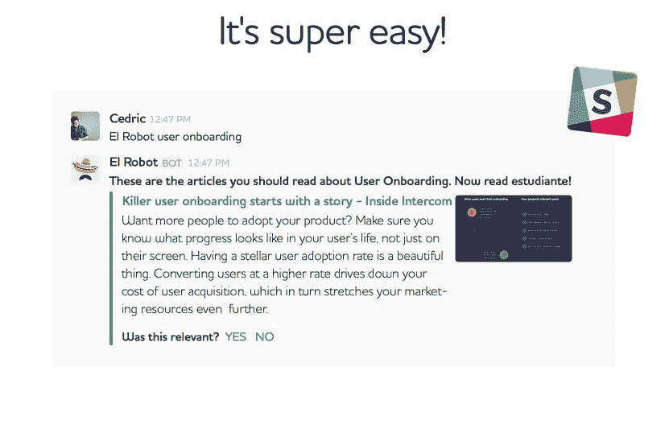

使用 El Robot Slackbot 获得直接交付给你和你的团队的最佳启动资源！

[**在此了解更多**](http://try.elrobot.info/)

# [Squelo](http://squelo.com/)

Squelo 是下一个专业网络，它以更好更简单的方式展示和分享工作和经验。我们已经建立了一个互动的时间表，其中包括个人投资组合。Squelo 的独特之处在于，公司可以根据他们的创造性工作和经验来寻找人才！

[**在此了解更多**](http://squelo.com/)

# [知情](http://www.privy.com/)

使用 Privy 的弹出窗口和横幅从您自己的网站收集更多的电子邮件。调整你的小部件的风格，位置和目标行为，而不需要接触代码。

[**在此了解更多**](http://www.privy.com/)

# [格利瑟](http://www.glisser.com/)

Glisser 使演示具有互动性。它采用常规的幻灯片，并在演示时将它们一张接一张地直播给观众的移动设备。然后，观众可以通过投票、现场问答和 Twitter 与演讲者互动。

这提高了参与度，有助于学习和回忆，并为演示者和活动组织者产生大量有用的反馈和有价值的数据。与会者还可以用电子方式在幻灯片上做标记，并发送到他们的电子邮件帐户，以备将来参考。

[**在此了解更多**](http://www.glisser.com/)

# [Wondr](http://getwondr.net/)

使用 Wondr 应用程序为您的 Twitter 关注者启动匿名聊天会话。一旦您创建了一个会话，人们就可以用隐藏他们身份的昵称匿名与您聊天。关注联系人，与他们保持联系，并在他们在线并可以聊天时得到通知。

[**在这里了解更多**](http://getwondr.net/)|[**iOS 版下载**|](https://itunes.apple.com/us/app/wondr-anonymous-chat-session/id1014964821)|[**安卓版下载**](https://play.google.com/store/apps/details?id=com.wondrapp)

# [风险聚焦](http://www.venturefocus.org/)

我们不断更新的数据库让您能够接触到最有可能为您的公司提供资金的风险投资。要么在线访问我们的数据库，要么根据您的需要将其导出为 CSV 格式。

你可以使用我们的数据库来筛选和寻找真正了解你的业务的公司。不要浪费时间给错误的人发邮件，锁定你的方法，节省宝贵的精力和时间。我们的资金来自全世界 60 多个国家。无论你的公司属于哪个行业，你都能找到完美的匹配。

[**在此了解更多**](http://www.venturefocus.org/)

# [拜师学艺](http://apprentice.at/)

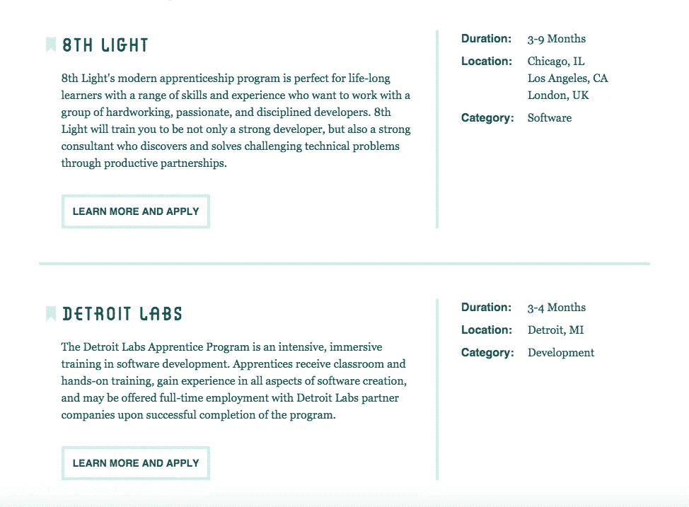

休斯顿，我们有一个问题——随着网络不断变化的本质，正规教育不再提供培养网络建设者所需的所有培训。所以我们用过去的方法来训练未来的职业。进入学徒阶段，这是一个可持续满足对有才华的网络专业人员不断增长的需求的机会。

[**在此了解更多**](http://apprentice.at/)

# [先注册](http://signupfirst.com/)

有一个全新的网站，但无法获得您的第一批成员？免费张贴在 SignUpFirst 上，说明你给予的独家奖励，并说明任何条件，我们会提升你，捕捉注册，当你准备好了就可以联系他们。非常适合发展中的初创公司和想要独家推广的现有公司。

[**在此了解更多**](http://signupfirst.com/)

# [Jumpshare](https://jumpshare.com/tour)

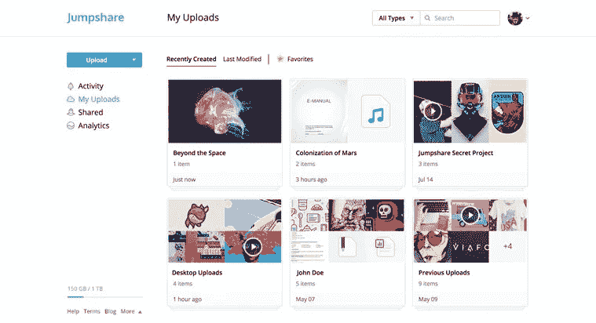

我们将 Jumpshare 设计成不同于任何其他文件共享服务。您的仪表板由集合组成。每个收藏都包含可以共享、组织和更新的文件和文件夹。使用收藏按项目、客户和事件来整理您的工作。Jumpshare 拥有让文件共享变得更好所需的一切。

放下你的文件，分享吧。不需要等待上传进程完成。你的朋友可以在你这边完成上传后立即查看文件。此外，您可以完全控制谁可以查看您的文件。所有文件都使用军用级 AES-256 加密进行加密，并通过安全/HTTPS 连接发送。长的安全网址确保你的文件防弹。

[**在这里了解更多**](https://jumpshare.com/tour) | [**下载用于 Mac 的**](https://itunes.apple.com/us/app/jumpshare/id889922906)

# [流行](http://popily.com/)

喝杯咖啡，从电子表格到新发现。放入数据，就会自动弹出大量的发现，然后你选择你喜欢的。

[**在此了解更多**](http://popily.com/)

# [基础工具包](https://founderskit.co/)

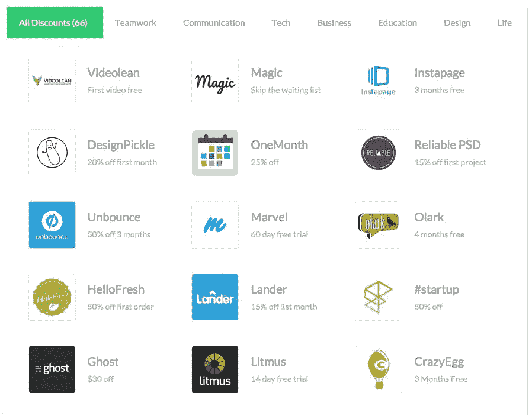

加入 FoundersKit，获得价值 6245 美元的优惠券，获得最好的创业工具和资源。作为创始人，我们一直在寻找工具和服务，让我们的业务更上一层楼，让我们的生活更轻松。有这么多选择，很难知道哪些值得我们花时间，哪些会浪费我们的时间。考虑到这一点，我们精心挑选了每一个合作伙伴。

[**在此了解更多**](https://founderskit.co/)

# [盆景](https://www.hellobonsai.com/)

由 Bonsai 的顶级律师撰写，我们的合同模板拥有保护您的业务所需的一切。另外，它完全免费使用。只需在用户友好的表格中输入您的条款，我们将立即为您创建合同。

[**在此了解更多**](https://www.hellobonsai.com/)

# [Wake.io](https://wake.io/)

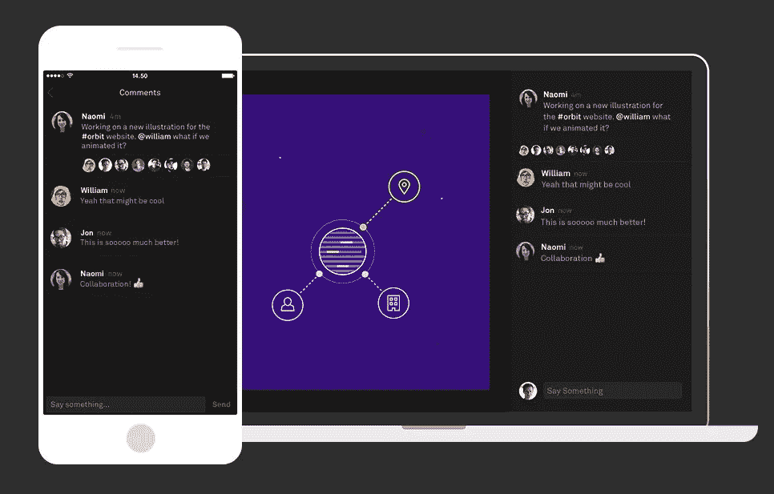

Wake 是一个与您的团队分享和讨论设计工作的私人空间。直接向你的团队展示你在做什么，而不会打乱你的设计流程。另外，解释您的想法，并直接在应用程序中获得反馈。

[**在这里了解更多**](https://wake.io/)|[**iOS 版下载**|](https://itunes.apple.com/us/app/wake-design-sharing-for-teams/id959471303?mt=8)|[**Mac 版下载**](https://wake.io/apps)

# [SumoMe 的谷歌分析](http://sumome.com/app/google-analytics)

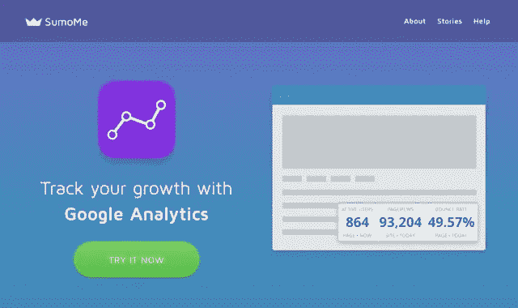

通过 SumoMe 的 Google Analytics，可以非常容易地在 SumoMe 仪表板中直接查看您的 Google Analytics。不再需要从数据中寻找重要的数字。我们会突出显示您最重要的统计数据，以便您可以轻松跟踪和增加您的流量。

[**在此了解更多**](http://sumome.com/app/google-analytics)

# [漫威用户测试](https://marvelapp.com/user-testing)

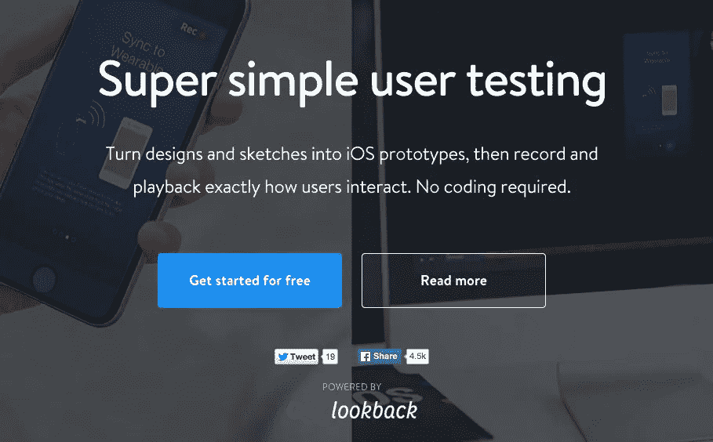

将设计和草图转化为 iOS 原型，然后准确记录和回放用户的交互方式。首先将你的设计或草图拖放到漫威，通过连接屏幕创建你的原型。

然后把你的原型发给用户，开始测试！就像给用户和利益相关者发送一个链接一样简单。一旦测试开始，我们将记录屏幕，点击和手势以及音频和视频反应。

[**在此了解更多**](https://marvelapp.com/user-testing)

# [Growthtools.io](http://growthtools.io/)

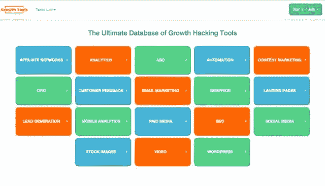

用终极成长黑客工具列表来加速你的创业成长！

[**在此了解更多**](http://growthtools.io/)

# [播客礼物](http://podcast.gift/)

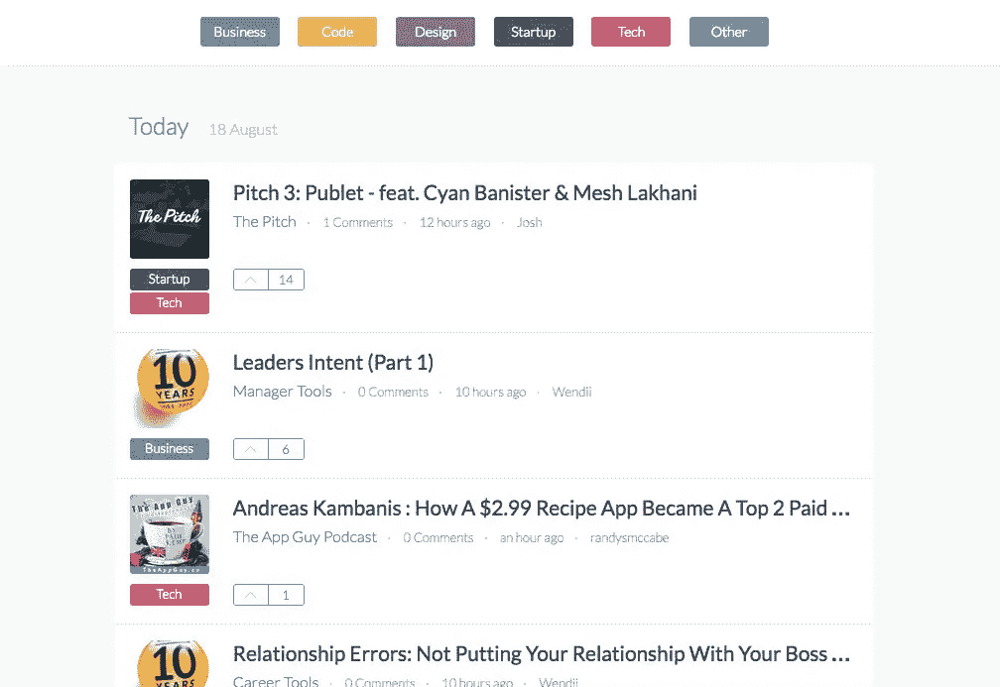

在过去的几年里，播客呈现爆炸式增长，很难找到其中的精华。事实是，找到好的播客很难，我们想改变这种情况。我们的目标是创建一个社区，在这里我们可以分享和讨论有趣的播客片段。

[**在这里了解更多**](http://podcast.gift/)

# [罗斯](http://www.rossintelligence.com/)

罗斯，使用 IBM 沃森，是一个数字法律专家，帮助你通过你的法律研究权力。你用简单的英语提出你的问题，就像你的同事一样，然后罗斯通读整个法律体系，并返回一个引用的答案和来自立法、判例法和二手资料的主题阅读，让你快速跟上。此外，ROSS 全天候监控法律，通知您可能影响您案件的新法院判决。

[**在此了解更多**](http://www.rossintelligence.com/)

# [字体图标](https://fonticons.com/?)

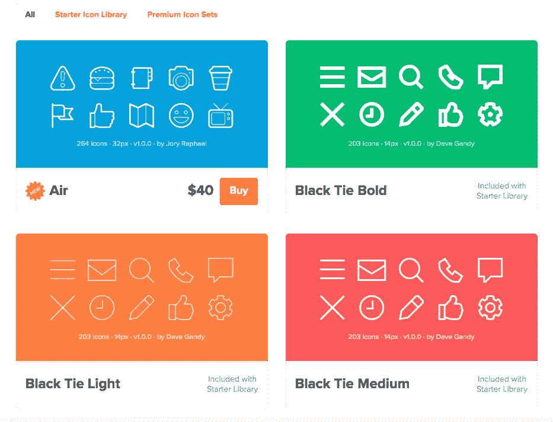

Font Awesome 是一个网站创建者的订阅服务，让你访问大量的图标集，上传你自己的自定义图标，并从我们的全球 CDN 提供你的网站需要的图标。

[**在此了解更多**](https://fonticons.com/?)

# [前端](https://frontapp.com/)

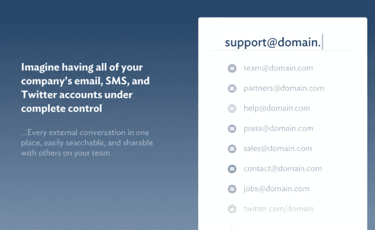

Front 是为团队创建的共享收件箱。让全世界一起参与进来，实现更快的响应时间和更满意的客户。Gmail、Twitter 和 SMS 不是为团队设计的。前面是。客户支持、销售、营销和任何其他部门都可以在一个平台上协同工作，与外界进行交流，而不会遇到任何麻烦。

你的个人拓展也要更有成效。Front 拥有您需要的一切来跟踪每个对话，并更快地响应人们。解决更多支持请求，达成更多交易，在更短的时间内完成更多工作。

[**在此了解更多信息**](https://frontapp.com/) | [**下载 Mac 版**](https://frontapp.com/)

# [治疗 2.0](https://www.treatings.co/)

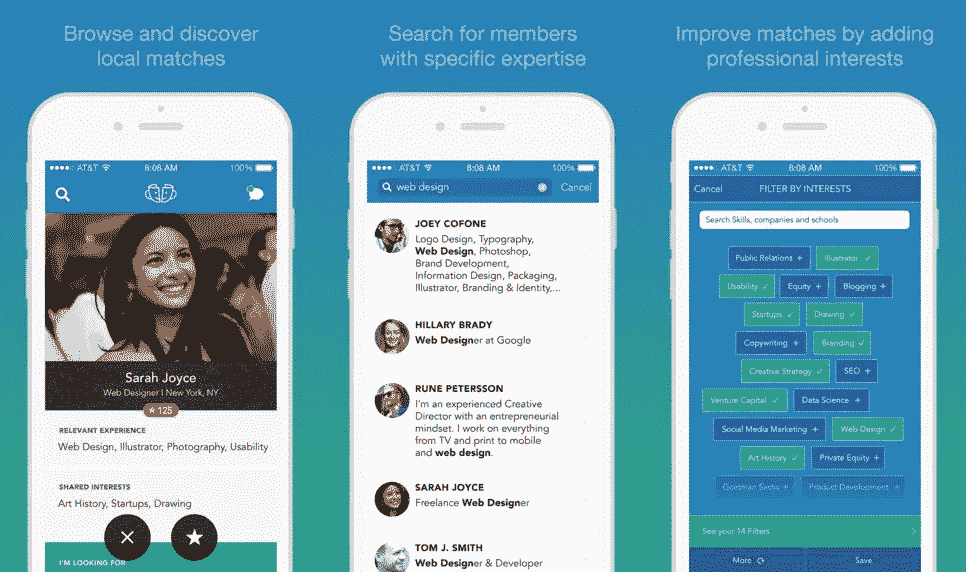

Treatings 帮助你发现并与适合你职业的人聊天。这是一种探索新的职业道路、寻找合作者和在你的城市遇到有趣的人的有趣方式。我们让找到附近有感兴趣的专业经验的会员并给他们发消息变得容易。

作为社区中平易近人、积极响应和主动的成员，您会赢得声誉点数。查看我们出色的社区成员，并开始与您所在城市有趣的人聊天！

[**在这里了解更多**](https://www.treatings.co/)|[**iOS 版下载**](https://itunes.apple.com/us/app/treatings-meet-inspiring-people/id948826633)

*原载于 2015 年 8 月 22 日*[*【www.listhunt.co】*](http://www.listhunt.co/19-innovative-new-tools-for-entrepreneurs-startup-founders/)*。*

*发表于* **创业、旅游癖和生活黑客**

-