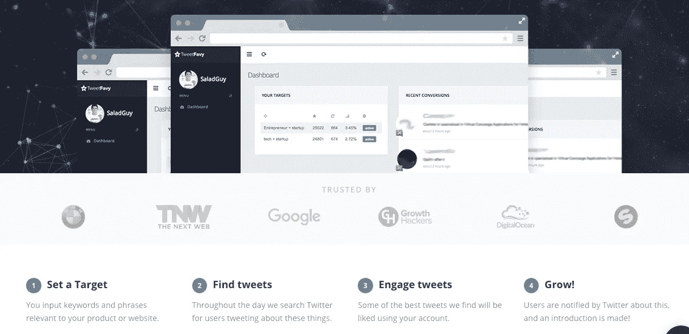

# 21 个(灰色)可操作的成长秘诀

> 原文：<https://medium.com/swlh/21-grey-actionable-growth-hacks-a626c001e300>

嘿，我不会用冗长的介绍来烦你，我已经写下了 21 条可行的增长秘诀，这些秘诀有助于获得客户，尤其是那些采用(Saas/Commerce)模式的初创公司。

在我今年进行的许多实验中，以下是我在(2017 年)尝试过的、给我带来良好投资回报的黑客技术。

让我们开始吧:

**成长黑客技巧#1:隐藏重定向饼干 45 秒**

停止重新定位那些立即从你的网站弹回的人。使用一点 javascript 来[隐藏重定向 cookies 秒](http://blog.wishpond.com/post/115675436102/lead-nurturing-growth-hacks)，以确保你只重定向对你的内容感兴趣的用户。

**成长黑客技巧 2:使用主动的实时聊天**

如果你使用 Intercom，Zendesk，甚至 LiveChat，那么你应该诚实地使用主动聊天。向访问你网站上任何页面的人发送一条消息都会让他们参与进来，在实施主动实时聊天一周后，我们看到注册人数增加了 5%。

**成长黑客技巧 3:收集更多电子邮件线索**

考虑在你的网站上添加 [hello bar](http://www.hellobar.com/) ，这是一种跟踪网站访问者的微妙方式，鼓励他们输入他们的电子邮件地址，这样你就可以扩大可爱的邮件列表。

**成长黑客技巧 4:在 twitter 上获得更多关注者**

[Tweetfavy](http://www.tweetfavy.com/) 是一个很好的廉价工具，每月支付 19 美元，就可以增长你的 twitter 粉丝，并观察你的 Twitter 粉丝的增长。

**成长黑客技巧 5:将站点添加到一个伟大的目录中**

许多目录已经饱和了，试着把你的初创企业加入到下一个发布的[中，它们每个月有 50，000 的访问量，有 30%的跳出率，数据来自](http://www.launchingnext.com/)[类似的网站](http://www.similarweb.com/)。

**增长黑客技巧#6:外包内容营销工作**

想要为你的初创企业开一个博客，但没有时间，因为你要为你的公司承担许多责任，外包内容营销比以往任何时候都更容易。一个月 100 美元，你就可以使用市场上最好的外包博客写作工具 [blogmutt](http://www.blogmutt.com/) 或 [problogger](http://problogger.com/start-here/) 。

**成长黑客技巧 7:在几分钟内将单词翻译成博客**

写博客时间紧张，使用 [rev](http://www.rev.com/) 在几分钟内将你的话翻译成脚本。现在，写一篇博文不再需要花费你几个小时，而只需要几分钟。

**成长黑客技巧 8:使用退出意图弹出窗口建立邮件列表**

退出弹出窗口是一种简单实惠的方式来利用你现有的网站流量。通过在你的浏览器中使用退出意图弹出插件，如[相扑](http://sumo.com/)或[会话实验室](http://conversionlab.no/)，它将识别用户何时试图离开你的页面，并自动显示最后一分钟的报价。

**成长黑客技巧 9:使用 Quora 广告打赌你不知道他们提供广告？**

Quora 去年开始尝试广告，但直到今天，你仍然不会听到或读到太多关于 Quora 的广告。CPC 仍然很低，因为还没有多少人使用它。它们为您开展的活动提供对话跟踪。

**成长黑客技巧 10:使用口袋广告**

不确定你是否还在使用口袋本，你真的应该使用它，它是一个保存文章/为文章做书签的好工具，以便以后阅读。他们提供赞助内容，这意味着你的内容营销努力可以在有兴趣阅读此类博客的人周围进行宣传。

每次点击的成本非常低，直到一个非常新的服务。

**成长黑客技巧#11:发出“哎呀！忘记链接“电子邮件**

当自动跟进电子邮件时，考虑将一些“人为错误”纳入你的电子邮件序列。一个窍门是发送一封缺少链接或文件的电子邮件。然后，在发送第一封电子邮件的缺失部分 1-5 分钟后，自动发送后续电子邮件。

虽然打开率可能会保持不变，但第二封邮件的转化率往往会飙升。

**成长黑客技巧#12:回复关于**[**Quora**](http://www.quora.com/)**，**[**Reddit**](http://www.reddit.com/)**，**[**LinkedIn**](http://www.linkedin.com/)

自我品牌是 2017 年的趋势，品牌品牌&更多的品牌，确保人们在你的空间里认出你，所以继续回答 Quora 上与你的利基相关的问题。

参与 Reddit 上的社区，加入 LinkedIn 群组，参与那里的社区。

**成长黑客技巧#13:在主题行中使用表情符号可以提高你的网站打开率**

这里没有什么需要解释的，把表情符号放在你邮件的主题行，看着打开率增加。

**成长黑客技巧 14:利用 ghostry 了解你的竞争对手**

渴望了解您的竞争对手在使用什么工具？你想监视他们，是吗？了解他们所拥有的并超越他们。酷安装 [Ghostry](http://chrome.google.com/webstore/detail/ghostery/mlomiejdfkolichcflejclcbmpeaniij?hl=en) 一个 chrome 扩展，可以读取他们在后台运行的任何网站、分析工具或社交媒体插件等。

**成长黑客技巧 15:使用推送通知/chrome 通知**

电子邮件或网页推送通知？听着，不要误解我的意思，电子邮件根本没有消亡，所以不要射杀信使，但你会惊讶地发现，通过电子邮件向客户/热情的销售线索发送推送通知，你的打开率会提高多少。

这篇[文章解释了](http://www.linkedin.com/pulse/how-acquire-more-users-web-push-notifications-growth-hacking-howard)使用推送通知的好处，如果你热衷于尝试这个实验，试试[推送团队](http://pushcrew.com/)，因为他们是游戏中的市场领导者。

**成长秘诀 16:开展 Capterra PPC 活动**

是的， [capterra](http://www.capterra.com/vendors/advertise) 有一个 PPC 报价，相信我伙计们，它他妈的创造了奇迹，capterra 上的大多数线索已经对你的软件感兴趣了，他们只是想在市场上找到最好的。因此，击败你的竞争对手，领先于竞争对手，只需支付低至 2 美元的点击费&他们就提供转化跟踪。

**成长秘诀#17:在**[**Reddit**](http://www.reddit.com/)**&**[**Quora**](http://www.quora.com/)

在你回答了 Quora 上的问题或者在 T2 的 Reddit 上发帖之后。你可以付钱给 T4 上的人，让他们给你在这些论坛上的评论投票/点赞，你得到的投票/点赞越多，人们就越信任你，认为你是思想领袖。

从那里，人们更有可能跟随你评论中的 CTA，可能是为了潜在客户，电子邮件注册等。

**成长秘诀 18:在你的 Google+个人资料中添加一张图片，增加打开率**

当你从一个真实的人那里发送电子邮件时，你也可以添加一张图片，它也会出现在人们收件箱的缩略图中。这将有助于强调你实际上是一个真实的人，并有助于提高你的电子邮件的打开率。

**成长秘诀 19:将博客转化为视频**

使用 [BuzzSumo](http://buzzsumo.com/) 或 [ahref](http://ahrefs.com/) 在你的利基市场寻找在社交分享和获得反向链接方面表现良好的内容。以视频的形式重新利用这些内容，把它们发布在 facebook 或 youtube 上，提高发布量，你的网站流量就会增加。

**成长秘诀 20:使用 Gmail 广告竞价竞争对手的关键词**

使用[Gmail 广告](http://blog.wishpond.com/post/115675436465/adwords-growth-hacks)在用户收件箱中按关键字定位。这种方法可以让你找到那些可能从你的竞争对手那里收到时事通讯和其他宣传材料的人，并向他们推销类似的产品。

**成长黑客技巧 21:使用免费的股票图片网站来美化你的博客/社交媒体文章**

事实证明，带有照片的博客和社交媒体帖子的参与度更高。利用像 [pexels](http://www.pexels.com/) 和 [unsplash](http://unsplash.com/) 这样的网站的免费库存照片来获取你需要的任何照片。

试试这些黑客，告诉我你的想法？请留下你尝试过的对你有效的获取客户的方法的评论。

和平！

PS:如果你喜欢这个，至少给我十几下掌声祝你好运；)

## 这个故事发表在 [The Startup](https://medium.com/swlh) 上，这是 Medium 最大的企业家出版物，拥有 282，454+人。

## 在这里订阅接收[我们的头条新闻](http://growthsupply.com/the-startup-newsletter/)。

