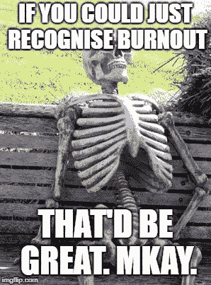
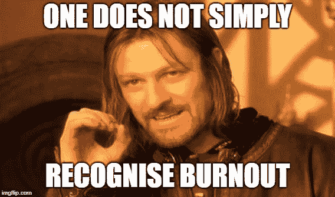

# 21.如何真正识别倦怠——30 天中等

> 原文：<https://medium.com/swlh/21-how-to-actually-recognise-burnout-30-days-of-medium-7972a7a7a89e>

欢迎回到 **30 天中等。**

感谢迄今为止**一直在阅读、鼓掌和评论**的每一个人！今天的话题是— **如何真正识别倦怠**。

如果你错过了下面的我的 30 天中型挑战的前 20 天，你可以补上:

## [0。30 天的培养基](/swlh/30-days-of-medium-c7ab34953c6c)

## [1。建立自己的网站需要什么？— 30 天中值](/swlh/1-what-do-you-need-to-build-your-own-website-30-days-of-medium-1ed1ad4e505c)

## [2。如何找到你热爱的事业——30 天的媒介](/swlh/2-how-to-find-a-business-you-love-30-days-of-medium-cb7a4a702d1b)

## [3。如何建立自己的网站—媒体 30 天](/swlh/3-how-to-build-your-own-website-30-days-of-medium-587f994672ec)

## [4。如何衡量你网站的表现——30 天媒体](/swlh/4-how-to-measure-your-websites-performance-30-days-of-medium-75e650969695)

## [5。如何通过回答他们的问题获得更多的客户-30 天的媒介](/swlh/5-how-to-get-more-customers-by-answering-their-questions-30-days-of-medium-b462d237533e)

## 6。成功的商业网站备忘单——30 天的媒介

## 7。如何衡量成功——30 天介质

## 8。了解在线销售漏斗——30 天媒介

## 9。什么是流量，为什么流量很重要？— 30 天的培养基

## 10。什么是 Google URL Builder，为什么要使用它？— 30 天的培养基

## [11。通过自动化您的社交媒体日程，让您的流量翻倍——30 天中等](/swlh/11-double-your-traffic-by-automating-your-social-media-schedule-30-days-of-medium-ac9aa74f7927)

## [12。如何辨别什么好卖— 30 天介质](/swlh/12-how-to-tell-what-sells-30-days-of-medium-ba3291d029d2)

## [13。我如何在 6，500% — 30 天的培养基中培养我的培养基](/swlh/13-how-i-grew-my-medium-following-6500-30-days-of-medium-c9d2d6f80b51)

## [14。你如何看待事情很重要——30 天中期](/swlh/14-how-you-look-at-things-matters-30-days-of-medium-f641b9733b90)

## [15。如何向小型企业销售服务— 30 天中等](/swlh/15-how-to-sell-services-to-small-businesses-30-days-of-medium-d6604c63b3b7)

## [16。如何通过有效的提案赢得更多交易— 30 天的媒介](/swlh/16-how-to-win-more-deals-with-effective-proposals-30-days-of-medium-481f16bbc86f)

## 17。如何在 10 分钟内建立一个网上商店——30 天的媒介

## [18。如何在任何地方工作— 30 天介质](/swlh/18-how-to-work-from-anywhere-30-days-of-medium-1c9cfa2d662f)

## [19。为什么你的网站会破坏你的销售——30 天媒体](/swlh/19-is-your-website-sabotaging-your-sales-30-days-of-medium-f63bdbdb350)

## [二十。你的流量从哪里来？— 30 天中值](/swlh/20-where-does-your-traffic-come-from-30-days-of-medium-a9b2d2c088bb)

## [21。如何真正识别倦怠——30 天中等水平](/swlh/21-how-to-actually-recognise-burnout-30-days-of-medium-7972a7a7a89e)

## [22。如何修改你的时间表并完成两倍的工作——30 天中等时间](/swlh/how-to-hack-your-schedule-and-get-twice-as-much-done-30-days-of-medium-441a509dc9be)

## [23。不要模仿你的竞争对手——30 天的媒介](/swlh/23-dont-copy-your-competitors-30-days-of-medium-56382b7ba8ed)

## 24。如何 SEO 优化一篇博文——30 天的媒介

## 25。独特或被遗忘——30 天的媒介

## 26。跟着感觉走——30 天中等水平

## 27。人们不支付平均 30 天的中等费用

## 28。如何做关键词研究— 30 天介质

## [29。为什么帕累托原则是世界上最大的诀窍——30 天中期](/swlh/29-why-the-pareto-principle-is-the-worlds-biggest-hack-30-days-of-medium-1c225f5c8aa1)

## 三十岁。你的内容比你的电话更有利可图——30 天的媒介

# 什么是‘倦怠’？

我看过很多关于倦怠的文章。有的集中在**心理**方面。有些上了**体能**。

我发现他们中的许多人在实际描述倦怠症状方面都很模糊。

在过去的 6 年里，我经历过几次倦怠，所以不幸的是，我对这些症状很熟悉。

我想写一篇有第一手视角的文章，讲述倦怠的真实感受，而不是列举一些普遍的症状，希望这能帮助你们中的一个人。

所以现在开始。

# 我的钢笔坏了

我第一次意识到自己是在周五被烧坏的，因为我的笔不工作了。

大约是上午 10 点钟，我像往常一样坐在办公桌前，努力制定出当天的任务清单。

10 分钟后是上午 11 点 30 分，而我一个字也没写。我一直漫不经心地翻阅着电脑上的标签，思考着我的任务清单，查看电子邮件。

我决定早点午休。

又试了 30 分钟后，我不知道为什么我不能集中注意力，我意识到我筋疲力尽了。

什么都不管用。

尽管我尽了最大努力，但我无法集中注意力，也无法从低迷中走出来。

所以我停下手头的工作，决定周末休假。

# 识别倦怠

不幸的是，过去的一周对我来说是一个疲惫的一周。

一切似乎都慢了下来。一切都让我恼火，我无法集中精力做任何事。

最令人担忧的是，我感到绝望，无法从任何事情中获得快乐。

根据我的经验，当你经历这三种症状时，你知道你真的已经精疲力尽了:

*   你根本不能放松。持续的压力、焦虑和担心感。我发现自己在房间里踱步，试图放松自己。什么都没用！
*   一切都让你恼火。我不是指微微上火。穿过市中心的 5 分钟足以让你厌恶生活。以前你可能没想过的小麻烦，现在成了争论的原因，你抓住机会和某人斗嘴。
*   你只看到消极的一面。我以前写过关于你如何看待事物的文章。我是一个非常积极的人，所以当我专注于积极的能力似乎停止工作时，我知道我真的筋疲力尽了。我所能关注的只是我的问题和压力。

# 导致精疲力尽

倦怠有许多次要症状，许多迹象表明你可能正走向“T4 倦怠事件”。

这里有一些其他的倦怠迹象，但是小心不要把它们和你生活中的其他事情或者你的日常事务混淆起来:

*   失眠(长期，我是说几个月)
*   不断感到疲倦
*   发现很难专注于事情或**富有成效**
*   应该很容易的少量运动却很难
*   消极思想蔓延

你需要小心正确地诊断出**倦怠**，不要把它和其他东西混淆。例如，**过多的咖啡因**会导致失眠(尽管它是许多高成就者最好的朋友)。

来自运动的**过度训练的症状也类似于倦怠。**

不幸的是，这是你必须亲身经历才能认识到的事情之一。

经过几次之后，当你将来真的筋疲力尽的时候，你会感到令人厌恶的熟悉，并且你会立刻认出它，不幸的是通常只在一周之后。

# 应对倦怠

一旦你意识到这一点，你绝对需要处理倦怠的问题。

**扔掉“没有休息日的视频”**烧掉**“无论如何都要做”的 DVD。**

幸运的是，我从未经历过神经崩溃或类似的事情，但是那些经历过的人的故事听起来很可怕。

你的倦怠是你的身体告诉你停止的方式。

立即休一个周末假。

这就是我刚刚过去的这个周末所做的事情。

关闭笔记本电脑。关掉你的电子邮件。**休息。放松**。玩你最喜欢的电子游戏。见一些朋友。喝点啤酒。锻炼身体。

给自己 48 小时属于自己的时间。

你越早这样做，你的身体就能越早充电，你就能精力充沛地回来工作，效率提高 200%。

如果你没有解决倦怠问题，你可以这么做

*   以 10%的效率工作
*   浪费自己的时间
*   危及你的未来和你的生意
*   走向精神崩溃

不幸的是，太多的企业家(包括我自己)最初被企业家精神的“没有休息日的心态”所迷惑。

几年后，你会发现这种态度是胡说八道，励志演说家和试图建立个人品牌的人向门外汉兜售，试图赚快钱。

也许这就是为什么心理健康对高绩效者和企业家来说如此重要，因为如果你敢休息一天，它会被视为**虚弱**或**没有全力以赴**。

这是不健康的，老实说是一个谬论。

可能，我的意思是可能，社会中有一小部分人是超人，他们可以一年 10 个月，一周工作 7 天，每天睡 6 个小时。

如果有，恭喜你。你有福了。这些人可能是世界上的亿万富翁。然而，对我们大多数人来说，这种**无休息日的做法**是最快的进精神病院的方式。

想想运动员。

他们需要**恢复时间，对吗？**

尤其是精英演员，在最高水平上竞争。

那么，对于企业家、高管或高绩效者来说，为什么会有什么不同呢？

不会的。如果你不这么想，你会被当成傻瓜。

不要过别人的生活。如果你追根溯源，创业的全部意义在于做自己的事。按照自己的一套规则生活。

通过你自己的常识过滤器运行一切，找到适合你的**。**

发展业务的最快方法是在你的职业倦怠让你死在水中并要求你休息一年之前，休个周末假。

所以，如果你感到绝望，无法集中注意力，超级易怒。**休息 2 天，不碰工作。**

**不要为了辜负某些 BS 励志视频的期望而自杀。**

等你回来工作的时候感谢我吧**神清气爽，干劲十足，准备大开杀戒。(郑重声明，今天我又感觉棒极了！)**

## 你可能也喜欢这个:

## [为什么 WordPress 是在](/swlh/why-wordpress-is-the-best-platform-to-build-your-business-or-startup-website-on-df3fe932fad7)上建立业务或创业网站的最佳平台

## [如何建立网站——终极指南](https://www.squareinternet.co/how-to-build-a-website-ultimate-guide/)

## 如果你喜欢这个故事，请点击👏按钮，并跟随我的其他 30 天的媒介。

## 这篇文章发表在 [The Startup](https://medium.com/swlh) 上，这是 Medium 最大的创业刊物，拥有 336，210 多名读者。

## 在这里订阅接收[我们的头条新闻](http://growthsupply.com/the-startup-newsletter/)。

