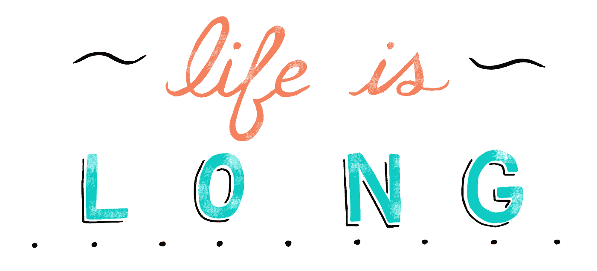

# 21 条世界上最有力的名言，今天更新

> 原文：<https://medium.com/swlh/21-of-the-worlds-most-powerful-quotes-updated-for-today-and-tomorrow-6b7634358c2>

> 世界上最聪明的思想家的智慧之言是永恒的，尽管世界每天都在变化。

# 1."你必须成为你希望在这个世界上看到的变化."—甘地

Photo by [Pratik Chauhan](https://unsplash.com/es/@smarty_14?utm_source=medium&utm_medium=referral) on [Unsplash](https://unsplash.com?utm_source=medium&utm_medium=referral)

> 为值得为之而死的东西而活，利用科技创造你希望看到的世界

# 2.“每个人都是天才。但是如果你根据一条鱼爬树的能力来判断它，它会一辈子都相信自己是愚蠢的。”——阿尔伯特·爱因斯坦

Photo by [Taton Moïse](https://unsplash.com/ja/@moyse?utm_source=medium&utm_medium=referral) on [Unsplash](https://unsplash.com?utm_source=medium&utm_medium=referral)

> *[*攻成天才*](https://www.linkedin.com/pulse/how-you-can-quickly-become-genius-why-arent-aram-taghavi) *理论简单实践难。它来自于掌握* [*你最爱的一项活动*](https://www.linkedin.com/post/edit/6352506283807043584) *。”**

# *3.“犯错误的一生不仅比无所事事的一生更可敬，也更有用。”乔治·伯恩哈德·肖*

> **“对于* [*创造成长和新机遇*](https://www.linkedin.com/pulse/8-principles-become-1-crowded-field-competitors-aram-taghavi/) *的经历来说，实验是必要的。”**

# *4."害怕自己会受苦的人，已经因为害怕而受苦了."—米歇尔·德·蒙田*

> *FOMO 制造苦难，然而苦难的人拥有 FOMO*

# *5.“我们有时认为贫穷只是饥饿、赤身裸体和无家可归。没有人要，没有人爱，没有人关心的贫穷是最大的贫穷。”—特里萨修女*

> *健康的生活需要爱。我们认为过健康的生活，就像食物和水一样。我每天都通过爱身边的每个人来练习。”*

# *6.“爱是一个动词。爱——感觉——是爱的果实，是动词。”—斯蒂芬·柯维*

> **“爱被误认为是占有和依恋。变得有爱，这样你就能爱所有的人。”**

# *7.“生活真的很简单，但我们坚持要把它变得复杂。”——孔子*

> *“生活真的很简单，但社交媒体让它变得复杂了。”*

# *8.“如果你不喜欢某样东西，就去改变它。如果你不能改变它，那就改变你思考问题的方式。”—玛丽·恩格尔布雷*

> *你如何思考决定了你如何应对压力，从而决定了你的健康程度。所以这才是最重要的。*

# *9."在为别人寻找幸福的过程中，你会在自己身上找到幸福。"—未知*

> *“不要寻找你热爱的东西，服务他人让自己充满激情。”*

# *10.“上帝啊，请赐予我平静去接受我不能改变的事情，赐予我勇气去改变我能改变的事情，并赐予我分辨两者的智慧。”—雷茵霍尔德·尼布尔*

> *“我的精神和信仰教会我拥抱我不能改变的东西，并把它们变成机会。冥想和祈祷给了我所需的智慧和意识。”*

# *11.“昨天是历史，明天是未知，今天是上帝的礼物，这就是为什么我们称它为现在。”—比尔·基恩*

> **“活在当下的每一刻是最重要的习惯，让我做到最好，也让我最快乐。”**

# *12."生活从来不会因为环境而变得无法忍受，只会因为缺乏意义和目标而变得无法忍受."维克多·弗兰克尔*

> **“拥抱障碍，建立生活目标所需的韧性。”**

# *13.“如果你想要一个小时的快乐——打个盹。如果你想快乐一天，去钓鱼吧。如果你想要一年的幸福——继承一笔财富。如果你想要一生幸福，那就去帮助别人。”—中国谚语*

> *快乐不是一种可以获得的东西，而是一种每天都在培养和练习的技能。这种精通来自于为他人服务。”*

# *14.“当一扇幸福之门关闭时，另一扇门就会打开，但我们经常长时间盯着那扇关闭的门，以至于看不到另一扇门已经为我们打开了。”——海伦·凯勒*

> *“我现在明白，盲目地关注过去或未来是浪费时间。重要的是我能多好地体验我现在正在做的事情。”*

# *15.“大多数人没有带着理解的意图去听；他们听着，意图回答。”—斯蒂芬·柯维*

> **“反应是自我，所以我尽量不去做。用心回应是唯一的沟通方式。”**

# *16.“在你诊断自己患有抑郁症或低自尊之前，首先要确保你实际上没有被一群混蛋包围。”——西格蒙德·弗洛伊德”*

> *“在你诊断自己患有抑郁症或缺乏自尊之前，试着关闭社交媒体一个月。”*

# *17."挑战让生活变得有趣，战胜挑战让生活变得有意义."——约书亚·马琳”*

> *挑战让我进入心流状态，心流让生活变得有价值，所以我期待挑战。*

# *18."一个被新的经历拉伸的头脑永远不会回到它原来的维度."—奥利佛·文德尔·霍马斯*

> *“我能体会到我的经历有多深刻，这才是成长和快乐的关键。”*

# *19.“我们生存的唯一方式就是成长。我们成长的唯一途径就是改变。我们能改变的唯一方法就是学习。我们能学习的唯一方法就是暴露在外。我们暴露的唯一方式是我们把自己抛到户外。”乔伊贝尔公司*

> **“世事无常，人生更精彩。不确定性教会我适应力，而适应力让我意识到我需要成为最好的自己。**

# *20.“时间对等待的人来说太慢，对恐惧的人来说太快，对悲伤的人来说太长，对欢乐的人来说太短，但对爱的人来说，时间就是永恒。”——亨利·范·戴克*

> *“我的财富不是用我有多少时间做我想做的事情来衡量的，而是用我能从这些时间中获得多少意义来衡量的。”*

# *21."我宁愿死得有意义，也不愿活得毫无意义。"科拉松·阿基诺”*

> **“生活通常是没有意义的，除非我们能决定它有多有意义。我不害怕死亡，因为我知道这一点，因此能够心安理得地生活。”**

*3/11/23 更新:感谢阅读。我现在经营一家名为 [Iremia Management](http://www.iremiamgmt.com) 的私募股权公司。如果您想随时了解我们的交易和进展，您可以在此[注册电子邮件提醒。](https://dogged-composer-13.ck.page/71e7d7585d)*

**

## *这篇文章发表在 [The Startup](https://medium.com/swlh) 上，这是 Medium 最大的创业刊物，拥有 282，454+读者。*

## *在这里订阅接收[我们的头条新闻](http://growthsupply.com/the-startup-newsletter/)。*

**