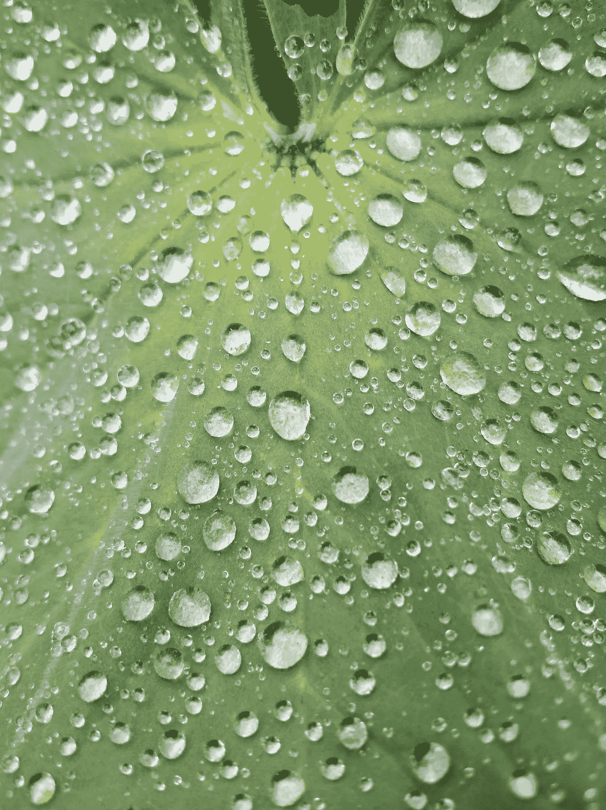
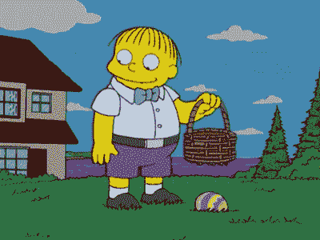
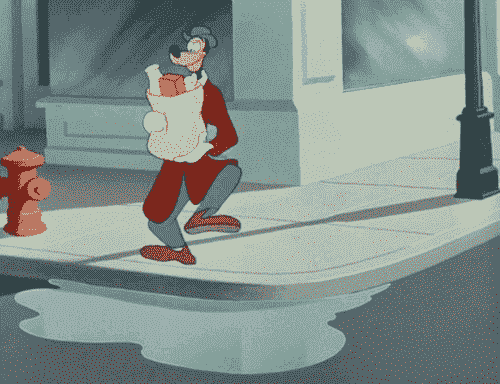
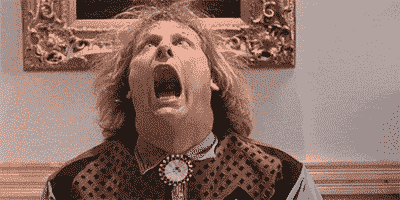

# 21 个冷酷的生活真相会让你成为一股不可忽视的力量

> 原文：<https://medium.com/swlh/21-stone-cold-truths-about-life-that-will-make-you-an-unrelenting-force-to-be-reckoned-with-5fad5ac9c466>

## 破解宇宙知识来推动你未来的成功。

Photo by [Form](https://unsplash.com/photos/aEo8TBLuufQ?utm_source=unsplash&utm_medium=referral&utm_content=creditCopyText)

宇宙中的知识已经成熟。

我们经常发现自己坐在地板上(无论是比喻还是字面上)思考我们是如何发现自己处于这种不太理想的境地的。

我们心里清楚，我们注定要做别的事情。

也许是走出*流行的小隔间*，进入自由和创造力的真实世界。也许它能够成为我们周围正在建设的社区的一盏明灯。很多时候，这是一件非常简单的事情，只是鼓起勇气与一群新的人见面交谈。

不管情况如何，有一些基本的事实可以帮助你打开可能在你生活中挥之不去的*盲点*。

当你抹去可能潜伏在你生活中的“隐藏的真相”时，它有可能让你思考(这在当今太缺乏了)，并发展成为你知道自己有能力取得的成功。

# 1.你是网络中的一个节点。

Photo by [Willem Karssenberg](https://unsplash.com/photos/5SH4PHlGH_I?utm_source=unsplash&utm_medium=referral&utm_content=creditCopyText)

我今天的所作所为将会产生我无法想象的连锁反应。我可以帮助这个世界陷入更多的痛苦，或者我可以帮助这个世界变得更加光明。我选择后者。

# 2.你是唯一一个能处理“我脑中的声音”的人

在入睡前的最后时刻和醒来的瞬间，只有我一个人。跟随那个“声音”是我的责任

# 3.重要的不是你写了什么，而是你坐下来，打开电脑，开始写作。

最难的部分是开始。写我想写的作品是我的责任。冲破阻力。

# 4.没有一个潜在的浪漫伴侣会是“完美的”

保持谦逊，杀死告诉我需要找到完美的人的自我——他们并不存在。现在我可以非常接近了，如果我努力的话。

# 5.这是你下半辈子唯一的身体。

当然，在我们有技术将我们的意识下载到另一个代理身体之前…我需要通过我的饮食和定期锻炼来照顾它，以实现它的最佳生活。

# 6.这是你下半辈子唯一拥有的大脑。

[Stay sharp](http://www.sleepy-slug.com/images/macros/ralph1.gif)

我需要学习和吸收信息、知识和洞察力，帮助这块肌肉成长为我最重要的器官。

# 7.亲人去世。

这是人生的一个道理。我们都是借来的时间。沉浸在失去他们的痛苦中是没有意义的。理解他们的课程和天赋，并与你周围的人分享。

# 8.你会死的。

抛开所有关于来世的理论和信仰，这是我过上我想要的生活的唯一机会。会有牺牲，会有奋斗，最重要的是，如果我足够努力，会有胜利。

# 9.不奋斗就不会有成就感。

根据定义，这是真的:没有坏就没有好。生活中没有什么是真正的福佑诺曼·洛克威尔。生活中你会受苦。苦难带来胜利。推动“硬按钮”而不是“简单按钮”是正确的选择。

# 10.你的雇主只关心你这么多。

到头来，你只不过是一笔资产。你不是朋友，你不是家人，你只是个工具。如果你做“正确的”事情，你可以成为一个积极的工具；如果你做“不好的”事情，你可以成为一个消极的工具。

# 11.被解雇是一种令人羞愧的经历，会让你变得更好。

你不是不可战胜的。如果你在生活中被解雇了(这是我推荐的),向它学习。哪里出问题了？你为什么被解雇？你需要从经历中吸取什么教训？

# 12.你父母会死的。

从某种意义上来说，你有责任传递火炬，领导你的家族。以这份责任为乐，好好呵护。

# 13.诚实是最好的策略。

真相会让你自由。别撒谎了，别挖坑了。告诉人们真相，也许更重要的是告诉自己真相。

# 14.坏事发生在好人身上。

We've all [felt](https://media.giphy.com/media/Muh0f9KFIvdBK/giphy.gif) it

那个好人可能就是你。你在生活中会被揍的。重要的是你如何应对打击。

# 15.人们并不像你想象的那样关心你。

说到底，人们关心的是自己。他们不在乎你在晚宴上看起来很傻，他们不在乎你的牛仔裤看起来很奇怪。重要的是*你*在乎*你*怎么想。

# 16.只有爱能消除仇恨。

仇恨、武力和暴力是人类社会丑陋、可憎的特征。只要有可能，就专注于传播爱。

# 17.有事实，然后有你的看法。

有时候你的自我让你很难区分这两者。尽可能寻求真相。

# 18.你便便的质量是你健康的一个很好的指标。

Hopefully not a [terrible](https://media.giphy.com/media/5qjebZ9hz3tjW/giphy.gif) experience

当你大便时，它看起来像什么？如果出来时感觉不好，那可能是你内心的反映。这种情况持续多久了？

# 19.最艰难的对话对你的灵魂来说是最好的对话。

当你拖延进行你知道应该进行的对话时，你是在阻碍自己和对方。扩展你的意识。

# 20.很多人和我一样害怕。

我们都在和自己的心魔打交道。想想当你和走在街上的人有眼神交流的时候。很可能他们会立刻移开视线，就像你害怕他们一样害怕你。

# 21.为你自己站出来。

成年后没人会替你做。确保你承担起责任，为自己挺身而出。让你的声音和力量为人所知。

# 👋🏻你好，我是乔恩

我是一个思考者，自由撰稿人和葡萄酒爱好者，写关于个人成长和心理优化的文章。我也鼓吹将你的作品货币化。**加入 1200 多名读者的行列**获得我的免费个人 6 天**“创业博客”**课程和我正在进行的时事通讯。

**🚨** [**> >世卫组织还想自己当老板？<<**](https://mailchi.mp/4b982beed325/free-6-step-course)🚨

> (你还将获得一份免费的 ***《如何写好终极博文》*** ):

## 这篇文章发表在 [The Startup](https://medium.com/swlh) 上，这是 Medium 最大的创业刊物，拥有+ 373，446 名读者。

## 在这里订阅接收[我们的头条新闻](http://growthsupply.com/the-startup-newsletter/)。

