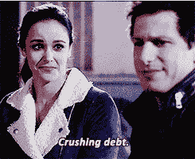
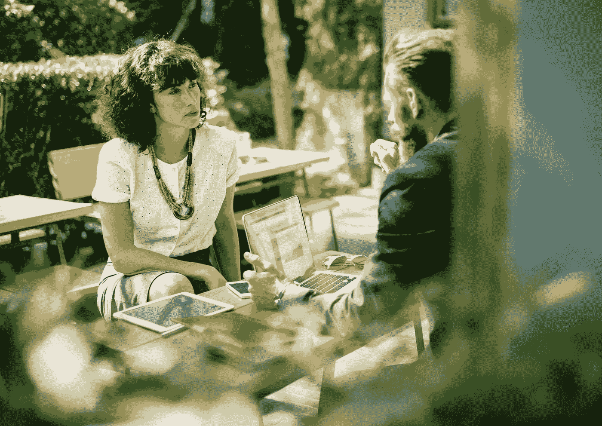

# 只有领导者才会明白的 21 件事

> 原文：<https://medium.com/swlh/21-things-only-leaders-will-understand-3b318ce345da>

Photo by [Rutger Geleijnse](https://unsplash.com/photos/QKrCzRBfWAw?utm_source=unsplash&utm_medium=referral&utm_content=creditCopyText) on [Unsplash](https://unsplash.com/search/photos/explorer?utm_source=unsplash&utm_medium=referral&utm_content=creditCopyText)

> "一个领导者是一个知道道路，走道路，并指出道路的人."—约翰·C·麦斯威尔

我敢打赌，每个阅读这篇文章的人或者绝大多数读者都想成为生活中的领导者。

事实是，只有一小部分阅读这篇文章的人是领导者，或者有能力承担责任以成为领导者。

这些人中的一小部分将有能力成为一名成功的领导者。

作为一名领导者，首先要对自己负责，然后才是对他人负责。根据定义，你将领导。

*   你带领人们走向未知。
*   你超越了自己的极限。
*   你带领人们回到安全的地方。
*   你是一个正面的例子。
*   即使你感到害怕，你也能领导。

从算术上来说，我们可以说，在我们在社会和经济中发现的众多系统中，领导者将是极少数。以 [*帕累托原理*](https://en.wikipedia.org/wiki/Pareto_principle) 为例:

> **帕累托法则**(也称为 **80/20** 法则，重要少数法则，或因素稀疏原则)指出，对于许多事件来说，大约 80%的结果来自 20%的原因。

**给定系统内只有一小部分人会占领导层的大多数。**

所以当你阅读这篇文章的时候，也许你已经有了被推上领导岗位的记录。

也许你内心深处一直相信自己是一名领导者，但却不一定有机会展示自己的优势。

## 不管是哪种情况，以下是我列出的现代世界中领导的关键礼仪、特质和习惯。

# 1.拥有你的大便。

> 你并不完美。

事实上你远非如此。

抱歉，我带来了坏消息。你在生活中会犯错误(很多错误)。我已经得到了我应得的一份。承认你的错误。承担责任。

委派者指责——领导者承担责任。

# 2.信守你的诺言。

这听起来如此陈词滥调和基本。

当我还是个孩子的时候，我妈妈总是说，“如果你说你要做什么，你最好去做。”

撇开她不恰当的英语不谈，她是对的。

有时候很难理解你的承诺和坚持到底有多重要。你基本上体现了你的话。你的话就是你的名誉。建一个伟大的。

# 3.每天至少向一个陌生人介绍自己。

[https://bit.ly/2HmZF4e](https://bit.ly/2HmZF4e)

如果你做不到，那就有意识地努力寻找一个新的机会来介绍你自己。

你是网络中的一个节点。

你是想成为一个积极的节点，进一步连接和增强其他节点的能力，还是想成为一个消极的节点，扼杀未来的联系？

# 4.提高你的在线存在感。

当然，社交媒体可以让你受益。有更好的途径让你的在线形象为人所知(咳，咳…任何人都可以？)Medium for one 是分享你的声音和专业知识的好方法。此外，在 Quora、Linkedin、Reddit 等网站上写作，或许还可以创建自己的博客。

> 这是一种新经济。

# 5.总是问为什么。

我是天主教徒。

虽然我很感激被教导的固有价值观，但我不同意天主教的许多东西。

最明显的是:把宗教背景下传授的一切都当成真理和*字*(其他宗教也是如此)。

从那以后，我采用了新的*福音。*总是问，为什么？我为什么要写这篇文章？为什么这种麦片是 X 美元，另一种是 Y 美元？有时我有点疯狂，但有时它有助于揭示面纱背后的真相。

# 6.问问你的人际网络，你怎样才能变得更好。

你的*自我*讨厌这个问题。

我知道我经常落入这个陷阱。我喜欢认为我能征服任何问题和我可能处理的任何事情。

事实是，我不能。

我发现，自从问了我周围重要的人我如何才能变得更好，它揭示了我生活中的“盲点”。

> 我怎样才能成为一个更好的儿子？我父亲回答。
> 
> 我怎样才能成为一名更好的作家？我的导师回答。
> 
> 怎样才能成为一个更好的爱人？我的搭档回答。

这不是由别人的突发奇想决定的，只是问问这个世界，你如何从那些愿意给你直说的人那里得到改善。

# 7.当你认为你完成了，再工作 15 分钟。

这是我父亲教给我的一课。

他是我认识的最努力的工人之一。他大学刚毕业，现在经营着一家成功的制造企业。

在 2008 年金融危机期间，他将这家企业从崩溃的边缘拉了回来。他总是告诉我，当你工作的时候(我和他谈了很多关于我写作的事情)，你认为你已经完成了，再写/工作 15 分钟。

我们人类通常认为我们储备的能量比我们实际拥有的要少。推开束缚。

# 8.抵制陷入信用卡债务。

[https://bit.ly/2LYRQFc](https://bit.ly/2LYRQFc)

我有一个同事，我把他置于自己的羽翼之下，试图在他生活的各个方面指导他。

他喜欢在时尚潮流上花钱。他刚买了一双 250 美元的牛仔裤。

我问他为什么。

他说这让他感觉很好。我告诉他，他最近告诉我，他担心交房租。

我问他为什么买这双鞋。他再次说他想要它们，让他感觉很好。

他欠了大约 4000 美元的信用卡债务。我用另一种方式说明了他的债务。我告诉他我有一张积累里程的信用卡(我现在有大约 50k 里程，已经用它乘坐了几次免费的航班)。我告诉他，我*可以*免费乘坐这些航班，因为当他提交最低还款额时，他会为自己的卡支付 16%的利息。本质上(尽管还有更多细节)，他是在补贴我的免费飞行。这似乎终于让他受到了一点打击。

# 9.求助。

生活是艰难的。

有时我们比其他人有更多的特权。然而，总而言之，生活是痛苦的。会有一些时候，我们觉得我们无法前进。

自我想要告诉你你很好。

会有你不寻求帮助的时候。如果你不想要一个男朋友或女朋友，而且似乎不能让它工作-寻求帮助。如果你在工作中停滞不前，错过了一个你认为应该得到的晋升机会，寻求帮助。如果你很沮丧，在生活中没有任何进展，寻求帮助。

# 10.利用“不”的力量

不要与现在的的*力量相混淆(感谢艾克哈特·托尔)。*

这个世界想把你拉向许多不同的方向。人们想要实现他们的梦想，有时是以牺牲你的梦想为代价。

会有人真心实意地想帮助你度过这一生，这是真的。你会发现，很多时候你首先要对自己负责。当有人问你一些可能会让你偏离工作的事情时，告诉他们不。让别人听到你的声音。

# 11.坚持不懈地阅读。

当你的学术生活停止时，你的教育也可以停止。太多的人找到了第一份“大男孩”的工作，并就此打住。

也许一两年后你会学到新的技能。为了适当地成长和提高，坚持不懈地阅读。

据说托马斯·杰斐逊生前拥有世界第二大图书馆(他的是私人图书馆)。他总是在学习。

# 12.注意你的卫生。

当你看起来很好的时候，你感觉很好。

简单明了。

这可能看起来很琐碎，也许确实如此。但这是事实。当你看起来像是住在一个洞穴下，你可能会喜欢它，并且最终可能会喜欢它。

你觉得什么发型很酷？

什么样的衣服让你感觉像穿了一套盔甲？

相信我，我和虚荣的感觉做斗争。然而，这对我来说是最基本的。这不是虚荣，这是需要。

# 13.让别人赢得你的尊重。

我们都想与人友好相处(请为反社会者保留)。

我们想成为每个人的朋友。

我们想远离对抗和冲突。这应该是一种美德去争取。

然而，也许尊重是一种更好更可持续的美德。当你给予人们尊重，人们也回报给你尊重时，你就在这个网络中建立了你的影响力和权力。这不是邪恶的力量。这是个人的力量。你知道自己想要什么，并能自由成为*你的力量。*

# 14.好好吃饭，优化身材。

> 当你爱自己的时候，你会发现人们爱你。

地球上的大多数人都是羊(希望你不是其中之一)。这些羊正在寻找崇拜的人，他们正在寻找带领他们的人。

如果你是这些领导者中的一员，你需要爱自己。当你用缺乏营养的食物来填饱你的身体时，你不可能优化你的身心。

# 15.先戴上氧气面罩。

我相信如果你是一个通情达理的人，你会想对这个世界产生影响。

我们都有“超越自我”的想法

这些都是优秀的、高尚的思想。为了做到这一点，你必须首先确保你是正确的。

如果你没有首先优化自己，你就不能走出去改变世界。你还在处理哪些需要克服的问题？在改变世界之前，先解决内在缺陷。

# 16.拒绝并避免闲聊。

昨晚谁赢了比赛并不重要。你买了新的苹果 iWatch 也没关系。

> 重要的是什么让人们滴答作响。

重要的是你面前的人在追求幸福的过程中做了什么(如果有的话)。我发现快速结束闲聊的最好方法是简单地问这个人他或她对什么感兴趣，“告诉我，你对什么感兴趣。”

他们可能会告诉你那是什么(每个人都喜欢谈论自己)。

你跟进，“*为什么？你对此有热情吗？”* 与观看谈话的人胸围大开。

你会惊讶于人们对什么充满热情，更重要的是，他们为什么会有这种热情。

# 17.腾出时间远离这一切。

我们都想从生活中得到最多。

我们都希望脑中的梦想成为现实。

如果你足够努力，工作得足够好，再加上一点运气，也许你会成功。然而，当我们到达收益递减点时，我们有必要远离这一切。

想想你以前为了上学拼命学习的时候。还记得你花几个小时学习的时候，你发现自己只是在读一张纸上的单词，而没有理解或记住任何东西吗？生活也是如此。

有时候，我们努力了很长时间，以至于我们并没有真正前进，而是原地踏步。

# 18.尽力管理好自己的情绪。

回想一下上一次别人冤枉你的时候。

你的第一反应可能是报复他们，报仇雪恨。

如果你做了，之后你有什么感觉？

可能有一会儿很好。然而，后来这种情绪溃烂了。愤怒溃烂，恐惧溃烂，内疚溃烂。如果你不能控制和消除这种情绪，也许可以和对方谈谈。甚至被击倒，而不是以爆发的情绪反应。

# 19.拥抱不舒服的情况。

我们不是在舒适中成长的。

这可能感觉很好，我们都需要稳定的生活。

> 想象你正站在一块恰好位于河流或小溪中的岩石上。这条河里有许多岩石，形成了水的顶部。为了顺流而下，你需要从一块岩石跳到另一块岩石。每隔一段时间，你会发现两次跳跃之间有很大的间隙。离开岩石跳下去是很可怕的。你可能会掉进河里，被河水冲走。然而，没过多久，你就鼓起勇气迈出了这一步。也许你绊了一下，脚就陷进去了。你最终安全着陆在下一块岩石上。

生活中会发生这种情况。

你可以看到着陆区——也许是一份新工作或离开爱人。你害怕跳入未知。你不知道你能做什么。然而，当你最终迈出这一步时，你会发现你自始至终都拥有这种力量。

# 20.学会谈判。

Photo by [rawpixel](https://unsplash.com/photos/bMclPCvSHLo?utm_source=unsplash&utm_medium=referral&utm_content=creditCopyText) on [Unsplash](https://unsplash.com/search/photos/negotiate?utm_source=unsplash&utm_medium=referral&utm_content=creditCopyText)

世界上基本上有三种*成为*的模式:

有主，有从，有谈判。

> 当你是高手的时候，你就是一个冷酷的暴君。
> 
> 当你是奴隶时，你是无能为力的。
> 
> 当你是一个谈判者时，你学会了来到一个地方的艺术，在这个地方，双方(或多方)离开的地方比他们来的地方更好——这是贸易的基础。

学会在这个世界上索要东西，并使用语言来获得这些东西。

# 21.松开饼干罐里的一些饼干。

有一句古罗马谚语是这样说的，

> “当孩子把手伸进饼干罐，抓了一把他们能抓到的最大的饼干时，他们发现他们的手停了下来，无法拿出来。然而，当他们释放一些糖果时，他们可以轻松地退出他们的手和一些宝藏。”

我倾向于歪曲事实。

除此之外，你不可能在生活中拥有一切。你需要找到平衡。当你试图最大化你生活中的所有领域时，有些领域最终会动摇。选择你想关注的重要领域:家庭、财务、精神、职业等。

优先考虑你想最大化的。

找到生活的平衡，提高你作为一个人的地位。

# 准备好接受刺激了吗？

我提供给你一个经过测试和验证的 6 部分指南，它包含了强大的概念，可以帮助你识别、规划、成长和完成你的创造性追求。

# [> > >在这里获得免费指南< < <](https://www.tribeloyal.com/free-6-step-course)

> *学到了什么？按住👏说“谢谢！”并帮助他人找到这篇文章。*
> 
> *还评论！你喜欢什么？你讨厌什么？你在做什么？*

## 这篇文章发表在 [The Startup](https://medium.com/swlh) 上，这是 Medium 最大的创业刊物，有 332，253+人关注。

## 在这里订阅接收[我们的头条新闻](http://growthsupply.com/the-startup-newsletter/)。

