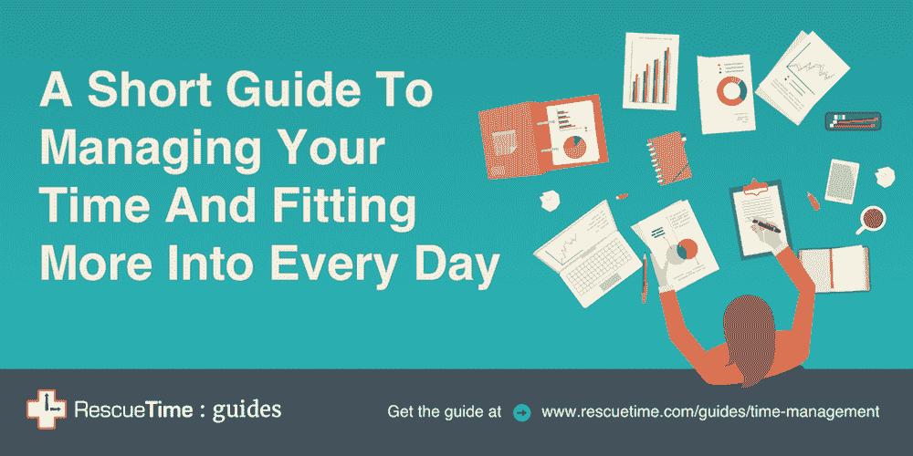
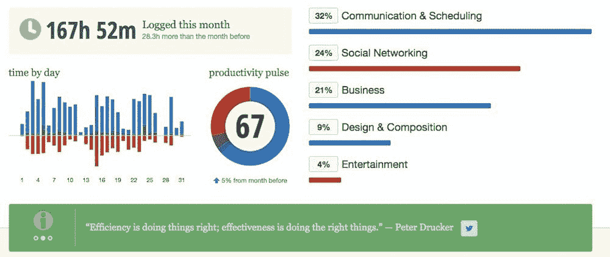
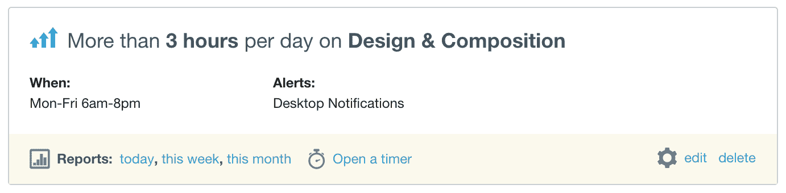
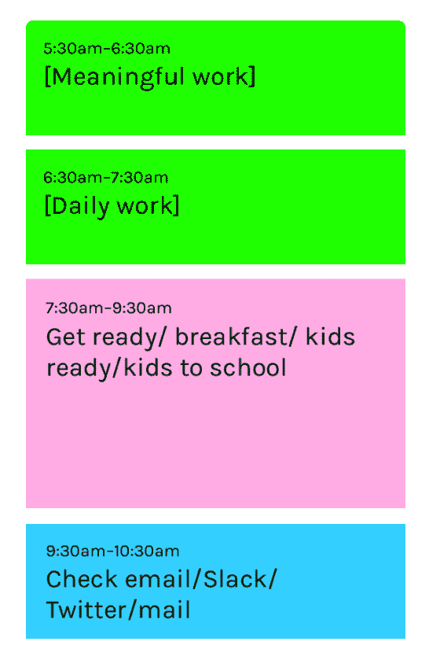
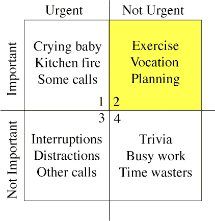
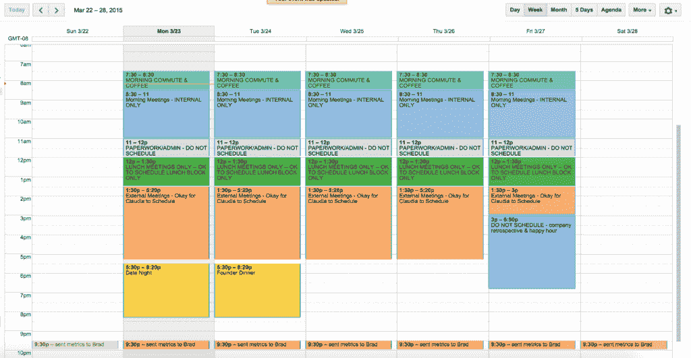
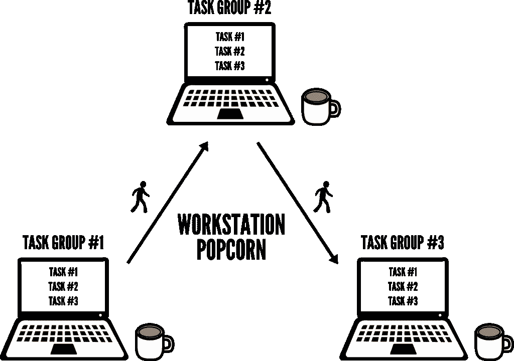
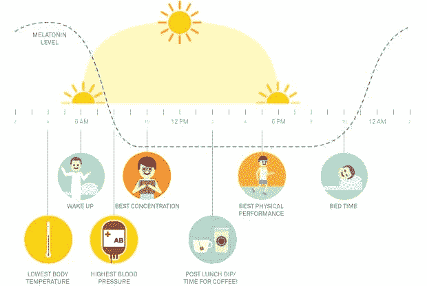

# 来自首席执行官、创意人员和教练的 21 条时间管理建议

> 原文：<https://medium.com/swlh/21-time-management-tips-from-top-ceos-creatives-and-coaches-196d858e747f>

## 从计划到说“不”，再到阻挡干扰，以下是专业人士如何完成更多工作的方法

Photo by [Harry Sandhu](https://unsplash.com/photos/FpYoDqGGI4A?utm_source=unsplash&utm_medium=referral&utm_content=creditCopyText) on [Unsplash](https://unsplash.com/?utm_source=unsplash&utm_medium=referral&utm_content=creditCopyText)

输入法管理是我们都面临的问题之一，但(讽刺的是)我们没有时间去解决。但是，正如本杰明·富兰克林曾经说过的，时间就像金钱。如果没有适当的管理，你怎么知道它要去哪里？

不幸的是，时间的流逝往往感觉完全不受我们的控制。在某些层面上的确如此。没有什么能阻止它前进。然而，当我们学会合理管理我们的时间时，我们会赢回一些控制权。

时间管理是一个复杂的话题，它涵盖了从提高[生产率](http://blog.rescuetime.com/productivity-in-the-workplace/)到[工作生活平衡](http://blog.rescuetime.com/work-life-balance-tips/)，避免[精疲力竭](http://blog.rescuetime.com/burnout-syndrome-recovery/)，培养良好的[习惯](http://blog.rescuetime.com/how-to-build-good-habits/)，以及设定长期[目标](http://blog.rescuetime.com/why-goals-and-resolutions-fail-and-what-to-do-about-it/)的方方面面。

虽然我已经写了很多关于这些话题的文章，但是这篇文章将只关注我们从企业家、经理和创始人那里发现的最好的日程安排、优先级排序和时间管理技巧。

***想在旅途中获得更多时间管理技巧？免费下载我们 63 页的*** [***管理你的时间并更好地融入每一天的指南***](https://www.rescuetime.com/guides/time-management)

# 为什么时间管理很重要？

人类的平均寿命约为 4000 周。这听起来是个很大的数字。但是，当你考虑到这些日子有多少是在学校度过的，有多少是在退休后度过的，有多少是在睡觉时度过的，情况就不一样了。

正如苹果公司创始人史蒂夫·乔布斯所写的:

> "很明显，时间是我们拥有的更宝贵的资源。"

只有有限的时间来做我们最有意义的工作，自然会感到一定程度的焦虑。但是时间管理并不是消除对浪费时间的恐惧。这是关于理解明智地使用我们的时间的深远的好处。

当我们合理管理时间时，我们:

*   在工作中变得更有效率。这意味着有更好的工作生活平衡和更多的晋升机会。
*   不容易受到压力。这意味着我们更快乐、更健康，也更不容易患上[倦怠综合症](http://blog.rescuetime.com/burnout-syndrome-recovery/)。
*   学得更快，并且能够看到我们花在对我们重要的技能上的时间的复合回报。
*   对我们花在非生产性活动上的时间有更多的意识。
*   可以腾出更多的时间去做[有意义的工作](http://blog.rescuetime.com/meaningful-work-guide/)并与更大的目标联系起来。

时间管理到底有多有效，我们真的能够继续放任不管吗？

# 21 条时间管理建议让你一整天都保持在正轨上

我们不能控制时间。但是我们可以学习一些策略来帮助我们充分利用我们所拥有的时间。这里有一些我们学到并实施的最有效的时间管理技巧。

# 对一天实际完成的工作量要现实一点

最简单的时间管理方式是安排好你要工作的时间和内容。你是做什么的？你翻开日历，开始插入适合你 8 小时工作日的任务。

这很简单，但不幸的是这种方法有一个缺陷。

虽然你可能已经工作了 8 个多小时，但是花在工作上的时间却少了很多。

少了多少？

一项对世界上最有创造力的人物和科学家的研究调查发现，最有生产力的工人(基于产量)比他们的同龄人工作得少。特别是一项研究发现，每周工作 10-20 小时的科学家比他们在办公室工作 35 小时以上的同事发表的文章更多。

虽然我们可能认为时间是一种我们需要更多的资源，但是更多的时间并不意味着更多的生产时间。

正如 Basecamp 创始人大卫·海涅迈尔·汉森[写的那样](https://www.slideshare.net/egarbugli/26-time-management-hacks-i-wish-id-known-at-20/3-Work_more_when_youre_in):

> "每天只计划 4-5 小时的实际工作."

当开始考虑时间管理时，对一天中实际完成的工作量要现实一些。

试着限制自己只做 3 到 5 件事情。或者，试着给你认为一项任务需要多长时间留出 25%的缓冲时间。更好地管理时间的第一步是诚实地意识到你有能力有效地利用时间。花更多的时间工作并不等于更好的结果。

# 找出你浪费时间的地方

人们很容易陷入脸书或 YouTube 的兔子洞里，而没有注意到时间在流逝。

根据 Salary.com 最近的一项调查，超过 30%的人承认每天在社交媒体和其他非生产性活动上浪费一个多小时。

现在，这里的解决方案不是简单地说*我不会上社交媒体*。我们都有[有限的意志力](http://blog.rescuetime.com/science-of-willpower/)，不断与坏习惯作斗争不会带来改变。相反，第一步是了解你在哪里浪费时间。

一个解决方案是使用像 [RescueTime](https://www.rescuetime.com/) 这样的工具，它在后台跟踪你的电脑使用情况，给你一个你如何度过一天的快照。

当作家丹妮尔·a·文森特试图完成她的第一本书时，她总是错过最后期限。所以。她决定开始记录她的时间，看看她的时间都去了哪里。

一个月后，她发现自己 25%的时间(一个月 40 多个小时！)要去脸书。

根据这些信息，丹妮尔改变了她访问社交媒体的时间和方式，并完成了她的草稿。但关键是首先要明白她的时间去了哪里。

你越了解你现在是如何度过一天的，你的时间管理工作就越有影响力。

# 为你如何花费时间设定每日目标和提醒

一旦你对自己的时间是如何度过的有了大致的了解，你就可以开始在每天的基础上做出改变。再说一次，你需要帮助来确保你没有把时间花在没有效率的事情上。

在 RescueTime 中，你可以设置[提醒](http://blog.rescuetime.com/alerts/),让你知道什么时候你在自己标记为分散注意力的工作上花了太多时间。或者，当您达到一个富有成效的里程碑时，提醒也可以通知您。

当我一天花 3 个小时或更多时间写作时，下面是我的一个提醒:

*您可以在此了解* [*如何在*](http://blog.rescuetime.com/alerts/) *设置提醒。*

除了像 RescueTime 这样的应用程序，还有其他方法来设定和跟踪每天的目标。

我发现一个有用的方法是把我的工作日分成 50 分钟的小块，每块之间有 10 分钟的休息时间。如果这听起来很熟悉，那是因为这是流行的番茄工作法的一个版本。

然后，我在我的每日任务清单上追踪每一块，标出完成一项任务需要多少时间。这样，在一天结束的时候，我就可以获得实时反馈，了解任务花费了我多长时间，以及我可能在哪些地方浪费了时间。

# 建立一个给你动力的早晨惯例

时间管理从你醒来的那一刻开始。有了正确的[晨间作息](http://blog.rescuetime.com/perfect-morning-routine/)，你就可以开始一天富有成效、有意义的工作。

早晨的例行公事给你一个机会以积极的动力开始，这种动力将带你度过一天的剩余时间。它还可以让你设置你的优先事项和重点。

虽然每个程序都应该单独定制，但有几个关键品质是你应该努力达到的:

1.  **克服睡眠惰性**,跳过贪睡按钮，带着活力和兴奋开始你的早晨
2.  通过记日记或写下你的每日待办事项清单来理清你的思绪
3.  用一些积极的事情来定下基调，比如给朋友打电话，查看你的 Instagram feed(如果这能让你感觉良好的话)，或者读一些你喜欢的东西
4.  **朝着有意义的目标采取行动**比如做一个个人项目

这听起来像是你早上要做的很多事情，但是尽早做些跑腿的工作会让你一整天都保持专注。你甚至可以像设计师 Dan Mall 一样，把早晨的例行工作加入到你的日程中:

我们坚信晨间常规的重要性。要阅读更多关于如何制作你自己的早餐，请查看这篇文章并下载我们的免费早餐模板。

# 放弃多任务处理

当你的待办事项清单上有一百万个任务，而时间有限，要完成所有这些任务，很容易开始多任务处理。

然而，研究表明，人类实际上不可能同时专注于一项以上的任务。相反，我们认为的多任务处理实际上只是你的大脑快速地来回切换。

那么问题出在哪里？嗯，[根据研究](http://www.nytimes.com/2013/05/05/opinion/sunday/a-focus-on-distraction.html) **分散注意力后，可能需要长达 25 分钟才能重新集中注意力**。

[我们的大脑通过做](https://crew.co/blog/science-of-how-to-stay-focused/)来学习，这意味着每当你在开会时拿起手机或在查看电子邮件时打开脸书，你都在教它破坏性行为是可以的。

为了合理地管理我们的时间，我们需要通过单一任务来改变这种行为。

当你发现自己注意力不集中时，停下来写下你在想什么，然后再回到手头的任务。有时候，简单地承认注意力分散就足以放松它对你的控制。

# 优先考虑有意义的工作(并委派其他工作)

现在我们知道我们的时间去了哪里，是时候决定我们应该(和不应该)把时间花在什么上面了。

# 把紧急的工作和重要的工作分开

尽管你尽了最大努力来计划你的一天，但任务总是会在最后一刻抛给你。虽然把这些加入你的待办事项清单很有诱惑力，但这会让你的一天很快失控。相反，我们需要能够识别并区分“紧急”任务和“重要”任务。

一个解决方案来自美国前总统德怀特·戴维·艾森豪威尔，他提出了一个简单的任务分类矩阵。

这是一个非常基本的模型:

在艾森豪威尔矩阵中，每项任务都属于不同的部分:

重要和紧急:这些任务要么是意料之中的，要么是意料之外的。如果你期待一项重要而紧急的任务，你应该提前计划，以避免压力和潜在的精疲力竭综合症，这可能来自于处理太多的这些事情。

**重要和不紧急:**这些任务可以帮助你实现个人或职业目标，但并不及时。人们很容易不为这些事情留出时间，尽管在寻找有意义的职业时这些事情是最重要的。

**不重要但很紧急:**这些是阻碍你做好工作的干扰。试着委派或重新安排尽可能多的任务。

**不重要不紧急:**简单来说，如果你的日程表上排满了不重要不紧急的任务，那你就是在做错事。尽可能地放弃这些。

通过这种方式对你的工作进行分类，你可以开始对你的时间进行优先排序，并制定一个时间表，让你做更多重要的工作，减少不重要的工作。

# 毫不留情地列出“不惜一切代价避免”的清单

对我们许多人来说，堆积更多的工作比分配任务更容易。但是为了合理管理你的时间，你需要知道什么该花时间，什么不该花时间。

虽然有很多方法可以优先处理你的工作，但一个特别有效的方法来自亿万富翁投资者沃伦·巴菲特。根据来自[巴菲特个人试播集](https://jamesclear.com/buffett-focus)的一个故事，这位亿万富翁使用一个简单的三步流程来安排工作的优先顺序:

*   第一步:在一张纸上写下你最重要的 25 个目标。
*   第二步:只圈出你最喜欢的五个选项。
*   第三步:把前五个放在一个列表上，剩下的 20 个放在第二个列表上。

似乎很简单。但这正是这个策略变得有趣的地方。

飞行员写完他的目标后，他同意专注于他圈出的前五个目标，并表示他有时间时会继续完成剩下的 20 个目标。对此巴菲特回应道:

> “不，你弄错了，迈克。你没有圈出的一切都成了你不惜一切代价避免的清单。无论如何，这些事情都不会引起你的注意，除非你成功地完成了前 5 项任务。”

尽管这些都是值得追求的“好”选择，巴菲特意识到我们第二张单子上的任何东西都只是分散注意力。

我们的每一个行为和选择都是有代价的。不断地决定做第一份清单还是第二份清单会占用你本可以用在更有意义的地方的时间。

当你看着你每天或每周的任务清单时，问问你的前五项任务中有哪些，哪些是应该不惜一切代价避免的？一旦你知道了这一点，那么是时候委派其他人了。

# 使用 30X 规则开始委派更多的任务

优先化和授权是确保你做有意义的工作的关键，而不仅仅是转动你的轮子。正如作家约翰·C·麦斯威尔所说，

> "如果某件事别人能做 80%好，那就委托他人去做！"

伦敦商学院的 Julian Birkinshaw 最近的一项研究发现，大多数知识工作者[平均花费我们 41%的时间在我们可以轻易交给别人的工作上。](https://hbr.org/2013/09/make-time-for-the-work-that-matters/ar/1)

问题是，虽然我们意识到我们可以移交工作，但训练某人来做这件事的想法令人生畏。

作者罗里·瓦登在他的书《故意拖延》中解释了这是一个错误的论点。相反，他建议我们应该给自己 30 倍的时间来训练别人完成任务。

这里有一个例子:如果你有一个每天花 5 分钟完成的任务，预算 30 倍的时间(所以，150 分钟)来训练其他人做这件事。这看起来马上就是巨大的时间浪费，但是将这 5 分钟乘以每年 250 个工作日，你个人将在这项任务上花费惊人的 1250 分钟。

花时间委派和培训别人会让你每年净收益 1100 分钟。或者，正如瓦登在他的书中所说的，**ROTI**(投资时间回报率)增长了 733%。

管理你的时间不仅仅是今天，它是关于建立系统和过程，在未来给你带来更多的时间。

# 把“不”带回你的词汇中

有一句名言是这样说的:每次你说不的时候，你实际上是在对别的事情说好。在时间管理方面尤其如此。

我们不应该对那个会议、项目、新任务，甚至是晚上出去玩说“是”，我们需要接受说“不”。但这并不容易。我们是群居动物。我们渴望被接受和感激，说“是”是最简单的方式之一。

克服害怕说“不”的一个方法是使用“拒绝技巧”

在最近一篇来自消费者研究杂志*的文章中，研究人员 Patrick 和 Henrik Hagtvedt 教授发现，说“我不做”比说“我不能”能让参与者更容易从不想要的承诺中解脱出来。*

*虽然“我不能”听起来像是一个有待讨论的问题，但“我不”意味着你有硬性规定。*

# *建立一个高效的日程安排*

*现在是时候开始将这项工作纳入日程了。但是你应该如何最好地设置它呢？这里有一些有用的建议，告诉你如何利用你的时间表有效地管理时间。*

# *设定时间表，而不是截止日期*

*尽管“时间”这个词在“时间管理”中是正确的，但是我们很容易忽略时间安排的时间方面。我的意思是，我们专注于我们的待办事项和截止日期，而不是创建一个我们可以努力的可重复的时间表。*

*正如作家詹姆斯·克莱尔解释的那样:*

> *“不要给自己设定完成某个特定目标的最后期限(如果没有实现，你会觉得自己很失败)，你应该选择一个对你来说很重要的目标，然后制定一个持续朝着这个目标努力的时间表。”*

*这一切都回到了对你一天能做什么持现实态度的想法。*

*时间管理意味着最大限度地利用我们所拥有的时间。按照时间表而不是截止日期工作可以确保我们每天都离目标更近一点。*

# *安排时间，而不是任务*

*如果你的一天都花在大量的或开放式的待办事项上，你很可能会在一项任务上花太多时间。*

*作为一名作家，我可以把像“完成 X 邮报的初稿”这样简单的事情放在我的任务清单上，把我的一天排得满满的。但这是否意味着我只写了一个项目？当然不是。相反，我的清单上有很多项目需要花一整天来完成。*

*显然这是一个问题。即使你花了一整天的时间完成一项任务，如果你说过你会完成五项类似的任务*

*幸运的是，有两个简单的方法可以解决时间管理的错误。*

*首先，把大任务分成几个时间段。例如，与其把“完成初稿”放在你的日程表上，你不如承诺两个 50 分钟的工作块。*

*根据《四秒钟:所有的时间你都需要用真正有效的习惯来取代适得其反的习惯 的作者彼得·布雷格曼的说法，这是因为时间承诺更加具体:*

> *“日历是有限的；一天只有一定数量的小时。当我们试图把不切实际的东西塞进有限的空间时，这个事实就变得很明显了。”*

*特斯拉和 SpaceX 创始人埃隆·马斯克就是这样安排自己一天的人。*

*尽管每周工作 80 多个小时，马斯克还是把每天分成 5 分钟的小块。他的每一项任务都会根据需要被分配尽可能多的时间。如此紧凑的日程安排让他可以经营多家公司，同时还能把 80%的时间[花在工程和设计上。](https://www.youtube.com/watch?v=qszGzNoopTc)*

*如果这听起来太严格，第二个解决方案是缩小你的任务范围。*

*在我们的博文写作示例中，这可能意味着致力于完成大纲或只写正文，而将引言、结论和编辑留给下一天。*

*通过围绕时间而不是任务来安排我们的一天，我们从围绕未知(任务)到已知(时间)来安排我们的时间表。*

# *为中断和休息安排时间*

*当我们填写每天的时间表时，我们多久会留出一段时间休息或被打扰？除了午餐和一两份小吃，通常都是满满的工作。*

*但是现实生活是混乱的。干扰来了，或者我们的身体告诉我们需要休息一下，突然间我们完美制定的时间表被扔出窗外。*

*这不仅令人沮丧，而且根据研究人员的说法，这比我们一开始就简单地安排休息时间还要糟糕。*

*发表在*组织行为和人类决策过程*上的一项研究发现，如果事先计划好，休息会让人更有精神，更能帮助人们变得更有创造力和效率。正如研究人员在《哈佛商业评论》**:*中所写**

> **“定期设置休息时间——必要时使用计时器。当它关闭时，切换任务:整理你的报销收据，检查你的电子邮件，或清理你的桌子，然后回到原来的任务。**
> 
> **“如果你犹豫要不要脱离，因为你觉得自己正处于好运之中，要注意这可能是一个错误的印象。”**

**如果你认为你不能在你的一天中安排这些休息时间，你可以使用类似番茄计时器的技术，或者设置[重复时间提醒](http://blog.rescuetime.com/alerts/)，当你工作到一定量时提醒你离开。**

# **将“制造者”和“管理者”的时间分开**

**说到时间管理，你的日历是你最好的工具。然而，很容易被管理任务填满，而没有足够的时间做有意义的工作。**

**几年前，散文家、程序员和风险投资家保罗·格拉厄姆研究了这个问题，并提出了两种非常不同的安排工作日的方式:创造者的时间表和管理者的时间表。**

**“经理的日程表是为老板准备的，”他解释道。“这体现在传统的约会簿中，每天都被分割成一个小时的间隔……当你这样利用时间时，与某人见面只是一个实际问题。在你的日程表上找一个空位置，预订它们，你就大功告成了。”**

> **但是还有另一种利用时间的方式，这种方式在程序员和作家等创造东西的人中很常见。他们通常喜欢以至少半天为单位来使用时间。你不可能以小时为单位写好或写好程序。这点时间几乎不够开始。”**

**不幸的是，我们大多数人都坐在中间。我们需要在一天中挤出时间来管理和创造。一个管理你的时间的方法是在你的日历上使用一个潜在的“系统”。**

**以下是 Mattermark 首席执行官丹妮尔·莫里尔如何设置她的:**

****

**每天都有一个模板，包括管理时间、文书工作时间和外部会议时间(经理时间)，以及专门用于内部会议和日常工作的大块时间(创造者时间)。**

# **一周内的“批量”活动**

**无论是写作、设计还是计划，当我们长时间从事某项工作时，都会有一种动力。把它想象成对牛顿第一运动定律的一种生产力:“一个运动的物体，保持运动。”**

**每当我们转换任务时，都会有认知负荷。因此，我们应该使用时间管理来批量处理类似的活动，并利用我们获得的动力。**

**这方面的一个很好的例子是畅销书作家保罗·贾维斯，尽管他写了很多书，主持了很多播客，还教了很多课程，但他多年来一直发送每周一次的“周日快讯”电子邮件。**

**[根据贾维斯](https://www.foodbloggerpro.com/blog/article/paul-jarvis/)的说法，关键在于他的写作:**

> **“我会一个月抽出一天时间写四五篇文章，或者一个月抽出一天时间录四五集播客。我发现有两件事可以解决这个问题:**
> 
> **“第一，我觉得当我将类似的工作批量处理在一起时，完成速度会更快。所以，我会坐在那里一个小时，试着写一篇文章，开头会很糟糕。然后我会开始进入节奏。下一篇文章需要 30 分钟。接下来的两个各花 15 分钟。诸如此类。**
> 
> **“第二部分，我知道我会更加坚持我的工作。”**

**当我们进入某一类项目的流程时，就更容易继续下去。我们也建立了自我效能，这基本上是我们对自己能力的信念。这有助于我们对工作更有信心，在更短的时间内完成更多的工作，并且与我们的产出更加一致。**

# **利用位置优势**

**你的日历和日程表并不是你时间管理工具箱中的唯一工具。这里有一些方法，你可以用你工作的*来帮助影响你工作的*。****

# **尝试“工作站爆米花”法来分配你的时间**

**一天中不断变换地点是保持我们动力和生产力的好方法。这也是管理时间的好方法，因为你知道某些任务会在某些地方发生。**

**尽管你可以随心所欲地“定位框”你的一天，但一个有趣的建议来自 Impossible HQ 创始人乔尔·鲁尼恩，他称之为[“工作站爆米花”](https://impossiblehq.com/workstation-popcorn/)它是这样工作的:**

*   **第一步:写下你今天需要完成的所有任务**
*   **第二步:将列表分成三个相等部分(或者像我们之前讨论的那样一起批量工作)**
*   ****第三步:**为每批作品选择 3 个不同的地点**

****

**Runyon 称之为“番茄工作法的宏观版本，不同的是，你不是在 25 分钟内工作，而是计划一整天。”**

**此外，每一个地点的改变都会带来短暂的休息，一点锻炼，同时也会把你的工作日分成可管理的小块。**

# **配合你身体的自然能量循环**

**任何人能给你的最好的时间管理建议就是做最适合你的事情。**

**早上工作更好？然后安排你最密集的工作。比如白天做行政工作，晚上做创造性的工作？那么这就是你应该如何管理你的一天。**

**然而，归根结底，管理的不仅仅是你的时间，还有你的精力。**

**越来越多的研究表明，我们的能量水平在一天中有一个自然的起伏。这些被称为昼夜节律。尽你所能，对抗它们就像看猫的视频一样有效。**

**每个人都有差异，但一个标准的昼夜节律看起来像这样:**

****

**一旦工作日开始，需要几个小时才能进入高峰工作模式(大约上午 11 点至下午 1 点)。此后，能量在下午 3 点左右急剧下降，然后在下午 6 点左右恢复。**

**花些时间了解你自己的节奏是什么样的，并相应地管理你的时间。把你最重要的工作安排在你最忙的时候。其余的可以划分为低能量时段。**

# **保护你的时间**

**总会有成千上万的其他事情突然出现，试图占用你的时间。如果你不付诸实践，这些时间管理的建议就一点意义也没有。这里有一些方法可以帮助保护你的时间，把它花在正确的*工作上。***

# **用战略性的懒惰去做正确的事情**

**时间管理可能关乎生产力，但懒惰可能是你的秘密武器。**

**然而，“战略性懒惰”的概念与游手好闲没有任何关系。相反，它是关于对重要的工作和任务进行优先排序，并允许自己懒惰或“不擅长”那些不重要的工作和任务。**

**这在实践中看起来如何？在[的一个故事](https://signalvnoise.com/posts/1619-theres-always-time-to-launch-your-dream)中，Basecamp 创始人 David Heinemeier Hansson 谈到他对自己在学校取得的一些糟糕成绩感到自豪:**

> **“我在一些课程上得到了大量的 b 甚至 c，这让我非常自豪，因为他们几乎没有花时间。这样我就可以花时间阅读自己的课程，开始自己的项目，经营自己的生意。**
> 
> **“我做到了。在大学期间，我创建了 Instiki、Rails、Basecamp，并成为了 37signals 的合伙人。你认为我能满足所有这些要求，而且还能得全 a 吗？”**

**这个想法就是放下你对完美的需求，专注于重要的工作。优先考虑重要的事情，允许自己在剩下的事情上表现不佳。**

**正如管理顾问彼得·德鲁克所说的那样:**

> **"没有什么比让根本不应该做的事情变得更有效率更没效率的了."**

# **自动化全天不可协商的集中时间**

**说你应该为[你最重要的工作](http://blog.rescuetime.com/meaningful-work-guide/)留出时间，这很好，但是当真正开始做那项工作时，你如何避免打断同事或忙于争夺你注意力的工作？**

**确保你专注的工作会议顺利进行的一个方法是自动化所有围绕开始的麻烦。**

**借助 RescueTime 的 [FocusTime](https://www.rescuetime.com/focustime) 功能，你可以通过多种方式在一段时间内自动屏蔽干扰，例如:**

**通过摆脱启动你的专注设置的摩擦，你在保护你最宝贵的时间不受干扰。**

# **用李锦梅方法恰当地结束你的一天**

**最伟大的生产力和时间管理技巧之一就是简单地知道做什么。这就是李锦梅方法的用武之地:**

1.  **在每个工作日结束时，写下你明天需要完成的六件最重要的事情。不会了。不多不少。**
2.  **花几分钟时间按照重要性排列这六个项目。**
3.  **当你明天到达时，只专注于第一个任务。一直工作到第一个任务完成，然后再转到下一个。**
4.  **以同样的方式完成你清单的其余部分。在一天结束的时候，任何未完成的项目都会转移到一个新的六个项目的列表中，供第二天使用。**
5.  **重复一遍。**

**这种技术如此有效的原因有很多。首先，它超级简单，强迫你完成一项任务。第二，每天只有六个时段，这让你在计划每一天时变得深思熟虑。最后，在你开始工作之前就把你的任务安排好了，开始工作的障碍和摩擦就少了。**

# **不要忘记空闲时间的好处**

**在这一点上，我们需要承认时间管理不仅仅是工作。为了找到让我们保持健康和快乐的工作生活平衡，我们需要确保我们留出休息、放松和社交的时间。**

**正如记者奥利弗·伯克曼在 [*《卫报》*](https://www.theguardian.com/technology/2016/dec/22/why-time-management-is-ruining-our-lives) 中写道:**

> **“以效率为基础的对待时间的态度的一个不为人知的陷阱是，我们也开始感到有压力去‘有效地’利用我们的闲暇时间。这种态度意味着为休闲而休闲，你可能会认为这是休闲的全部意义，但这是不够的。”**

**为了更好地管理你的时间，记住不是所有事情都可以或者应该被管理。**

**我们需要[脱离工作的时间](http://blog.rescuetime.com/disconnect-from-work/)来适当地充电和恢复，以确保当我们工作时，我们充分利用了我们的时间。**

**所以，当你下班的时候，试着让你的家庭环境不那么以科技为中心，或者留出时间从事一项爱好，或者仅仅是独自思考。虽然与时间管理没有直接联系，但这些简单的做法可以帮助我们在一周中保持专注和更有效率。**

**我们不能控制时间前进，但我们可以尝试并找到方法来控制我们如何度过时间。有了这些时间管理技巧，你应该准备好合理地分配、优先安排和安排你的时间。**

***嘿！我是乔里。屡获殊荣的作家、编辑和内容策略师。如果你想一起工作，可以在* [*的博客*](http://blog.rescuetime.com/time-management/) *或* [*上查看更多类似的帖子。*](http://jorymackay.com/)**

****

## **这个故事发表在 [The Startup](https://medium.com/swlh) 上，这是 Medium 最大的企业家出版物，拥有 272，171+人。**

## **在这里订阅接收[我们的头条新闻](http://growthsupply.com/the-startup-newsletter/)。**

****