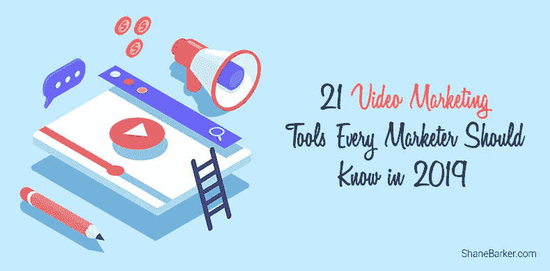

# 2019 年每个营销人员都应该知道的 21 个视频营销工具

> 原文：<https://medium.com/swlh/21-video-marketing-tools-every-marketer-should-know-in-2019-e11482455c2c>

视频营销是在网上推广你的品牌的最佳方式之一。这是吸引网站访问者和增加网站流量的有效方法。人们每天花大约 [5.5 个小时](https://www.brafton.com/glossary/video-marketing/)在线观看视频。

此外，社交媒体对我们的生活产生了巨大的影响，每天大约有 40 亿人在脸书和 YouTube 上观看视频[。这说明了视频营销的流行。](https://www.brafton.com/glossary/video-marketing/)

精选的相关内容:

*   [如何利用 SEO 配合内容营销表现更好](https://shanebarker.com/blog/seo-and-content-marketing/)
*   [什么类型的内容会对你的业务产生影响？](https://shanebarker.com/blog/best-content-type-for-businesses/)

研究发现，到 2019 年，视频流量将占全球 19 亿观众(不包括移动用户)所有互联网流量的 80%。

如果你想通过视频营销推广你的品牌，看看这些能帮到你的重要视频营销工具。

# 1.[敌意](https://animoto.com/)

Animoto 是一个在线编辑器，可以供想要制作视频的营销人员、视频博客作者或摄影师使用。Animoto 可以帮助您创建专业质量的视频，并帮助您实现更好的业务增长目标。

# 关键特征

*   Animoto 可以帮助您创建幻灯片视频来展示您的作品或投资组合。
*   它们提供了几十个内置的故事板模板，您可以使用它们来创建您的营销视频。
*   它们提供了无数的文本字体、颜色、库存照片和音乐选项，您可以将它们添加到您的视频中。
*   您甚至可以将您的徽标作为水印添加到视频中，以获得更高的品牌认知度。

# 2.[普通工艺](https://www.commoncraft.com/)

Common Craft 是一个视频编辑工具，适用于从照片和视频创建视频和动画。在你购买任何东西之前，你可以免费评估你的视频。

# 关键特征

*   Common Craft 具有令人印象深刻的功能，可以简化上传，并允许录制直接视频进行编辑。
*   你可以用它们来创造性地制作解说视频，对你的观众产生情感上的影响。
*   编辑视频很容易，只需很短的时间就可以添加动画和音频。

精选的相关内容:

*   [11 个写引人注目文案的最佳文案技巧](https://shanebarker.com/blog/best-copywriting-tips/)

# 3.[菲尔莫拉](https://filmora.wondershare.com/)

Filmora 是最好的视频编辑工具之一，因为它给了用户大多数工具所没有的自由。它允许用户调整颜色效果、亮度、速度、旋转和许多其他视频增强功能。

# 关键特征

*   它带有一个强大的视频编辑界面，可以帮助用户创建交互式视频。
*   你可以使用这个工具来制作极具吸引力的视频，帮助你建立自己的品牌。
*   这个工具可以在 Windows 和 Mac 上工作，在 Android 和 iOS 上可用，名称为“FilmoraGo”。

# 4. [Vyond](https://www.vyond.com/)

Vyond(以前的 GoAnimate)是一个重要的视频营销工具，可以让您创建高质量的动画视频。此外，您可以使用对口型功能为您的角色添加对话。

# 关键特征

*   它允许您使用声音、道具和模板库来创建视频内容。
*   它适用于所有的网络浏览器。
*   与其他工具相比，GoAnimate 是最快的编辑工具之一。

精选的相关内容:

*   [3 个最有效的内容营销自动化技巧](https://shanebarker.com/blog/content-marketing-automation/)

# 5.[魔术师](https://www.magisto.com/)

Magisto 是一个视频编辑工具，它可以通过为观众制作有吸引力的营销视频来帮助您的业务增长。

# 关键特征

*   您可以制作视频来提高您的品牌知名度，或者制作宣传视频来帮助您挖掘更多商机。
*   您可以创建不同风格的视频，并配有各种字幕和音乐。

# 6. [nFusz](https://nfusz.com/)

nFusz 是一个视频营销平台，允许您创建、分发和测量传递营销信息的互动视频。nFusz 是以下工具的组合:

# 关键特征

*   notifiCRM:全球首款互动视频 CRM 旗舰产品。
*   notifiMED:为医疗保健行业制作互动视频。
*   notifiEDU:为教育部门制作互动视频。
*   notifiLIVE:这允许用户创建可以在智能电视或网络浏览器上观看的直播视频。

精选的相关内容:

*   [利用竞争情报提升内容营销战略的 5 种最佳方式](https://shanebarker.com/blog/boost-your-content-marketing-strategy/)

# 7.[皮科维科](https://picovico.com/)

Picovico 帮助您使用文本和音乐将图片转换成视频。这种视频营销工具也被称为生日视频制作工具。

# 关键特征

*   这个工具可以帮助你即时制作视频。
*   它以简单无缝的方式毫不费力地工作。
*   它有助于从您拍摄的图片中创建美丽的视频。

# 8.[波顿](https://www.powtoon.com/)

Powtoon 是另一个视频营销工具，可以帮助您创建真实的演示和视频。你可以在 20 分钟内制作出一个专业的视频。这个工具被星巴克这样的顶级公司使用。

# 关键特征

*   Powtoon 可以帮助您创建个人、教育和商业视频。
*   它包括好看的模板，可以帮助您快速制作视频和演示文稿。
*   你可以使用 Powtoon 作为编辑器来制作不同格式的视频。

精选的相关内容:

*   [利用竞争情报推进内容营销战略的 5 种最佳方式](https://shanebarker.com/blog/boost-your-content-marketing-strategy/)

# 9.[渲染森林](https://www.renderforest.com/)

这是另一个视频营销工具，使您能够在云中创建动画宣传视频。这是一个简单的平台，你不需要任何技术专业知识。

# 关键特征

*   你可以免费制作专业质量的视频。
*   它们还提供了许多内置模板，因此您可以使用它们创建宣传视频或介绍。

# 10. [Sellamations](https://sellamations.com/)

如果你想用涂鸦来推广你的品牌，Sellamations 是一个你可以使用的工具。

简单来说，涂鸦就是手绘的图像。在这个工具的帮助下，观众可以在观看视频的同时看到迷人的手绘图像。

# 关键特征

*   Sellamiations 视频营销工具提供了一种可爱的方式，通过创建涂鸦视频来吸引您的客户关注您的品牌。
*   它还提供专业画外音艺术家的服务，帮助您创建精彩的内容。

精选的相关内容:

*   [内容作者的 36 个最佳内容写作工具](https://shanebarker.com/blog/content-writing-tools/)

# 11. [Shakr](https://www.shakr.com/)

Shakr 可以帮助你为你的品牌推广制作视频。该工具提供了大约 1000 种视频设计供您的品牌选择。

# 关键特征

*   这个工具有许多不同类别的设计，包括脸书视频、书籍宣传片和商业视频。
*   您可以拖放视频剪辑和图像，添加任何文本，并创建您的视频。

# 12.[滑动式](http://slide.ly/)

Slidely 是一个编辑工具，可以让您创建、发现和共享您的照片、视频剪辑或音乐。这是一个真正用户友好的工具，几乎任何人都可以使用。

# 关键特征

*   你可以在脸书、推特等社交媒体平台上直接分享你的照片和视频，与你的观众交流。
*   你可以制作非常吸引人的视频来吸引你的观众。

精选的相关内容:

*   [如何利用内容营销成功推出产品](https://shanebarker.com/blog/successful-product-launch-content-marketing/)

# 13.[视频学习](https://videolean.com/)

Videolean 是另一个基于云的视频创作服务。这使您能够非常轻松地创建专业视频。超过 240，000 人正在使用这项服务。

# 关键特征

*   Videolean 有各种内置模板，您可以使用它们来创建演示文稿、视频或故事，以推广您的业务。
*   对于创业公司、电子商务商店和营销机构来说，这是一个有效且经济实惠的工具。

# 14.[书记员](https://www.videoscribe.co/en/)

VideoScribe 是一个虚拟白板，你可以在上面轻松地创建手绘或动画讲解视频。

# 关键特征

*   这是一个便宜的工具，给你数以千计的内置图像和音乐可供选择。
*   它具有令人印象深刻的功能，可以用于商业、教育和社会交往。

精选的相关内容:

*   [你如何扩大影响者的内容？](https://shanebarker.com/blog/how-do-you-amplify-influencer-content/)

# 15.[音像店](https://www.videoshop.net/)

Videoshop 是另一款令人惊叹的视频编辑应用，目前可以在 Android、iOS 和 Windows 设备上使用。使用此应用程序，您可以将吸引人的功能与您的视频相结合。

# 关键特征

*   您可以将您最喜爱的歌曲添加到视频中。
*   有了 Videoshop，你还可以用慢动作制作视频。
*   您还可以应用滤镜来提高视频质量。
*   它允许你删除不想要的视频剪辑，并添加声音，如掌声，动物的声音等。
*   您可以为视频添加标题和字幕。
*   您还可以使用合并工具将多个片段合并成一个片段。

# 16.[维德亚德](https://www.vidyard.com/)

Vidyard 是一款视频营销工具，专为企业设计，旨在吸引受众的注意力。像联想和花旗银行这样的公司使用 Vidyard 来吸引客户。

# 关键特征

*   Vidyard 可以帮助您进行销售线索挖掘、员工培训和企业沟通。
*   它有一个内置的分析工具，可以帮助你衡量你的视频营销的表现。
*   Vidyard 还提供视频托管功能，您创建的视频可以很容易地在社交网站上分享。
*   它还集成了 HubSpot 或 Salesforce 等工具来跟踪您的销售线索。

精选的相关内容:

*   [如何利用影响者产生大规模的 UGC](https://shanebarker.com/blog/leveraging-influencers-user-generated-content-scale/)

# 17. [Viewbix](http://corp.viewbix.com/)

这个工具使用 SaaS 的 builder，在它的帮助下，你可以创建交互式视频广告。

# 关键特征

*   您可以创建集成了行动号召的视频，以提高您的流量、转化率和点击量。
*   这个专业工具为您提供跨平台分发的优势，使您的视频在台式机、笔记本电脑和其他设备上看起来非常棒。
*   通过可操作的分析，您可以了解人们如何以及何时参与您的视频。

# 18. [Vimeo](https://vimeo.com/)

Vimeo 是视频营销最好的高质量视频托管网站之一。

# 关键特征

*   通过他们的高级计划，您可以在一个地方托管和管理您的所有视频，存储容量为 7 TB，没有每周限制。
*   您可以将团队成员添加到您的帐户，这样您就可以协作查看视频并在视频上做笔记。
*   您可以将视频嵌入任何地方，并添加可点击的行动号召，这将有助于提高参与度。
*   一旦你开始你的视频营销活动，你可以跟踪表现，并可以看到什么最吸引观众。

精选的相关内容:

*   [2018 年你需要知道的 25 个内容营销平台](https://shanebarker.com/blog/content-marketing-platforms/)

# 19. [WeVideo](https://www.wevideo.com/)

WeVideo 是一款在线视频编辑工具，可用于在任何地方创建、捕捉、查看和分享您的视频。

# 关键特征

*   您可以创建高质量的视频(高达 4K 分辨率)，这绝对可以抓住您的客户的注意力。
*   这个工具可以帮助你在任何地方和任何设备上编辑你的视频。
*   该工具还提供内置的图像、图形、音频和视频；并且还提供了绿屏功能。
*   其用户友好的界面提供高级编辑功能，帮助您轻松创建视频。

# 20. [Wideo](https://wideo.co/)

Wideo 是制作动画视频的另一个好选择。您可以从头开始或使用内置模板轻松制作引人入胜的营销视频。

# 关键特征

*   在 Wideo 的帮助下，你可以下载 MP4 格式的视频。
*   它相对容易使用，你可以在短短 5 分钟内创建专业的视频。
*   你可以直接从 Wideo 在脸书或 YouTube 上分享你的视频。

# 21.Wistia

Wistia 是这个列表中最后一个可以用于[在线营销](https://shanebarker.com/blog/best-digital-marketing-strategies-for-startups/)的视频营销工具。Wistia 是一个视频营销平台，提供视频托管、视频编辑和制作视频的深入指导。

# 关键特征

*   它提供了先进的工具，您可以通过它来增强您的视频。
*   您可以使用帧和缩略图在几分钟内创建视频。
*   它提供了互动元素，你可以用它作为一个可点击的行动号召。
*   它很可能会完全控制你的观众对无干扰视频的体验。

精选的相关内容:

*   [2018 年你需要知道的 11 个 YouTube 营销工具](https://shanebarker.com/blog/youtube-marketing-tools/)
*   [2018 年你需要知道的 23 个网上研讨会主办网站](https://shanebarker.com/blog/webinar-hosting-websites/)

# 最后的想法

视频营销是企业用来推销自己的最受欢迎的在线营销策略之一。使用上面提到的视频营销工具来制作精彩的视频，产生线索或吸引观众。

你能想到其他有用的视频营销工具吗？请在下面的评论中告诉我们。

***原载于***[***Shanebarker.com***](https://shanebarker.com/blog/video-marketing-tools/)***。***

**关于作者**

[谢恩·巴克](https://shanebarker.com)是[内容解决方案](https://contentsolutions.io/)和 [Gifographics](http://gifographics.co/) 的创始人兼首席执行官。你可以在[推特](https://twitter.com/shane_barker)、[脸书](https://www.facebook.com/ShaneBarkerConsultant/)、 [LinkedIn](https://www.linkedin.com/in/shanebarker/) 、 [Instagram](https://www.instagram.com/shanebarker/) 上和他联系。

## 这篇文章发表在 [The Startup](https://medium.com/swlh) 上，这是 Medium 最大的创业刊物，拥有+385，320 名读者。

## 在这里订阅接收[我们的头条新闻](http://growthsupply.com/the-startup-newsletter/)。

