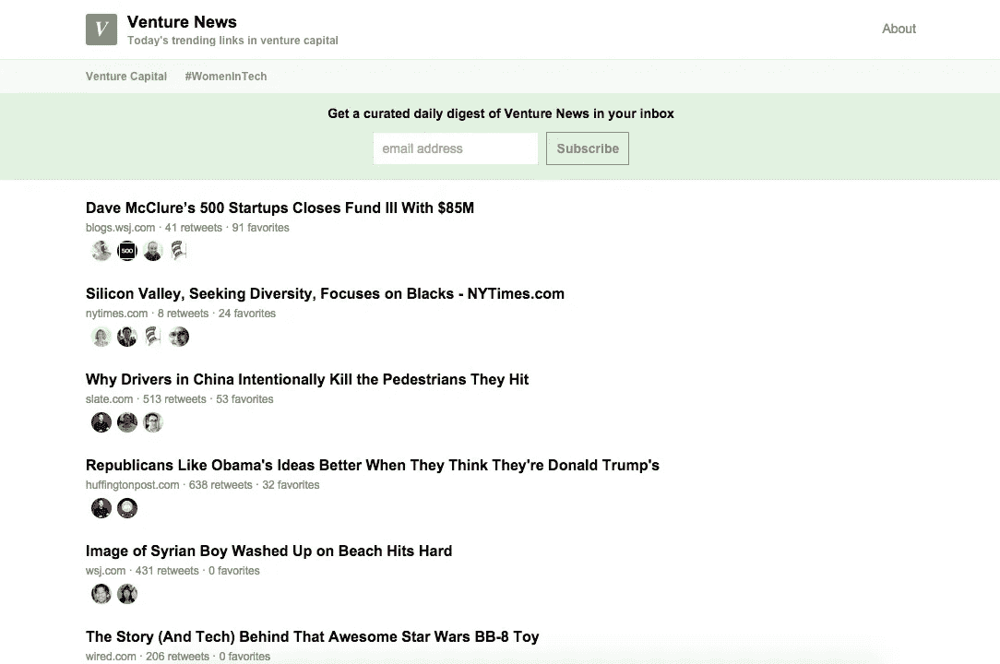
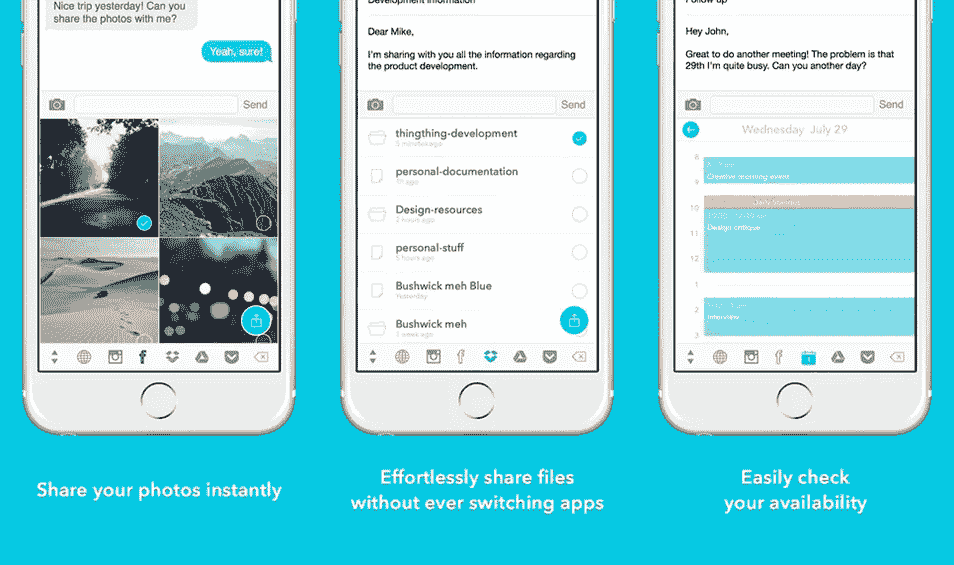
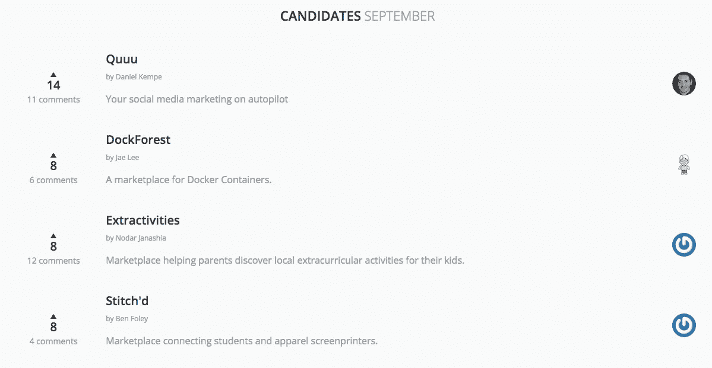

# 22 个对企业家和初创公司创始人非常有用的新工具

> 原文：<https://medium.com/swlh/22-insanely-useful-new-tools-for-entrepreneurs-startup-founders-8b41d83edb84>

不久前，我们开始了一个新的 ListHunt 系列，从过去的一周里为初创公司和创始人寻找最好的新工具。这个新系列背后的主要驱动力是我们找到了一堆很棒的工具，但它们不适合我们每天的列表搜索所迎合的人群。

我们的观众由许多创始人和创业社区的人组成，所以开始这个新系列是一个很容易的决定。我们知道创建一家新公司需要大量的时间，你没有时间浏览所有的新工具。这就是我们的用武之地，让你的生活不那么忙乱！

# [斯彭迪](http://spendy.co/)

Spendy 是一项简单方便的服务，可以记录你在创业公司和网站上花的钱。只有你的费用，没有别的！我们决定不在这项服务上增加发票、收入和文件流程，而是只关注支出。

[**在此了解更多**](http://spendy.co/)

# [每周一次](http://newsletter.gratify.io/)

获得免费的、每周一次的、与内容营销和博客写作艺术相关的工具的最佳链接综述。

[**在此了解更多**](http://newsletter.gratify.io/)

# [贝宝。我](https://www.paypal.me/)

贝宝。我，快速获得报酬的链接！与任何人分享您的个人链接，这样他们可以在几秒钟内将钱汇至您的 PayPal 帐户。对任何人来说，这都是一种更安全、更可靠的还钱方式。

[**在此了解更多**](https://www.paypal.me/)

# [格鲁鲁](https://gluru.co/)

Gluru 是一个智能的个人助理/文件管理器，在你需要的重要时刻帮助你组织和找到你的文件。

安全地连接您已经使用的流行来源的基于文本的数据。Gluru 会发现您的活动所需的每一个文件、电子邮件和联系人，只需点击一个链接即可获得。

[**在此了解更多**](https://gluru.co/)

# [流量](https://www.getflow.com/)

“心流”是你的团队聊天、讨论任务和计划项目的一个地方，所有重要的东西都可以帮助你完成更多的工作。这使得与队友接触或进行快速讨论变得轻松而有趣。就等着看大家有多爱你不发邮件吧。

立即从聊天中直接创建任务，无需离开您正在做的事情。添加一个截止日期，你就万事俱备了，不再需要复制、粘贴或解释。Flow 为您提供了许多快速获得整个项目的高层次视图的方法。包罗万象，轻松评估工作状态。

[**在此了解更多**](https://www.getflow.com/)

# [樊奇普](http://fanchimp.com/)

在更短的时间内为您的社交媒体安排内容。对所有人免费。添加您喜欢分享的任何内容来源，然后一旦某个来源发布了一些新内容，只需点击一下即可分享。

[**在此了解更多**](http://fanchimp.com/)

# [网页组合](https://webfol.io/)

Webfolio 允许开发者向潜在雇主展示代码片段。在这里，你可以创建一个独特的吸引眼球的展示你最好的代码，给雇主一瞥你的编码技能，这是他们真正想看到的。

[**在此了解更多**](https://webfol.io/)

# [协议 io](https://proto.io/)

无论你是否是一名经验丰富的设计师，Proto.io 都是将你的移动应用创意变为现实的首选工具。Proto.io 提供了一个简单直观的拖放界面，可以帮助你将你的应用想法原型化，让它看起来和运行起来完全像真正的应用。

使用任何内置的、具有本机外观的 UI 库或上传您自己的设计，在几分钟内将您的想法变为现实。全部，没有一行代码。

[**在此了解更多**](https://proto.io/)

# [支持套件](https://supportkit.io/slack/)

允许您的整个团队完全管理与客户的沟通，而不留下任何空隙。SupportKit 还会自动管理和归档其创建的对话渠道，以保持您团队的松弛整洁。

[**在此了解更多**](https://supportkit.io/slack/)

# [创业新闻](http://www.venturenews.co/)

《风险新闻》捕捉了风险投资界的每日动态。我们关注来自 350 多家风投公司的推文，并展示过去 24 小时内最常分享的链接。

[**在此了解更多**](http://www.venturenews.co/)

# [Zendesk 的收件箱](https://www.zendesk.com/inbox/)

收件箱组织您团队的电子邮件，因此不存在所有权问题。将电子邮件分配给自己或委托给团队成员。

团队成员在客户的电子邮件线程中进行幕后交流。在一个地方交流知识，达成共识后再回复。

[**在此了解更多**](https://www.zendesk.com/inbox/)

# [字型火焰](http://fontflame.com/)

Font Flame 雄心勃勃地试图解决大多数字体爱好者都有的一个问题，即字体配对。

尽管这仍然是一个早期的原型，新的功能正在不断推出。希望最终，它将成为您的首选字体配对工具。目前利用谷歌的免费字体库，但有计划实施其他来源。

[**在此了解更多**](http://fontflame.com/)

# 好理发师

GoodBarber 使您能够为 iPhone、iPad 和 Android 创建和定制 100%的原生应用程序。不需要编码。

[**在此了解更多**](http://www.goodbarber.com/)

# [贾维](https://twitter.com/javvy_app)

学习 Java 比你想象的要容易得多。更重要的是，有了 Javvy 的一口大小的交互式教程，入门从未如此有趣！立即加入测试版！

[**在此了解更多**](http://javvy-app.com/)

# [熔核](http://www.getnugget.co/)

nugget 是一个高度可视化的应用程序，可以帮助你发现、记住和分享让你变得更好的书籍的最佳内容。想想 GoodReads 语录遇上 Instagram。一个金块是高度视觉化的图书片段。从一本书中摘录的一段简短独立的引文，它本身就能带来价值。金块要么是鼓舞人心的引语，要么是可行的引语，并配有相关的背景图片，以产生更大的影响，这样你更容易记住。

[**在这里了解更多**](http://www.getnugget.co/)|[**iOS 版下载**|](https://itunes.apple.com/us/app/nugget-visual-quotes-from/id1015438645?ls=1&mt=8)|[**安卓版下载**](https://play.google.com/store/apps/details?id=com.nugget)

# [事物事物](http://www.thingthing.co/)

Thingthing iOS Keyboard 是唯一一个可以让你即时访问和分享所有数字内容的键盘。无需切换应用程序，即可找到您需要的内容、分享您想要的内容并做出更好的决策。

从 Dropbox、Google Drive 和 OneDrive 轻松附加文件。一切都在你的键盘下，在旅途中写电子邮件终于感觉很自然！借助内置日历，您可以快速分享您是否有空，并选择见面的最佳时机！

[**在这里了解更多**](http://www.thingthing.co/)|[**iOS 版下载**](https://itunes.apple.com/app/id987945974?ref=producthunt)

# [Angeloop](https://angeloop.co/)

跟踪你的创业报告并与投资者分享，透明度是成功关系的关键。Angeloop 让您轻松掌握自己的财务状况，并让您和您的投资者可以随时访问这些数据。不再发送电子表格和 PowerPoint 演示文稿。

还要衡量您的关键绩效指标，并根据目标和历史绩效跟踪指标。对比数据，对自己的创业成长有更清晰的认识。

[**在此了解更多**](https://angeloop.co/)

# [创客 MVP](http://makermvp.com/)

让你的 MVP 由顶级产品猎制造商打造！想出一个想法很容易，但是将这个想法转化为解决问题的可操作产品却很难。构建一个最小可行的产品通常是验证一个想法的第一个主要步骤。在 MakerMVP，我们将分析您的想法，并帮助您构建第一个可行的版本。

[**在此了解更多**](http://makermvp.com/)

# [前置](https://frontify.com/styleguide)

在几分钟内创建基于网络的风格指南。这是免费且简单的。从头开始或使用我们的风格指南模板。忘记发送 PDF 文档，不要再为旧版本而烦恼。最新版本永远在线，就在你身边。

创建经典风格指南、UI 组件的前端库或两者都有。Frontify 将印刷和数字两个世界融合在一起。

[**在此了解更多**](https://frontify.com/styleguide)

# [ClearVoice](https://www.clearvoice.com/)

以前所未有的方式协作和发现内容创意。规划您的编辑日历，轻松连接您的整个团队。我们正在将白板规划会议带到网上。

在一个平台中体验内容生命周期，该平台专为内容规划者和创作者而设计。使用我们的数据丰富的内容发现工具，更快地从想法变成成品。

[**在此了解更多**](https://www.clearvoice.com/)

# [自作聪明](https://wiselike.com/)

Wiselike 是一个知识共享平台，允许你创建自己的专业问答页面，人们可以在这里向你提问。

本质上，Wiselike 是一个网站，它使各行各业的人们能够分享他们的知识，并通过利用他们的个人经验来促进他人的学习和知识，从而成为一种独特的专家。在 Wiselike 上，人们可以相互分享知识，通过就各种主题提问和回答问题来磨练自己的专业知识并扩大自己的理解。

[**在此了解更多**](https://wiselike.com/)

# [用户平台](https://userdeck.com/)

UserDeck 提供了一个可安装的小工具，可以将聊天、内嵌知识库和联系表单嵌入到您现有网站的任何页面上。

[**在此了解更多**](https://userdeck.com/)

*发表于* **创业、旅游癖和生活黑客**

-