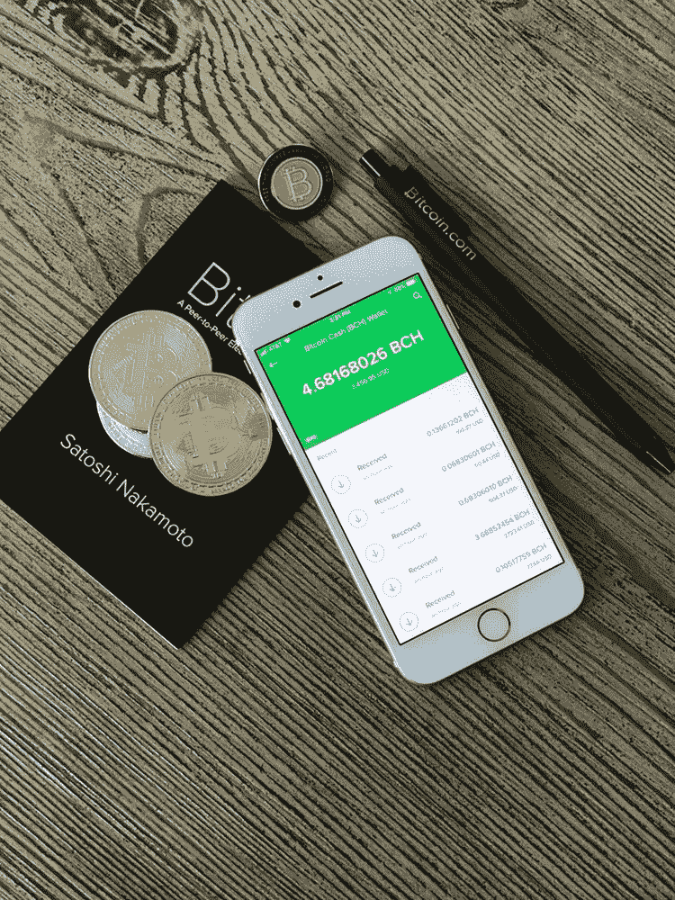

# 2018 年 4 月 24 日:BlockEx 的《密码世界最大的故事》

> 原文：<https://medium.com/swlh/24-04-2018-biggest-stories-in-the-cryptosphere-by-blockex-eecc11748c9c>

**1。日本将成立自律机构**

日本新闻媒体《朝日新闻》报道称[一个自律机构即将在日本成立](https://cointelegraph.com/news/japan-finally-gets-self-regulatory-body-for-cryptocurrency-exchanges):日本加密货币交易所协会(JCEA)。它将由位于该国的 16 个特许交易所组成。所有成员将共同制定并遵循一套标准和最佳实践。尚未获得许可的交易所(大约 12 家)也将由集团提供建议，特别是在跨行业发展方面。我们第一次[报道](https://hackernoon.com/21-02-2018-biggest-stories-in-the-cryptosphere-48f695a39949)是在二月份，当时承认这需要时间。

**2。韩国 SK 电信用区块链改善服务**

总部位于韩国的 SK Telecom [计划在其支付和订阅流程中使用区块链](https://www.zdnet.com/article/sk-telecom-to-adopt-blockchain-for-authentication/#ftag=RSSbaffb68)来提高客户满意度。这将通过创建一个“实名认证程序”来实现。资产管理服务也正在开发中。顾客将能够在点对点的水平上交易贵重物品。[包括加密货币在内的金融和非金融资产都将在同一个地方进行管理](http://www.koreaherald.com/view.php?ud=20180424000698)。信用卡、银行账户和里程积分也是资产的一部分，将被归入篮子中。SK 电讯还计划推出一个令牌交换中心，旨在帮助对 ico 感兴趣的初创公司和中小企业。他们将与投资者建立联系，投资者将为增长提供资本。

**3。五分之一的金融机构计划允许加密交易**

路透社进行的一项[调查显示，五分之一的金融机构计划在未来 12 个月内允许在其平台上进行加密货币交易。在这一群体中，70%的人打算在三到六个月内这样做。这些数据是从汤森路透公司的 400 名客户那里收集来的。受访者中有来自大型银行的交易部门、资产管理公司和对冲基金。尽管存在监管方面的担忧和不确定性，但预计在该行业运营的机构数量将会增加，事实也确实如此。这是由于客户的兴趣更高，以及对冲基金之前对加密货币交易的尝试。](https://www.reuters.com/article/us-crypto-currencies-survey/one-in-five-financial-institutions-consider-cryptocurrency-trading-survey-says-idUSKBN1HV0S4)

**4。风险投资家蒂姆·德雷珀称比特币将超过互联网**

蒂姆·德雷珀是 Skype、特斯拉和 Hotmail 的早期投资者。这位风险投资家现在表示，他相信[比特币将比这些公司的总和还要大，甚至超过互联网](https://www.cnbc.com/2018/04/23/early-tech-investor-says-bitcoin-will-be-bigger-than-the-internet.html?__source=facebook%7Ccrypto+)。在曼哈顿研究所亚当·斯密协会参与的美国智力广场辩论中，他分享了自己的想法。德雷珀此前断言，到 2022 年，比特币将达到 25 万美元，现在又重申了这一说法。他接着说，由于加密货币扩展到日常生活中，其价值将会增长。德雷珀之前在 2014 年购买了 3 万枚硬币。尽管它们现在价值 2.68 亿美元，但他没有出售它们的计划。

> 本新闻综合报道由 [BlockEx](http://bit.ly/BlockEx_) 为您带来。

> 要想在你的邮箱里收到我们的每日新闻综述，请在这里注册:[*http://bit.ly/BlockExNewsRoundup-Updates*](http://bit.ly/BlockExNewsRoundup-Updates)

## 这个故事发表在 [The Startup](https://medium.com/swlh) 上，这是 Medium 最大的创业刊物，拥有 318，983+人关注。

## 在这里订阅接收[我们的头条新闻](http://growthsupply.com/the-startup-newsletter/)。

