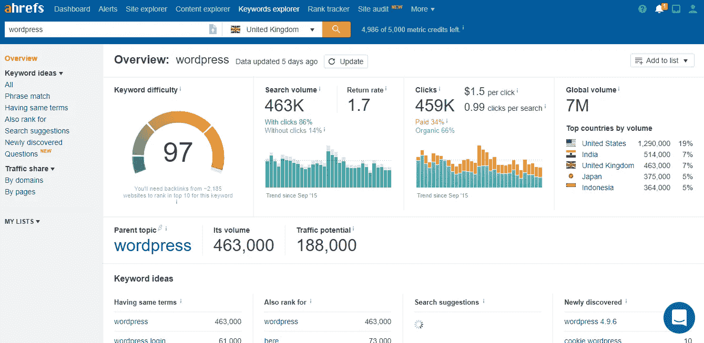
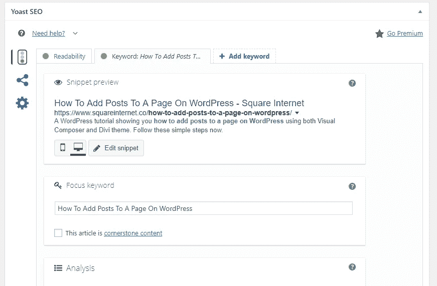

# 24.如何 SEO 优化一篇博文——30 天中等

> 原文：<https://medium.com/swlh/24-how-to-seo-optimise-a-blog-post-30-days-of-medium-80180eba4e8b>

Website Grader

感谢到目前为止一直在阅读和跟随我的 30 天中期帖子的每一个人。

确保你**使用底部的小**注册框**订阅我的内容**，以确保我可以通过电子邮件向你发送每个新帖子。

如果你刚刚发现我的帖子，你可以看看下面的其他 **30 天介质**。

## [0。30 天的培养基](/swlh/30-days-of-medium-c7ab34953c6c)

## [1。建立自己的网站需要什么？— 30 天中值](/swlh/1-what-do-you-need-to-build-your-own-website-30-days-of-medium-1ed1ad4e505c)

## [2。如何找到你热爱的事业——30 天的媒介](/swlh/2-how-to-find-a-business-you-love-30-days-of-medium-cb7a4a702d1b)

## [3。如何建立自己的网站—媒体 30 天](/swlh/3-how-to-build-your-own-website-30-days-of-medium-587f994672ec)

## [4。如何衡量你网站的表现——30 天媒体](/swlh/4-how-to-measure-your-websites-performance-30-days-of-medium-75e650969695)

## [5。如何通过回答他们的问题获得更多的客户-30 天的媒介](/swlh/5-how-to-get-more-customers-by-answering-their-questions-30-days-of-medium-b462d237533e)

## 6。成功的商业网站备忘单——30 天的媒介

## 7。如何衡量成功——30 天介质

## 8。了解在线销售漏斗——30 天媒介

## 9。什么是流量，为什么流量很重要？— 30 天的培养基

## 10。什么是 Google URL Builder，为什么要使用它？— 30 天的培养基

## [11。通过自动化您的社交媒体日程，让您的流量翻倍——30 天中等](/swlh/11-double-your-traffic-by-automating-your-social-media-schedule-30-days-of-medium-ac9aa74f7927)

## [12。如何辨别什么好卖— 30 天介质](/swlh/12-how-to-tell-what-sells-30-days-of-medium-ba3291d029d2)

## [13。我如何在 6，500% — 30 天的培养基中培养我的培养基](/swlh/13-how-i-grew-my-medium-following-6500-30-days-of-medium-c9d2d6f80b51)

## [14。你如何看待事情很重要——30 天中期](/swlh/14-how-you-look-at-things-matters-30-days-of-medium-f641b9733b90)

## [15。如何向小型企业销售服务— 30 天中等](/swlh/15-how-to-sell-services-to-small-businesses-30-days-of-medium-d6604c63b3b7)

## [16。如何通过有效的提案赢得更多交易— 30 天的媒介](/swlh/16-how-to-win-more-deals-with-effective-proposals-30-days-of-medium-481f16bbc86f)

## 17。如何在 10 分钟内建立一个网上商店——30 天的媒介

## [18。如何在任何地方工作— 30 天介质](/swlh/18-how-to-work-from-anywhere-30-days-of-medium-1c9cfa2d662f)

## [19。为什么你的网站会破坏你的销售——30 天媒体](/swlh/19-is-your-website-sabotaging-your-sales-30-days-of-medium-f63bdbdb350)

## [二十。你的流量从哪里来？— 30 天中值](/swlh/20-where-does-your-traffic-come-from-30-days-of-medium-a9b2d2c088bb)

## [21。如何真正识别倦怠——30 天中等水平](/swlh/21-how-to-actually-recognise-burnout-30-days-of-medium-7972a7a7a89e)

## [22。如何修改你的时间表并完成两倍的工作——30 天中等时间](/swlh/how-to-hack-your-schedule-and-get-twice-as-much-done-30-days-of-medium-441a509dc9be)

## [23。不要模仿你的竞争对手——30 天的媒介](/swlh/23-dont-copy-your-competitors-30-days-of-medium-56382b7ba8ed)

## 24。如何 SEO 优化一篇博文——30 天的媒介

## 25。独特或被遗忘——30 天的媒介

## 26。跟着感觉走——30 天中等水平

## 27。人们不支付平均 30 天的中等费用

## 28。如何做关键词研究— 30 天介质

## [29。为什么帕累托原则是世界上最大的诀窍——30 天中期](/swlh/29-why-the-pareto-principle-is-the-worlds-biggest-hack-30-days-of-medium-1c225f5c8aa1)

## 三十岁。你的内容比你的电话更有利可图——30 天的媒介

# SEO 优化是什么意思？

我想我今天会写一篇关于 **SEO 的文章。**

从 **SEO 优化一篇博文开始。**

SEO 优化意味着为搜索引擎优化一些东西，主要是 Google，因为它是大部分流量的来源。

SEO 优化通常需要三件事:

1.  关键词研究
2.  元数据优化
3.  写一些有用的内容，包括相关的关键词

在研究了 6 年多的网络营销后，这是一个小企业的总结。

我是**不** [**SEO 专家**](https://www.startupnorfolk.com/seo-norwich) ，就像我的朋友 Richard Patey，还有一大堆我**不认识的。然而**我不与大型网站合作，也不需要成为一名技术 SEO 专家来推动流量并将其转化为我的业务。

# 关键词研究

内容有两种类型。

关键字驱动内容和其他内容。

媒体上的许多内容都属于“其他内容”类别。在我写文章之前，我不会做关键词研究，我写的内容会对我提交的出版物有帮助和合适(总是这个)。

**关键词驱动内容**利用关键词研究找出人们在搜索什么，并给他们想要的东西。

例如:

1.  使用**谷歌关键词规划器**来找出人们在谷歌上做什么样的 WordPress 搜索。
2.  找到具有商业意图的**低搜索量**和低竞争的关键词。
3.  写一篇博文来回答这个问题，或者提供关于这个话题的见解，在这个过程中吸引这个流量到我的网站。

# 使用 AHREFS

[**AHREFS**](https://ahrefs.com) 是关键字研究的无价工具。它的速度是谷歌关键词规划器的两倍，而且更容易使用。

很遗憾他们没有会员计划，因为我很乐意整天谈论他们的软件有多棒而获得报酬。

AHREFS 有一个神奇的工具叫做**关键词浏览器。**

Keyword Explorer

使用这个工具，我可以输入“WordPress”作为起点，找到 WordPress 周围所有不同的关键词，它们的**搜索量**和**竞争力**。

我还可以应用简单易用的过滤器来为我的营销计划找到最理想的关键词。

比如前几天我写了一篇关于— [**如何给 WordPress**](https://www.squareinternet.co/how-to-add-photos-to-wordpress/) **添加照片的文章。**

它每月只获得 **10 次搜索**，但拥有 **0 的关键词难度分数。**

这意味着两件事:

1.  这是一个搜索非常具体的答案的长尾关键词(它有商业意图)。
2.  只要写一篇好的内容，用**很少甚至没有资源就可以很容易地在谷歌**的第一页找到这个关键词。

10 个搜索听起来可能不算多，但是如果我在一年的时间里从这篇文章中获得了哪怕是 1 个客户，我已经获得了非常好的投资回报，因为我并没有花太多时间来编写内容(因为对我来说这是 WordPress 中非常基本的功能)。

# 元数据优化

元数据是位于页面和文章头部的技术数据。

如果你有 **WordPress** 安装 Yoast 插件，然后听它说什么。

每一篇博客文章都会在页面底部有一个 Yoast 框，告诉你该怎么做，来优化你的文章。

您需要采取的步骤是:

1.  设置一个**焦点关键字**
2.  围绕这个关键词写一篇至少 300 字的文章
3.  包含 0.5%-1%关键词密度之间的关键词(2-3 倍)
4.  遵循 Yoast **优化技巧**的其余部分

一篇正确的 **SEO 优化文章**会显示一个**绿色小圆圈，如下图所示。**

# 写好内容

最重要的部分是**写好内容**。

谷歌不希望人们玩系统游戏，这就是为什么你不能做十年前一半的黑帽游戏。

游戏的目的是写出好的、有用的内容来帮助人们。

谷歌希望让人们更容易找到他们想要的东西，并找到高质量的结果。

如果你坚持遵循这些简单的步骤，写出大量好的、有帮助的、优化过的内容，你的流量会随着时间的推移稳步增加，你的销售机会也会增加。

## 你可能也喜欢这个:

## [为什么 WordPress 是在](/swlh/why-wordpress-is-the-best-platform-to-build-your-business-or-startup-website-on-df3fe932fad7)上建立业务或创业网站的最佳平台

## [如何建立网站——终极指南](https://www.squareinternet.co/how-to-build-a-website-ultimate-guide/)

## 如果你喜欢这个故事，请点击👏按钮，并跟随我的其他 30 天的媒介。

## 这篇文章发表在《创业公司》杂志上，这是 Medium 最大的创业刊物，拥有 337，320 多名读者。

## 订阅接收[我们的头条新闻](http://growthsupply.com/the-startup-newsletter/)。

