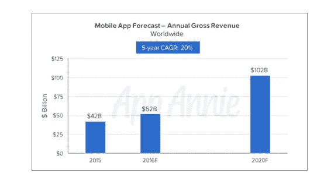
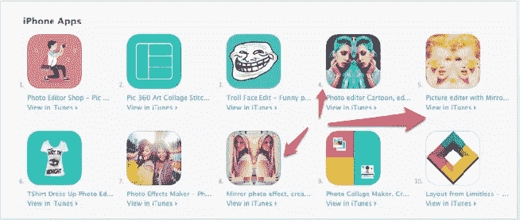
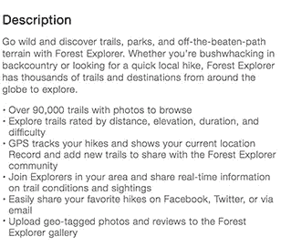

# 24 条提升“应用商店优化”(ASO)排名的技巧

> 原文：<https://medium.com/swlh/24-rank-improving-app-store-optimization-aso-tips-3001fbf89444>

**Originally published on** [**http://www.appsterhq.com**](http://www.appsterhq.com/?utm_source=CP&utm_medium=Medium)**/**

200 万和[计数](http://mashable.com/2016/06/13/apple-wwdc-apps/#y5uZdORYFsqm)。

这是 iOS 应用商店中的应用数量，数以千计的类似应用淹没了每个类别和子类别。

65%的用户仍然依靠应用商店搜索来安装新的应用程序，苹果在过去的 6 个月里支付给开发者令人瞠目结舌的 100 亿美元，不尽一切努力让你的应用程序在搜索中占据更高的位置意味着你正在赔钱。

Source: [AppAnnie](https://www.google.com/url?q=https://9to5mac.com/2016/08/03/app-store-record-breaking-july-50-billion/&sa=D&ust=1484768045801000&usg=AFQjCNHPWQlDnfSVPmS02-jE2-KNBl_FAw)

像网站 SEO 一样，有“在页面上”(应用商店列表)和“在页面外”两种策略可以用来提高应用商店的优化。

本次综述中的策略将帮助您:

*   获得更多安装。
*   提高应用的可见性

我们走吧！

# 1.将关键字控制在 100 个字符以内

Apple 允许您在应用商店列表中添加关键词。搜索算法使用这些关键词在结果中显示你的应用，因此你选择合适的关键词来描述你的应用是至关重要的。

关键字最多可以使用 100 个字符。不要在关键词栏中使用长尾关键词、复数、应用程序名称或拼写错误。用逗号分隔关键词，不要用空格。

# 2.将您的应用程序标题描述为 50 个字符以内

除非你是大品牌，否则你的 app 在用户中不会有任何认可度。在这种情况下，使用关键字来描述应用程序的核心功能非常重要，这样用户就可以清楚地知道他们正在下载什么。

在标题中使用关键词来提高你在搜索中的位置，并且将[保持在 50 个字符](https://www.google.com/url?q=https://developer.apple.com/app-store/product-page/&sa=D&ust=1484768045812000&usg=AFQjCNGgsYEpRINEkAD5QfgT8AUAVAukpg)以内。

# 3.避免在应用标题中使用与现有应用相似的通用术语或名称

在你的应用标题中使用“照片”或“音乐”这样平淡无奇的术语会让用户感到困惑，并导致他们忽略你的应用。

小心使用与现有应用程序相似的名称。这是一种黑帽战术，受到发布虚假应用程序的可疑开发者的青睐，可能会导致苹果公司禁止你的应用程序进入商店。

例如，看看这张截图中所有这些应用程序是如何兜售镜像效果的。

# 4.不要在关键词中使用名人的名字或商标

App Store 开发者指南中有一个严格的政策，即除非你得到许可，否则不要使用名人、受保护的名字或商标作为关键词。除非你能证明你的 app 是官方 app，或者有某种隶属关系，否则就不要做。

苹果会直接拒绝你的应用。

Source: [Apple](https://www.google.com/url?q=https://developer.apple.com/app-store/product-page/&sa=D&ust=1484768045821000&usg=AFQjCNGQCyO9Wi4cy49y7pPBluRMnnlBIA)

# 5.给标题添加关键词

根据一项分析，在标题中添加描述性关键词将使你的应用的可发现性提高 10.3%。

那是一部不容忽视的电梯。在这场游戏中，每一个百分比都很重要。

# 6.选择描述应用核心功能的类别

App Store 搜索算法在向用户显示结果时也会查看类别。选择类别时，关注应用的核心功能，而不是次要功能。

例如，Instagram 被归类为照片和视频，而脸书被归类为社交网络，尽管两者在功能上有很大的重叠，用户现在认为 Instagram 是一个社交网络。

# 7.让你的应用程序描述对用户友好

应用描述对于告诉人们你的应用实际上是做什么的很重要。以下是一些让你的应用描述更好的技巧:

*   使用项目符号和分段。
*   使用社会证据(新闻报道、用户评价)
*   列出优势和使用案例..
*   添加有关版本号、新更新中的更改、错误修复等信息
*   附加链接到网站或支持。

# 8.优化你描述中的前几行

这张来自苹果开发者页面的 gif 展示了用户是如何看到描述的:默认情况下只能看到前几行，只有点击更多链接才能看到全文。

Source: [Apple](https://www.google.com/url?q=https://developer.apple.com/app-store/product-page/&sa=D&ust=1484768045832000&usg=AFQjCNHi_Go8LQfV9250VTxG9RbZpysBVA) // this looks like a static image but is actually a gif that should show in Wordpress.

如果开头几行没有抓住用户的衣领，那么你为突出描述所做的所有工作都将付之东流。

所以花点时间为你的描述想出一个吸引人的线索。

# 9.首先锁定竞争和搜索量较低的关键词

换句话说，做小池塘里的大鱼，而不是大池塘里的小鱼。

使用关键词研究工具，找出搜索量和竞争力较低的关键词，并对它们进行排名。一旦你建立了社会证明和信誉，就进入并攻击他们自己地盘上的大男孩。

# 10.创建前两个截图，展示你最好的功能

根据 Storemaven 的研究，60%的用户不会跳过前两张截图。所以，让那两张截图有价值吧。

设计更好截图的一些技巧:

*   提交高清截图。
*   在前两张图片中展示你的应用程序的最佳特性
*   使用覆盖文本和注释来改进信息传递
*   使用简单的背景以获得更好的可读性

# 11.在你的描述中使用一个引人注目的海报框架的应用预览视频

苹果建议在你的应用列表中添加一个短视频(15-30 秒),展示你的应用的不同功能。

使用引人注目的海报框架(缩略图)测试视频，以便驱使用户点击它。AppAnnie 的一项调查显示，当视频被添加到主页面时，转化率提升了 25-30%。

一个好的视频还会降低安装成本，给你带来更多的忠实用户，并提高产品的可发现性。

Source: [Apple](https://www.google.com/url?q=https://developer.apple.com/app-store/product-page/&sa=D&ust=1484768045846000&usg=AFQjCNFyjCrG6s7dIh5gn9ihbhchgrPL1Q)

# 12.本地化，本地化，本地化

只有 31%的应用收入来自北美，而 41%来自亚洲。

如果你的应用程序列表只有英文，你将把你的应用程序挡在全球大量移动用户之外。遵循[这些指导方针](https://www.google.com/url?q=https://www.oneskyapp.com/academy/learn-ios-localization/&sa=D&ust=1484768045849000&usg=AFQjCNHyCHkQpmImLPhXtZelSeEbIZTD3w)，国际化你的应用程序的代码库，然后开始改变:

*   应用标题
*   关键词
*   描述中的前几行。

一旦你在转换中看到了提升(一个应用开发者看到了一个 [767%的提升](https://www.google.com/url?q=http://makeappmag.com/iphone-app-localization-keywords/&sa=D&ust=1484768045851000&usg=AFQjCNF2qS0KiDX-vvG8AiLsluy-BOh5qA))改变其他部分，比如:

*   截屏
*   录像
*   货币和日期格式
*   描述
*   复习

Source: [Product Coalition](https://www.google.com/url?q=https://productcoalition.com/app-store-screenshots-localization-dc0bf2a140d7%23.26i42d5oy&sa=D&ust=1484768045854000&usg=AFQjCNGeCyOm4HsrxJlPHnmTPzi6DnFQvw)

# 13.定期更新您的应用程序以遵守 Apple 的政策

苹果对长时间不更新的应用不以为然。就像谷歌奖励频繁更新的网站一样，定期更新的应用告诉苹果，开发者致力于提供更好的用户体验。

您还需要更新您的应用程序，以符合 Apple 政策的变化，并查看您所做的应用程序商店优化更改在您的应用程序商店列表中的反映。

过时或废弃的应用程序[将面临从应用商店](https://www.google.com/url?q=https://techcrunch.com/2016/11/15/apples-big-app-store-purge-is-now-underway/&sa=D&ust=1484768045857000&usg=AFQjCNHYGsSpS7zMDRC3kAPhYnFEnovzRA)中删除。

# 14.为你的应用图标流汗

考虑到用户在 App Store 上通过图标的外观来记住你的应用，你绝对有必要关注你的图标的外观。

根据 Incipia 对应用图标的分析，调色板有限的简单图标比花哨的图标更高级。

用户似乎也更喜欢图标外观精美、有阴影和过渡效果的应用程序，这些应用程序更容易让人记住。

当你在设计你的图标时，看看苹果的 [iOS 人机界面指南](https://www.google.com/url?q=https://developer.apple.com/ios/human-interface-guidelines/graphics/app-icon/&sa=D&ust=1484768045863000&usg=AFQjCNH4O8lvSMHVom5VqcVjc13bFB7SEQ)以获得灵感和最佳实践。

Source: [Apple](https://www.google.com/url?q=https://developer.apple.com/app-store/product-page/&sa=D&ust=1484768045864000&usg=AFQjCNH-3ZXW6pbqGOkjPz4Xm1Phdmug1w)

# 15.利用人类来寻找独特的关键字

虽然有足够多的关键词工具在识别高价值关键词方面做得非常出色，但问题是你的竞争对手也在使用它们，并可能针对相同的关键词进行优化。

相反，请人们描述他们将如何通过在[亚马逊土耳其机器人](https://www.google.com/url?q=https://www.mturk.com/mturk/welcome&sa=D&ust=1484768045867000&usg=AFQjCNG_f6vg7c9b6JCW5516LB7YJvzewg)中设置人类智能任务(HIT)来搜索你的应用程序，并分析响应以找到合适的关键词。

# 16.使用竞争关键词研究工具

当你开始应用商店优化和关键词研究时，找出你的竞争对手正在使用的关键词。

*   使用 AppCodes、AppTweak、SensorTower 或 Mobile Action 等工具找出竞争应用的关键词排名。
*   使用 SEMRush 找出关键词权威网站在您的利基排名。

这些应用智能工具将帮助你理解用户意图，让你的竞争对手防不胜防。

# 17.定期监控关键词排名

像网站一样，留意你关键词的排名，以及任何可能出现的新关键词。

你可以使用上面提到的应用智能工具来跟踪你的关键词，并在 100 个字符的限制内不断添加新的关键词或删除旧的关键词。

# 18.A/B 测试你的应用列表上的所有内容

图标、截图、描述、关键词、视频——所有这些元素对应用商店优化都很重要。正如 AppAnnie 的[转化研究所示，改变视频和截图似乎可以带来 25-30%的转化提升，其次是图标和描述。](https://www.google.com/url?q=https://www.appannie.com/insights/mobile-strategy/aso-best-practices-optimizing-app-store-page-part-1/&sa=D&ust=1484768045874000&usg=AFQjCNGRVGjbZMKU92Vbxnumoop_GeLabw)

首先，先测试高可见性的标题、描述、图片和视频，然后转移到 app store 列表中的其他部分。

Source: [AppAnnie](https://www.google.com/url?q=https://www.appannie.com/insights/mobile-strategy/aso-best-practices-optimizing-app-store-page-part-1/&sa=D&ust=1484768045876000&usg=AFQjCNFd8nbYnF8tWk7K49JmBZfMXE3BAA)

# 19.询问快乐用户的评分和评论

评论和评级对用户和苹果如何看待一款应用起着非常重要的作用。一项研究发现，在其他条件相同的情况下，[59%的用户会下载评分高的应用。](https://www.google.com/url?q=https://www.apptentive.com/blog/2016/10/20/average-mobile-apps-ratings-and-reviews-by-category/&sa=D&ust=1484768045879000&usg=AFQjCNF4qybMsnOQmCKjA46RRDczzhgPmQ)

虽然绝大多数用户不会留下评价或评论，但如果某个东西崩溃了，极少数人会留下负面评论。

评分最高的应用程序几乎总是遵循这一流程来获得正面反馈:

*   监控应用内的用户行为，直到他们从应用中获得某种价值。
*   问用户一个是/否的问题，问他们是否喜欢这个应用程序。
*   提示“是”组进行评定和评估，并让“否”组留下内部反馈

Source: [Apptentive](https://www.google.com/url?q=https://www.apptentive.com/blog/2016/10/20/average-mobile-apps-ratings-and-reviews-by-category/&sa=D&ust=1484768045883000&usg=AFQjCNHJS07HaaqF7d796leL6zBms3Zfjg)

# 20.改变你的收入模式或营销策略

要在短期内提高下载速度，您可以:

*   在有限的时间内为您的高级应用程序提供大幅折扣
*   与 AppSumo 合作获得一次性赠品
*   给在线社区的成员，播客的听众，博客等提供特别的折扣。

这些一次性活动可以提高应用程序的下载量和应用程序商店排名，前提是这些活动经过精心策划，并且证明了对该应用程序的需求。

# 21.被追捕

在产品搜索中被搜索可以极大地提高你的应用程序的可见性。由于其高度参与的社区，您将获得安装，如果您出现在产品搜索主页上，您可以期待看到安装的重大飞跃。

对于新推出的应用程序，产品搜索效应可以帮助你避免苹果臭名昭著的 7 天悬崖，并保持你的排名，因为用户活动的最初爆发。

Source: [Medium](https://www.google.com/url?q=https://medium.com/ios-os-x-development/product-hunt-s-impact-on-the-launch-of-gifpitch-b1d0746159b8%23.iydltqtf2&sa=D&ust=1484768045889000&usg=AFQjCNGFXWO7dI1N2f5QaxEQbpg5ASiTMQ)

查看这篇关于[产品搜寻最佳实践](https://www.google.com/url?q=http://www.appmasters.co/7-tips-for-product-hunt-success/&sa=D&ust=1484768045890000&usg=AFQjCNGmV7PmJueGF5z5iDTxvVvEKI1-Tw)的文章。

# 22.在应用商店中运行搜索广告

根据最近发布的 [App Store 搜索广告数据，](https://www.google.com/url?q=http://www.adweek.com/news/technology/apples-3-month-old-search-ads-are-generating-conversion-rates-higher-50-175364&sa=D&ust=1484768045892000&usg=AFQjCNHwb0p0FQKA0H43Sp6wLQL4eNLvNg)主流和独立应用开发者的搜索广告转化率平均为 50%。

这意味着每次安装成本为 25 美分，比其他平台上的广告便宜 80%。

你可以注册[苹果应用商店广告平台](https://www.google.com/url?q=https://developer.apple.com/app-store/search-ads/&sa=D&ust=1484768045894000&usg=AFQjCNEOQwXtoHbinCC-ZUmMN9IFDZDP7w)，用 100 美元的信用开始推动流量。

# 23.受益于苹果的 19 个奖励关键词

在最近的一项[研究中](https://www.google.com/url?q=http://incipia.co/post/app-marketing/15-free-aso-keyword-ranking-algorithm-keywords/&sa=D&ust=1484768045896000&usg=AFQjCNFR-blW53i6S3Ctc4DBauv2KlwWAA) Incipia 分析了 App Store 的描述，找出了 19 个在优化过程中可以安全忽略的关键词。

该列表包括 ipad、iphone、免费、主要和第二类别名称等关键词，以及 for、by、of 等停用词。

这些信息非常有用，因为标题只有 50 个字符，关键字字段只有 100 个字符。

# 24.使用热门话题作为关键词

你应该考虑使用热门话题作为关键词。例如，在美国总统竞选期间，在 App Store 中搜索“特朗普”显示 2.109 个结果，搜索“希拉里”显示 334 个结果。

虽然大多数应用程序与候选人无关，但你可以发挥真正的创造力，关注季节性事件，优化你的关键词，为你的应用程序带来搜索流量。例如，如果你有一个锻炼应用程序，你可以添加明星球员在超级碗比赛期间的套路，并使用相关的关键字来获得高排名。

你可以使用像 App Radar 这样的工具来追踪热门关键词。

Source: [The Ringer](https://www.google.com/url?q=https://theringer.com/developers-are-using-the-election-to-game-the-app-store-353f7f808d9e%23.1df81df3h&sa=D&ust=1484768045902000&usg=AFQjCNEM45n8wBDjakpya4RzoWNYhQiWbQ)

## 结论

App Store 优化过程从未停止。这 23 个建议只是皮毛，当你深入这个话题时，你可以找到更多的方法来优化你的应用程序和改善你的列表。

然而，实施这 23 条建议中的每一条，你会比 95%的应用开发者做得更好。

> 最初发表于 http://www.appsterhq.com/的

