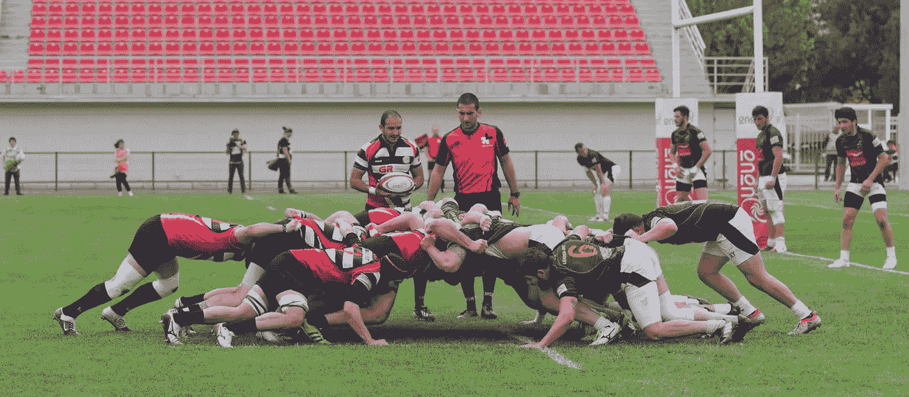
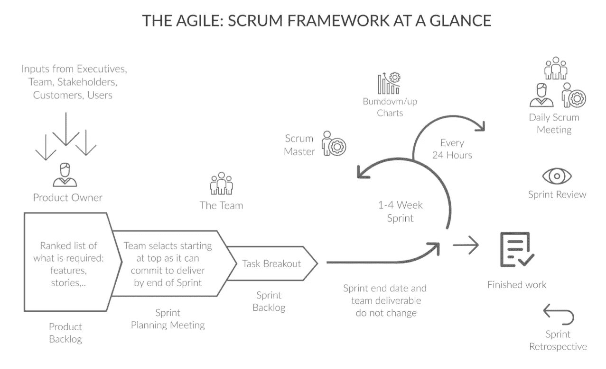
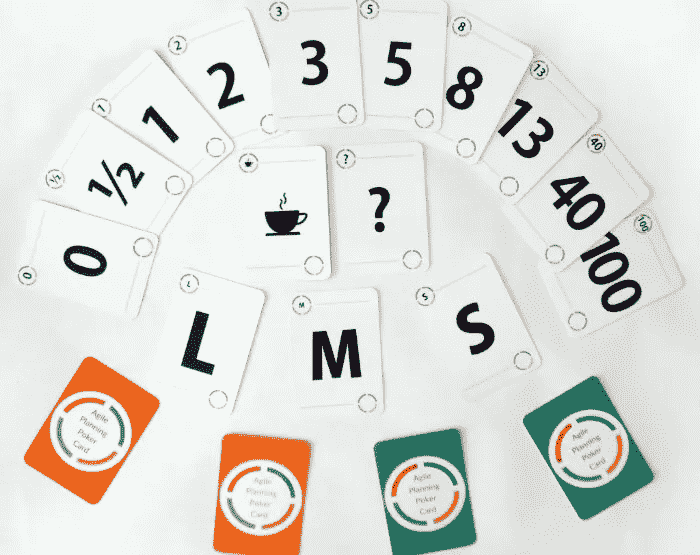
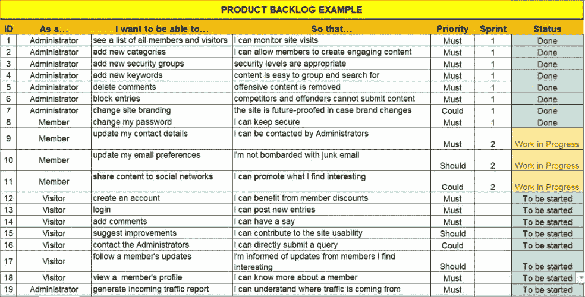
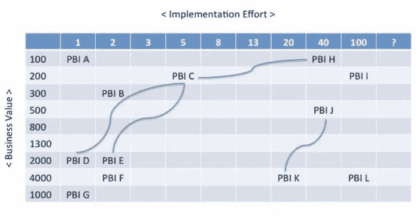
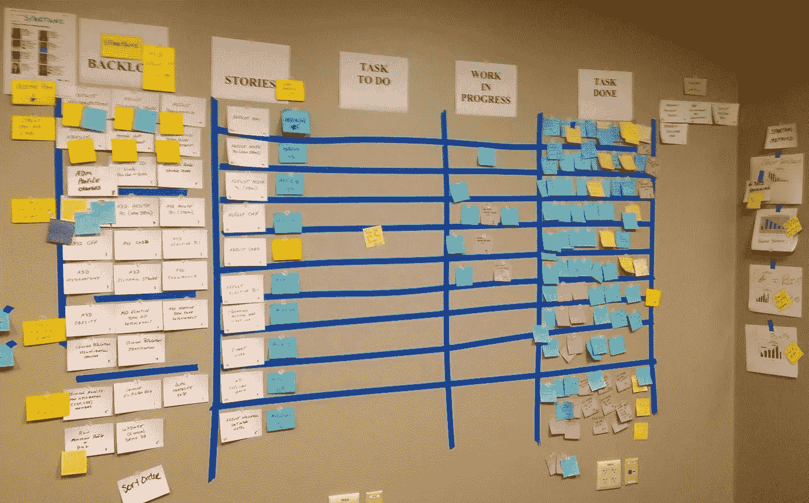
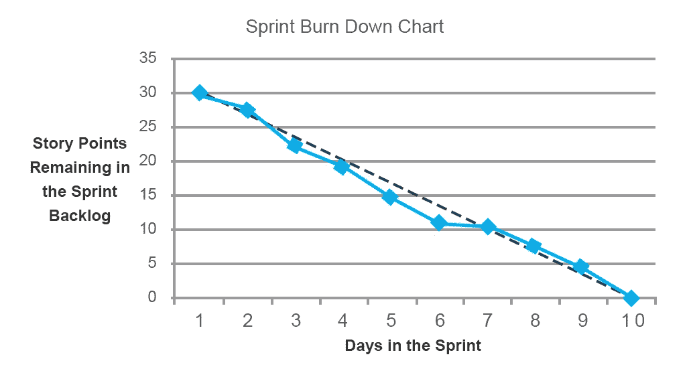
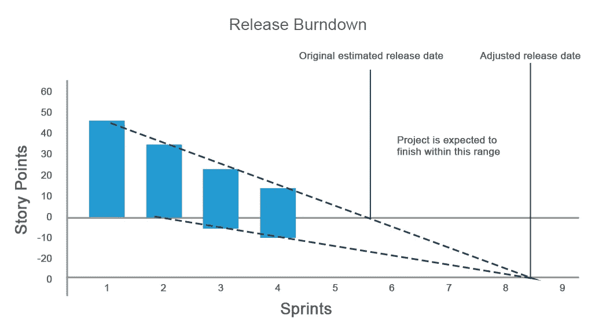
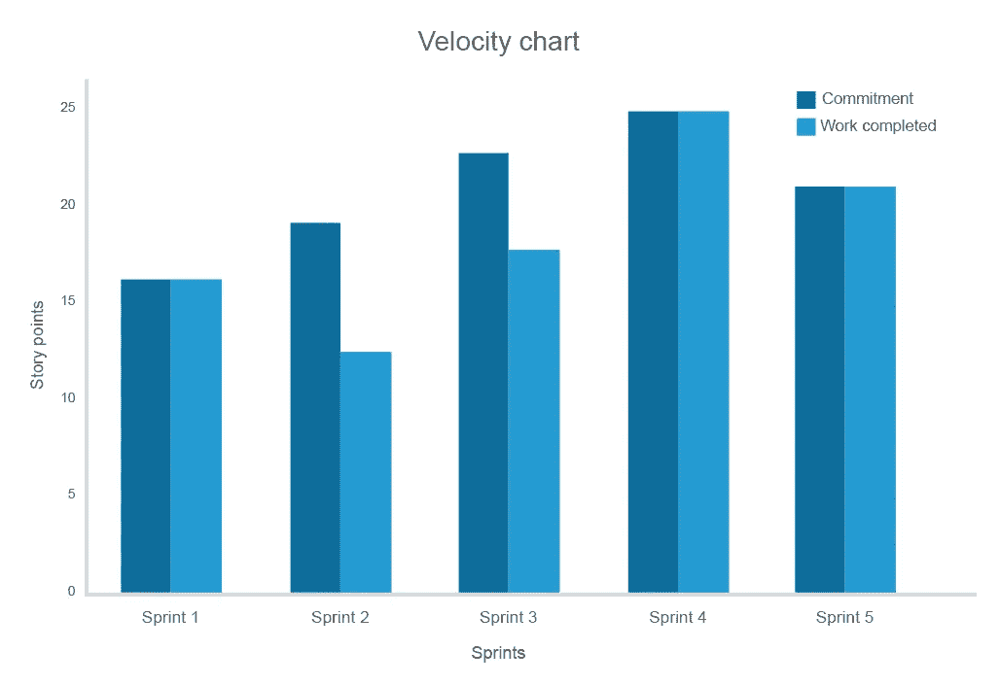

# 25 个 Scrum 流程最佳实践，让你的敏捷工作流程更有效率

> 原文：<https://medium.com/swlh/25-scrum-process-best-practices-that-set-your-agile-workflow-for-efficiency-5fc9873f4f2>

敏捷是各种不同软件开发方法的基础哲学，包括 Scrum、看板、精益和 XP。我们已经介绍了[敏捷软件开发](https://www.altexsoft.com/whitepapers/agile-project-management-best-practices-and-methodologies/)的主要特征，这次我们将更详细地讨论 Scrum，因为它是目前最流行的实现敏捷方法的方法。

***Scrum*** 是一种应用[敏捷原则](http://agilemanifesto.org/)的迭代软件开发和产品管理方法。根据 it，项目开发是在短时间的迭代中处理的，以允许业务和工程的灵活性。Scrum 以及最终的敏捷背后的主要思想是不断地向客户交付价值。

这反映在如何管理一个给定的项目和团队成员的心态上。如果你仔细观察，Scrum 主要用于需要业务和工程灵活性的长期复杂项目。

在本文中，我们将给出 Scrum 组件的简要分类，并为您提供一套帮助您改进 Scrum 的最佳实践。

# Scrum 管理简而言之

## 迭代开发

Scrum 的基本原则是迭代开发。整个项目时间线被分解成称为 sprints 的短迭代。在每个冲刺阶段——通常持续两周——团队承诺交付一组[用户故事](https://www.altexsoft.com/blog/business/functional-and-non-functional-requirements-specification-and-types/)，简明的产品特性描述。短迭代确保团队优先考虑实际需要的特性，并在收到反馈后进行调整。最好的情况是，每个 sprint 交付一个小的产品增量，这个增量是有效的，是 QA 批准的，并且可以交给涉众或最终用户来获得他们的意见。

*The entire cycle repeats itself every 1–4 weeks*

# Scrum 团队和角色

所有工作都需要由专门的 ***Scrum 团队*** 来完成。传统团队由三个主要角色组成:

**Scrum 高手。这个人确保团队的行动符合 Scrum 原则，帮助成员和解，并解决冲突。有时候，一个 Scrum 大师会为最终的冲刺目标做出贡献。**

**产品负责人。**此人承担产品经理的职责。他或她代表最终客户和其他利益相关者传达产品的整体愿景。

Scrum 团队。团队必须是跨职能的、自组织的，并且非常敏捷。出于这些原因，团队成员的人数不得超过 7 人。

## Scrum 工件

工件是团队在开发过程中创建的[开发文档](https://www.altexsoft.com/blog/business/software-documentation-types-and-best-practices/)，主要有三个。

**产品积压。**主 backlog 包含各种需求，这些需求被记录为用户故事或其他格式。文档是需求的主要来源，并且不断地用新的项目更新。

**冲刺积压。sprint backlog 包含团队承诺在给定的 sprint 期间完成的需求项目。正如您所猜测的，sprint backlog 项目来源于产品 backlog。**

**冲刺燃尽图。这是主要的跟踪文件，说明每天计划了多少项，实际完成了多少项。该图表允许团队成员预测他们的结果，并与最初的进度估计进行比较。**

# Scrum 会议

考虑到团队更知道如何解决出现的问题，Scrum 方法没有强加很多规则。因此，Scrum 会议的逻辑和目标与期望的结果一致，而不是与方法指南一致。然而，有一套传统的会议。

**策划。**在每个 sprint 开始的时候，召开一个计划会议来决定团队承诺多少用户故事(或者其他需求)项目。冲刺计划的平均持续时间为*四个小时*，整个团队都必须参与。这个会议的目的是从待办事项中提取最重要的项目，并对它们进行评估。选定的项目形成了 sprint backlog。

**每日例会。**每天，所有团队成员都要参加每日 Scrum 会议。sprint 每日会议的目标是讨论昨天做了什么和今天计划做什么。每日 scrums 同步团队的工作，并保持工作节奏。

**仪容仪表。**每周召开一到两次整理会议，以删除待办事项中不再需要的项目，如果需要，添加新项目，添加或删除一些验收标准，确定优先级，并指定评估。

**冲刺演示。**会议在每次冲刺结束时举行。团队向利益相关者展示他们在过去的 sprint 过程中产生的成果。

回顾性的。而这最后一式也设定在冲刺的最后。目标回顾是讨论在冲刺阶段哪里出错了，哪里做得好，以更好地将项目进展与目标结合起来。

所以，让我们讨论一下在你的团队中成功运行 Scrum 的主要建议。我们将我们的建议分为五类。我们承认这种划分在很大程度上是有条件的，因为建议和它们的组是相互交叉的。例如，会议与规划活动重叠。但是，这种划分的目的是简化您的导航。

[团队合作和会议](https://www.altexsoft.com/blog/business/25-scrum-process-best-practices-that-set-your-agile-workflow-for-efficiency/#teamwork)
[计划和估计](https://www.altexsoft.com/blog/business/25-scrum-process-best-practices-that-set-your-agile-workflow-for-efficiency/#planning)
[管理积压](https://www.altexsoft.com/blog/business/25-scrum-process-best-practices-that-set-your-agile-workflow-for-efficiency/#managing)
[跟踪和预测](https://www.altexsoft.com/blog/business/25-scrum-process-best-practices-that-set-your-agile-workflow-for-efficiency/#tracking)
[工程和质量保证](https://www.altexsoft.com/blog/business/25-scrum-process-best-practices-that-set-your-agile-workflow-for-efficiency/#engineering)

# 团队合作和会议

## 1.与利益相关者召开研讨会，以形成待办事项和产品愿景

产品积压是 Scrum 中使用的最重要的工件之一。基本上，它记录了利益相关者的产品愿景。一个好的实践是与涉众一起填充产品积压。这甚至可能发生在签署合同之前。在产品待办事项协商期间，团队会更好地了解利益相关者，因为他们一起调整他们的愿景，并达成对未来产品的共同理解。

## 2.邀请利益相关者参加一些 Scrum 会议

利益相关者和/或产品所有者应该参与一些由团队组织的 Scrum 会议。这允许涉众充分体验会议是如何召开的，并理解团队内部是如何沟通的。例如，涉众可以评估 sprint 规划技术，并在 sprint 回顾或演示期间听到关于工作结果的讨论。团队可能会收到关于可交付成果和协作成果的宝贵反馈。

## 3.不要打破现有的团队

如果团队已经在以前的项目上工作了很长时间，那么为了一个新项目重新组织他们并不是一个好主意。这些人学会了合作，知道彼此的速度。最好的做法是无论如何都要把它们放在一起。不幸的是，不同的项目需要不同的技能，不允许一直遵循这个规则。

## 4.不要忽视团队建设

团队建设活动本身就很重要。但是，如果你必须为一个新项目从头开始组建一个团队，它们的价值就会大幅上升。团队建设不会在非正式的聚会和混战中结束，这很重要。有一些[有效的团队建设技术](https://www.atlassian.com/agile/teams)围绕着纯粹的专业活动，从分享技能到采用促进合作的工程实践。

任何团队建设的标准路径是:

*形成并明确角色和流程→设定决策流程→优化已建立的关系→成功执行并取得结果。*

## 5.实际上，练习单口相声

每日例会有时被称为站立会议，因为每个人都应该站着参加，除非他们身体状况不允许。这种方法的核心思想是保持会议简短。当每个人都舒适地坐着交谈时，任何会议都可能持续几个小时。因此，这种会议通常花费比需要更多的时间。站着开会，当每个人都站着说话时，不可避免地要花更少的时间。

## 6.与远程团队合作时，制定沟通准则

沟通很难。远程沟通甚至更难:Skype 通话和宽松的信息历史记录可能会遗漏许多重要细节。为了简化事情，尝试制定通信准则，确保远程团队成员有效地共享关键信息。例如，强制通知所有团队成员一些用户故事受到新问题的影响。此外，您可以宣布问题何时得到解决，或者要求在发现新的拦截器时立即分享相关信息。如果您使用特定的协作软件(我们将在第 21 点中讨论)，您可以设置通知消息和电子邮件来通知新的问题。

# 规划和估计

## 7.与利益相关方一起评估

在项目涉众面前评估产品待办事项。首先，团队可以直接问所有需要的问题。第二，客户听到所有的讨论，并且能够理解什么时候评估是合理的，什么时候显然是不合理的。这不会完全防止项目出现糟糕的评估，但是这种格式将建立信任，并有助于减少围绕评估的进一步冲突的机会。

## 8.当产品 backlog 有足够的项目时，计划新的 sprint

*冲刺计划*必须在产品储备有足够的项目来完成至少两次冲刺时进行。否则，项目可能遭受*范围蔓延*，项目范围不受控制的增长，因为最近的 sprints 的范围在产品 backlog 中没有完全定义。

## 9.为每次冲刺设定主要目标

Sprint 目标有助于确保团队和客户的目标一致。这些目标决定了团队在冲刺阶段必须完成的任务，并有助于对待办事项列表中的项目进行优先级排序。通常，产品负责人在为下一次冲刺选择项目之前会设定一个冲刺目标。然后，在冲刺计划期间，团队根据目标为冲刺选择项目。这些目标用简单明了的一两句话表述，如:*实施结账流程:查看购物车、设置付款、选择送货方式、付款、接收确认电子邮件。*

## 10.使用规划扑克做出更好的估计

规划扑克是一种基于共识方法进行评估和规划的敏捷技术。规则很简单:

1.产品所有者或客户阅读用户故事或向评估者描述特性。

2.每个评估者收到的牌的数值都是 0，1，2，3，5，8，13，20。这些值代表团队估算的单位数(例如小时)。

3.评估者讨论这些特征，然后选择代表他们评估的卡片，用调整好的支持来支持他们。

4.所有的牌同时显示出来。如果所有估计量都选择了相同的值，它就成为估计量。

5.如果没有，评估者讨论他们给出的估计。最高和最低估计解释他们的意见。之后，所有评估人员再次选择评估卡。重复这一过程，直到达成共识。

这种技术是实现更精确和平衡的估计的有效方法。

*Cards for Planning Poker may include some other nuances depending on a type of a deck. Image source:* [*grow.org.ua*](https://grow.org.ua/)

## 11.计划 6 小时工作制以降低风险

在冲刺阶段，许多风险都可能发生。例如，团队成员中的某个人可能会突然缺席。处理缺勤的一个好方法是计划每天工作六小时，剩下的两小时用于降低风险。另一种方法是计划团队中特定比例的人缺席。

## 12.不要拉长冲刺时间

有时候，故事出乎意料的大，或者有太多的故事被并行处理，这就有一种诱惑，那就是稍微延长一点冲刺的时间来完成它们并达到目标。牺牲一个固定的节奏不仅会破坏你的时间表，还会形成一种有害的习惯，那就是经常忽视约定的时间表。时间安排的问题必须在回顾会议上讨论。

## 13.不要削减冲刺时间

另一方面，一旦所有的故事都完成了，缩短冲刺的持续时间也是一个坏主意。如果你偶然遇到这种情况，最好想出一些小故事，并把它们添加到范围中，直到你到达 sprint 结尾。这也有助于保持节奏。

# 管理积压

## 14.总是将产品待办事项和冲刺待办事项分开

在大多数情况下，sprint backlog 是冻结的，而产品 backlog 是不断更新的。将这些文件分开将确保你能够计划、有效地评估和预测你的冲刺。例如，通过比较 spring backlogs，您可以度量您的团队速度，并在将来做出更精确的估计。

## 15.在产品待办事项中使用任务优先级技术

有多种确定待办事项优先级的技术。虽然一些团队依赖 HiPPO(收入最高的人的意见)，但这并没有为团队成员提供足够的透明度，并且会妨碍数据驱动的决策。所以，我们来讨论一下最常见的。

**莫斯科。**这个巧妙的首字母缩写代表 ***必须、应该、可能、不会、*** 四个主要类别，按优先级分解你的故事。莫斯科是最广泛和最简单的优先化方法，但它不考虑产品细节。

**商业价值。**这种方法让利益相关者或产品所有者能够估计哪些用户故事在实现时会带来最大的财务价值。如果你有一个有效的商业想法，这种方法是非常有效的。

**技术风险。**您可以根据给定功能实现的估计风险量来划分优先级。这需要首先实现风险最大的特性，然后用完全可预测的工程任务来接近项目的最后冲刺。与前一种方法类似，这种方法认为你有一个经过验证的商业想法，甚至是一个正在更新的工作产品，只需要完美的技术实现。

**卡诺模型。** [模型](https://en.wikipedia.org/wiki/Kano_model)基于客户偏好，从优先级最高到最低分为五类:

*   *必备*
*   *一维质量:*如果有此功能，用户会感到满意，如果没有，用户会感到不满意(例如，许多消息平台都有语音消息，用户也希望有)
*   吸引人的质量:如果该特性存在，用户会很高兴，但如果不存在，用户也不会不满意(animoji 很酷，但不是必需的)
*   质量无关紧要:用户不会认为一个功能既不好也不坏
*   *逆向质量:*用户(或者他们的一些团队)对某个特性完全不满意

如果你进入一个饱和的市场，并且有许多竞争者，考虑这种方法。

**行走的骷髅。**优先功能足以让产品尽快上市。行走骨架的概念在我们关于构建 MVP(最小可行产品)的[文章中有详细描述。MVP 是它最常见的用例。](https://www.altexsoft.com/blog/business/minimum-viable-product-types-methods-and-building-stages/)

**经验证的学习。**市场风险最高的功能首先发布，以便尽早获得反馈。如果你的目的是扰乱市场，这种方法是有效的。

*You can use simple Excel documents to form backlogs and prioritize features in it. Image source:* [*Techno-pm.com*](http://www.techno-pm.com/2016/09/product-backlog-excel-template.html)

## 16.为项目分配 id

一个简单但非常重要的建议是，始终为用户故事或待办事项列表中的其他项目分配 id。这将极大地简化团队内部的交流，因为说出一个数字总比分享用户故事本身要好。

## 17.可视化依赖关系以捕获瓶颈

首先你要把所有的依赖分成两组:1) ***功能依赖*** 和 2) ***技术依赖。*** 利益相关者和产品所有者必须定义功能依赖，即那些考虑产品市场行为的依赖。(例如，*我们无法在结账工作流程*之前实现登录页面)。工程师必须定义技术依赖性(例如*我们必须在设计运输设置工作流程*之前集成支付网关)。

*Dependencies mapped considering business value and timeframes. Image source:* [*scrum.org*](https://www.scrum.org/resources/blog/8-best-practices-start-scrum-project)

一旦映射了依赖关系，您就可以找到瓶颈，并重新考虑它们的结构，或者完全取消其中一些的优先级。

## 18.使用 Scrum 板

提高 sprint 可见性的一个有用技术是使用 Scrum 板。电路板本身分为四个主栏和几个可选栏。

**故事。**用户故事位于最左边的一栏，来源于 sprint backlog。

**未开始。**在这里，你把具体的任务，必须涵盖实施各自的用户故事。

**进行中。你可能已经猜到了，这一列包含了正在处理的任务。**

**搞定。再一次，非常明显。**

**拦截器**(可选)。您可能会提出阻止某些任务完成的阻塞问题。这将意味着你必须首先处理拦截器。

**测试**(可选)。根据项目的具体情况，您可能希望将测试任务添加到管道中。

**产品负责人审查**(可选)。如果您需要持续跟踪产品所有者对所做工作的评估，那么添加 review 列是值得的。

*Your board can be both physical and digital. Image source:* [*medium.com/@sashabondareva*](/@sashabondareva/scrum-task-board-offline-or-online-b341719fa472)

虽然一些专业人士建议只使用模拟版本，但你可以自由选择。例如，如果你使用 JIRA，Scrum 板的工具是开箱即用的。同样，您可以使用 Trello。

# 跟踪和预测

## 19.想象冲刺烧毁

Scrum 中的一个好的实践是使用显示冲刺进度的燃尽图。图表显示每天完成的项目与计划完成率的对比。它的主要价值是确保冲刺按照进度进行。这种技巧有助于在问题出现时就发现它们，在日常谈话中讨论它们，并专注于尽早解决它们以跟上进度。

*This chart shows that the team couldn’t complete planned tasks during days five and six but they were back on track on the seventh and eighth days*

## 20.使用释放燃尽图

类似于 sprint burndown，发布 burndown 图表有助于估计按计划完成一个项目需要多少 sprint，以及团队是否必须调整估计的时间框架。x 轴表示冲刺，而 y 轴描述在最终发布之前必须完成多少故事。如果最初的产品积压在开发过程中用新的故事更新，那么发布烧毁是非常重要的。这些更新不可避免地会影响发布日期。

*Positive values on the y-axis showcase the initial number of stories while the negative values depict the stories that were added later on*

发布燃尽图将提供发布日期的实时可见性，并允许估计冲刺的次数。

## 21.使用速度测量

速度是一种衡量标准，它考虑了与最初的估计相比，在每个冲刺阶段完成了多少故事。

*这个例子展示了在第二次和第三次冲刺中，承诺不切实际地增长，这使得团队可以重新考虑它，使其与实际用户情景和匹配预测保持一致*

需要速度度量来更好地预测团队承诺和最终结果，以揭示长期的估计问题。通常，3-5 次冲刺足以衡量整个团队的速度，然后根据它来计划冲刺。如果你在 5 次冲刺后仍然有高度可变的结果，那就值得重新考虑故事计划:你的故事在大小上一定是不均衡的，这使得冲刺计划不可靠。

## 22.利用优质协作软件

虽然您可以使用 Excel 电子表格进行所有这些度量，但是最好坚持使用专门为 Scrum(以及最终的敏捷)团队构建的通用工具。以下是您必须考虑的最重要的几个因素:

[JIRA](https://www.atlassian.com/software/jira?_mid=6818e8b50423cd32658554f54d88b40a&aceid=&adposition=1t1&adgroup=47435902938&campaign=915034279&creative=220373393883&device=c&keyword=jira&matchtype=e&network=g&placement=&ds_kids=p24697429574&ds_e=GOOGLE&ds_eid=700000001558501&ds_e1=GOOGLE&gclid=Cj0KCQjw3v3YBRCOARIsAPkLbK4R8-Xl5CKdAWM7XeOrWHjuFMACRtv9FlWChK-pko9310_BP0bGfsYaAi3uEALw_wcB&gclsrc=aw.ds) 。也许，JIRA 是项目管理专业人员中最受欢迎的软件开发工具。它足够通用，包括上述所有指标，等等。但是，你需要花 2-4 周的时间让你的团队完全过渡到 JIRA，并了解它的所有优点。过渡期不会很快。

[JIRA 替代品](https://www.g2crowd.com/products/jira/competitors/alternatives)。如果 JIRA 是一辆坦克，而你需要一辆自行车，考虑一些更简单的替代品。例如，[团队甘特图](https://www.teamgantt.com/)非常简单，可以用甘特图进行基本的项目规划。该产品考虑团队角色，允许映射依赖关系和分组组织任务。

[Toggl](https://toggl.com/) 。Toggl 是一个流行的时间跟踪工具，不会取代 JIRA，但会非常支持。它们也可以被集成。

[Git](https://git-scm.com/) 。这是版本控制和管理小型到大型工程项目的重要工具。

[松弛](https://slack.com/)。可以说，Slack 比其他专业的大众信息平台更适合团队协作。反正不能跳过考虑。最重要的是，如果你已经在使用 JIRA，Slack 可以与之集成。

# 工程和质量保证

## 23.不要将测试和开发分开

根据敏捷原则，开发人员和 QA 专家必须在特性上合作。这将激励他们作为一个团队合作。工程师将了解 QA 标准，而测试人员将对工程进展有足够的了解，以主动建议质量保证程序。

## 24.在接下来的 sprint 中解决 bug 债务

为了保持承诺的一致性和稳定的工作节奏，在当前 sprint 中发现的所有 bug 都必须在接下来的 sprint 中解决。不要试图在当前的冲刺阶段进行修补，除非它们没有违背最初的承诺。这将使你的冲刺计划更加精确，所有的跟踪都是可预测的。

## 25.实施持续集成

持续集成(CI)是一种技术，在工程师提交之后，需要对每个特性运行自动化测试。如果这个特性通过了测试，它会自动包含在每天更新几次的构建中。结果，所有的 bug 都被更快地发现，并且工程团队得到了关于集成问题的及时更新。在我们单独的故事中阅读更多关于[持续集成](https://www.altexsoft.com/blog/business/continuous-delivery-and-integration-rapid-updates-by-automating-quality-assurance/)的内容。

有时，持续集成作为持续交付(CD)的一部分发挥作用——一提交就部署所有特性，而不是每次冲刺都进行构建。虽然 CD 和 CI 经常被用于 [*【极限编程】【XP】*](https://www.altexsoft.com/blog/business/extreme-programming-values-principles-and-practices/)(查看我们关于这种敏捷方法的故事)，但是它们也可以应用于 Scrum。

# 我们错过的事情，但你不应该

这只是我们认为重要的最佳 Scrum 实践和建议的清单。它不是完全详尽的，也不可能如此，因为许多在一个团队中为一个给定项目工作的 Scrum 实践会导致另一个团队的彻底失败。这就是敏捷的全部思想:尽可能灵活，尝试不同的方法，直到找到最适合你的方法。例如，一些敏捷专家认为*结对编程*是一种有害的实践，因为它将交付时间延长了[15-60%](http://www.cs.utah.edu/~lwilliam/Papers/ieeeSoftware.PDF)。

尽管如此，我们建议您查看一些额外的材料，以获得更全面的了解:

[敏捷指标和 KPI](https://www.altexsoft.com/blog/business/agile-software-development-metrics-and-kpis-that-help-optimize-product-delivery/)。除了我们在这里描述的那些，你可以找到一组项目和代码管理的度量标准，使你的 Scrum 进程真正可预测。

[软件质量度量](https://www.altexsoft.com/blog/engineering/what-software-quality-really-is-and-the-metrics-you-can-use-to-measure-it/)。更深入地研究代码质量度量。

微软的 Scrum 文档。这是一个巨大而广泛的 Scrum 材料包，由微软的工程师们整齐地组织成优秀的软件文档。作者考虑了不同组织的不同情况。例如，向企业级项目管理过渡。

Scrum 上的 30 本书。这篇文章不足以为你成为 Scrum 大师打下基础，但是 Scrum 策划的这些书可以。

好吧，下一步。

请就我们建议的做法向我们提供反馈。

他们为你工作吗？

你有什么建议是我们必须添加到这个列表中的，但是由于某种原因我们没有添加？

请分享！

**喜欢这个故事吗？鼓掌让我们知道，这样更多的人可以找到它！**👏
最初发表于 AltexSoft 的博客:[*25 个 Scrum 流程最佳实践，让你的敏捷工作流程更高效*](https://www.altexsoft.com/blog/business/25-scrum-process-best-practices-that-set-your-agile-workflow-for-efficiency/)

****

## **这篇文章发表在 [The Startup](https://medium.com/swlh) 上，这是 Medium 最大的创业刊物，拥有 338，320 多名读者。**

## **在此订阅接收[我们的头条新闻](http://growthsupply.com/the-startup-newsletter/)。**

****