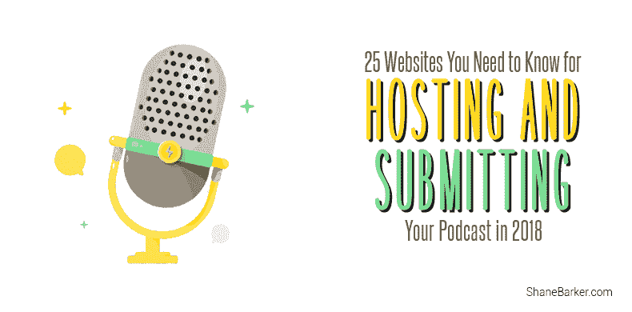
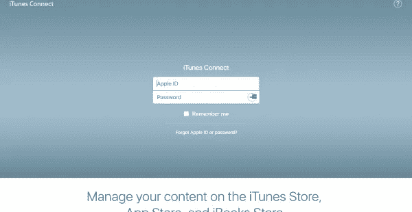

# 2018 年托管和提交播客需要知道的 25 个网站

> 原文：<https://medium.com/swlh/25-websites-you-need-to-know-for-hosting-and-submitting-your-podcast-in-2018-8ced2421b0c4>

> 这篇文章最初出现在谢恩·巴克的博客上。

播客在互联网上越来越受欢迎。如果你不知道，播客是一种可以在线下载的音频文件。

播客可以在电脑和智能手机等其他设备上播放。为什么播客会从 MP3 文件中脱颖而出？当你订阅播客时，它会给你带来你想要的音频。因此，您不必搜索特定的文件。

如果有新的播客，您会被告知。所以摆在你面前的问题是你在哪里主持你的播客？

以下是 25 大播客托管站点，可托管和提交您的播客:

# #1.[苹果播客](http://itunespartner.apple.com/en/podcasts/faq)

大卫·爱迪:100

价格:免费

# #2.[谷歌播放音乐](https://play.google.com/)

大卫·爱迪:100

价格:免费

# #3.[音云](https://soundcloud.com/)

达:95

价格:免费到每月 16 美元

# #4. [Spotify](https://www.spotify.com/)

达:91

价格:免费

# #5.[博客脱口秀](http://www.blogtalkradio.com/)

达:87

价格:免费基础版

# #6.[音频吊杆](https://audioboom.com/)

达:87

价格:每月 9.99 美元

# #7.[方形空间](https://www.squarespace.com/)

达:87

价格:每月 12 美元起

# #8.[装订机](https://www.stitcher.com/)

达:87

价格:免费

# #9. [Libsyn](https://www.libsyn.com/)

达:85

价格:每月 5 美元起

# #10.我的心脏

达:85

价格:免费

# #11.[豆荚](https://www.podbean.com/)

达:84

价格:每月 3 美元起

# #12.[4 共享](https://www.4shared.com/)

达:84

价格:免费

# #13. [PodOmatic](https://www.podomatic.com/)

达:82

价格:基础版:免费
专业版:每月 8.32 美元起

# #14.[纯净体积](http://www.purevolume.com/)

达:81

价格:免费

# #15.[扬声器](https://www.spreaker.com/)

达:80

价格:基础版:免费
专业版:每月 5.99 美元起

# #16.[布鲁布利](https://www.blubrry.com/)

达:70

价格:每月 12 美元起

# #17. [BuzzSprout](https://www.buzzsprout.com/)

DA: 61

价格:每月 12 美元起
提供免费版本

# #18. [Onalytica](http://www.onalytica.com/podcasts/)

大卫·爱迪:60

价格:免费

# #19.[炉边](https://fireside.fm/)

DA: 52

价格:每月 19 美元

# #20. [Simplecast](https://simplecast.com/)

达:49

价格:每月 12 美元

# #21.[播客](http://www.podcasts.com/)

DA: 45

价格:免费

# #22. [OmnyStudio](https://omnystudio.com/)

达:44

价格:每月 99 美元起

# #23.[播客网站](https://podcastwebsites.com/)

达:44

价格:每月 77 美元

# #24. [Podiant](https://podiant.co/)

达:41

价格:基础版:免费
专业版:每月 12.99 美元

# #25.[破鞋](https://www.podigee.com/en/)

达:39 岁

价格:计划从每月 4 美元开始

# 结论

这些是托管播客的最佳网站。虽然您可以在其中的大多数上托管任何媒体文件，但它们最适合于音频文件。视频文件要大得多，像 YouTube 这样的网站是更好的托管选择。

虽然可以选择将播客直接放在你的网站上，但独立的播客主持人还有很多其他好处。

> 这篇文章最初出现在谢恩·巴克的博客上。

**关于作者**

谢恩·巴克是 Gifographics.co T2 公司的首席执行官，也是 T4 内容解决方案公司的创始人。你可以在[推特](https://twitter.com/shane_barker)、[脸书](https://www.facebook.com/ShaneBarkerConsultant/)、 [LinkedIn](https://www.linkedin.com/in/shanebarker/) 、 [Instagram](https://www.instagram.com/shanebarker/) 上和他联系。

## 这个故事发表在 [The Startup](https://medium.com/swlh) 上，这是 Medium 最大的企业家出版物，拥有 307，492+人。

## 在这里订阅接收[我们的头条新闻](http://growthsupply.com/the-startup-newsletter/)。

