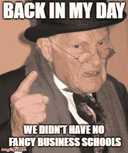
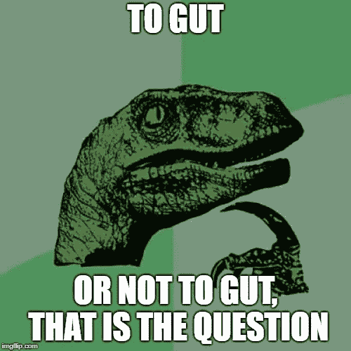

# 26.跟着感觉走——30 天中等

> 原文：<https://medium.com/swlh/26-going-with-your-gut-30-days-of-medium-20f0715ce900>

感谢到目前为止一直在阅读和跟随我的 30 天中期帖子的每一个人。

确保你**使用底部的小**注册框**订阅我的内容**，以确保我可以通过电子邮件向你发送每个新帖子。

如果你刚刚发现我的帖子，你可以看看下面的其他 **30 天介质**。

## [0。30 天的培养基](/swlh/30-days-of-medium-c7ab34953c6c)

## [1。建立自己的网站需要什么？— 30 天中值](/swlh/1-what-do-you-need-to-build-your-own-website-30-days-of-medium-1ed1ad4e505c)

## [2。如何找到你热爱的事业——30 天的媒介](/swlh/2-how-to-find-a-business-you-love-30-days-of-medium-cb7a4a702d1b)

## [3。如何建立自己的网站—媒体 30 天](/swlh/3-how-to-build-your-own-website-30-days-of-medium-587f994672ec)

## [4。如何衡量你网站的表现——30 天媒体](/swlh/4-how-to-measure-your-websites-performance-30-days-of-medium-75e650969695)

## [5。如何通过回答他们的问题获得更多的客户-30 天的媒介](/swlh/5-how-to-get-more-customers-by-answering-their-questions-30-days-of-medium-b462d237533e)

## 6。成功的商业网站备忘单——30 天的媒介

## 7。如何衡量成功——30 天介质

## 8。了解在线销售漏斗——30 天媒介

## 9。什么是流量，为什么流量很重要？— 30 天的培养基

## 10。什么是 Google URL Builder，为什么要使用它？— 30 天的培养基

## [11。通过自动化您的社交媒体日程，让您的流量翻倍——30 天中等](/swlh/11-double-your-traffic-by-automating-your-social-media-schedule-30-days-of-medium-ac9aa74f7927)

## [12。如何辨别什么好卖— 30 天介质](/swlh/12-how-to-tell-what-sells-30-days-of-medium-ba3291d029d2)

## [13。我如何在 6，500% — 30 天的培养基中培养我的培养基](/swlh/13-how-i-grew-my-medium-following-6500-30-days-of-medium-c9d2d6f80b51)

## [14。你如何看待事情很重要——30 天中期](/swlh/14-how-you-look-at-things-matters-30-days-of-medium-f641b9733b90)

## [15。如何向小型企业销售服务— 30 天中等](/swlh/15-how-to-sell-services-to-small-businesses-30-days-of-medium-d6604c63b3b7)

## [16。如何通过有效的提案赢得更多交易— 30 天的媒介](/swlh/16-how-to-win-more-deals-with-effective-proposals-30-days-of-medium-481f16bbc86f)

## 17。如何在 10 分钟内建立一个网上商店——30 天的媒介

## [18。如何在任何地方工作— 30 天介质](/swlh/18-how-to-work-from-anywhere-30-days-of-medium-1c9cfa2d662f)

## [19。为什么你的网站会破坏你的销售——30 天媒体](/swlh/19-is-your-website-sabotaging-your-sales-30-days-of-medium-f63bdbdb350)

## [二十。你的流量从哪里来？— 30 天中值](/swlh/20-where-does-your-traffic-come-from-30-days-of-medium-a9b2d2c088bb)

## [21。如何真正识别倦怠——30 天中等水平](/swlh/21-how-to-actually-recognise-burnout-30-days-of-medium-7972a7a7a89e)

## [22。如何修改你的时间表并完成两倍的工作——30 天中等时间](/swlh/how-to-hack-your-schedule-and-get-twice-as-much-done-30-days-of-medium-441a509dc9be)

## [23。不要模仿你的竞争对手——30 天的媒介](/swlh/23-dont-copy-your-competitors-30-days-of-medium-56382b7ba8ed)

## 24。如何 SEO 优化一篇博文——30 天的媒介

## 25。独特或被遗忘——30 天的媒介

## 26。跟着感觉走——30 天中等水平

## 27。人们不支付平均 30 天的中等费用

## 28。如何做关键词研究— 30 天介质

## [29。为什么帕累托原则是世界上最大的诀窍——30 天中期](/swlh/29-why-the-pareto-principle-is-the-worlds-biggest-hack-30-days-of-medium-1c225f5c8aa1)

## 三十岁。你的内容比你的电话更有利可图——30 天的媒介

# 你曾经…

你曾经对某件事有过**强烈的直觉并采取行动反对它吗？**

顺利吗**？**

我已经做了很多次违背直觉的决定，但大多数决定都没有对我有利。

你的**直觉**并不像逻辑那样有形且容易描述。

你的**直觉**是**习得的经验、逻辑和我们作为人类发展的一种第六感的结合。**

每当我们面临一个决定时，我们的大脑都会在幕后进行无意识的分析。

这是正确的做法吗？

这次会像上次一样吗？

我不是科学家，所以我不能给你凭直觉行事背后的确切科学依据，但我可以给你我个人对凭直觉行事如何帮助我建立和发展我的企业的见解。

# 你的直觉就是你的本能+ 1

你的直觉基本上是你本能的高级版本。

我们都有天生的生存本能，这种本能每时每刻都在被激发。

战斗或逃跑，生存和复制。这些都是人类最基本的本能。

你的直觉似乎是你本能的内置数据库。它从过去的经验中学习，帮助你在未来不知不觉中做出更好的决定。

例如，你认为为什么大多数企业家要花将近十年的时间才能成功，而他们中的许多人在这个过程中失败了很多，还有更多人在这个过程中破产了？

因为人类天生没有商业本能。进化需要时间，我们仍在追赶。我们还没有这些内在的本能，所以我们必须长时间培养它们，艰难地培养。

我们的身体和思想仍在努力适应 X 因素，以及我们不太可能在上班的路上被人用棍子打死的事实(大部分情况下)。

是否**抽取和转储比特币**不是我们进化到无意识处理的事情。

# 从好的方面来看…

这意味着我们可以通过**学到的经验**和研究正确的东西**发展商业或成功的本能**。

你创业的第一年是涉世不深的。你可能会犯很多错误。其中一些可能会留在你的潜意识中，帮助你发展本能，有些可能不会。

关于**的事情是，**每天都是不同的。

这里有一套你可以学习和应用的规则，但是它们是非常非常基础的。例如，企业的目标是盈利。雇佣优秀的员工，努力工作，提高销售额，让顾客满意等等。

然而，这些简单的小规则只能带你到这里。

当然，没有一套规则或可靠的游戏计划可以让你用来创造新市场、新产品或决定某样东西是卖是卖。

如果这些规则存在，每个人都会成为百万富翁。

如果很容易，大家不都是成功的 CEO 吗？

但事实并非如此，这就是为什么商业领袖在做决策时以依靠直觉而闻名。

他们不得不利用自己的直觉，因为没有纯粹符合逻辑的答案可供他们选择，也没有适合他们自身情况的案例研究。

看看**乔布斯和苹果。**

乔布斯知道，如果苹果专注于小事情，销售少量产品，并让这些产品让人绝对难忘，他们就会成功。

他的竞争对手在做同样的老一套。粗制滥造一个又一个产品，没有做出任何真正的创新。

乔布斯知道，要让计算机真正起飞并成为主流，这项技术必须是自我的自然延伸，而且对任何人来说都足够简单，只要拿起它就能‘得到’。

整个商业世界和他的董事会不这么认为，这就是为什么他们解雇了他，他开始了下一个。

问题是，他们错了，而他是对的。

只有**史蒂夫在正确的行动过程中有杀手的本能，**因为这是他的生意，他花了**他的一生来发展这种本能以追求一个目标。**

我经营一家小企业，所以我不是一个雄心勃勃的首席执行官。但是同样的逻辑也适用于我的日常决策。

我违背直觉的时候，它很少奏效，因为我的直觉是我潜意识的决策过程**根据经验和逻辑给我正确的答案。**

这篇文章的要点是，如果你对某事有强烈的直觉，不要忽视它。

通常**几乎总是对的。**

还有一点小提示。你的直觉**决定通常是直接出现在你脑海中的决定**，你会再次猜测或选择忽略。

不要怀疑自己，坚持自己的观点。

正如 Brian Tracy 所说——“决策的关键是做出决定。如果这个决定行不通，你就做另一个决定。然后又是一个，然后迟早这些决定会开始起作用。”

## 你可能也喜欢这个:

## [为什么 WordPress 是在](/swlh/why-wordpress-is-the-best-platform-to-build-your-business-or-startup-website-on-df3fe932fad7)上建立业务或创业网站的最佳平台

## [如何建立网站——终极指南](https://www.squareinternet.co/how-to-build-a-website-ultimate-guide/)

## 如果你喜欢这个故事，请点击👏按钮，并跟随我的其他 30 天的媒介。

## 这篇文章发表在 [The Startup](https://medium.com/swlh) 上，这是 Medium 最大的创业刊物，拥有 338，320 多名读者。

## 在此订阅接收[我们的头条新闻](http://growthsupply.com/the-startup-newsletter/)。

