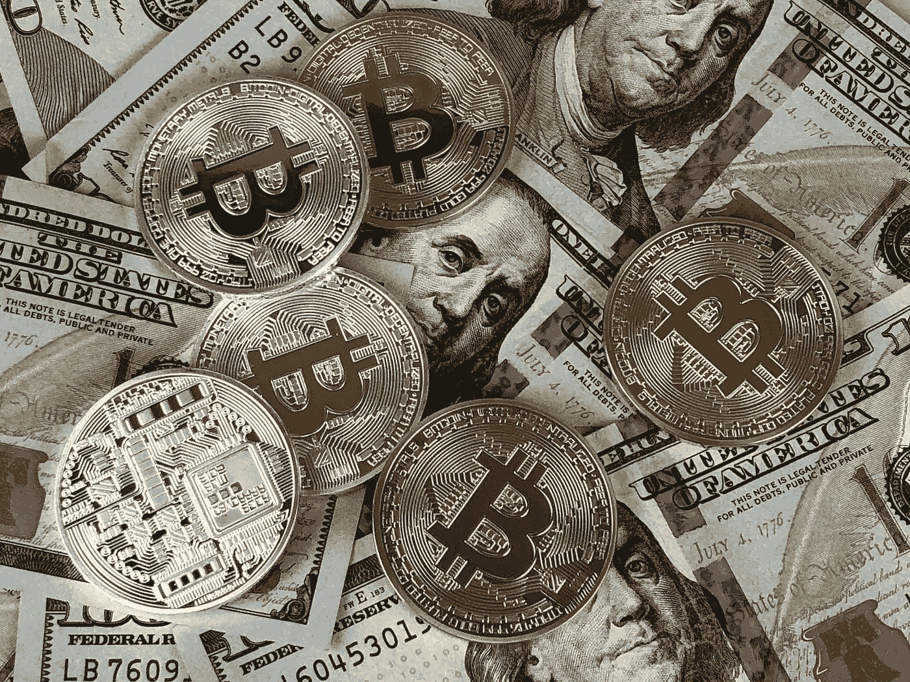

# 2018 年 3 月 27 日:神秘领域最大的故事

> 原文：<https://medium.com/swlh/27-03-2018-biggest-stories-in-the-cryptosphere-8cce0aee059a>

**1。Kakao 确认区块链子公司，但无 ICO**

我们之前[报道过](https://hackernoon.com/06-03-2018-biggest-stories-in-the-cryptosphere-91598dd6e24b)互联网巨头 Kakao Corp .计划推出一家名为 Ground X 的区块链子公司。我们还注意到，该消息发布两周后，更多细节将在新闻发布会上公布。现在[公司已经证实](http://english.yonhapnews.co.kr/news/2018/03/27/0200000000AEN20180327006100320.html)区块链子公司已经成立。一个基于区块链的应用程序开发平台目前正在开发中，目标是在今年年底完成。然而，对于 ICO 来说就不一样了。事实上，关于可能发射的谣言在同一天被揭穿。Kakao Corp .希望此举将有助于该公司在亚洲的扩张。

**2。韩国 6000 家商店将在 6 月前接受加密支付**

到 6 月 11 日，韩国的 6000 家商店将接受加密支付。这是由于加密交易所 Bithumb 和当地移动支付提供商 Pay's 之间的合作关系。该计划是到 6 月份达到 6000 家分店，然后在年底扩大到 8000 家。该项目涉及 200 个特许经营品牌。此前，Bithumb 与该国最大的酒店预订提供商 Yeogi Eottae 和电子商务平台 WeMakePrice 合作。

**3。在首席执行官称比特币是未来的货币几天后，Twitter 禁止了加密广告**

一周前，我们[报道了](https://hackernoon.com/21-03-2018-biggest-stories-in-the-cryptosphere-33e9c6381cf4)Twitter 的联合创始人兼首席执行官杰克·多西在一次采访中表示，他认为比特币将在 10 年内成为主要货币，甚至超过美元。然而，Twitter 现在已经证实了将[禁止与 crypto](https://www.cnbc.com/2018/03/26/twitter-bans-cryptocurrency-advertising-joining-other-tech-giants-in-crackdown.html) 相关的广告的消息。这项禁令从今天 3 月 27 日开始实施，涵盖首次发行硬币和代币销售。此前，多尔西宣布他将处理 Twitter 平台上的在线诈骗和机器人，但[反而限制和/或暂停了错误的账户](https://www.coindesk.com/twitter-pledges-action-crypto-scams-account-shadow-bans/)。

**4。芝加哥期权交易所倡导比特币交易所交易基金**

Cboe 全球市场交易所运营商已经向美国证券交易委员会(SEC)写了一封[信](http://www.cboe.com/publish/ComLet/20180323.pdf)，建议其[不要阻止比特币交易所交易基金(ETF)](https://www.reuters.com/article/us-cboe-etf-bitcoin/cboe-urges-u-s-regulators-to-move-forward-with-bitcoin-etfs-idUSKBN1H224L) 的发展。这封信辩称，它们类似于其他类型的 ETF。此外，Cboe 总裁 Chris Concannon 表示，目前的监管框架也适用于这种情况。这份文件是在美国证券交易委员会的一封[信函](https://www.sec.gov/divisions/investment/noaction/2018/cryptocurrency-011818.htm)之后撰写的，该信函可追溯至 2018 年 1 月。该文件涵盖了操纵风险，以及对加密市场流动性的担忧。然而，芝加哥期权交易所认为，交易所交易基金实际上将是一个有用的工具，因为投资者将以一种清晰和可接近的方式接触到加密货币。

> 这是由 BlockEx 为您带来的新闻综述。

> *要想在你的邮箱里收到我们的每日新闻综述，请在这里注册:*[*http://bit.ly/BlockExNewsRoundup-Updates*](http://bit.ly/BlockExNewsRoundup-Updates)

## 这篇文章发表在 [The Startup](https://medium.com/swlh) 上，这是 Medium 最大的创业刊物，有 310，032+人关注。

## 在这里订阅接收[我们的头条新闻](http://growthsupply.com/the-startup-newsletter/)。

