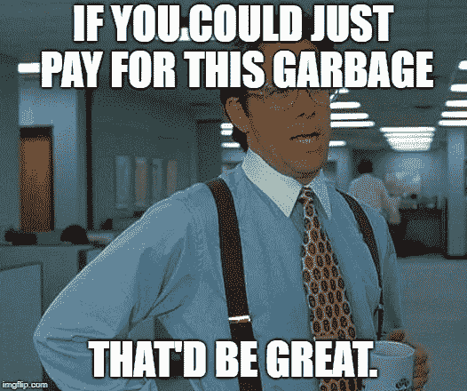

# 27.人们不支付平均 30 天的中等费用

> 原文：<https://medium.com/swlh/27-people-dont-pay-for-average-30-days-of-medium-85373a9fb8de>

感谢到目前为止一直在阅读和跟随我的 30 天中期帖子的每一个人。

确保你**使用底部的小**注册框**订阅我的内容**，以确保我可以通过电子邮件向你发送每个新帖子。

如果你刚刚发现我的帖子，你可以看看下面的其他 **30 天介质**。

## [0。30 天的培养基](/swlh/30-days-of-medium-c7ab34953c6c)

## [1。建立自己的网站需要什么？— 30 天中值](/swlh/1-what-do-you-need-to-build-your-own-website-30-days-of-medium-1ed1ad4e505c)

## [2。如何找到你热爱的事业——30 天的媒介](/swlh/2-how-to-find-a-business-you-love-30-days-of-medium-cb7a4a702d1b)

## [3。如何建立自己的网站—媒体 30 天](/swlh/3-how-to-build-your-own-website-30-days-of-medium-587f994672ec)

## [4。如何衡量你网站的表现——30 天媒体](/swlh/4-how-to-measure-your-websites-performance-30-days-of-medium-75e650969695)

## [5。如何通过回答他们的问题获得更多的客户-30 天的媒介](/swlh/5-how-to-get-more-customers-by-answering-their-questions-30-days-of-medium-b462d237533e)

## 6。成功的商业网站备忘单——30 天的媒介

## 7。如何衡量成功——30 天介质

## 8。了解在线销售漏斗——30 天媒介

## 9。什么是流量，为什么流量很重要？— 30 天的培养基

## 10。什么是 Google URL Builder，为什么要使用它？— 30 天的培养基

## [11。通过自动化您的社交媒体日程，让您的流量翻倍——30 天中等](/swlh/11-double-your-traffic-by-automating-your-social-media-schedule-30-days-of-medium-ac9aa74f7927)

## [12。如何辨别什么好卖— 30 天介质](/swlh/12-how-to-tell-what-sells-30-days-of-medium-ba3291d029d2)

## [13。我如何在 6，500% — 30 天的培养基中培养我的培养基](/swlh/13-how-i-grew-my-medium-following-6500-30-days-of-medium-c9d2d6f80b51)

## [14。你如何看待事情很重要——30 天中期](/swlh/14-how-you-look-at-things-matters-30-days-of-medium-f641b9733b90)

## [15。如何向小型企业销售服务— 30 天中等](/swlh/15-how-to-sell-services-to-small-businesses-30-days-of-medium-d6604c63b3b7)

## [16。如何通过有效的提案赢得更多交易— 30 天的媒介](/swlh/16-how-to-win-more-deals-with-effective-proposals-30-days-of-medium-481f16bbc86f)

## 17。如何在 10 分钟内建立一个网上商店——30 天的媒介

## [18。如何在任何地方工作— 30 天介质](/swlh/18-how-to-work-from-anywhere-30-days-of-medium-1c9cfa2d662f)

## [19。为什么你的网站会破坏你的销售——30 天媒体](/swlh/19-is-your-website-sabotaging-your-sales-30-days-of-medium-f63bdbdb350)

## [二十。你的流量从哪里来？— 30 天中值](/swlh/20-where-does-your-traffic-come-from-30-days-of-medium-a9b2d2c088bb)

## [21。如何真正识别倦怠——30 天中等水平](/swlh/21-how-to-actually-recognise-burnout-30-days-of-medium-7972a7a7a89e)

## [22。如何修改你的时间表并完成两倍的工作——30 天中等时间](/swlh/how-to-hack-your-schedule-and-get-twice-as-much-done-30-days-of-medium-441a509dc9be)

## [23。不要模仿你的竞争对手——30 天的媒介](/swlh/23-dont-copy-your-competitors-30-days-of-medium-56382b7ba8ed)

## 24。如何 SEO 优化一篇博文——30 天的媒介

## 25。独特或被遗忘——30 天的媒介

## 26。跟着感觉走——30 天中等水平

## 27。人们不支付平均 30 天的中等费用

## 28。如何做关键词研究— 30 天介质

## [29。为什么帕累托原则是世界上最大的诀窍——30 天中期](/swlh/29-why-the-pareto-principle-is-the-worlds-biggest-hack-30-days-of-medium-1c225f5c8aa1)

## 三十岁。你的内容比你的电话更有利可图——30 天的媒介

你曾经为**支付过平均费用吗？**

你有没有花时间出去买一些不太好的东西**？**

你上一次特意去餐馆买你认为还可以的食物是什么时候？那些是你不会再去的餐馆。

人们不会为平均水平买单，原因很简单。

# 为什么一般的公司不会成长

我想到了一个词语**‘meh’**。

一个普通的公司是一个激发一种感觉的公司

没人出钱 ok 没人出钱**平均。作为一个经营诺里奇网页设计代理公司的人，这是一个竞争激烈的领域，我可以直接告诉你，人们只会为超出这个范围的东西付费。**

这些公司没有成长，因为他们试图向平庸收费。我用上面的**餐馆类比，因为我认为它很简单。**

如果你看过戈登·拉姆齐的《厨房噩梦》(我都看了),你会看到他不断试图向各种各样的老板灌输“一般的餐馆不会持久”。

爱他或恨他，他在他所做的事情上非常有才华，是一个非常强有力的领导者。

戈登告诉业主，他们需要“追求卓越”。这并不离谱。

在我观察的几乎每一次转变中，问题都是老板们接受并以某种形式提供平庸的服务。通常是食物(服务)。

这就是为什么他们的生意失败，他们迫切需要戈登的帮助。

# 你不用离开家去支付平均费用

该剧的另一句常见台词是——“如果这些人自己在家能做更好更便宜的菜，他们为什么要离开家？”。

这是指**自己动手的方法。**

如果你的顾客自己能做得更好，或者一样好，他们为什么要付钱给你呢？

好吧，如果你纯粹基于价格交易，他们可以利用你来节省时间。

然后你必须用你的服务和周转时间让他们惊叹。

在商界，总有办法超越平均水平。

因此，如果底线是**人们不为平均水平付费，**如果你的产品是平均水平，你就别指望增长。

当然，你可以在销售和市场营销上花一大笔钱，你就会成长，但代价是什么呢？

平均服务和自满迟早会赶上你。就像厨房噩梦里的餐馆一样。

大多数情况下，他们从事业务已有 5-10 年，故事总是相同的。

生意开始时还不错，后来开始走下坡路。

# 进行平均审计

生意并不复杂。这很难，需要大量的努力工作，但这不是火箭科学。

如果你想把你的公司从一般的 T4 公司转变成优秀的 T7 公司，有三个关键的方面需要注意。

1.  产品或服务。
2.  客服。
3.  销售和营销。

你的**产品**或**服务需要与你的客户花费的**投资水平保持一致。****

你的客户需要爱你(在情理之中，你不可能绝对取悦所有人，但要尽力而为)。

你需要在你的销售和营销方法上保持一致，而不是零星的。

好的客户服务很容易。这是超越自我，做一点点额外的事情。

尽可能减轻客户的负担，快速友好地回答他们的任何问题，最重要的是**超越他们的期望。快速全面地完成工作。**

尽你所能，提供一些免费的价值。人们喜欢免费的东西。

因此，这篇文章的关键要点是，如果你都不愿意为平均价格买单，你怎么能指望你的客户愿意呢？

给他们你愿意为之付出的东西，如果鞋子在另一只脚上。

## 你可能也喜欢这个:

## [为什么 WordPress 是在](/swlh/why-wordpress-is-the-best-platform-to-build-your-business-or-startup-website-on-df3fe932fad7)建立商业或创业网站的最佳平台

## [如何建立一个网站——终极指南](https://www.squareinternet.co/how-to-build-a-website-ultimate-guide/)

## 如果你喜欢这个故事，请点击👏按钮，并跟随我的其他 30 天的媒介。

## 这篇文章发表在 [The Startup](https://medium.com/swlh) 上，这是 Medium 最大的创业刊物，拥有 338，320 多名读者。

## 在这里订阅接收[我们的头条新闻](http://growthsupply.com/the-startup-newsletter/)。

