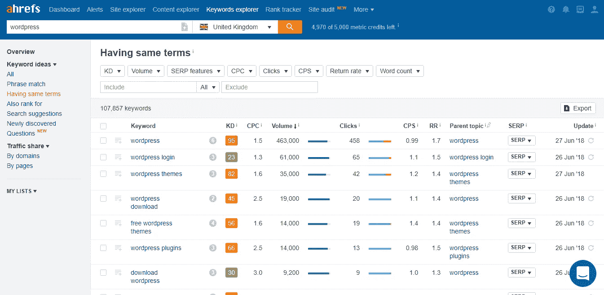
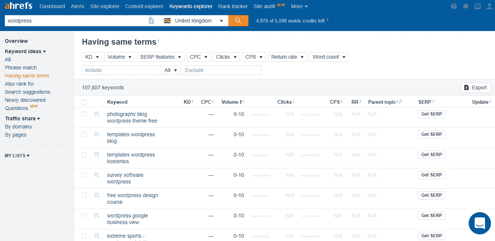

# 28.如何做关键词研究——30 天的媒介

> 原文：<https://medium.com/swlh/28-how-to-do-keyword-research-30-days-of-medium-5fd0fc0f5523>

30 Days Of Medium

感谢到目前为止一直在阅读和跟随我的 30 天中期帖子的每一个人。

确保你**使用底部的小**注册框**订阅我的内容**，以确保我可以通过电子邮件向你发送每个新帖子。

如果你刚刚发现我的帖子，你可以看看下面的其他 **30 天介质**。

## [0。30 天的培养基](/swlh/30-days-of-medium-c7ab34953c6c)

## [1。建立自己的网站需要什么？— 30 天中值](/swlh/1-what-do-you-need-to-build-your-own-website-30-days-of-medium-1ed1ad4e505c)

## [2。如何找到你热爱的事业——30 天的媒介](/swlh/2-how-to-find-a-business-you-love-30-days-of-medium-cb7a4a702d1b)

## [3。如何建立自己的网站—媒体 30 天](/swlh/3-how-to-build-your-own-website-30-days-of-medium-587f994672ec)

## [4。如何衡量你网站的表现——30 天媒体](/swlh/4-how-to-measure-your-websites-performance-30-days-of-medium-75e650969695)

## [5。如何通过回答他们的问题获得更多的客户-30 天的媒介](/swlh/5-how-to-get-more-customers-by-answering-their-questions-30-days-of-medium-b462d237533e)

## 6。成功的商业网站备忘单——30 天的媒介

## 7。如何衡量成功——30 天介质

## 8。了解在线销售漏斗——30 天媒介

## 9。什么是流量，为什么流量很重要？— 30 天的培养基

## 10。什么是 Google URL Builder，为什么要使用它？— 30 天的培养基

## [11。通过自动化您的社交媒体日程，让您的流量翻倍——30 天中等](/swlh/11-double-your-traffic-by-automating-your-social-media-schedule-30-days-of-medium-ac9aa74f7927)

## [12。如何辨别什么好卖— 30 天介质](/swlh/12-how-to-tell-what-sells-30-days-of-medium-ba3291d029d2)

## [13。我如何在 6，500% — 30 天的培养基中培养我的培养基](/swlh/13-how-i-grew-my-medium-following-6500-30-days-of-medium-c9d2d6f80b51)

## [14。你如何看待事情很重要——30 天中期](/swlh/14-how-you-look-at-things-matters-30-days-of-medium-f641b9733b90)

## [15。如何向小型企业销售服务— 30 天中等](/swlh/15-how-to-sell-services-to-small-businesses-30-days-of-medium-d6604c63b3b7)

## [16。如何通过有效的提案赢得更多交易— 30 天的媒介](/swlh/16-how-to-win-more-deals-with-effective-proposals-30-days-of-medium-481f16bbc86f)

## 17。如何在 10 分钟内建立一个网上商店——30 天的媒介

## [18。如何在任何地方工作— 30 天介质](/swlh/18-how-to-work-from-anywhere-30-days-of-medium-1c9cfa2d662f)

## [19。为什么你的网站会破坏你的销售——30 天媒体](/swlh/19-is-your-website-sabotaging-your-sales-30-days-of-medium-f63bdbdb350)

## [二十。你的流量从哪里来？— 30 天中值](/swlh/20-where-does-your-traffic-come-from-30-days-of-medium-a9b2d2c088bb)

## [21。如何真正识别倦怠——30 天中等水平](/swlh/21-how-to-actually-recognise-burnout-30-days-of-medium-7972a7a7a89e)

## [22。如何修改你的时间表并完成两倍的工作——30 天中等时间](/swlh/how-to-hack-your-schedule-and-get-twice-as-much-done-30-days-of-medium-441a509dc9be)

## [23。不要模仿你的竞争对手——30 天的媒介](/swlh/23-dont-copy-your-competitors-30-days-of-medium-56382b7ba8ed)

## 24。如何 SEO 优化一篇博文——30 天的媒介

## 25。独特或被遗忘——30 天的媒介

## 26。跟着感觉走——30 天中等水平

## 27。人们不支付平均 30 天的中等费用

## 28。如何做关键词研究— 30 天介质

## [29。为什么帕累托原则是世界上最大的诀窍——30 天中期](/swlh/29-why-the-pareto-principle-is-the-worlds-biggest-hack-30-days-of-medium-1c225f5c8aa1)

## 三十岁。你的内容比你的电话更有利可图——30 天的媒介

# 什么是关键词研究？

关键词研究是找到你的客户在谷歌上搜索的**商品的过程。**

使用**谷歌关键词规划器，或 AHREFS，**你可以直接从谷歌上看到人们使用什么关键词，他们得到多少搜索以及他们排名有多难的数据。

比如说你像我一样经营一家[**WordPress&woo commerce agency**](http://squareinternet.co)**。**

**我的客户是小企业，他们需要帮助建立或发展他们的 WordPress 或 Woocommerce 网站。**

**我需要从集客营销漏斗的 3 个部分中找到具有商业意图的关键词。**

**他们搜索的内容包括:**

1.  **如何在 WordPress 的页面上添加文章—kd0(0–10)**
2.  **在 Woocommerce 中设置 PayPal—KD 0(0–10)**
3.  **添加照片—kd0(0–10)**

****

**AHREFS Keyword research**

**我怎么知道这个？因为它们来自我实际的**长尾关键词研究**，我用它来写博客。**

# **为什么要做关键词研究**

**这就好比问**为什么做广告？****

****或者更恰当地说，为什么要在你的商店前面放一块牌子？****

**人们在寻找你能提供的东西。他们只是不知道你还能做到。**

**关键词研究让你写得聪明。如果你打算写好的内容，那么就写得让它可以被搜索到，并能从谷歌带来有针对性的有机流量。**

**哪一个更好——一篇没人读的好文章，还是一篇一年有 100 个人读的好文章？**

**在这 10 个人中，可能会有 1 到 2 个顾客会为你服务。**

**这就是为什么关键词研究如此重要，因为它允许你写一些写得很好的长尾内容(为一个长关键词写的内容)，可以为你的业务带来商机。**

**还有在你的领域建立**思想领导力的案例。****

**发展业务的最快方法之一是将自己树立为内容营销的权威。**

**你的客户不知道你知道什么，只有你知道。**

**那就告诉他们吧！向他们展示你对所选话题的了解程度，并与他们建立信任。随着时间的推移，这将转化为未来的业务。**

# **如何做关键词研究**

**其实真的很简单，按照这个流程来。**

1.  **将你选择的关键词输入 [**AHREFS**](https://ahrefs.com) **或谷歌关键词规划器****
2.  **点击“音量”显示最低音量的关键词。**
3.  **建立一个具有商业意图的低容量、低竞争关键词列表(你可以看到你的客户在谷歌中输入这些关键词)。**

****

**WordPress low volume keywords**

**对于搜索词“WordPress ”,有超过 10 万个低容量、低竞争的关键词。所以我有很多选择。**

**当我进行关键词研究时，我需要确保我使用的是与**相关的、有针对性的关键词**，未来的买家可能会使用这些关键词。**

****

**你需要对你的**关键词做同样的研究。****

**要对这些关键词进行排名，请针对这些关键词中的每一个写至少 300 字的文章，这些文章写得很好并且很有帮助。**

**我建议建立一个清单，提前几个月计划好你的内容。**

**这有助于我以最小的努力在每天的同一时间高效地写我的内容。**

****长尾关键词排名**是一个长期策略，可以产生很好的结果，但是需要**时间和持续的努力。****

**别指望一夜之间会有 1000 个新访客。使用谷歌分析和我在上一篇文章中提到的收购报告持续监控你的有机流量。你的流量从哪里来——30 天中等**

## **你可能也喜欢这个:**

## **[为什么 WordPress 是在](/swlh/why-wordpress-is-the-best-platform-to-build-your-business-or-startup-website-on-df3fe932fad7)上建立业务或创业网站的最佳平台**

## **[如何建立网站——终极指南](https://www.squareinternet.co/how-to-build-a-website-ultimate-guide/)**

## **如果你喜欢这个故事，请点击👏按钮，并跟随我的其他 30 天的媒介。**

****

## **这篇文章发表在 [The Startup](https://medium.com/swlh) 上，这是 Medium 最大的创业刊物，拥有 338，320 多名读者。**

## **在这里订阅接收[我们的头条新闻](http://growthsupply.com/the-startup-newsletter/)。**

****