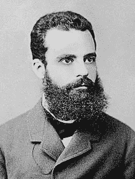
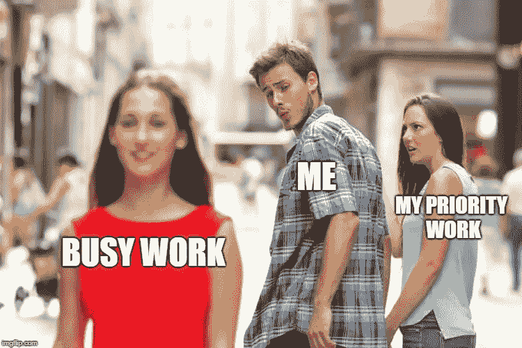
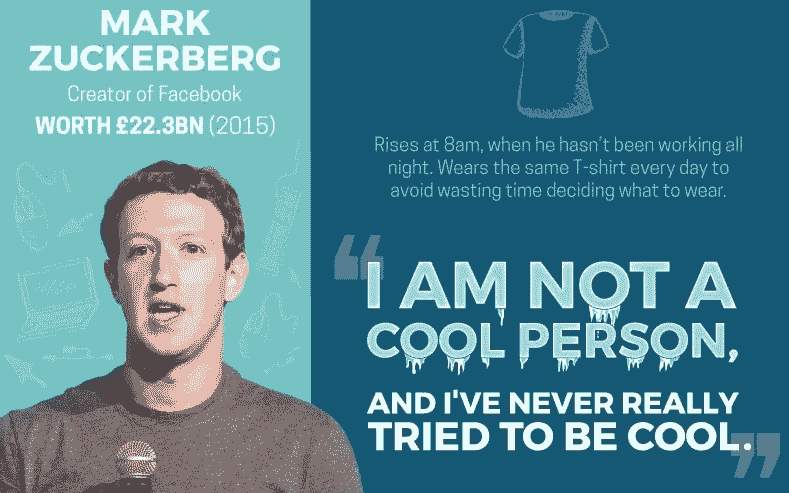

# 29.为什么帕累托原则是世界上最大的黑客——30 天中等

> 原文：<https://medium.com/swlh/29-why-the-pareto-principle-is-the-worlds-biggest-hack-30-days-of-medium-1c225f5c8aa1>

30 Days Of Medium

感谢到目前为止一直在阅读和跟随我的 30 天中期帖子的每一个人。

确保你**使用底部的小**注册框**订阅我的内容**，以确保我可以通过电子邮件向你发送每个新帖子。

如果你刚刚发现我的帖子，你可以看看下面的其他 **30 天介质**。

## [0。30 天的培养基](/swlh/30-days-of-medium-c7ab34953c6c)

## [1。建立自己的网站需要什么？— 30 天中值](/swlh/1-what-do-you-need-to-build-your-own-website-30-days-of-medium-1ed1ad4e505c)

## [2。如何找到你热爱的事业——30 天的媒介](/swlh/2-how-to-find-a-business-you-love-30-days-of-medium-cb7a4a702d1b)

## [3。如何建立自己的网站—媒体 30 天](/swlh/3-how-to-build-your-own-website-30-days-of-medium-587f994672ec)

## [4。如何衡量你网站的表现——30 天媒体](/swlh/4-how-to-measure-your-websites-performance-30-days-of-medium-75e650969695)

## [5。如何通过回答他们的问题获得更多的客户-30 天的媒介](/swlh/5-how-to-get-more-customers-by-answering-their-questions-30-days-of-medium-b462d237533e)

## 6。成功的商业网站备忘单——30 天的媒介

## 7。如何衡量成功——30 天介质

## 8。了解在线销售漏斗——30 天媒介

## 9。什么是流量，为什么流量很重要？— 30 天的培养基

## 10。什么是 Google URL Builder，为什么要使用它？— 30 天的培养基

## [11。通过自动化您的社交媒体日程，让您的流量翻倍——30 天中等](/swlh/11-double-your-traffic-by-automating-your-social-media-schedule-30-days-of-medium-ac9aa74f7927)

## [12。如何辨别什么好卖— 30 天介质](/swlh/12-how-to-tell-what-sells-30-days-of-medium-ba3291d029d2)

## 13。我如何在 6，500% — 30 天的培养基中培养我的培养基

## [14。你如何看待事情很重要——30 天中期](/swlh/14-how-you-look-at-things-matters-30-days-of-medium-f641b9733b90)

## [15。如何向小型企业销售服务— 30 天介质](/swlh/15-how-to-sell-services-to-small-businesses-30-days-of-medium-d6604c63b3b7)

## 16。如何通过有效的提案赢得更多交易— 30 天的媒介

## [17。如何在 10 分钟内建立一个网上商店——30 天的媒介](/swlh/17-how-to-setup-an-online-store-in-10-minutes-30-days-of-medium-a4f955e9b493)

## [18。如何在任何地方工作— 30 天介质](/swlh/18-how-to-work-from-anywhere-30-days-of-medium-1c9cfa2d662f)

## [19。为什么你的网站会破坏你的销售——30 天媒体](/swlh/19-is-your-website-sabotaging-your-sales-30-days-of-medium-f63bdbdb350)

## [20。你的流量从哪里来？— 30 天中值](/swlh/20-where-does-your-traffic-come-from-30-days-of-medium-a9b2d2c088bb)

## [21。如何真正识别倦怠——30 天中等水平](/swlh/21-how-to-actually-recognise-burnout-30-days-of-medium-7972a7a7a89e)

## [22。如何修改你的时间表并完成两倍的工作——30 天中等时间](/swlh/how-to-hack-your-schedule-and-get-twice-as-much-done-30-days-of-medium-441a509dc9be)

## 23。不要复制你的竞争对手——30 天的媒介

## 24。如何 SEO 优化一篇博文——30 天的媒介

## 25。独一无二或者被遗忘——30 天媒介

## 26。跟着感觉走——30 天中等水平

## 27。人们不支付平均 30 天的中等费用

## [二十八。如何做关键词研究— 30 天介质](/swlh/28-how-to-do-keyword-research-30-days-of-medium-5fd0fc0f5523)

## [29。为什么帕累托原则是世界上最大的诀窍——30 天中期](/swlh/29-why-the-pareto-principle-is-the-worlds-biggest-hack-30-days-of-medium-1c225f5c8aa1)

## 三十岁。你的内容比你的电话更有利可图——30 天的媒介

# 什么是帕累托原理？

以意大利经济学家[、](https://en.wikipedia.org/wiki/Vilfredo_Pareto)或**何命名的帕累托法则**是宇宙的绝对真理。

Vilfredo Pareto

帕累托原则指出:

“我们 20%的行动会产生 80%的结果”。

你也可以说:

“大约 80%的**结果**来自 **20%的原因**”。

这是什么意思？

嗯，就**业务和创业来说**，这意味着**你工作的 20%** 将占你成果的 **80%** 。

这也意味着，如果你学会如何利用并把帕累托法则应用到你的生活中，你就可以利用人类历史上最大的生活帮。

# 帕累托原则在起作用

你有没有想过聪明工作这个术语是怎么来的？

我敢打赌，这来自于帕累托法则。

例如,**帕累托原则**是销售中众所周知的**公理。许多销售人员可能已经被灌输了这样的观念:我们 80%的销售额来自我们客户的 20%或类似的东西。**

帕累托原则甚至在我的工作中也很明显，那就是 WordPress。使用 WordPress staging 环境让我减少了 80%的压力，如果我有足够的勇气在我的客户网站上测试新功能和更新的话。

理查德·科赫甚至就此写了一本书。

80/20 法则基本上是聪明工作法则。

如果你将这一普遍真理应用到你的业务和日常事务中，你将只完成产生 80%结果的 20%的任务。

这是我最近一直在做的事情。我每周都会分配几次计划时间，坐下来思考我正在做的事情。

什么是**生成结果**？我能做得更好吗？我怎样才能更有效率，在同样的时间内完成更多的工作？

# 利用帕累托原则

在你的生活中利用帕累托原则是**聪明工作的定义。**

想想吧。

你正在花时间深入地**自我分析**并剔除所有的错误。

什么**实际上给你带来了结果？**而什么只是浪费时间或者忙工作。

我们天生懒惰**。我们所有人，包括我。为了完成任务并获得成功，我们一直在与自己的本性抗争。**

**我们**不是被设计来**攀登公司阶梯或成为白手起家的百万富翁的。**

**我们被**设计**来繁衍后代，逃避捕食者的死亡。我们的大脑还没有进化到能够处理复杂的决策水平，以及现代水平带来的奇怪的新型压力和焦虑。**

**这就是为什么你需要**变聪明**并利用 80/20 法则。**

****

**为什么？因为它可以**大大减少你开始获得某种程度成功的时间**。**

**我希望 6 年前我能更加自我批评。但是它又是懒惰的东西。我从来没有看到过计划的价值，像这样的练习我会认为没有必要而推迟。**

**变得聪明并大规模改变你的生活的第一步是审视你的日常生活。好看。像这样:**

*   **我做了什么让我离目标更近了？**
*   **我做了哪些对我接近目标有负面影响或没有影响的事情？**
*   **向下钻取一个清单，列出你每天可以完成的具体任务，来推动你实现目标。**
*   **提前一个月计划这些任务。**
*   **坚持每天执行它们。**

**你也要**从你的生活中消除任何你能消除的摩擦，**和**烧掉那件愚蠢的** **没日没夜的 t 恤。****

**我以前写过我们大多数人都不是超人。我们中有极小比例的人需要 6 小时睡眠，没有休息日。这些家伙通常已经杀了它，并在他们的游戏顶端。**

**所以我的理论是，他们的**意志力在大部分时间**处于绝对最大状态，因为他们能够利用每一个可能的**力量倍增器**，从他们的日常工作中挤出最后一滴生产力。**

**例如，让私人教练在早上 5 点叫醒你，带你去健身房。当你回来的时候，做好的健康的饭菜等着你，或者当你想花的时候，你想花的钱。**

**这使得去健身房锻炼变得轻而易举。**

**马克·扎克伯格 写道，他每天总是穿着同样的 t 恤，因为他可以少做一个决定。**

**他在谈论这样一个事实，即**决定会耗尽意志力**，他正在修改自己的生活和时间表**，直到他一天中做出的第一个决定**。**

**不幸的是，虽然**我们努力获得成功，但**我们没有同样的奢侈，所以我们需要做的是**消除摩擦和意志力消耗练习，这样我们才能在聪明的任务中保持一致，而不是在愚蠢的事情或繁忙的工作中筋疲力尽。****

**如果你不是一个早起的人，不要在早上 5 点醒来，这会让你筋疲力尽。**

**7 点起床，不要被其他人的建议所迷惑。**给自己的建议**。跟着你的直觉走。如果你每天做同样的 8-10 个小时的工作，无论你是在 5 点还是 7 点都没关系。**

**如果你早上 5 点起床，疲惫不堪，只能勉强坚持 4 个小时，那就不是很有效率了，不是吗？**

**如果你是一个早起的人，这很适合你，如果不适合，就不要做。早上 5 点醒来这件事是一个神话。看[亚伦⑼的](https://www.inc.com/magazine/201211/reshma-memon-yaqub/the-way-i-work-aaron-levie-box.html)日程。**

**对马克·扎克伯格来说，在正常时间醒来似乎也很好，而且我要说他做得很好。**

****

**Image credit — [Dreams.co.uk](https://www.dreams.co.uk/sleep-matters-club/10-morning-rituals-of-successful-entrepreneurs-infographic/)**

**找到一个对你和你的生物钟最合适的例行程序。**

**我 7 点醒来，洗个澡，然后在 7.30 前工作。**

**然后我会在 9 点休息一会儿，吃点东西，为新的一天做准备。我可以一周 5 天一贯保持这种作息规律，需要的时候周末也工作，因为这不会**太消耗我的意志力**。**

**我确保在晚上给自己留出放松的时间。我会玩一个小时的电子游戏，看看电视，和我的伴侣去散步，吃一顿丰盛的晚餐，放松一下。**

**每天，我都在通过完成推动我的业务发展或为我的客户交付成果的任务来制定我的时间表。**

# **关键外卖**

**这篇文章的关键要点是:**

*   **自我分析，了解在你的日常生活中什么有效，什么无效**
*   **通过只做那些能产生 80%结果的任务来改变你的生活，砍掉那些只能产生 20%结果或者没有结果的忙碌任务。**

## **你可能也喜欢这个:**

## **[为什么 WordPress 是在](/swlh/why-wordpress-is-the-best-platform-to-build-your-business-or-startup-website-on-df3fe932fad7)上建立业务或创业网站的最佳平台**

## **[如何建立网站——终极指南](https://www.squareinternet.co/how-to-build-a-website-ultimate-guide/)**

## **如果你喜欢这个故事，请点击👏按钮，并跟随我的其他 30 天的媒介。**

****

## **这篇文章发表在 [The Startup](https://medium.com/swlh) 上，这是 Medium 最大的创业刊物，拥有 338，320 多名读者。**

## **订阅接收[我们的头条新闻](http://growthsupply.com/the-startup-newsletter/)。**

****