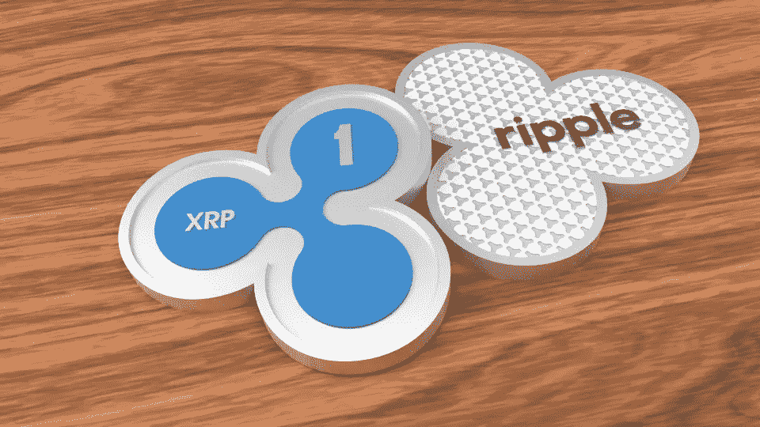

# 2018 年 4 月 15 日的 3 枚代用币(XRP、KMD 和希尔)

> 原文：<https://medium.com/swlh/3-altcoins-for-april-15-2018-xrp-kmd-hire-432745f0fb4d>

**12 月至**[4 月初](http://bitcoinist.com/4-altcoins-major-events-week-april-7-2018-iost-xes-kmd-prl/) **经历了比特币历史上最大的一次调整，接下来的几个月应该是反弹的绝佳机会。本周对于诸如:瑞波(** [XRP](https://coinmarketcap.com/currencies/ripple/) **)、科莫多(** [KMD](https://coinmarketcap.com/currencies/komodo/) **)、HireMatch (** [雇佣](https://coinmarketcap.com/currencies/hirematch/) **)等加密货币来说非常重要。**

几个月来第一次，来自加密领域的消息非常积极。FUD 似乎在很大程度上已经平静下来，从近期低点的反弹似乎已经开始。过去几周，比特币多次跌破 7000 美元，测试 6000 美元的下限。

然而，本周 BTC 仍然保持强劲，非常重要的信息来自场外交易市场(场外交易)、交易所交易基金(交易所交易基金)，以及亿万富翁的家族办公室开始交易加密。这种规模的催化剂将推动整个市场(替代币和比特币)大幅上涨。

如果投资者足够精明，他们可以分析即将到来的市场事件，并试图击败 BTC 的回报。在牛市期间，加密领域的几乎每一枚硬币都会升值，但击败比特币的回报应该是大多数人试图击败的标准。本周有像瑞波(XRP)、科莫多(KMD)和 HireMatch(租用)这样的硬币。

# 下周——加密王国竞赛

本周是特殊的一周，XRP、KMD 和 HIRE 都将举办重大活动。尽管如此激动人心的一周排满了加密赛事，加密王国还是举办了一些他们自己的比赛(2！).超过 15 个 ETH 将在比赛中被送出，比赛非常简单，从现在到八月挑选前 3 个最高收益的硬币并参加 Discord 频道。这两件事让你有机会获得数千美元(免费！)!

要参加任何一场比赛，请务必在 Discord:[https://discord.gg/qTjQp8W](https://discord.gg/qTjQp8W)和 Twitter: @JBtheCryptoKing 上加入加密王国。

# RIPPLE (XRP)- BLOCKBID 列表和西联汇款应用程序

Ripple (XRP)目前的交易价格为每枚硬币 0.64 美元，市值为 250 亿美元。由于市值如此之大，XRP 通常是总市值排名前三的加密货币。XRP 市值数十亿美元的一个主要原因是他们与金融领域大公司的合作关系。

目前，XRP 已经与英国银行、苏格兰皇家银行、速汇金、桑坦德银行、BBVA 以及最近的西联银行建立了合作关系。大型银行和金融公司对 XRP 的认可度最高，这让其庞大的市值在一定程度上得到了证明。本周 XRP 有两个重大事件，应该会继续为经历了几个月动荡的加密技术提供动力。

BlockBid Exchange 正在 XRP 上市，Western Union 正在加勒比海和拉丁美洲发布他们的新支付应用程序。该应用背后的技术涉及 Ripple，如果该应用受到欢迎，XRP 应该会升值。该应用的计划发布日是 2018 年 4 月 18 日。在西联汇款申请的两天前，XRP 已经在 BlockBid 上巩固了自己的地位。

BlockBid 是一个 ICO，共售出 120 万美元的硬币，并在澳大利亚获得了加密货币许可证。这使得 BlockBid 成为少数几个在澳大利亚合法运营的交易所之一，让 XRP 可以在一个全新的大陆进行大规模投资。

# HIREMATCH(雇佣)—展示周

HireMatch (HIRE)是一款 altcoin，市值 350 万美元，单枚硬币价值 3.5 美元。不幸的是，他们的 ICO 结论是正确的，因为市场正在调整，推动了 HIRE token 的价值，就像该领域的大多数其他替代硬币一样。由于 BTC 在这段调整期下跌了 70%以上，像 HIRE 这样的替代货币跌得更厉害。由于市值如此之小，即使是最小的宣传也能提供获得巨额回报的机会。HIRE 本周有非常令人兴奋的消息，因为他们将在 Monster.com 这样的招聘巨头面前进行演示。

活动门票的费用超过 1200 美元，因此不太可能选择出席。由于出席成本如此之高，这确保了只有招聘领域最优秀的人才会参加。这个活动不仅仅是在区块链举行。该活动将于 2018 年 4 月 19 日上午 11 点在拉斯维加斯举行。围绕演示文稿的宣传以及由此衍生出的任何可能的合作伙伴关系都可能导致雇佣价值的增加。

# 科莫多(KMD)——分散式 ICO

科莫多(KMD)是一家专注于 dICO(分散式初始硬币发行)的 altcoin。这一过程应该会彻底改变加密货币领域的 ICO 平台。2018 年 4 月 17 日，开始在 Komodo 平台上进行首次 dICO token 销售。该集团令牌将开始，并正式宣布为加密货币空间的第一个分散的 ICO。科莫多骄傲地从出售 BlocNATION token 开始改变 ICO 的面貌。

KMD 目前的交易价格为每枚硬币 3.51 美元，比 KMD 2018 年 4 月 7 日的交易价格高出 1.00 美元。随着第一个 dICO 日期的临近，加上他们对 ICO 平台的革新，KMD 背后的动力正在继续增强。KMD 的市值超过 3.6 亿美元，除非 dICO 平台出现任何挫折，否则这一数字将继续上升。

让 KMD 如此独特的是科莫多平台。科莫多区块链平台使用 KMD 的开源加密货币进行透明、匿名、私人和可替代的交易。一个延迟的工作证明协议通过使用比特币的区块链使它们变得超级安全。超网生态系统也使用 KMD 作为他们的官方加密货币。SuperNET 是一个分散的组织，为加密市场开发开源和分散的工具。这些工具可以包括从分散交易到多硬币钱包的任何东西。

KMD 有许多他们正在进行的项目，包括一个分散的交易所 BarterDex，它使用原子互换来通过资产挂钩，以实现硬币的即时交换。dICO(去中心化 ICO)是一个去中心化的平台，允许使用原子交换技术支持的模型进行 ICO 的代币销售。这允许使用 dICO 模型完全分散和匿名地发布和分发密码。KMD 显然有非常先进的隐私技术，他们正在通过交换平台植入 ICO 领域。

KMD 的 dICO 平台将于本周上线，BlocNATION 是 KMD 主持的第一个 dICO 平台。本周应该是 KMD 历史上最重要的一周，因为完美的执行应该会导致价格持续攀升，但任何问题都可能导致市场信任的崩溃。

**扩展币分析及本周币的进一步信息可在此阅读:**[**http://bitcoinist . com/3-alt coins-跑赢大盘-比特币-周-4 月-16/**](http://bitcoinist.com/3-altcoins-outperform-bitcoin-week-april-16/)

*阅读国王之前的文章，了解他目前推荐哪些 ICO，或者直接与国王取得联系，可以在 Twitter (@JbtheCryptoKing)或者*[*Reddit*](https://redd.it/81hj5q)*(ICO 更新和每日报道)。*

## 这篇文章发表在《创业公司》杂志上，这是 Medium 最大的创业刊物，有 316，638 人关注。

## 订阅接收[我们的头条](http://growthsupply.com/the-startup-newsletter/)。

