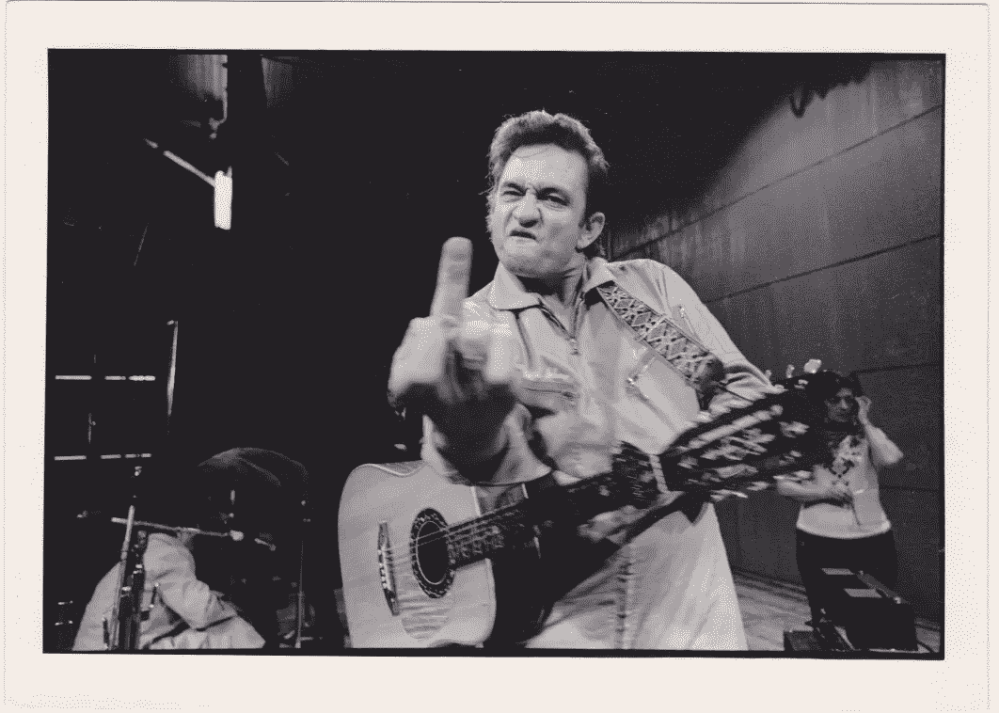

# 2018 年用你的写作获得收入的 3 个防弹步骤

> 原文：<https://medium.com/swlh/3-bulletproof-steps-to-earn-income-with-your-writing-in-2018-5d129b7f2f0b>

## 我这周赚的钱比我前一年半赚的钱加起来还多

Photo by [Lionel Gustave](https://unsplash.com/photos/c1rOy44wuts?utm_source=unsplash&utm_medium=referral&utm_content=creditCopyText)

我这周通过写作赚的钱比过去一年半的总和还要多。

这个梦想很简单——在你想写的时候写你想写的东西，并以此来维持舒适的生活。从那里，你可以自由地阅读，与朋友一起闲逛，旅行，并在任何一天沉浸在任何令你着迷的悠闲追求中。

这个梦想是将创业精神与写作结合在一起。

然而，梦想不会在一夜之间实现。在众多有影响力的人、博客作者和作家的帮助下，我们看到了终点线——与此相关的自由、财富和名声。我们看不到实现这一目标所需要的辛劳、奋斗和大量的艰苦工作。

太多的作家有一种*“如果你建造了它，他们就会来”*的心态。你认为仅仅因为你把以太放入这个世界，宇宙就会联合起来把你带到应许之地。这当然是一种谬论。

> “当你意识到别人很少关心你时，你就不会那么在意别人对你的看法了。”
> 
> —戴维·福斯特·华莱士

仅仅因为你开始制作和生产作品，并不意味着人们会关心——更不用说看到它了。你需要写作，这是最重要的。然而，如果你想通过它实现财务收入，简单地写下你的想法并向全世界公布可能不会让你实现。

为你的经济收入建立基础并传播你作品的恶名的一个好方法就是代笔。

有了代笔，当然你写的内容并没有得到你想要的直接荣誉，但是，你在社区里建立了一个勤奋的名声，这些人会为你的技能付钱。 [**目前的市场**](https://doctorfreelance.com/freelance-ghostwriting-rates/) **为自由撰稿人支付平均每个项目 36000 美元的费用。这是一堆等待开采的黄金。**

> 这是将你从业内业余者中分离出来的方法，并开始将你塑造成专业人士。

作为一名成功的代笔人，我已经学会了一些技巧、窍门、策略和技术，以便获得客户，并看到我的手艺变成现金。

以下是为你的第一份代笔工作做准备的方法。

# 每天写作——即使你不想写

> “除非你愿意产生许多坏主意，否则你不可能有好主意。”
> 
> ——塞思·戈丁

我一直在指导我的一个朋友。他的名字叫达斯汀，他经营着一个很棒的个人理财博客，教授如何通过鲜为人知的投资策略来教授和建立财务独立。

当我们交谈时，他总是惊讶于我是如何通过我的博客获得大量的浏览量[(250 多万次浏览)](https://www.quora.com/profile/Jon-Brosio)。**我告诉他没有秘密——只要每天出现和写作。**

像许多博客作者一样，他仍然有一份全职工作，认为自己没有时间写作。

> 我认为这不是你没有时间的问题，而是事情的轻重缓急。

每天写作和每天把*写好*不一样。你在日常写作实践中所做的只是建立一个文件夹，磨练你作为一名作家的技能。你还不是一个伟大的作家。

练习并建立一个文件夹，这样当你有机会向潜在客户推销你的作品时，你就有一大堆材料可以选择。

# 尽可能和每个人谈论你的工作

Photo by [Joshua Ness](https://unsplash.com/photos/-bEZ_OfWu3Y?utm_source=unsplash&utm_medium=referral&utm_content=creditCopyText)

我花了很长时间来和我接触的人分享我对写作的热爱。我觉得自己好像是个骗子，我不能仅仅因为写作就称自己为*作家*:我需要可信度、佣金、名声，需要被欢迎进入*作家*的圈子(不管他们是谁)。

简单的事实是，人们不知道你是一个作家，除非你告诉他们。除非你直言不讳，否则潜在客户不知道你可能有价值提供给他们。

幸运的是，我在芝加哥小熊队的棒球比赛中喝了几杯啤酒，拿到了我的第一笔佣金。我和一个朋友谈论我的写作，他说他的公司正在寻找代笔人。

> 我进入了一个我没有任何经验的竞技场，向前走着，对自己打赌我能做到。

过了一段时间，你把你的作品提交给客户，恐惧就消退了——就像你在激情写作时按下“提交”按钮之前的恐惧一样。

站在你的讲台上，向唱诗班宣扬美好的话语——大多数人不会在意，很多人也不会听。那些少数正在寻找它的人会给予好评。

# 即使害怕也要说“是”

当我第一次得到一个自由撰稿人的机会时，我吓得屁滚尿流。

我之前已经深入写过“冒名顶替综合症”是如何扼住我的喉咙的。

 [## 我如何引导我的恐惧和焦虑得到我的第一份代笔工作

### 为什么站在边缘是可怕的，但回报可能是…

medium.com](/the-post-grad-survival-guide/how-i-channeled-my-fear-and-anxiety-to-get-my-first-ghostwriting-job-be460b4bb642) 

在处理了首先充斥我意识的极度焦虑之后，总是排在第二位的想法会以这样的形式出现，

> “管它呢……也许我能做到。”

我最终会对这些我不确定是否能成功的机会说“是”。

我有一个关于人类的理论，倾向于二元对立。当你走投无路时(你正处于一段糟糕的感情中，你正处于财务困境中，你正搬到一个你不认识任何人的地方，等等)，你有两个选择:

[https://bit.ly/2MioRzs](https://bit.ly/2MioRzs)

*   你可以在恐惧中畏缩和崩溃，哭着入睡，最终放弃。
*   你可以向全世界竖起两根中指，告诉所有人:“我能做到！”

即使我不知道该做什么，我也会竖起两根中指。你建立了一种决心感，并且能够向自己展示真实的自己以及你有潜力成为什么样的人。

如果你像我一样，那么也许你会处理这些膨胀的宏伟想法，这些想法混合着令人虚弱的自我对话，试图让你相信你是一个骗子。

在这一切当中，需要找到一个中间地带。

你当然想爬上这座山，在作家统治的顶峰插上你的旗帜。然而，要实现这一目标还需要数年时间。

为了帮助你更快地爬山，你需要为那些寻找它的人提供服务。我已经看到代笔促进了我的写作和勤奋向更好的方向发展。我一路上收集的要点和经验教训将在你的旅途中对你有所帮助。我真心希望你从中有所收获。

# 👋🏻你好，我是乔恩

我是一个思考者，自由撰稿人和葡萄酒爱好者，写关于个人成长和心理优化的文章。我也鼓吹将你的作品货币化。加入 1，200 多名读者的行列，获得我为期 6 天的免费个人“创业博客”课程和我的时事通讯:

**🚨** [**> >世卫组织还想自己当老板？< <**](https://mailchi.mp/4b982beed325/free-6-step-course) **🚨**

## 这篇文章发表在 [The Startup](https://medium.com/swlh) 上，这是 Medium 最大的创业刊物，拥有 358，974+读者。

## 在这里订阅接收[我们的头条新闻](http://growthsupply.com/the-startup-newsletter/)。

