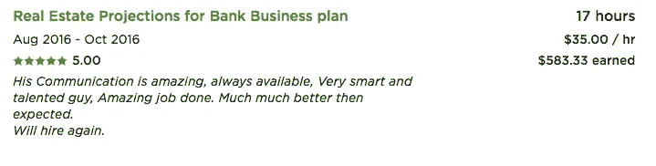
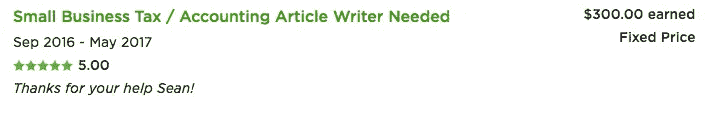
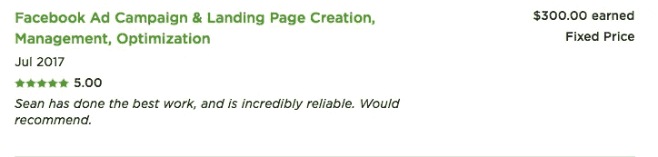
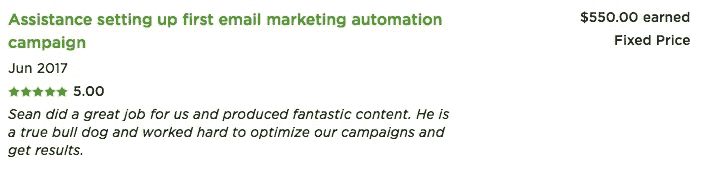

# 为什么每个自由职业者都应该尝试工作的 3 个违反直觉的原因

> 原文：<https://medium.com/swlh/3-counterintuitive-reasons-why-every-freelancer-should-try-upwork-b1ba4c21cda5>

Photo by [Ben White](https://unsplash.com/photos/qDY9ahp0Mto?utm_source=unsplash&utm_medium=referral&utm_content=creditCopyText) on [Unsplash](https://unsplash.com/?utm_source=unsplash&utm_medium=referral&utm_content=creditCopyText)

如果你曾经关注过在线自由职业者的世界，你可能听说过 [Upwork](https://www.upwork.com/) …

你可能听说过这很糟糕。

现在不要误解我，我确实理解所有大师们所说的，我自己也目睹了同样的问题，但我也学会了如何将这些障碍转化为积极因素…

一旦你做到了这一点，Upwork 实际上就成为了一个每个自由职业者都在寻找的令人惊叹的平台。

# 违反直觉的原因#1:他们收取 20%的费用

好吧，公平地说，那 20%的费用只适用于你从客户那里赚到的第一个 500 美元，然后下降到 10%

但即使一直是 20%,也还是物有所值。

为什么？

因为尽管我知道这笔费用一开始有多可怕，但看着某人拿走你 20%的血汗钱…

大多数人忘记的是，自由职业是一门生意，我不管你做什么形式的营销，你永远不会有***【真实】*** 100%的净利润。

现在，我说 **" *true"*** 因为很多讨厌我的人总是会回来找我，说他们如何写博客或做冷冰冰的电子邮件宣传，这两件事不会让他们付出任何开销…

再说一次，我明白，但我也知道这种方法需要更长的时间来寻找客户——所以这本身就减少了你的收入，减少了你口袋里的钱。

这已经够糟糕了，但是似乎一旦大多数自由职业者开始注意到这一点，他们就会尝试“更快”的营销形式(比如脸书广告)

即使它可以工作，也需要几美元来优化和运行一切，这很容易占用您 20%的收入…

所以这是另一件需要考虑的事情。

好的，这就是它的营销方面，这就是为什么，以我(不那么)浅显的意见——我认为 Upwork 的费用已经值得了…

但是也有一些隐藏的费用，大多数专家都忽略了。

真见鬼，说实话，我确定我错过了一些东西——但我总是想到的主要三个是:

1.  **保险**——up work 有一项担保，它涵盖你工作的任何时间，并且不收取报酬。在极少数情况下，当你的客户是一个骗子或者破产了而无力支付时，这是非常有用的
2.  **支付处理**——所以说实话，客户支付支付处理费……但是，嘿，这比传统的从你口袋里掏出 2.9% + 30 美分(标准)要好得多
3.  网站——如果你打算尝试“传统”形式的自由职业，即不借助市场获得客户，那么你可能需要一个网站。现在网站的费用到处都是，我知道它们不像以前那么贵了，但它仍然是 Upwork 为你消除的一项开支

**长话短说:**作为一名正在恢复的会计，我真的对数字很着迷，我可以向你保证，Upwork 的 20%比其他方法更有利于你的底线…

你只需要知道要找什么。

# 违反直觉的原因 2:竞争非常激烈

是的，你没看错，我认为疯狂的竞争是件好事。

同样，不要误解我，我并不讨厌这个，因为我刚开始的时候也掉进了同样的陷阱…

但像 99%的其他自由职业者一样，我总是有这样一种印象，那就是一开始我不得不放弃我的生意，获得一些评论，然后在我“站稳脚跟”后收取适当的费用。

我在[的这篇文章](/swlh/want-more-clients-raise-your-rates-8514a2a040f6)中详细讨论了这个问题，但是总结一下——这是一个可怕的想法，每个自由职业者都应该避免。

这不仅会让你在工作 80 个小时后极度疲惫，还会让你和其他人挤在一起，让你很难找到工作。

另一方面，由于 99%的其他自由职业者都提供残酷的价格，并寻求最低的价格…

很容易提高你的工资，脱颖而出，很快找到工作。

这就是为什么我喜欢 Upwork 的竞争，但你也可以更进一步，通过战略定位脱颖而出…

老实说，这并不难做到，你只需要找到自己独特的位置。

你也不要告诉我你没有，因为这些年来我和很多人一起工作，并且能够为每个人找到一个独特的技能…

那么一旦你发现了这一点，就很容易从 99%的自由职业者中脱颖而出，成为“通才”。

现在，找到你的定位的最简单的方法就是简单地将某项技能(你拥有或想要学习的)与某个行业(你了解或想要了解的)结合起来…

为了给你一个如何做到这一点的例子，我开始了(嗯，改进了)我的自由职业生涯，成为一名专门从事税务(国税局注册代理)的文案(我想学习的技能)。

这可能会让我失去很多机会，但与此同时，我获得了我申请的 90%的税务写作工作…

这让我以超乎想象的速度开始了我的自由职业生涯，尤其是在我毫无经验的领域(文案)。

**长话短说:** 99%的自由职业者都患有从众心理，融入人群，非常容易脱颖而出……只需几个简单的调整。

# 违反直觉的原因#3:很容易失败

像大多数自由职业者一样，我必须克服的最大挑战之一就是弄清楚我想做什么。

我总是担心我会选择错误的技能，或者陷入我讨厌的事情，或者更糟，一些不受欢迎/无利可图的事情…

这对于那些前期投入大量时间和金钱的“传统”自由职业者来说是一个真正的问题，但是当你利用 Upwork 的力量时——很容易进行实验并弄清楚这一点。

我什么意思？

让我们以我的故事为例，我开始是一名簿记员，在这个领域工作了几周后，我意识到它有多无聊，于是我决定尝试文案写作(为会计师事务所)。

几个小时后，我改变了我的个人资料，开始申请这些工作，事实证明这是我喜欢的事情，所以我坚持了一段时间…

$75 per blog

直到几个月后，我厌倦了这份工作，决定改变一下，成为一名销售文案。

$750 for sales letter

在做了一段时间的销售文案后，我意识到我不能每周都这样做，于是我决定成为一名登陆页面设计师/文案——我讨厌吹牛，但我能够获得比“专业人士”高 8 倍的转化率……

3.5 hours of work

所以我一路创造了很多快乐的客户。

在那之后，我决定利用我的文案知识，开始做脸书广告，然后是电子邮件渠道，这是另一个我很快就能出类拔萃的领域…

$110 per email

1 hour of work

在那之后，我将所有这些技能结合起来，开始了自己的在线业务，这一切都是因为 Upwork 让我能够快速“转向”并在几乎没有阻力的情况下改变行业。

**长话短说:**至少，我认为每个人都应该开始向上努力，至少尝试并确保他们的自由职业是他们喜欢的事情。花几个小时建立个人资料(几乎没有资金投入)就能搞清楚这一点，要比浪费几周(如果不是几个月)去获取“必需品”(如名片、网站等)好得多。)准备好了，才意识到这是你不喜欢的东西。

# 明白我在说什么吗？

如果使用不当，Upwork 确实有一些缺点，但你猜怎么着，生活中的其他事情也是如此。

不要让一些心怀不满的大师吓得你放弃利用这个令人惊叹的市场，如果你想要一本告诉你关于在线自由职业者世界的入门书…我为你创建了一门免费课程，在这里找到。

## 这篇文章发表在 [The Startup](https://medium.com/swlh) 上，这是 Medium 最大的创业刊物，有 277，994+人关注。

## 订阅接收[我们的头条新闻](http://growthsupply.com/the-startup-newsletter/)。

