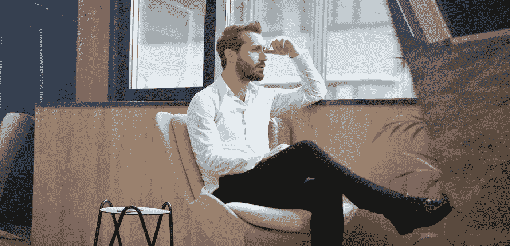

# 更好思考的 3 个关键策略

> 原文：<https://medium.com/swlh/3-critical-strategies-to-think-better-d295f8142204>

每当有人谈论在生活中获得更大的成功时，不可避免地，在任何行为或行动之前需要解决的第一个领域是更好地思考的策略。事实是，我们都有破坏性的思维模式，这些模式在我们的意识之外运作，并导致负面的结果，给我们的生活带来潜在的灾难性后果。

我们都拥有思维模式，这种模式是我们的大脑基于我们过去的条件反射和经验而采用的。因为我们的身体需要来自大脑的不断指示、反馈和响应，以便我们在世界上运作和发挥作用，并且因为我们每天每一秒钟都能有意识地意识到的刺激是有限的，所以我们的大脑需要自动处理大量的刺激。

例如，当你阅读这篇文章时，你可能没有意识到你在椅子上坐立不安，你的身体从一个位置转移到另一个位置。或者你本能地在手臂上抓痒。这些简单的例子强调了我们的大脑是如何在我们意识之外处理外部刺激的。现在，有许多原因可以解释你的身体移动或你抓挠你的手臂(不仅仅是习惯)，但事实仍然是，你的大脑告诉你的身体对某些事情做出反应，你的身体服从了，往往你不知道。

在这样的小例子中，这种行为的后果是微不足道的。我的意思是，谁会在意我们开会时身体是否会坐立不安，除了如果这种情况发生得太频繁，可能会分散房间里其他人的注意力。困难在于，当这些“自动”反应发生在后果更重要的情况下。

举个例子，我们通常从我们的父母和我们成长的环境中学习如何处理冲突。如果爸爸生气时对每个人尖叫，妈妈让每个人闭嘴，让孩子们回到自己的房间，直到爸爸“冷静下来”，我们可能已经知道，对付一个生气的人的最好方法是回避或尽最大努力平息事态。

因为这种习得的行为，现在当我们遇到冲突时，我们的大脑自动运行，我们自动进入回避或平滑模式。或者，更糟糕的是，如果我们知道在冲突中“获胜”的唯一方法是猛烈抨击和咄咄逼人，当我们现在的关系中有冲突时，这种破坏性的模式就会成为我们实践中的一个常规部分。

有这种经历的人有时会想，为什么他们只是“倾向于”更具攻击性的行为，即使他们知道这种行为会破坏他们的关系。这是因为过去的经验和行为条件已经“编程”他们的大脑以一种特定的方式运作——无论是侵略性的，逃避的，还是圆滑的——在任何有意识的想法可以对这种情况产生影响之前。这些次优的冲突管理策略不仅会给我们的关系带来更大的困难，还会阻止我们了解自己，学会如何以建设性的方式处理冲突，拥有更令人满意的关系和更幸福的生活。

鉴于这些类型的思维模式和破坏性结果，了解我们如何更好地思考——如何从一开始就停止功能障碍——是非常有意义的。这里有 3 个策略来开始改善你的思维，从而体验更好更成功的生活。

# 1.使用适当的思维图，而不是精确的思维图

我们在日常语言中使用的词汇可以被认为是描述我们现实世界的地图。语言不仅仅是具象的。也就是说，一个词不仅仅代表一件事。语言在进化。词语在描述现实时有多种细微的含义。事实上，我们用语言“思考”。正如路德维希·维特斯坦根所说，我们语言的极限就是我们世界的极限。

此外，我们很容易理解，我们没有一个名称来描述世界上发生的每一件事。我们用词汇来描述事件和事物，但它们永远不会完全准确，因为现实远不止我们可以用词汇来描述。从两个方面考虑这个问题:

(1)我们有一个事物和事件的世界，和

(2)我们有一个词汇世界，我们用它来描述世界上的事物和事件。

换句话说，在“领域”(事物和事件的世界)和我们的语言地图(我们用来描述那个世界的词语)之间是有区别的。考虑到这一点，我们可以说，良好、合理的思维正在绘制语言地图，以充分描述我们在现实中经历的不断变化的领域。

充足的地图(相对于精确的地图)很重要，因为领土不是一个非此即彼的概念。语言欺骗我们，让我们相信我们对世界(以及整个世界)的描述是完整的、静态的。例如，当我们使用“杯子”这个词时，只有当我们谈论这个词本身时，它才是一个“杯子”。在这个意义上(在谈论“杯子”这个词时)，杯子不可能是一个容器，因为这些词是不相等的。但是对于事物本身，现实中的实际物体，它可以同时是杯子和容器，很多时候正是如此。

现实中的物体实际上可以同时被称为许多不同的东西——杯子、容器、白、高、矮、蹲、奶油、硬、陶瓷等等。没有任何矛盾，因为这些描述是主观的，取决于一个人的观点。

小肯尼斯·凯斯(Kenneth Keyes Jr .)在他的《如何发展你的思维能力*一书中举了这个例子:*

*鲍勃钓了一整天的鱼，运气都不好。在回家的路上，他在鱼市停下来，对店主说:*

*"汤姆，挑出五条最大的鱼扔给我."*

*“你是说扔了它们？？，”店主说。*

*“是的，把它们一个一个地扔给我，这样我就可以告诉家人我抓到了它们。我可能是一个贫穷的渔夫，但我不是骗子。”*

*这个故事说明了适当的语言地图和精确的语言地图之间的区别。虽然渔夫说他抓到了 5 条鱼，可以说他制作了一幅完全准确真实的现实地图，但我们都意识到他的地图不足以描述实际发生的事情。*

*因此，为了更好地思考，要学会使用适当的地图来描述现实，避免使用精确的地图，因为精确的地图往往会产生误导。*

*在我们如何自言自语时尤其如此。很容易使用精确的地图来欺骗我们，让我们相信一些不一定是真的东西。(这是我在这篇[文章中更多谈论的事情:我们应该说实话吗](http://www.mindforlife.org/should-we-tell-the-truth/))。*

*使用适当的地图而不是精确的地图能让我们更好地看世界，更真实地交流，更清楚地理解我们的经历有多少被我们的视角所影响。*

**

# *2.运用良好的批判性思维技能*

*批判性思维是人生成功的重要技能我们都喜欢认为自己是优秀的批判性思考者，但不幸的是，当涉及到自己的偏见和价值观时，许多人往往会暂停他们的批判性思维。*

*我们都有偏见，导致我们简单地相信我们的*“人】、*我们的*权威人物告诉我们的东西——无论是媒体、博客、名人还是政治家。**

**归因理论指出，我们都试图将因果关系归因于他人的行为。我们扮演业余心理学家的角色，试图理解人们为什么做他们所做的事情。**

**此外，我们根据自己的特定偏见对这些原因进行价值判断。当和我们想法一样的人做了坏事，我们会把他们的行为归因于他们的行为——“这是一个错误”、“那是一个意外”，或者“环境导致他们这样做。”当这种情况涉及到与我们对立的人时，我们通常会将他们的不良行为归因于他们的性格——“他们是一个邪恶的人”，或者“他们是种族主义者。”**

**说到好的行动就相反了。像我们这样的人得到了怀疑的好处，我们把他们的好行为归因于他们的性格，而对于另一方的人来说，他们的好行为被归因于“意外”或只是他们没有真正意义的事情。**

**举个例子，对于民主党人来说，当特朗普做了好事时，他“并不是真的想让事情这样发生”，但当他做了坏事时，“他就是一个种族主义者。”这种情况也发生在另一边，你可以阅读共和党的博客，了解南希·佩洛西或查克·舒默是邪恶的化身，甚至他们所做的好事也不是他们自己良好性格的结果，而是共和党人迫使其发生的环境造成的。**

**归因理论对我们所有人的问题是，它导致我们更倾向于相信我们身边告诉我们的东西，而不去批判性地思考事实真相。因为我们认为“我们的人民”是好的，“他们”是坏的，我们倾向于相信我们的一方，妖魔化另一方。**

**这让我们接触到了宣传的力量，这是我们都应该小心的事情。抛开我们的偏见可能很难，但我们必须努力不仅检查对方说了什么，而且同样批评我们这一方。**

**互联网的两极分化已经将每一方置于极端，但为了更好地思考，我们必须找到方法来批判性地检查每一方——甚至是我们自己——而不管我们的偏见和倾向。**

****

# **3.认识到知识的无限性**

**互联网的承诺之一是，它将开创一个信息时代，在这个时代，我们想知道的任何事情都只需点击或轻击。今天，我们生活在一个前所未有的世界里，我们几乎可以获得任何我们想要的东西，而可供我们使用的大量信息产生了两个问题。**

**首先是尼尔·波兹曼所说的信息过剩。大量的信息虽然带来了难以置信的好处，但也产生了一个问题——谁能知道所有的信息？**

**另外，当权威知识相互矛盾时，我们该怎么办？我的意思是，当一项医学研究说鸡蛋对你有益时，下一项研究说鸡蛋有害时，我们会相信谁呢？**

**我们自身知识的有限容量和互联网提供的前所未有的信息可以让我们相信谷歌掌握着权威，谁排名高谁就是对的(我希望我们都知道这不是真的)。**

**正是这种情况导致了一种“假新闻”文化，在这种文化中，甚至连权威消息来源都受到质疑，因为在如此多的信息面前，我们能真正相信谁呢？在信息过剩的情况下，谁能真正知道谁对谁错呢？**

**第二个问题是相信知识是完整的。生活在科技文化中的后果之一是，当涉及到我们对现实的认知和信念时,“科学”和科技被赋予了极大的权威。**

**这是有道理的。新发现和新信息打开了我们的视野，让我们对周围的世界有了难以置信的了解。但是我们不能被愚弄去相信我们今天科学上所知道的一切是完全准确的，甚至是完整的。**

**举个例子，科学界曾一度普遍相信自然发生或[自发产生](https://en.wikipedia.org/wiki/Spontaneous_generation)——即有机物(生命)只是从无机物中产生的想法。跳蚤从尘土中冒出来，蛆从死去的肉中冒出来。我们回过头来看，并意识到今天——在伟大科学进步的这一边——这种想法是多么荒谬。**

**有鉴于此，意识到科学在过去犯了多少次错误，我们也应该意识到一百年后，科学发现将继续进步，我们对生命、世界和宇宙的一些最珍贵的信念可能被证明是不正确的。**

**也许会发现新元素。也许对现实的新解释将被证明是正确的。也许我们会发现宇宙中还有其他智能。**

**我们感谢科学向我们展示了我们的世界，我们应该安全而轻松地掌握现有的知识。**

**除此之外，我们需要认识到，没有人知道或可能知道关于某件事的一切。当然，在这些问题上有权威，但是即使是这些权威也在他们的专业领域上有分歧。**

**有一些非常聪明的人知道很多事情，但是这些人并不是什么都知道，甚至是他们最了解的领域。没人能。**

**这并不意味着当他们说出他们的专业知识时，我们不相信他们，但是我们必须这样做，因为他们可能是错误的，新的发现可能证明他们的理论和想法是不正确的。**

**我们需要认识到真相和猜测之间的区别——这是有区别的。专家对许多事情建立理论(推测)。我们需要意识到，当那些专家对某件事情进行推测时，当他们对某件事情进行理论化时，可能是这样(也可能不是这样)，当他们提供明确的已证实的知识时。**

**很多时候，专家知识被当作真理，而事实上，它是为了推进议程、说服观众或获得权力而进行的推测。在这种情况下，我发现意识到如果问题的双方都有同样聪明和知识渊博的人，那么他们所辩论的不一定是决定性的，这很有帮助。**

**没有人知道这一切。不是专家，更不是你(或我)。所以，为了更好地思考，当你就一个问题发表意见时，要谦虚一些。你可能不是专家，如果你是，你应该意识到除了你所做的，还有更多你不知道的专业领域。正如我的教授曾经说过的，“任何白痴都可以有自己的观点——这并不意味着他们知道自己在谈论什么。”**

## **结论**

**思考对我们人生的成功至关重要。它决定了我们如何行动，进而决定了我们行动的结果。元认知是思考你如何思考的过程，更好地思考的第一步是学会思考你如何思考。**

## **深入一点**

**这篇文章是《牢记生活中的 52 个基本技能》课程的一部分。你可以加入我们的个人发展之旅。免费的！[下载必备技能个人评估](https://mindforlife.lpages.co/52-essential-skills-self-assessment/)和[加入脸书生活必备技能头脑小组](https://www.facebook.com/groups/1754943878132687/)。**

*****Jeff Bogaczyk 主持了*** [***心灵生活播客***](https://itunes.apple.com/us/podcast/mind-for-life/id1220165343?mt=2) ***，这篇文章最初发布在他的个人博客***[***【www.mindforlife.org】******。在推特上关注他***](http://www.mindforlife.org/)[***@ jeffbogaczyk***](https://twitter.com/jeffbogaczyk)***。*****

****

## **这篇文章发表在 [The Startup](https://medium.com/swlh) 上，这是 Medium 最大的创业刊物，拥有+396，714 名读者。**

## **在这里订阅接收[我们的头条新闻](http://growthsupply.com/the-startup-newsletter/)。**

****