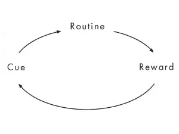
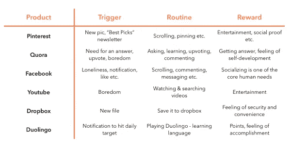
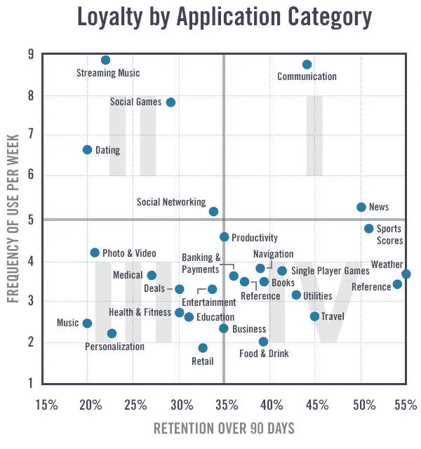
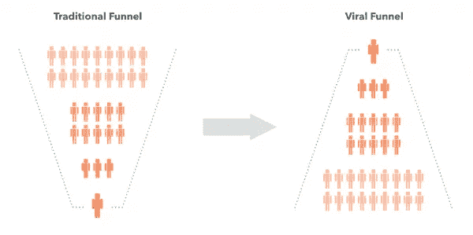
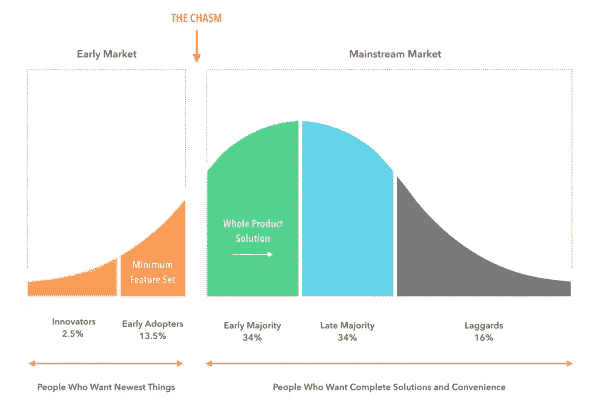

# 高成长性创业公司的 3 个关键特征

> 原文：<https://medium.com/swlh/3-crucial-features-of-high-growth-startups-2d791bbcb577>

Originally published on [http://www.appsterhq.com](http://www.appsterhq.com/?utm_source=CP&utm_medium=Medium)

每年都有无数的创业公司诞生，雄心勃勃的创始人希望创造下一个 Instagram、优步或脸书。

但事实仍然是，只有极小比例的初创公司实现了成为十亿美元公司所需的增长。

那么他们是怎么做到的呢？

在这篇文章中，我将讨论高速成长的初创公司共有的 3 个关键特征。

过去二十年里，任何获得巨大成功的创业公司都不是建立在真正革命性的想法之上，也不是先于他人进入市场的结果。

[正如我最近提到的](http://www.appsterhq.com/blog/4-startup-myths-entrepreneurs-success):

> “在脸书诞生之前，Myspace 和 Friendster 就已经成立，并拥有许多活跃用户；早在 Groupon 出现的十年前，就有各种各样的团购网站在运营；在特斯拉取得主导地位之前，美国道路上就有电动汽车了。”

类似地，谷歌是在 Altavista 和雅虎已经上线运营之后出现的，Dropbox 是在云存储初创公司可以说已经成为陈词滥调的时候成立的。

幸运的是，对于科技领域的许多人来说，执行不再是一个新名词。

R 创业界的 Dropboxes、Facebooks、Googles、Groupons 和 Teslas 不同于其他 90%最终因承诺执行而失败的新公司。

天使投资人马丁·双立人[用以下方式描述了](https://www.entrepreneur.com/article/271086)执行的意义和重要性:

> *“每一家初创公司都始于一个想法，但从那时起，一切都与执行有关。创始人很快了解到* ***客户只为解决方案而不是创意花钱*** *。投资者还学会了不要投资创意，而要投资能够提供解决方案的企业家和团队。成功需要将你的热情从想法迅速转移到业务实施上。* ***良好的执行力需要计划和合适的人，结合起来才能创造卓越的运营和卓越的客户价值。在这方面做得最好的公司会成为市场领导者。***

*高成长性创业公司是快速有效地扩大经营规模的新公司。*

*“经典”的例子是脸书、谷歌、推特和优步，最近的例子包括 Slack、Cloudfare 或 Intercom。*

*至关重要的是，大多数高增长的初创公司知道如何以 3 种极其重要的方式执行:*

1.  *他们掌握*客户维系能力*；*
2.  *他们专注于*病毒式营销*；和*
3.  *他们确切地知道*他们应该向谁*推销他们产品的第一次迭代(也就是说，他们知道何时“跨越鸿沟”)。*

*让我们更详细地考虑这三个要素。*

# *1.高速成长的初创企业掌握客户维系能力*

**

*科技初创公司在竞争激烈的环境中运营。*

*举个例子，考虑移动应用。*

*对智能手机使用的研究表明:*

*   *用户将近 [85%的使用时间](https://techcrunch.com/2015/06/22/consumers-spend-85-of-time-on-smartphones-in-apps-but-only-5-apps-see-heavy-use/)奉献给不超过 5 个应用(应用因人而异)；和*
*   *几乎五分之四的用户[在首次安装应用程序 72 小时后](http://www.androidauthority.com/77-percent-users-dont-use-an-app-after-three-days-678107/)再也不会使用它。*

*尽管目前在谷歌的 Play Store 和苹果的 App Store 上分别有 280 万和 220 万[应用可供下载](https://www.statista.com/statistics/276623/number-of-apps-available-in-leading-app-stores/)，但这些基本数据依然存在。*

*是什么将数量相对较少的“常用”应用程序(如脸书、Twitter 和 Instagram)与数量巨大的“下载安装、删除并忘记”应用程序区分开来？*

*这并不奇怪:*

> ***超成功的创业公司创造的产品最终成为新习惯的焦点。***

*如果你想一想现代社会中被大量采用的各种产品——从信用卡、牙刷、电视到汽车、电脑和 MP3 播放器——那么你会意识到它们实际上并不被普遍认为是产品。*

*相反，它们只是我们日常生活和常规行为的一部分。*

**

*创造客户离不开的产品是高增长创业公司长期留住客户的基本要素之一。*

*让我们先简单讨论一下习惯是如何起作用的，然后再来看看一些成功公司的重要例子，它们的成长都归功于它们的习惯养成产品。*

*《习惯的力量》一书的作者查尔斯·杜希格[认为](http://charlesduhigg.com/how-habits-work/)“一个简单的神经回路存在于每个习惯的核心，这个回路由三部分组成:线索、常规和奖励”。*

**

*([image source](http://thepowerofhabit.com/wp-content/uploads/2011/11/Slide11.jpg))*

*杜希格是这样描述这三个关键方面的:*

> *“有一个提示，就像是行为开始展开的触发器。一个惯例，也就是习惯本身，也就是行为，当你养成一个习惯时，你自动做的事情。最后，会有奖励。回报就是我们的神经学学会如何为未来编码这种模式。”*

*为了养成习惯，这三个要素都必须具备。*

*黑兹尔·盖尔[对杜希格的描述进行了扩展](https://thecoffeelicious.com/habit-loops-the-mechanics-of-behaviour-programming-d3c9ba657bba)，指出了以下几点:*

> *线索是引发习惯行为的东西。它可能是一种负面情绪，如孤独、无聊或压力。或者，可能是某个特定的情况，一群朋友，一天中的某个时间，等等。*
> 
> **例行公事就是习惯本身:咬指甲、抽烟，或者走到冰箱前吃一大块奶酪……**
> 
> *奖励可以是任何令人愉快的事情。它可能像尼古丁或糖对身体的刺激一样明显……它可能与一种接受感、归属感或成就感有关；或者这只是一个离开办公桌的借口。”*

*从移动应用的角度思考这些动态，我们可以看到:*

*   *“赞”、“转发”、“心”、评论和所有其他形式的公开认可(即，社会赞赏的表示)起到了*奖励*的作用，让我们的大脑认识到参与某些行动带来的积极结果。*
*   *我们越是注意到在做特定的事情(例如，分享脸书的状态更新)和获得特定奖励(例如，用积极的评论重新分享那个状态)之间形成联系，我们就越是开始期待，即**渴望那个奖励**。*
*   *外部事件——如电子邮件简讯和社交媒体通知——和内部动态——如看到朋友在脸书上发布他们周末有趣活动的状态更新后感到孤独——起到 ***触发*(即线索)**的作用，鼓励我们的大脑进入“自动驾驶”模式并做出反应。*
*   *听到智能手机发出的噪音表明你在 Instagram 上“自动”收到了一条 DM，会让你拿起手机阅读这条消息。为什么？因为你的大脑在期待**自我感觉良好的奖励(“多巴胺点滴”)**在你满足了想知道谁给你发了信息以及为什么发的渴望之后到来。*

*下面的图表突出了当今几个最成功的高增长创业公司，以显示他们确实依靠创造习惯形成产品来留住他们的客户:*

**

*拥有习惯形成产品的初创企业享有的优势之一是一种自我生成的增长循环，在这种循环中，客户使用他们的产品越多，这些客户永久放弃他们产品的可能性就越小。*

*T 他的现象被称为“[沉没成本陷阱](http://www.investopedia.com/terms/s/sunk-cost-trap.asp)”，我们投入的资源越多，就越容易坚持(或完成)某个系统、任务或行为。*

*沉没成本陷阱通常有负面的含义。*

*例如，它解释了为什么一家公司可能会继续将资金投入到明显表现不佳的投资中:“我们现在已经投资了 350 万美元！放弃这个项目没有任何意义！我们能修好它！”。*

*当谈到高增长的初创公司和成功的客户保留时，通常更多的是用户在使用特定产品上投入的时间和其他资源，而不是感觉“被迫”继续做一些事情，即使它非常不令人满意:*

*   *比方说，如果你已经花了两年时间来建立你的 Instagram 档案和粉丝，你就不太可能放弃 Instagram 并加入竞争对手的手机摄影应用。*
*   *如果你只使用了 Dropbox 几天，而不是过去的 10 个月，你更有可能放弃 Dropbox，去加入一个与之竞争的在线文件存储服务。为了实现这一转变，在你的所有设备上移动、重新组织和重新共享你在 Dropbox 上存储了近一年的所有文件简直太麻烦了。*
*   *你在脸书上积累的朋友越多，你就越不可能关闭你的个人资料。不管脸书变得有多“烦人”，用几个月或几年的时间建立一个社交网络可能是一项让你继续使用该网站的强大投资。*

*下图比较了各种应用类别的 90 天保留率和每周使用频率，从中可以看出像脸书这样的大规模高增长初创公司获得 2000 亿美元估值的可能性。*

**

*现在让我们来看看高增长创业公司的第二个重要特征:*

# *2.高速增长的创业公司专注于病毒式营销来发展客户*

**

*对于理解企业如何制定招募客户策略至关重要的一个概念是**客户获取成本(CAC)** 。*

*在 Kissmetrics 博客上，[的 Chase Hughes 对这个概念做了简单明了的解释:](https://blog.kissmetrics.com/customer-acquisition-cost/)*

> **“CAC 是说服潜在客户购买产品或服务的成本。你的 CAC 可以通过简单地将获得更多客户所花费的所有成本(营销费用)除以在花费这些钱的期间所获得的客户数量来计算。例如，如果你的公司在一年内花了 100 美元进行营销，并在同年获得了 100 个客户，那么你的 CAC 就是 1.00 美元。”**

*对于创业公司来说，高 CAC 往往是致命的。*

*一般的在线公司，如电子商务商店，可能需要支付 200 美元甚至 300 美元以上，才能通过传统的营销和广告获得一个新客户。*

*从这个角度来看，试着想象一下 Dropbox 和 Instagram 各自支付 400 亿至 600 亿美元，以积累 2 亿用户群。*

*有些事情听起来令人震惊，但却是真实的:一些发展最快的技术、网络和移动创业公司在直接营销和旨在获得新客户的广告努力上花费很少的钱。*

*怎么会这样呢？*

*拥有数千万(如果不是数亿)用户的公司如何获得如此庞大的客户群，而无需支付数亿美元来招募他们？*

*这一切都归结于一个事实:高速增长的初创公司使用病毒式营销策略来扩大他们的用户群。*

**

*思考病毒式增长的一种方式是将其与传统的“营销漏斗”进行对比。*

*传统的营销漏斗将公司描绘成支付大量的钱，以将流量导向他们的产品，努力将一小部分流量转化为活跃的付费客户。*

***病毒漏斗**与传统漏斗相反:不是大量潜在客户产生少量实际客户，**少量实际客户有助于带来成倍增加的客户**。*

*换句话说，每个新用户引入一个或多个新用户，然后这些新用户自己引入一个或多个新用户，以此类推:*

**

*病毒式营销基于产品的使用(例如，新的 Instagram 用户自然会推荐他的朋友试用该应用程序)，有时也基于推荐系统的实施(例如， [Lyft 用户](https://help.lyft.com/hc/en-us/articles/214216977-Refer-New-Passengers-and-Get-Rewarded)传播推荐代码，允许她和将代码应用于每笔现金的人免费乘车)。*

*以下是一些著名的例子:*

*   ***团购网站 Groupon** 在经济危机期间为吸引人的交易[提供了巨大的优惠](http://www.investopedia.com/articles/investing/011316/can-groupon-make-comeback-2016.asp):因为这种交易只有在一定数量的买家加入的情况下才会被激活。现有用户邀请他们的朋友加入网站，Groupon 的用户群因此扩大。*
*   *当文件存储和共享网站 Dropbox 首次推出时，它向所有推荐用户提供免费存储空间。这种刺激如此强烈，以至于该公司在运营的前 7 个月就获得了 100 万用户。*
*   ***脸书是首批利用电子邮件邀请的网络创业公司之一**，允许新用户方便快捷地邀请他们所有的电子邮件联系人加入该网站。*
*   *Airbnb 通过使用一个允许 Airbnb 新用户与其他人分享其房源的机器人来“入侵”Craigslist，从而创造了一个吸引其他人的网络效应。*
*   ***Instagram 实现了一个** [**交叉发布**](https://help.instagram.com/365696916849749) **功能**，允许用户自动与他们的脸书和推特好友分享他们的照片；这个功能鼓励其他社交网站的人注册 Instagram。*
*   *优步的双向推荐代码系统非常成功，大约 50%的新优步客户是通过推荐获得的。*

*这里要遵循的关键指标是[病毒系数](https://www.geckoboard.com/learn/kpi-examples/marketing-kpis/viral-coefficient/#.WWVjJHfMyRs)。*

*病毒系数代表每个现有用户为公司带来的新用户数量。*

*例如，1.5 的病毒系数意味着，平均而言:*

*   *100 个用户指另外 150 个用户，*
*   *这 150 个用户会带来 225 个以上的用户，以此类推。*

*重要的是，如果你的创业公司能够保持 1.0 以上的病毒系数，那么你就不需要任何实质性的营销预算来保持增长。*

# *3.高增长的创业公司确切地知道谁是他们的早期采纳者*

**

*Airbnb 的联合创始人布莱恩·切斯基曾经告诉 Y Combinator 的观众:*

> **“拥有 100 个爱你的人，好过找到 100 万个有点喜欢你的人。一次只为一个人发展你的事业。只关注 100 个人。如果他们爱你，他们会为你推销产品，并告诉其他人。去找你的用户。做一件可扩展的事情，一次一个人。其实就这么简单。”**

*切斯基的话指向了一个重要的事实:*

***所有成功的创业公司都有一种被证明的能力，那就是确定他们应该向哪些人推销他们产品的早期版本**。*

*正如我们过去在 Appster 上讨论过的[,构建一个成功的产品，实现稳固的产品市场匹配，其中一个必不可少的阶段是创建一个](http://www.appsterhq.com/?utm_source=CP&utm_medium=Medium)[最小可行产品](http://www.appsterhq.com/blog/mvp-app) (MVP)。*

*有效地开发、测试和改进您的 MVP 的一部分包括理解人们如何接受新技术的两个关键因素:*

1.  *Everett Rogers 的[颠覆性技术理论](https://ondigitalmarketing.com/learn/odm/foundations/5-customer-segments-technology-adoption/)，该理论指出*不同类型的人以不同的程度和速度采用革命性技术*；和*
2.  *杰弗里·摩尔的理论在[跨越鸿沟](https://www.amazon.com/Crossing-Chasm-3rd-Disruptive-Mainstream/dp/0062292986/)中概述，当代创业公司必须专注于有效地控制*早期采用者市场*——修复漏洞，回应客户问题，赢得用户的心，并逐步建立品牌声誉——然后试图通过在主流市场寻求成功来“跨越鸿沟”。*

*鸿沟是将创新者和早期采用者与主流客户区分开来的关键空间:*

**

*[在最近的一篇文章](http://www.appsterhq.com/blog/realities-21st-century-start-ups)中，我相当广泛地谈到了初创公司在推出产品时需要考虑不同市场领域之间的关键差异:*

> **“成功的初创公司往往不会向主流消费者营销，因为这些消费者通常不信任新技术:他们寻求安全、保障和品牌声誉，而大多数初创公司都是漏洞百出、不为人知、相对未经证实的，至少在初创时期是如此。**
> 
> **主流客户关心两件事，即品牌和安全。**
> 
> *他们通常不会购买新东西，除非其他人已经在使用(并推荐)它们。*
> 
> **另一方面，早期采用者不在乎你的公司/品牌是否闻所未闻、有待证实，或者是否存在与推广新产品相关的风险。**
> 
> **他们实际上是被你的企业所吸引，因为你的企业具有这些新奇和激进的特质。**

*如果你看看过去 20 年的顶级创业公司，你会发现它们都是从占领一小部分市场开始，然后试图占领主流市场:*

*   *在走出教育领域、面向更广泛的社会之前，脸书在常青藤联盟大学中占据主导地位。*
*   *易贝的顾客是第一批使用 PayPal 的人，PayPal 在进入其他领域之前完全统治了这个市场。*
*   *回到苹果后，史蒂夫·乔布斯终止了公司的许多产品，并选择专注于创造创新型人才(音乐家、设计师、摄影师、技术极客等)喜欢的电脑。).*
*   *Snapchat 开始追求并主导青少年市场。*
*   *在转向主流之前，Instagram 聚焦于潮人、美食家和其他独特的艺术类型。*

*这些公司(和许多其他像他们一样的高增长初创公司)所做的是在*时成功执行*跨越从早期采用者细分市场到主流人群的鸿沟。*

*要成为真正的颠覆性产品，新产品必须首先主导早期采用者市场。早期采用者对新奇事物持开放态度，如果出现产品缺陷也相对宽容。*

*一旦产品在早期采用者中获得成功，其背后的公司就可以通过成功瞄准主流用户来利用这种急需的验证。*

*当主流消费者知道他们不是被强加一些潜在不可靠的小玩意的“小白鼠”时，他们可能会更容易接受一种产品。*

*首先占领早期采用者市场，在不致命损害你的声誉的情况下修复你的漏洞，并建立你的品牌名称——这些是说服主流客户尝试你的产品的关键步骤。*

> *最初发表于[http://www.appsterhq.com/](http://www.appsterhq.com/?utm_source=CP&utm_medium=Medium)*

******