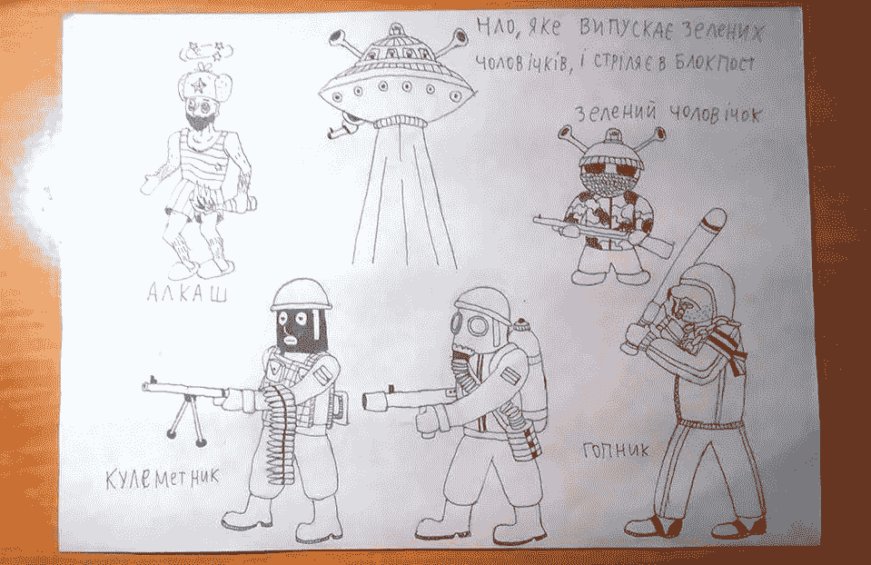
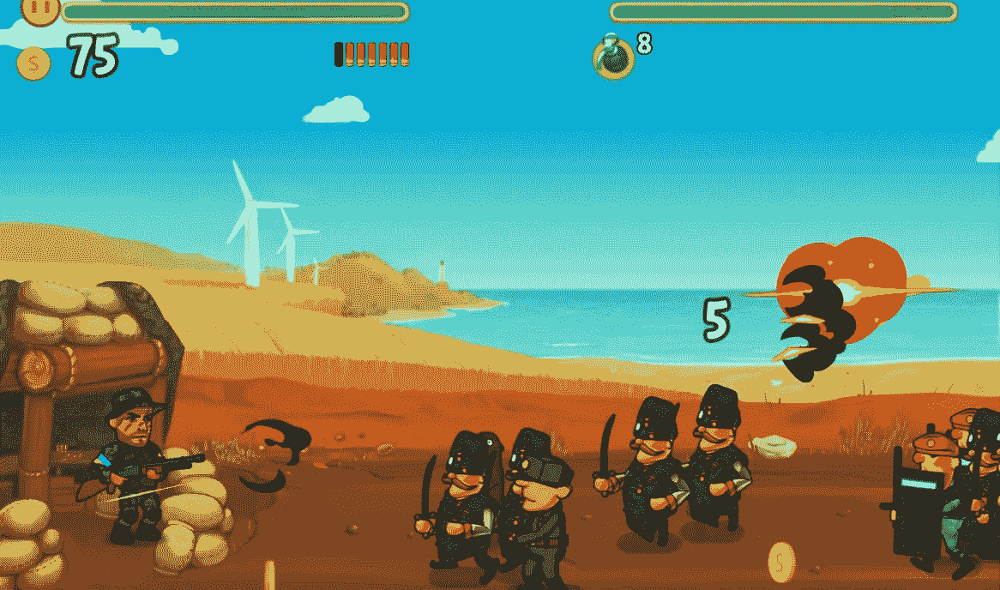
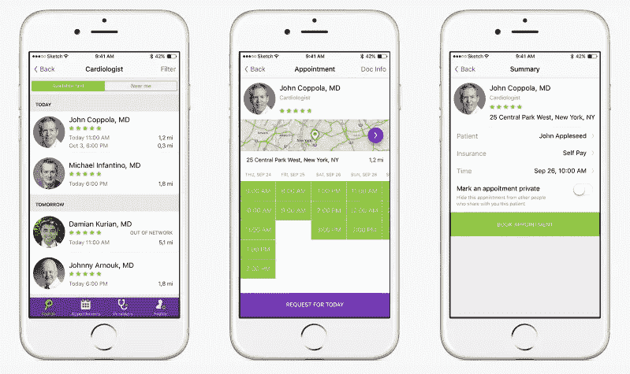

# 想法验证的 3 个关键步骤

> 原文：<https://medium.com/swlh/3-crucial-steps-of-idea-validation-ddecd116423a>

开创自己的事业，这是前所未有的好时机。历史上从未有过如此多的自由和支持。从来没有如此多的新领域等待着你去开创……哎呀……统计数据令人警醒: [90 %的创业公司都失败了。](https://failory.com/blog/startup-failure-rate)为什么？

我们的答案是:许多美好的想法从来没有变成基础良好的业务，因为他们没有从一开始就彻底检查。你确实需要遵循基本面投资之前的一系列步骤。

简而言之，当谈到 IT 产品开发时，这一系列包括概念验证—构建产品原型— MVP 发布和测试—以及最终的全面产品开发。在我们的文章中，我们已经讨论了[什么是 MVP(最小可行产品)](https://stfalcon.com/en/blog/post/why-your-startup-needs-mvp)和[如何衡量其成功](https://stfalcon.com/en/blog/post/measuring-mobile-mvp-success)。这一次，让我们更加关注 MVP 之前的步骤。

# 为什么要验证一个商业想法？

你的愿景可能是辉煌的，但如果没有牵引力，在成千上万的其他辉煌愿景中赢得一席之地是不可能的。你还需要有吸引力的证据来说服投资者。这是可以理解的:投资者知道，围绕需求建立业务，比在现有产品上创造需求要容易得多。

确认有助于你脱离这个想法，冷静地看待它。通过利用来自目标受众代表和领域专家的客观反馈，您可以达到这种状态。

# 从概念证明开始验证你的创业想法

一定要把你的创业想法放在一边，转向你的目标受众和他们的体验。你需要的是深入了解你的潜在客户是否真的认为你的产品有吸引力和必要。

从分析你的产品将要解决的问题开始可行性研究。现在大家都是怎么解决的？谁是你的主要竞争对手？你的解决方案如何变得更好？它与现有的选项有何不同？

你的假设现在更接近现实了。但它们仍然是假设。你需要向你的目标受众进行宣传，以检验他们。有几十种企业家用来收集用户反馈的工具。它们包括广泛的市场调查、采访、电子表格、电子邮件分发、创建登录页面等。

我们利用一个脸书社区来获得对我们的手机游戏“[最后的前哨站](https://last-outpost.stfalcon.com/index_en.html)”的反馈。开发初期，邀请玩家参与图形设计。我们得到了积极的回应，一些用户甚至把他们的草图发给了我们。这在使游戏吸引玩家和传播方面帮助很大。

这个例子还说明了另一件事:在这个阶段，你实际上已经开始建立你的商业身份，并形成一种产品认知。这有助于找到产品与市场的契合点:如果人们之前已经听说过某种新事物，他们会更愿意尝试。你吸引了创新者和早期采用者——最忠诚和最活跃的客户，他们经常充当意见领袖，并会宣传你的产品(顺便说一下，是免费的)。

当你确定你的想法是可行的，就开始考虑它的具体实现，也就是你的商业想法要怎么运作。

# 当你需要产品原型时

原型是最终产品的最简单的工作交互模型。它将设计和功能传达给未来的客户、投资者或利益相关者。原型的主要功能是将你的想法可视化。但它也允许在实践中检验你的理论。

在测试原型时，您可能会遇到有用功能的新想法，或者提前确定问题区域。在项目生命周期的初始阶段修复错误或进行修改要便宜得多。

例如，在开发一款 [IsDocIn](https://isdocin.com/front/) 医疗应用的原型时，我们的设计师考虑了来自客户和后端开发人员的信息，前者拥有医疗专业知识，后者为创建用户友好的界面提供建议。然后，进行用户测试。它揭示了用户在处理应用程序时面临的问题。在这个阶段，我们毫无痛苦地引入了必要的更改，app 设计顺利进行。

通过适当的原型测试，你可以开始开发一个 MVP，也就是说，一个推向市场的完整产品的最小形式。

# 最后，MVP

当原型在开发的开始阶段纠正问题时，MVP 被设计成当产品在现实生活中被实际测试时识别用户的反应。

由于 MVP 实际上是一个真实的产品，所以强烈建议将其开发委托给专业团队。原因就在于我们已经提到的竞争:全球每月都有数百款应用和服务推出。这确实会影响顾客的态度。人们不会给你豁免，因为你只是在努力。他们会简单地转向你的竞争对手的解决方案。所以，一定要认真对待一个 MVP:它不是你产品的一个蹩脚版本，它是一个设计完整的工作产品，但是功能有限。

# 摘要

我们已经分析了验证产品商业理念的三个主要步骤。它们是:

*   概念证明，
*   原型开发，
*   MVP 构建和测试。

通过采取这些步骤，你可以快速、低成本地检查你的想法是否有市场潜力。创意验证可以避免错误，消除有缺陷的功能，增加产品成功的机会。我们建议连续使用这些步骤，尽管它们中的每一个都可以作为单独的技术。我们 Stfalcon.com 很乐意在产品开发的各个阶段与您合作。

*最初发表于*[*【stfalcon.com】*](https://stfalcon.com/en/blog/post/startup-idea-validation)*。*

## 这篇文章发表在 [The Startup](https://medium.com/swlh) 上，这是 Medium 最大的创业刊物，有 340，876 人关注。

## 在这里订阅接收[我们的头条新闻](http://growthsupply.com/the-startup-newsletter/)。

