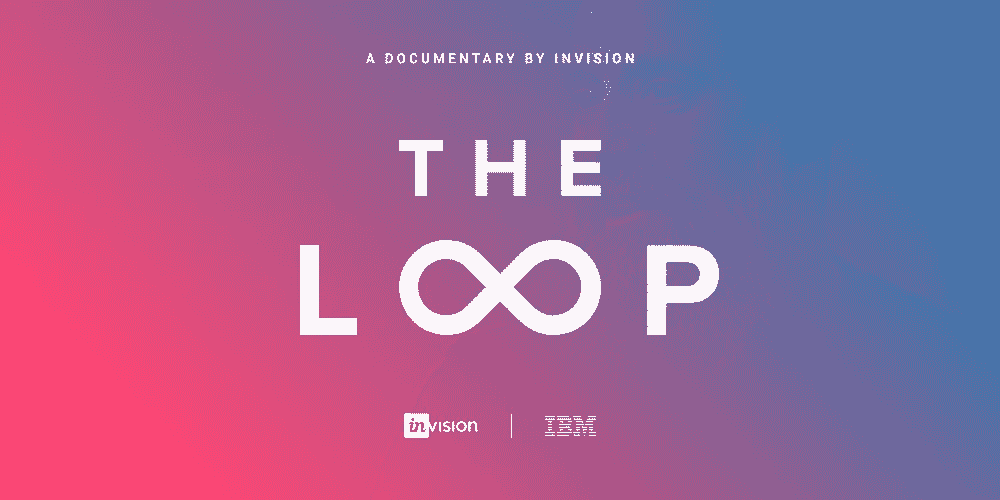
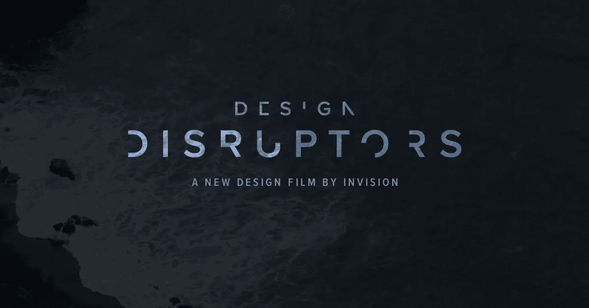

# 每个设计师必看的 3 部纪录片

> 原文：<https://medium.com/swlh/3-documentary-every-designer-must-watch-bab3b36d4109>

# **循环**

InVision 展示了“循环”，这是 IBM 通过设计思维进行变革的故事。

Invision

Trailer

https://www.invisionapp.com/enterprise/ibm-design-thinking

# 设计破坏者

《设计颠覆者》以前所未有的视角揭示了这些公司的设计方法，以及他们如何通过设计超越数十亿美元的产业。

Invision

Trailer

【https://www.designdisruptors.com/get-film 

# 设计是未来

这部电影是巴塞罗那设计周期间于 6 月 6 日至 8 日在巴塞罗那迪赛尼中心举行的最后一届“设计是未来大会”的成果。它展示了参加 2016 未来设计的 15 位演讲者以及本次活动的主持人和策展人的主要亮点和强有力的想法。

## 这篇文章发表在 [The Startup](https://medium.com/swlh) 上，这是 Medium 最大的创业刊物，有 303，461+人关注。

## 订阅接收[我们的头条新闻](http://growthsupply.com/the-startup-newsletter/)。

