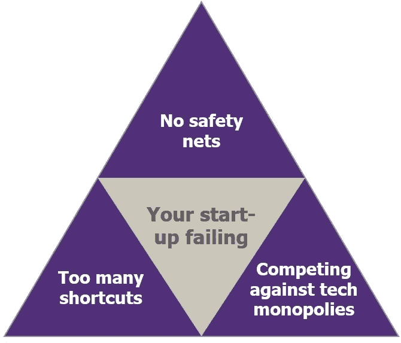

# 我会在创业课上教授的 3 个生活事实

> 原文：<https://medium.com/swlh/3-facts-of-life-id-teach-in-entrepreneurship-class-aad0e43cc600>

## 我们在商学院教授企业家精神的方式很糟糕

我花了很多年谈论或参与创业。六年前，我在英国创办了一家时装公司，那场无所不包的垃圾箱大火构成了我今天所知道的营销、电子商务、品牌以及没人会买的大部分知识…