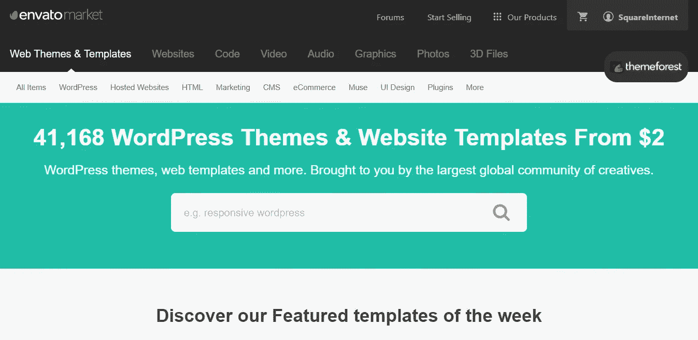

# 3.如何建立自己的网站——30 天的媒介

> 原文：<https://medium.com/swlh/3-how-to-build-your-own-website-30-days-of-medium-587f994672ec>

30 Days of Medium

这是我 30 天中级挑战的第三天。

如果你错过了第一个条目，这里是:

## [0。30 天的培养基](/swlh/30-days-of-medium-c7ab34953c6c)

## [1。建立自己的网站需要什么？— 30 天中等](/swlh/1-what-do-you-need-to-build-your-own-website-30-days-of-medium-1ed1ad4e505c)

## [2。如何找到自己热爱的事业— 30 天的媒介](/swlh/2-how-to-find-a-business-you-love-30-days-of-medium-cb7a4a702d1b)

## [3。如何建立自己的网站— 30 天的媒介](/swlh/3-how-to-build-your-own-website-30-days-of-medium-587f994672ec)

## [4。如何衡量你网站的表现——30 天媒体](/swlh/4-how-to-measure-your-websites-performance-30-days-of-medium-75e650969695)

## [5。如何通过回答他们的问题获得更多的客户-30 天的媒介](/swlh/5-how-to-get-more-customers-by-answering-their-questions-30-days-of-medium-b462d237533e)

## [6。成功的商业网站备忘单——媒体 30 天](/swlh/6-the-successful-business-website-cheat-sheet-30-days-of-medium-42f89eb43e67)

## [7。如何衡量成功——30 天中期](/swlh/7-how-to-measure-success-30-days-of-medium-3da43f4b4a44)

## [8。了解在线销售漏斗— 30 天媒介](/swlh/8-understanding-the-online-sales-funnel-30-days-of-medium-a8a6e96ddde4)

## 9。什么是流量，为什么流量很重要？— 30 天中等

## 10。什么是 Google URL Builder，为什么要使用它？— 30 天的培养基

## 11。通过自动化你的社交媒体日程，让你的流量翻倍——30 天的媒体

## 12。如何辨别什么好卖——30 天介质

## 13。我如何在 6，500% — 30 天的培养基中培养我的培养基

## [14。你如何看待事情很重要——30 天中期](/swlh/14-how-you-look-at-things-matters-30-days-of-medium-f641b9733b90)

## 15。如何向小型企业销售服务— 30 天介质

## [16。如何通过有效的提案赢得更多交易— 30 天的媒介](/swlh/16-how-to-win-more-deals-with-effective-proposals-30-days-of-medium-481f16bbc86f)

## [17。如何在 10 分钟内建立一个网上商店——30 天的媒介](/swlh/17-how-to-setup-an-online-store-in-10-minutes-30-days-of-medium-a4f955e9b493)

## 18。如何在任何地方工作— 30 天的媒介

## [19。为什么你的网站会破坏你的销售——30 天媒体](/swlh/19-is-your-website-sabotaging-your-sales-30-days-of-medium-f63bdbdb350)

## [20。你的流量从哪里来？— 30 天中值](/swlh/20-where-does-your-traffic-come-from-30-days-of-medium-a9b2d2c088bb)

## [21。如何真正识别倦怠——30 天中等强度](/swlh/21-how-to-actually-recognise-burnout-30-days-of-medium-7972a7a7a89e)

## [22。如何修改你的时间表并完成两倍的工作——30 天中等时间](/swlh/how-to-hack-your-schedule-and-get-twice-as-much-done-30-days-of-medium-441a509dc9be)

## [23。不要模仿你的竞争对手——30 天的媒介](/swlh/23-dont-copy-your-competitors-30-days-of-medium-56382b7ba8ed)

## [24。如何 SEO 优化一篇博文——30 天的媒介](/swlh/24-how-to-seo-optimise-a-blog-post-30-days-of-medium-80180eba4e8b)

## 25。独一无二或者被遗忘——30 天灵媒

## 26。跟着感觉走——30 天中等水平

## 27。人们不支付平均 30 天的中等费用

## 28。如何做关键词研究— 30 天介质

## 29。为什么帕累托原则是世界上最大的诀窍——30 天中期

## 三十。你的内容比你的电话更有利可图——30 天的媒介

# 购买主题

我帮助**建立、发展和扩大基于 WordPress 的业务**，所以这些帖子假设你正在 WordPress 上建立你的网站(为什么不呢，这是最好的！).

首先，你需要购买一个 **WordPress 主题。**

你可以在这里从[主题森林](https://themeforest.net/?ref=SquareInternet)得到一个主题。

Themeforest

# 安装您的主题

要安装你的主题，确保你有**可安装的 WordPress 文件。**

最常见的安装主题错误发生在人们上传错误的 zip 文件时。你需要确保你只下载可安装的 WordPress 文件。

Installable WordPress file

# 设置您的核心页面

一个小的商业网站不需要太多的东西就可以运营。

你需要一个**主页，关于我们，产品或服务页面，博客和联系页面**。

其他的一切都可以随你所愿。这些是告诉访问者你是谁、你做什么和你如何做的基本知识。

# 决定一些字体

你使用的字体决定了你的整个网站的外观。

无衬线字体更加友好。

**衬线**字体更专业。

决定你想要描绘什么样的外观和感觉，以匹配你的品牌，然后前往 [**谷歌字体**](https://fonts.google.com/) 为自己挑选一种字体。

我建议你坚持使用一种字体，尤其是当你的网站开始时会很小。您可以将该字体的**粗体**用于**标题**，将**浅色**用于副标题或引用。

# 为你的网站选择一个配色方案

根据你的标志选择**配色方案。**

一个小网站的品牌基本上是他们的标志，并确保一切都与标志中使用的设计、字体和颜色一致。

你可以使用**不同深浅的一种颜色**，或者**对比色**。

你也可以使用**浅灰色**作为你网站上一些页面的中性背景色，那里可能有很多内容。

我实际上录制了一个关于如何为你的网站选择配色方案的视频，如果你需要更多的帮助，欢迎查看下面的视频。

How to pick a website colour scheme

# 上传您的徽标

你可以通过**外观>定制器**在大多数 WordPress 主题上上传你的 logo

如果你的 logo 文件很大，可能值得使用类似于 [Tiny PNG](https://tinypng.com/) 的东西来得到一个精简的版本，这样你的页面就不会加载缓慢。

# 设置您的主页和博客页面

在 WordPress 上，你需要设置哪个页面作为你网站的**主页**。

默认情况下，它会显示你的**帖子**。

导航到**设置>外观**，你会看到两个下拉菜单，在那里你可以选择哪个页面是你的主页，哪个是你的帖子页面。

Set Home and Posts

# 继续建筑

一旦你建立了网站的核心，建立**谷歌分析**并开始衡量你的进展。

继续**根据你的营销目标和它在谷歌分析中的表现，建立、改进和扩展**你的网站。

Install Google Analytics on WordPress

你不会在一夜之间甚至在第一次迭代中就构建出**完美的网站，所以如果你第一次没有做好**也不要灰心丧气。

我花了 **4 次迭代**才得到一个我满意的网站，而且我每天都在改进和发展我们的网站。

# 如何建立网站——终极指南

如果你觉得这篇文章很有用，但想更详细地了解如何建立自己的网站，可以看看我的终极指南。

[查看指南](https://www.squareinternet.co/how-to-build-a-website-ultimate-guide/)

How To Build A Website — The Ultimate Guide

## 你可能也喜欢这个:

## [为什么 WordPress 是在](/swlh/why-wordpress-is-the-best-platform-to-build-your-business-or-startup-website-on-df3fe932fad7)建立商业或创业网站的最佳平台

## 如果你喜欢这个故事，请点击👏按钮并分享，帮助其他人找到它！欢迎在下方留言评论。

## 这个故事发表在 [The Startup](https://medium.com/swlh) 上，这是 Medium 最大的创业刊物，拥有 316，638+人关注。

## 在这里订阅接收[我们的头条新闻](http://growthsupply.com/the-startup-newsletter/)。

