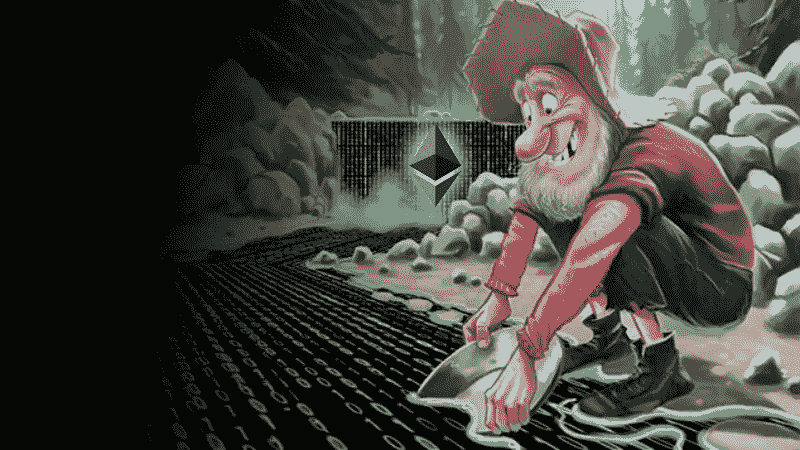
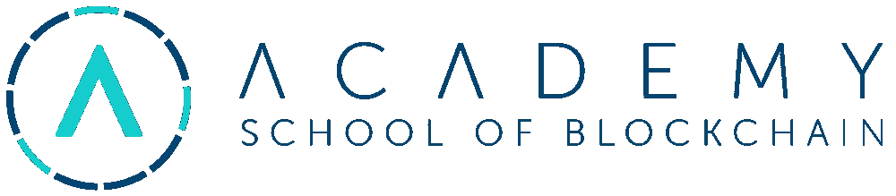
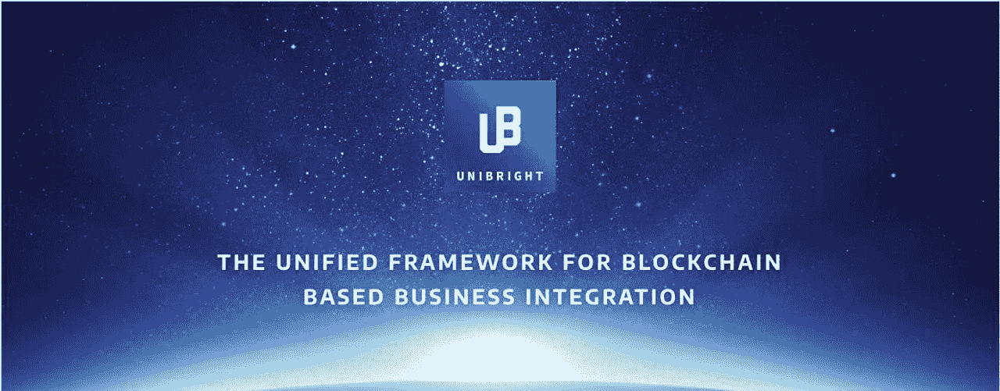
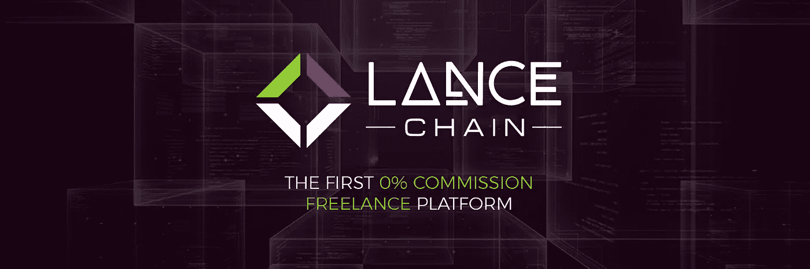

# 熊市中值得寻找的 3 个 ico

> 原文：<https://medium.com/swlh/3-icos-worth-seeking-during-the-bear-market-1535bce7bf3c>

随着牛市热潮似乎已经过去，日内交易或盲目向每个 ICO 投资都不太可能产生积极的结果。是时候坚持基础扎实的项目了。以下是我对熊市的最佳 ICO 选择。

# T op 即将发布 ICOs:

# 1.[学院令牌](http://acadtoken.com) (ACAD)

[**Academy**](http://acadtoken.com) 是一个美国项目，它解决了一个紧迫的问题，并提供了一些**最好的经济学表征**。这也是你可以选择用法定货币买入的极少数 ico 之一。

2016 年，仅通过 ico 筹集了 1.06 亿美元；到 2017 年底，这一金额飙升至 37 亿美元，增幅高达 3000%。 [**年初以来募集的资金已经是 2017 年全年的两倍！随之而来的是，对区块链专家的需求已经增长到了这样的程度，目前每一个区块链开发者就有 14 个工作机会。**](https://www.investopedia.com/news/already-more-icos-2018-all-2017-63b/)

有几个问题使得使用传统方法解决危机的尝试不充分。第一个是区块链世界发展和变化的速度，这使得传统大学很难也不切实际地跟上它——他们根本无法不断更新他们的课程，并且将很难找到没有被区块链高薪吸引的合格教师。另一方面，未经认证的在线课程缺乏标准，产生了许多训练不足的开发人员，降低了雇主对此类证书的信心，从而加剧了这一问题。

学院是世界上第一所完全由美国认可的区块链学校。这种地位确保了他们认证的质量，因为他们的项目正在经历严格的学术审查过程。这也允许他们向传统大学提供课程和项目。他们拥有 **10 年的在线课程建设记录，最近收购了 SoftUni——东欧领先的 IT 教育提供商**，该公司赢得了众多奖项，包括**福布斯商业奖:最佳创业企业(2015)** 、创新促进人才发展:**年度创新企业(2016)** ，并通过为该地区蓬勃发展的 IT 行业提供训练有素的开发人员而闻名。

## ACAD 代币有什么好处？

**针对学生:**

*   优先于选择以菲亚特支付的学生的课程安排
*   降低课程费用
*   游戏化的学习激励
*   开发人员职位安排

**对于公司/政府/组织:**

*   员工再培训优先课程安排
*   优先获得训练有素的开发人员——争取进入前 30%的群体
*   通过咨询节点系统塑造课程的机会

**在学院使用代币支付时:**

## 70%令牌将被烧毁

*   价值的 15%将被存入一个专门的奖学金基金
*   价值的 15%将记入社区发展基金，该基金为孵化器加速器项目提供部分资金。

## 象征性销售

**令牌** — ACAD

**价格**——2.00 美元

**未售出的代币将被烧毁**

**平台** —以太坊

**接受** —瑞士联邦理工学院、BTC、BCH、LTC、**菲亚特(美元)**

**硬上限**——5000 万美元

> [在此报名](http://acadtoken.com)参加学院 ICO

# 2.尤尼布赖特 (UBT)

Unibright 将帮助大企业在区块链上市，同时提供非常低的硬上限(1350 万美元)和分配给众筹的高比例代币(67%)。

许多企业都希望将区块链解决方案整合到他们现有的服务中，但是由于缺乏专业知识以及合格和有经验的开发人员而受阻。Unibright 将提供一个框架，在底层技术的基础上建立一个抽象层，使企业和个人可以通过使用简单的模板轻松实现他们自己的解决方案，这些模板可以根据他们的特定需求进行定制。所有这些都使得企业使用区块链技术的风险更低，成本更低。

Unibright 框架建立在现有的基于云的集成平台上，该平台可与来自银行部门和生产行业的客户一起工作。

Unibright 背后的团队也在经营德国公司 [SPO Consulting GmbH](http://www.spo.de/) ，该公司已经为 Lufthansa、Shell、Samsung 和 Siemens 等大客户提供 SAP 相关软件解决方案**超过 20 年**。

优衣库自称与 Iconiqlab、Ambisafe 和微软有合作关系。

**UBT 令牌**将是为平台提供动力的实用令牌，也是使用任何 Unibright 服务的唯一可用支付选项，因此这可能是一个缓慢的燃烧器。

## 象征性销售

**令牌** — UBT

**价格**——0.14 美元

**硬上限**——1350 万美元**未售出的代币将被销毁**

**最低购买量** — 100 UBT

**平台** —以太坊

**接受** — BTC、瑞士联邦理工学院(以及其他通过 Shapeshift.io)

> 访问 [Unibright 网站](https://wallet.unibright.io/user/register/?ref=7B79P6XGDWR6)

# 3.长矛手 (LANC)

[**lance chain**](https://lancechain.com/r/5aa21847278c6)**将为自由职业者和雇主匹配 **0%的平台佣金**。它将采用免费增值的商业模式，并向代币持有者提供各种折扣和激励的分层订阅。**

**如今自由职业者市场上最大的问题之一是平台收取的高额费用。最著名的此类平台之一 UpWork 向自由职业者收取 500 美元以下项目高达 20%的佣金，超过 10000 美元的项目低至 5%；雇主也不能幸免——他们必须为平台上的每笔交易支付 2.75%的费用。**

## **Lancechain 优势**

*   **0%的佣金:LanceChain 不会向自由职业者或雇主收取任何佣金**
*   ****安全性**:资金将被存储在智能合同托管系统中，并防止欺诈性退款，因为所有支付都将使用 LANC 令牌进行。**
*   ****争议解决**:如有争议，公正独立的主题专家将拥有最终决定权。中小企业将是由 LANC 代币持有者选出的社区成员。为了鼓励代币持有者&SME 的积极参与，我们将公平分摊争议费用，这样双方都可以赚更多的钱。**
*   **人才审查: LANC 代币持有者可以通过参与评估自由职业者获得额外收入，由平台专家提供支持。经验丰富的人力资源团队&中小型企业将能够在整个过程中帮助寻找&雇佣经过证明的顶尖人才。**
*   ****时间跟踪工具:**自由职业者将需要每小时收费。工作时间将被跟踪和记录。**
*   **屏幕截图工具:雇主会随机截取自由职业者的屏幕截图，确保他们正在为项目工作。生成的屏幕截图还将有助于中小企业最终解决争议。**
*   ****任务管理系统**:确保项目要求被理解和遵循，进度被及时和充分地报告，质量是可接受的**

## **免费增值模式**

**核心平台功能将**向所有人免费开放**。用户可以选择为他们选择的增强功能付费，或者订阅更多的高级付费计划。分层计划的价格从每月**19.95 美元**到**99.95 美元**不等，代币金额超过某个阈值的 LANC 代币持有者可以享受**折扣或完全免费。( [*阅读白皮书*](https://www.lancechain.com/whitepaper) )****

> **如何保护自由职业者和企业主免受价格波动的影响？**
> 
> **为了确保价值，我们将致力于在 LanceChain 上提供可选的增值服务，这将允许固定交易的 LANC 价格。高级算法将在交易时发出相反的交易指令，以对冲加密资产价值的变化。LANC 价值变化可能产生的任何损失将由相反头寸的收益来补偿。一旦 LANC 被撤回，双方的头寸将被平仓，对冲成本将是双方之间的差价。这将为 LANC 售后市场提供额外的流动性。**

## **象征性销售**

****令牌** — LANC**

**价格在 1400 到 2000 LANC/升之间(取决于你何时购买)**

****平台** —以太坊**

****接受** — ETH**

****硬帽**—32000 ETH**

****未售出的代币将被烧毁****

> **访问 [LanceChain 网站](https://lancechain.com/r/5aa21847278c6)**

# ***荣誉奖***

# *** [FoxTrading](http://foxtrading.network) (FOXT)**

****

*   **外汇和加密交易信号和自动交易服务(**不是交易所！**)**
*   **来自福克斯二元信号 &背后经验丰富的**团队与**华帝 FX** 合作****
*   ****极低的硬上限**(500 万美元)**
*   **Fox Trading Token ( **FOXT** )将用于支付平台上的信号、机器人和指示器等服务**
*   **只有 **ICO 投资者才能从交易池**中获得基于初始投资和持有金额+终身自动交易服务的利润**
*   **API 到**连接服务到所有主要的交易所****
*   ****令牌刻录程序****

## **象征性销售**

****日期** —进行中**

****令牌** — FOXT**

****价格** — 1 ETH = 1440 FOXT ( **目前 20%加成**)**

****平台** —以太坊**

****接受** — ETH**

****硬上限**——500 万美元**

**未售出的代币将被烧毁**

> **[访问网站](http://foxtrading.network)**

## **感谢阅读和…请鼓掌！:)**

****

**我不是财务顾问，这也不是财务建议。**

****

## **这篇文章发表在 [The Startup](https://medium.com/swlh) 上，这是 Medium 最大的创业刊物，有 317，238+人关注。**

## **在这里订阅接收[我们的头条新闻](http://growthsupply.com/the-startup-newsletter/)。**

****