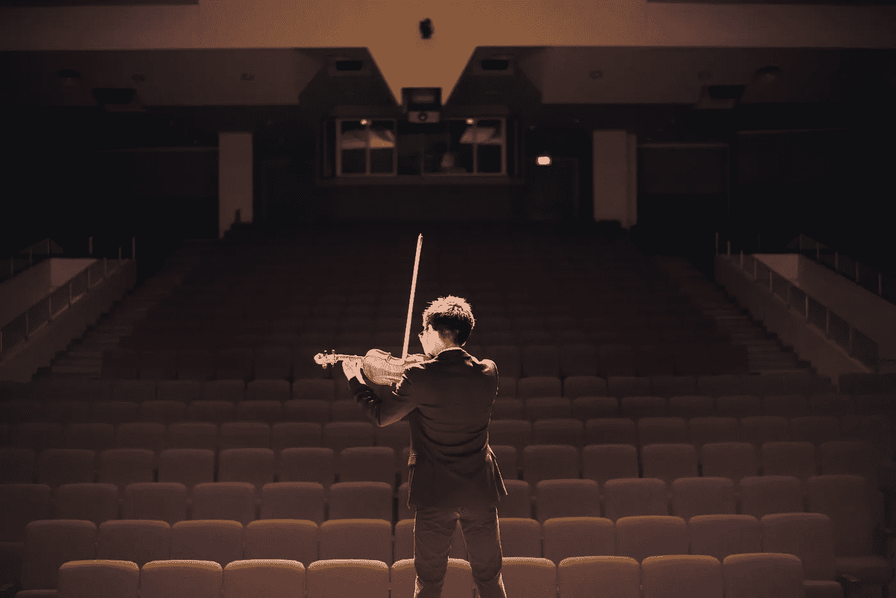

# 我们告诉自己需要学习的 3 个疯狂的谎言

> 原文：<https://medium.com/swlh/3-insane-lies-we-tell-ourselves-about-our-need-to-learn-758c0ce34e6d>

Photo by [chuttersnap](https://unsplash.com/photos/Kx4Mm3ZnZBc?utm_source=unsplash&utm_medium=referral&utm_content=creditCopyText) on [Unsplash](https://unsplash.com/?utm_source=unsplash&utm_medium=referral&utm_content=creditCopyText)

## 每个人都想成为大师。没人想当学生。

> “活着吧，就像你明天就会死去一样。要像永远活着一样去学习。”
> ***—圣雄甘地***

大多数人都渴望成功。他们希望成为某项手艺的大师，并享受成功的果实。

大多数人不明白做一名学生需要什么。一个*饥饿的*学生。如饥似渴地寻求答案和真理的学生。有目的。

我们大多数人认为我们的学校教育随着毕业而结束。

大多数人想要的是大师的成果，而不是学生的自由。

而大多数人并没有意识到，大师有一种学生没有的责任和负担。

事实是，做大师有挑战，做学生有喜悦和乐趣。

# 我们告诉自己的谎言

> “我们通过寻找问题的答案而没有找到答案，比我们从答案本身中学到的更多。”
> ***—劳埃德·亚历山大***

大多数人都有被称为学生的经历，无论是在小学、大学还是其他形式。

但是作为一个班级的学生和实际上是一个课题的认真学生是有区别的。

大多数人去上学，并认为他们自动知道如何成为一名学生。

如果我在一个班，我必须是一个学生，对不对？

如果我坐在书桌前，我一定是个学生，对吗？

如果我有课本，我一定是学生，对吗？

如果有老师分配给我，我一定是学生，对吗？

号码

作为一名学生，仅仅坐在教室里是不够的。

为你挑选并指派一位老师来教你是不够的。

它需要的不仅仅是一本教科书，一门课程，或者一个看起来很酷的包。

# 谎言 1:我不是学生

> "只在学校受教育的孩子是未受教育的孩子."***—乔治·桑塔亚纳***

如果你认为你不是学生，那你就错了。

我们都处于不断需要学习的状态。

我们中的一些人仍在接受某种形式的正规教育。然而，其他人不是。

没关系:我们都是学生。

当正规学校教育结束时，你的教育不应该。

*学生身份实际上与你的年龄无关。最好的学生是 30 岁、40 岁、50 岁、60 岁，甚至 70 岁。在某些时候，你会意识到最好的老师，“最好的班级”和最好的课程不在学校，而是在传统教室之外。*

# 谎言 2:我知道如何做一名学生

> "你不能往满了的杯子里加水."
> 
> ***—禅宗谚语***

大部分人都是很恐怖的学生。

大多数人认为，如果他们在一堂课上取得了好成绩，那么他们就做得很好。他们可能做了足够多的事情来获得一个好分数，但是他们通常不会成为班上的学生、教材或者老师。

作为一名学生不仅仅是获得一个好成绩或分数。

网飞*大厨的餐桌*中的 Gaggan 一集提供了两个学生心态的完美例子。

主厨 Gaggan 在印度一家顶级餐厅工作。其中一名厨师做了一道印度菜肴 biryani，里面有鸡肉和米饭。Gaggan 想学习如何做这道菜，但厨师不会教他。

所以 Gaggan 每天都提前四个小时到达餐厅。他熨厨师的外套，把衣服从洗衣房带到餐馆，擦亮厨师的鞋子，甚至每周带一瓶厨师最喜欢的饮料。最终，厨师态度软化，教 Gaggan 如何做印度炒面。为什么？因为 Gaggan 证明了他是一名*学生*。

在同一集的后面，Gaggan 决定要开一家自己的印度餐馆，成为世界上最好的印度厨师。那他是做什么的？他确定了世界上最好的餐馆——西班牙的 El Bulli 并对其进行了研究。Gaggan 从 El Bulli 购买所有可用的食谱。他亲自尝试每一种食谱。他尽可能多地学习。然后，他给所有认识这位厨师的人打电话，试图在那里获得一份延长的实习。

最后，他通过电子邮件联系到我，要求实习。他成为了世界上最好的餐厅的实习生。

想想这个:

*   Gaggan 已经是一个成功的厨师。
*   然而，他愿意成为世界上最好的餐厅的实习生。
*   只是因为他想从最优秀的人那里学习。

加根是一个真正的学生。他问了很多问题，直到大师给了他答案，他的渴望才得以满足。

有多少次我们在没有学生心态的情况下经历了作为学生的运动？

一个**真学生**有一定的心态。

*   一个学生问问题。在寻求答案的时候，有一种意图去解渴。
*   一个学生感到被迫——被迫——去寻找答案，否则他们内心的某些东西会崩溃。
*   学生知道有一个必须填补的缺口——知识、理解和真理的缺口。
*   一个学生注意了。强烈关注。
*   一个学生先寻求*理解*。
*   一个学生听得如此专注，如此专注，以至于让人望而生畏。
*   当老师提出建议时，学生认为这是强制性的。
*   一个学生努力从老师那里吸收尽可能多的东西，同时仍然尊重这种关系。
*   学生想要答案——并且受到启发和激励去寻找那些答案。

> 当你像渴望呼吸一样渴望成功时，你就会成功
> 
> ***—埃里克·托马斯博士(以及其他许多人)***

# 给学生的最好建议

> “大多数人没有带着理解的意图去听；他们听着，意图回答。”
> ***—斯蒂芬·R·科维***

这是我给学生的一条最好的建议:

## ***闭嘴***

*   别说话了。
*   如果你告诉每个人你所知道的和你所想的，你怎么能学习呢？
*   你不能。你不会的。

这是我给学生的第二条最好的建议:

## ***听***

*   光停止说话是不够的。
*   你也需要认真倾听。
*   我的原则是:如果你在听完之后没有一个问题在你脑海中燃烧，那么你就没有足够的注意。

你真的需要按照这个顺序遵循建议。

# 谎言 3:我知道如何成为大师

> “当学生准备好了，老师就会出现。老师准备好了，学生就会出现。”

大多数人都想成为某项技能或能力的大师。

但是通往精通的道路需要一条作为真正学生的道路，要有正确的心态。不先做学生，就不能成为大师。

你不会仅仅因为当了一段时间的学生就成为大师。需要的不止这些。

主人已经问过问题了。大师已经找到了答案。大师用对知识的渴求和追求取得了*成果*。

虽然学生需要一定的心态，但大师必须取得切实的成功。

但是大师也有很深的责任:大师的成果如果不用于造福他人，就是一文不值的。

一个大师**必须**:

*   铅
*   服务
*   尊重
*   分享
*   教导他人
*   最重要的是，倾听。

> "敢于教书的人必须永不停止学习。"***—约翰·科顿达纳***

# 师徒的错误行事方式

大多数学生不知道如何做学生。

大多数大师不知道如何做大师。

以下是学生的一些错误行为:

*   懒惰的
*   消极的
*   一种“教我”的心态，而不是一种感恩的心态
*   缺乏饥饿感
*   过度说话
*   不听

以下是一些大师的错误行为:

*   控制
*   权威驱动的影响
*   位置领导
*   自私
*   自我聚焦
*   过度说话
*   不符合部落或追随者的最佳利益

还记得*厨师桌*的 Gaggan 那集吗？当厨师第一次教他如何做印度炒面时，他忽略了最重要的部分:香料。厨师没有表现得像一个真正的大师，因为他没有为他的学生服务。厨师忽视了他的责任。

# 最终的解决方案…选一个:学生或硕士

> “有分歧就不要纠正。只有当你在一个学习者面前时，才是正确的。”

事实是，在某些情况下，我们是学生。而在其他情况下，我们是主人。

*   做学生。最近，我坐在两个百万富翁旁边的桌子上。我遵循了自己的建议:(1)闭嘴，(2)倾听。我为什么要说一个字？我想向那两个人学习。
*   **做主人**。我最近还和一个想听我建议的人一起吃了早餐。我聚精会神地听着，试图找到一种我可以*为那个人服务的方式。从精神上来说，我想帮忙。领导就是服务。*

然而，决定我们在某些情况下应该如何行动常常是具有挑战性的:我们是学生，还是主人？

幸运的是，我发现了一个框架来指导我，并帮助我确定在任何情况下我应该如何行动。

在这里。

1.  **首先**，决定在任何情况下*要么*做学生*要么*做主人。
2.  **然后**，选一个:决定你是学生还是情境中的主人。你必须是其中之一。
3.  最后，以学生或大师应有的方式行事。

*在每种情况下，选择一种，并遵循每种情况下的最佳心态和行动。*

这句话的真正含义是:在任何情况下，你的目标要么是向某人学习(作为一名*学生*)，要么是为某人服务(作为一名*大师*)。

# 如果你不确定自己是大师还是学生呢？

> "一人教，两人学。"***—罗伯特半***

有时候你可能不知道。幸运的是，有一个简单的解决方案。

如果不确定，**挑一个**。

不要迷失在中间。

**这里有个秘密:你选一个永远不会错:学生*或者*师傅。**

然后，确保*作为饥饿的学生听*说话，或者*作为尊敬的主人服侍*。

**你只有做*而不是*选一个才是错的。**

主人发球。学生寻求理解。

你会死在中间。

以下是一些个人例子:

*   最近，当我和一个最终比我更成功的朋友在一起时，我说得太多了。我应该多听听他的观点而不是我自己的！我是学生，我甚至不知道。
*   在新客户会议中:我是哪一个？我需要倾听和*为*服务，而不是专注于我将从这段关系中得到什么。
*   在与妻子的对话中:我是哪一个？我应该服务还是倾听？只要我选择一个，我就不会出错。

危险和错误将来自不是一个真正的学生和不是一个真正的大师。在任何情况下，你要么专心倾听，要么有意识地服务。

做学生。做主人。不要中途夭折。

# 行动呼吁

***你是学生？*** 如果你想学习**中最能改变我生活的**一课，并且绝对能改变*你的*生活，消除挫败感，粉碎焦虑，那就看看我的 ***免费“每日转变清单”***

[点击此处立即获取免费清单！](http://go.theintenselife.com/daily-transformation-checklist-optin)

## 这个故事发表在 [The Startup](https://medium.com/swlh) 上，这是 Medium 最大的创业刊物，拥有 295，232+人关注。

## 在这里订阅接收[我们的头条新闻](http://growthsupply.com/the-startup-newsletter/)。

