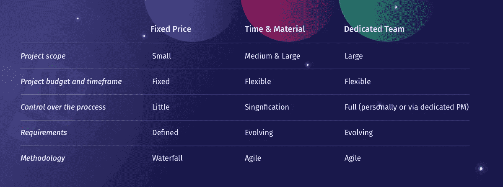

# 3 种 IT 外包模式:固定价格 vs 时间和材料 vs 专门团队

> 原文：<https://medium.com/swlh/3-it-outsourcing-models-fixed-price-vs-time-and-materials-vs-dedicated-teams-4e3915721a89>

在联系 IT 外包公司之前，首先要问自己的问题是“什么样的计费模式最适合我的项目？”我们列出了 3 种主要 IT 外包模式的优缺点。

虽然许多来源错误地将这些方法命名为“软件开发定价模型”，但是它们的应用并不仅限于软件开发。托管服务提供商可以对他们提供的任何类型的服务使用固定价格、时间和材料或专用团队定价模式，无论是软件开发、云基础架构管理，还是传统基础架构优化和向云的过渡等。

因此，我们仔细看看所有这些定价模型，以确定它们的优缺点和使用案例。

# 固定价格合同

这种 IT 外包定价模式最适用于具有预定义任务范围、严格要求和可预测时间框架的项目。该模型要求客户提供项目需求和所有必需的开发人员文档的详细列表，因此承包商可以设计工作范围，并根据严格的路线图和不可更改的截止日期进行工作。

**固定价格的优势** IT 外包模式:

*   **清明。**所有项目要求以及所有必需的开发人员文档都是预先指定的
*   **精密。**项目范围和时间框架是预先知道的，因此团队可以轻松地设置截止日期并监控项目进度。
*   **问责。一个可靠的承包商会在预算内按时完成项目，即使这意味着团队需要额外的时间。**

**固定价格** IT 外包方法的缺点:

*   **风险。**外包团队的风险更高，因为项目范围是固定的，不能改变。任何影响项目范围或价格的不可抗力情况导致需要对整个项目进行重新评估。
*   **勤奋。**固定价格项目需要客户或承包商的精心规划。如果承包商进行估算，这可能会占用整个项目 40%的预算和时间。
*   **一丝不苟。客户方或承包商方都需要一名专门的项目经理，以确保所有任务都在截止日期前完成。否则，团队很有可能会为了赶上最后期限而放弃某些功能。**

**固定价格合同的用例**要么是较小的试点项目，如网站重新设计，要么是责任范围严格受限的长期合作伙伴关系(客户/技术支持)。

# 时间和材料 IT 外包模式

这是一种更灵活的 IT 外包方法，因为客户为计费时间内完成的工作支付更少的费用。更详细地说，这种现收现付的模式只允许支付实际完成的工作(交付的功能、达到的里程碑)，而不包括团队喝咖啡、抽烟或在脸书冲浪的时间。也就是说，时间和材料模型更适合于长期项目，在这种项目中，最终的需求事先并不知道，而且可以随时改变。

**时间和材料的优势** IT 外包方法:

*   **灵活性。**客户可以随时改变项目范围、需求或团队规模，以满足其业务目标。
*   **透明。**客户对预算有深入的控制，并且只为实际交付的结果付费。
*   **效率。这是敏捷/Scrum 软件交付过程的最佳模型，在这种模型中，短时间的冲刺可以交付切实的成果。**

**时间和材料的缺点** IT 外包模式:

*   **含糊不清。**项目预算和时间框架都还没有确定，所以很难预测产品何时交付或成本如何。
*   **监督。**需要进行详细的监督，以确保团队正确评估任务并全面完成里程碑。
*   **沟通。**澄清任何更新的项目需求或收集对已交付功能的反馈需要耗时的沟通。然而，这更多的是一个好处，因为它确保最终的项目符合你的期望。

**时间和材料合同的用例**包括产品开发(MVP 开发等。)或产品更新(添加新功能或用 RESTful APIs 重建产品)。

# 专门的团队 IT 外包模式

这种方法结合了前面两种模型的特点，但比它们都略好。它用于弥补中长期项目内部 It 专业知识的不足。承包商根据客户的要求组建团队，这个团队可以直接向客户汇报，也可以由专门的项目经理监督。费用包括团队成员的工资+承包商的行政费用(工作场所费用等)。)

**专业团队的优点**方法:

*   **预见性。**账单是在可预测和透明的基础上形成的，客户总是只为交付的结果买单。
*   **可调节性。团队规模、项目范围或要求——如果需要，任何东西都可以调整。**
*   **连续性。**该团队在您的项目上工作了很长时间，因此对所有项目特性都有充分的了解，并致力于项目的顺利运行。

**专用团队**方法的缺点:

*   **渐进主义。**如果团队不能由可用的承包商员工组成，寻找额外的人才可能需要一些时间(根据所需的技能，平均 2-4 周)。这样说，团队的核心可以马上开始工作，而其余的成员将逐渐增加。
*   **彻底。**除非客户愿意为负责日常团队管理任务的个人项目经理付费，否则使用专用模型需要对所有任务进行全面控制，以确保项目朝着预期的方向发展。
*   **隐隐约约。当没有明确的项目需求时，最终结果可能会与客户期望的相差甚远。然而，在与有经验的团队合作的情况下，这种情况很大程度上是因为他们消除了客户甚至没有想到的所有瓶颈和漏洞。**

**专用团队模型的用例**包括长期的大范围项目，这些项目具有不断发展的需求，例如从传统基础架构向云的过渡，实施 AI/ML 算法进行大数据分析或云咨询以提高 IT 基础架构性能。

# 对三种 IT 外包模式的思考

因此，每个 it 项目在根据最合适的 IT 外包模式进行管理时都会提供最佳的结果。然而，有些情况下，短期项目最好由专门的团队来完成(比如加入启动加速器的 MVP 开发)，或者当具有严格要求的项目最好在时间和材料方法下完成。

因此，最合适的 IT 外包模式的决定最好是在咨询将处理它的托管服务提供商之后做出。一旦你选择的承包商了解了项目的范围、所需的技能和预期的预算，他们将能够提出最适合的方法。是固定价格、时间和材料还是[专门团队](https://dzone.com/articles/advantages-and-disadvantages-of-dedicated-teams-of)——由企业决定！

*原载于 2018 年 12 月 10 日*[*itsvit.com*](https://itsvit.com/blog/3-outsourcing-models-fixed-price-vs-time-materials-vs-dedicated-teams/)*。*

## 这篇文章发表在 [The Startup](https://medium.com/swlh) 上，这是 Medium 最大的创业刊物，拥有+400，714 名读者。

## 订阅接收[我们的头条](http://growthsupply.com/the-startup-newsletter/)。

