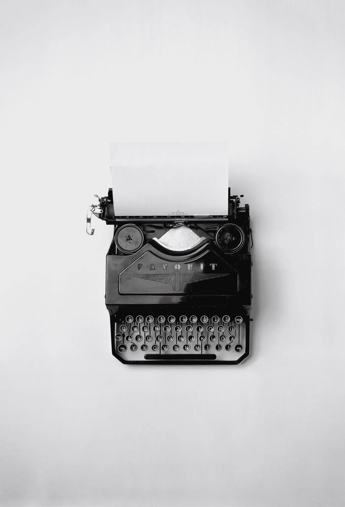

# 我在媒体上发表的第一个月学到的 3 个关键经验

> 原文：<https://medium.com/swlh/3-key-lessons-i-learned-in-my-first-month-publishing-on-medium-63803e81247b>

Photo by [Florian Klauer](https://unsplash.com/photos/mk7D-4UCfmg?utm_source=unsplash&utm_medium=referral&utm_content=creditCopyText) on [Unsplash](https://unsplash.com/search/photos/writing?utm_source=unsplash&utm_medium=referral&utm_content=creditCopyText)

几年前，一个朋友向我推荐了 Medium，我几乎立刻就下载了它。我喜欢阅读来自人们个人经历的所有故事，并阅读他们所接触的人的评论。

我吃光了所有关于“做 X 事的 X 种方法”、“最佳晨间作息”和其他自我提升支柱的文章。我经常…