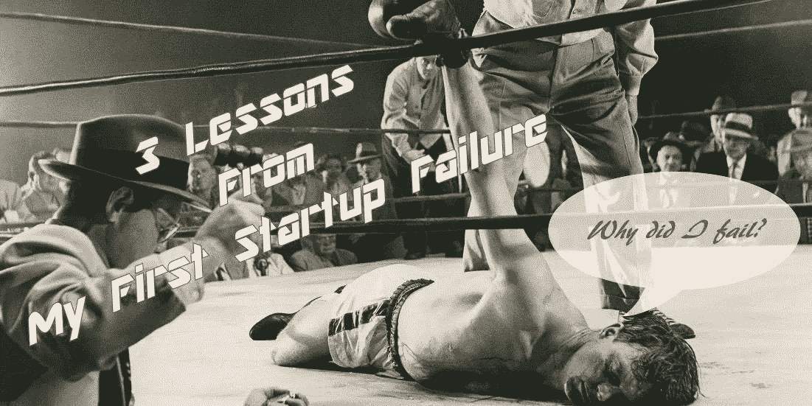

# 我第一次创业失败的 3 个教训

> 原文：<https://medium.com/swlh/3-lessons-from-my-first-startup-failure-4fea5dd55798>

Damn, why did I fail starting-up?

我爱 Quora，曾经被问到一个问题，“[你的第一次创业教会了你什么？](https://www.quora.com/What-did-your-first-startup-teach-you/answer/Karthik-Sirasanagandla)”。这促使我再次思考这个问题，我想以浓缩的形式分享我的经验，以帮助这位想成为企业家的人准备这次冒险。我从经验中提炼出三点作为答案。

这篇博文是那个答案的再现。

我的第一次创业失败教会了我以下 3 个关键教训:

1.  我和我的生意:先做最重要的事情——了解你的优势和劣势。将它映射到你创业成功的需要。想想你如何填补空白。
2.  我的产品和它的业务:应用 GOOB(走出大楼)原则，为产品-市场的适合性做真正的市场研究。如果你知道产品的市场适应性看起来很脆弱，至少可以说，你正在把自己从巨大的压力中拯救出来。否则，学习一下一个产品点击需要什么，并相应地做好计划。
3.  我、我的产品和我的公司:了解了个人和产品之间的差距后，就需要决定如何通过建立一家公司来弥补这些差距，以及这家公司需要什么。你有足够的资源来养活这个机构吗？

这篇博文也发表在我的另一个频道——[密码子经济学](https://blog.codonomics.com/2018/12/3-lessons-from-my-first-startup-failure.html)。

## 这篇文章发表在[《创业](https://medium.com/swlh)》上，这是 Medium 最大的创业刊物，有+402，714 人关注。

## 在这里订阅接收[我们的头条新闻](http://growthsupply.com/the-startup-newsletter/)。

