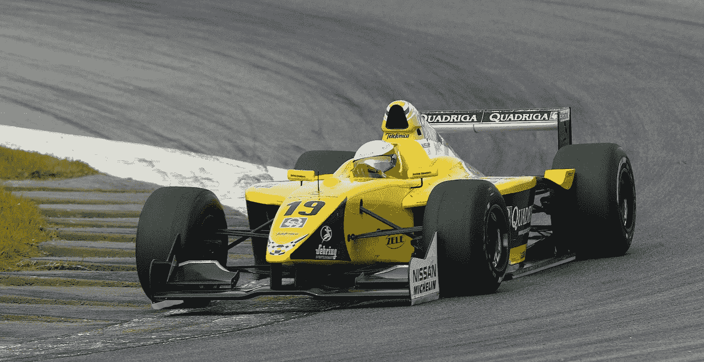

# 职业赛车教给我的关于性能的 3 个教训

> 原文：<https://medium.com/swlh/3-lessons-that-professional-car-racing-taught-me-about-performance-72f98c20e210>

Bonus lesson: sometimes it is ok to cut corners — Valencia, World Series 2002 — © Rafael Sarandeses

## 职业体育可以是生手老师

# 1.“赢”是…