# 300 万本书的封面判断

> 原文：<https://medium.com/swlh/3-million-judgements-of-books-by-their-covers-f2b89004c201>

## 数据

[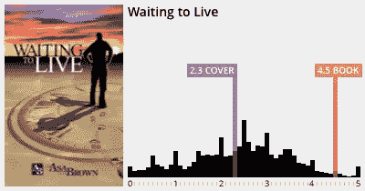](http://amzn.to/1LB5z1T)[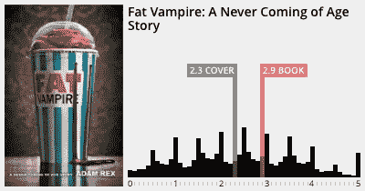](http://amzn.to/1EhEGx9)[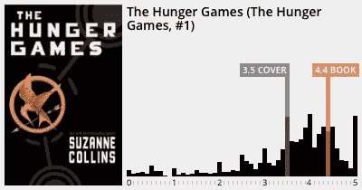](http://amzn.to/1NUKcpN)

上周，我的朋友内特·加尼翁和我推出了一款基于浏览器的游戏，让用户有机会通过封面来判断书籍的好坏。我们都是创造者，内特是作家，我是技术人员。所以，如果我说得太专业，请原谅——我保证会用漂亮的图表来奖励你。

[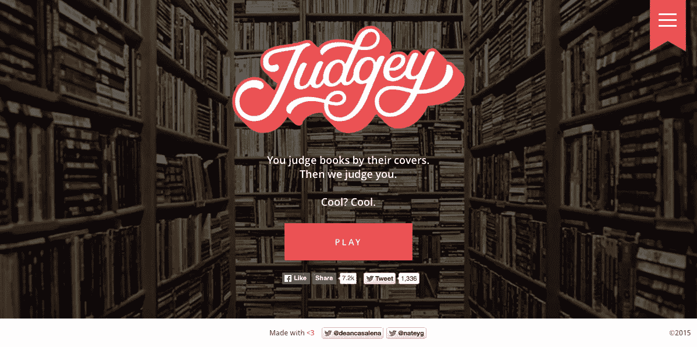](http://playjudgey.com)

碰巧的是，[互联网](https://www.reddit.com/r/InternetIsBeautiful/comments/3ign72/my_friends_built_a_site_where_you_judge_books_by/)认可了我们的失误，同样认可的还有 [Goodreads](https://twitter.com/goodreads/status/637029370822033408) (我们使用了其 API)、各种[公共](https://twitter.com/nypl/status/637363826292314114) [图书馆](https://twitter.com/SFPublicLibrary/status/636724920936824833)和书店、 [Book Riot](http://bookriot.com/2015/08/28/find-out-how-judgmental-of-book-covers-you-are-today-in-critical-linking/) 、 [Adweek](http://www.adweek.com/agencyspy/friday-odds-and-ends-258/92163) 以及一些 [文章](http://www.goexplore.net/internet-heroes/judgey-judge-a-book-by-its-cover/)(其中一些尚未浮出水面)。我们在《华盛顿邮报》上也得到了一个模糊的提及。

我们都看到了 reddit 首页能带来什么样的流量(内特看了 Forgotify，我看了网飞的《宠坏你自己》，我们做了必要的技术支持，以防止 Reddit 拥抱死亡。我很想告诉你关于所说的支撑，以及游戏开发的技术方面，但我会留到以后的帖子。

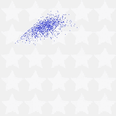

Spoiler: it will contain this graphic of some scores resulting from gameplay emulation for testing.

我们使用 Google Analytics 跟踪了第一周 300，000+访问者的各种数据点，以监控他们完成了多少级别以及他们的判断能力。我们等到 reddit 峰值之后才打开更详细的事件跟踪，因为太多的事件动作会让你的跟踪完全关闭。

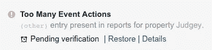

> **但重点是**多亏了[所有善良的人们](https://twitter.com/search?f=tweets&vertical=default&q=http%3A%2F%2Fplayjudgey.com%2F)，上周我们看到了 300 万本根据封面做出评判的书，我们已经对最近的 733，802 本做出了评判。

最后一个前言:这不是一项科学研究。这些结果并没有说明一本书有多出名(尽管有封面，但会影响评分)，也没有说明 Goodreads 不允许评分低于 1 星的事实。每本书的结果当然有一个模式，但是，我们发现一些非常有趣。

[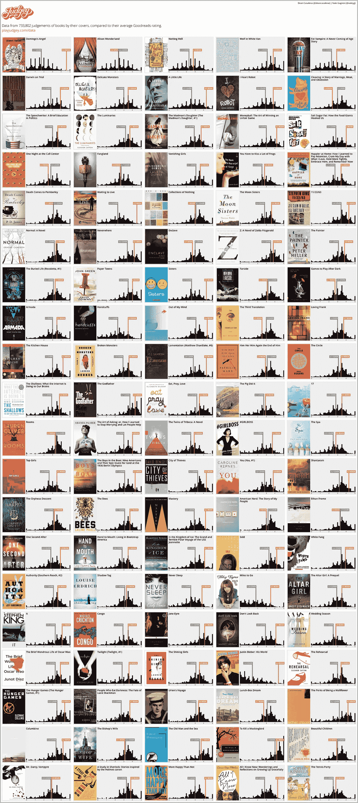](http://playjudgey.com/data/img)

Click to enlarge

[发此图](https://twitter.com/intent/tweet?url=http%3A%2F%2Fplayjudgey.com%2Fdata&text=Infographic%3A%20See%20how%20people%20fared%20at%20judging%20books%20by%20their%20covers%20http%3A%2F%2Fplayjudgey.com%2Fdata%2Fimg&related=deancasalena%3ACo-creator%20of%20Judgey%20and%20more,nateyg%3ACo-creator%20of%20Judgey%20and%20more)

## 一些观察

1.如果你想知道所有的黑条尖峰是什么，人们似乎更喜欢完全或半星级的评级书。即 **2.5** 而不是 **2.4** 或 **2.6** 。这是游戏没有规定的自我限制。

2.试着不要只看整体平均值，而要看图表本身的形状。所有的评级都聚集在一起，表明存在某种程度的共识——显示出来自数据的一些真正意义。评级分散开来意味着人们真的不知道该怎么想。

3.人们摇摆着走出大门。第二差的书封面是游戏的第一本书:[多明戈的天使](http://amzn.to/1i0epcS)，仅次于[贾斯汀比伯:他的世界](http://amzn.to/1UcwkZS)。比伯到底是怎么在 Goodreads 上拿到 4.4 分的？？

[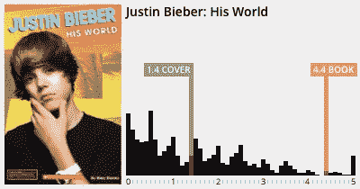](http://amzn.to/1UcwkZS)[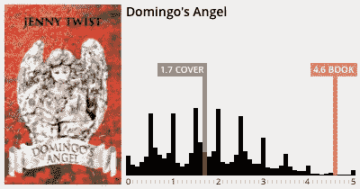](http://amzn.to/1i0epcS)

4.不管是哪本书，都会有人给它打零分…

> “让我想想……杀死一只知更鸟，不需要一本书——这有多难——零颗星！法官……哦。”

…或者用 5 来赞一下。

> “这个封面有一张女性的照片——五星！'

[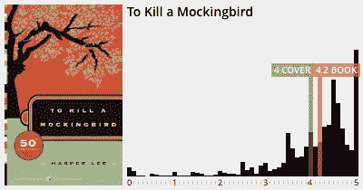](http://amzn.to/1V90Y8N)[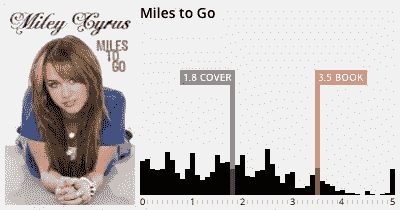](http://amzn.to/1V91hAg)

5.对大多数书来说，封面上的评价比该书的 goodreads 评级还要糟糕。我要说的是，例外都有非凡的封面(和标题)。

> 我会把《呼叫中心的一夜》读得一塌糊涂

[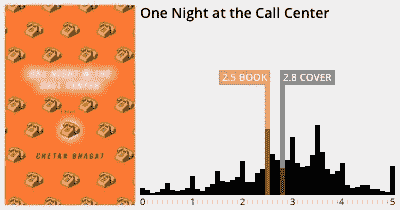](http://amzn.to/1V8WLBY)

**各位数据爱好者:**你对哪些书籍的结果图感兴趣？你认为这是什么形状？

**各位制造者:**你们在做什么？

我们在推特上聊一聊 [@deancasalena](https://twitter.com/deancasalena) 和 [@nateyg](https://twitter.com/nateyg) 。

*发表于* **创业、旅游癖和生活黑客**

-