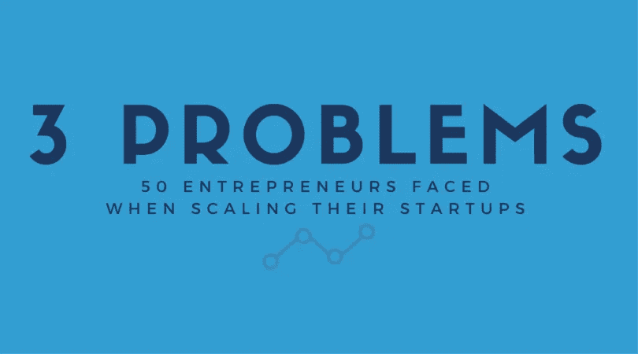

# 50 位企业家在扩大创业规模时面临的 3 个问题

> 原文：<https://medium.com/swlh/3-problems-50-entrepreneurs-faced-when-scaling-their-startups-76b8110ee417>

> “这就像一个骑着狮子的人。人们认为，‘这家伙很勇敢。’他在想，‘我到底是怎么骑上狮子的，我怎么才能不被吃掉？’？"

这个[著名的比喻](http://www.inc.com/magazine/201309/jessica-bruder/psychological-price-of-entrepreneurship.html)非常恰当地描述了企业家倾向于过的生活——创造奇迹，坚持不懈。对于普通人来说，成为一名初创企业的创始人可能看起来很性感，很有吸引力(“掌控你的生活，经营你自己的事业！”).

Living the life? Maybe not. via [Tech Cocktail](https://www.flickr.com/photos/techcocktail/)

但是，100 个创业者中，大概有 99 个会跟你说不一样，最后一个显然是被蒙蔽了。

所以，*亲爱的初露头角的企业家*，我知道你渴望去做自己的事情，我为你感到非常兴奋。不过，明智的做法是，先了解一下初创公司创始人在公司生命的每个阶段面临的主要问题。

我们对 50 位企业家进行了随机调查，得到了他们在种子期和成长期分别面临的各种各样的问题。事后看来，这是有道理的，因为我们确保调查了各种市场和行业。

然而，在每个阶段，大多数创业者似乎都会遇到三个关键问题。

# 在种子阶段

## 1)建立一个有才华、有动力的团队

尽管初创公司的创始人得到了很多关注，但工作的质量——尤其是在早期阶段——很大程度上取决于他们背后的团队。这些第一批员工不仅要有足够的才华来完成一流的工作，他们通常还需要同时兼顾多项任务。

正因为如此， [LawCanvas](https://lawcanvas.com/) 创始人 Daniel Leong 表示，团队需要和创始团队一样有动力——但还要更聪明。

马来西亚漫游服务提供商 Flexiroam 的创始人 Jefrey Ong 对此深表赞同。他认为，需要给员工一个理由“在一家没人听说过的公司工作，放弃大公司支付得起的高薪。”

自然，这在寻找联合创始人时更加适用。为此， [Unified Inbox](https://unifiedinbox.com/) 的托比·拉克特(Toby Ruckert)发现完善他的推销至关重要，这样他就可以“以一种有意义的方式”传达他的想法，并使你能够从你需要的关键利益相关者那里获得必要的认同

## 2)获得初步验证和牵引

所有初创公司创始人面临的永恒挑战是，“我如何让客户使用我的产品或服务？”按需送货服务公司 [The 货车](https://www.thelorry.com/)的创始人 Goh Chee Hau 解释说，除非你刚从像 [YCombinator](http://www.ycombinator.com/) 或 [500 Startups](http://500.co/) 这样的知名项目中走出来，否则没有人会相信一个没有良好记录的新产品。

对于像卡车这样的市场初创企业来说，这项任务更加艰巨，因为它们面临着“先有鸡还是先有蛋”的问题。厂商或供应商希望在加入平台前见到客户，而客户则要求证明另一端的厂商是可靠的。

简而言之，这是一个棘手的问题。

因此，根据 Wedding.com.my 创始人 Kelvin Leow 的说法，获得前十名客户对团队的士气至关重要。在种子阶段，这实际上是“要么成功，要么失败”。

教育初创公司 EasyUni 的负责人埃德温·泰(Edwin Tay)强调，这一责任落在了创始人身上——他或她必须做“最初的努力”来验证他们的假设。

## 3)执行速度快

当今世界上有数量惊人的创业公司。《快速公司》估计，仅在美国，每月就有超过 50 万家新企业涌现。几乎每个行业都挤满了寻求为自己开拓利基市场的新贵，这意味着速度至关重要。

这一点在种子阶段尤为重要，此时你的初创公司正挣扎着在很少甚至没有资源的情况下喘口气。“没有大银行账户和身边的团队，你如何在短时间内做得更多？”提问 Ching 李威， [iMoney](http://www.imoney-group.com/) 联合创始人。

这就是人们经常谈论的“敏捷思维”的来源——快速失败，快速学习，不断进步，直到你击败竞争对手。商业配对平台 [Socialwalk](http://www.socialwalk.com/) 背后的智囊 Tham Keng Yew 说，通过这种方式，企业家可以建立一个最低限度的可行产品，并迅速进入市场，获得有价值的投入和(希望是)验证。

旅游应用程序 [Wander](http://heywander.com/) 的创始人郑秀晶·周补充道，通过快速执行，创始人将更清楚如何将一个想法发展成一家成熟的公司。

初创公司可能不一定有办法在早期雇佣所需的人才来完成所有这些工作，这就是像 [AgilityIO](http://www.agilityio.com/) 和 [Ops Ninja](http://www.opsninja.co/) 这样的公司来的原因——在关键阶段提供合适的人才。

# 在生长阶段

## 1)雇佣和留住人才

既然产品与市场的匹配已经建立，初创公司需要专注于授权专门的角色来推动某些指标。对于这些职位，只有一流的人才会做，但这项研究中接受调查的其他所有创始人都表示，说起来容易做起来难。

分别来自 Wander 和 Unified Inbox 的 Choo 和 Ruckert 都认为，在经济起伏中保持员工的积极性是一个巨大的挑战。初创公司的本质就是有许多高峰和低谷，尤其是在成长阶段。

Choo 表示，士气尤其难以保持，因为大多数员工现在拿到的是薪水，而不是全额股权——他们必须有不同的激励。

LawCanvas 的 Leong 认为，要做到这一点，建立团队文化并保持它是至关重要的。更重要的是，每个人都必须不断地保持“在同一页上，我们在做什么，我们为什么这样做，以及下一步需要做什么和什么时候做。”

## 2)培养一支优秀的管理团队

同样，大多数企业家发现，随着创业规模的扩大，他们不再有能力照顾一切。用 Ching 的话说，现在的工作量需要“一批愿意‘全身心投入’的顶尖人才。”

换句话说，在成长阶段需要一个全明星管理团队来掌权——根据 [Megafash](https://megafash.com/) 创始人恩乔·文佳的说法，你可以信任这些人“用很少的数据在很短的时间内做出很大的决定”。

做到这一点并不像向有才华的人砸钱那么简单。EasyUni 的 Tay 将这一特殊时期描述为“可怕的”,因为一开始就没有一个强大的基础。当时他们的团队由 15 名应届毕业生组成。他说，在种子阶段走太多捷径，会在扩大规模和进入下一个阶段时造成许多问题。

## 3)建立稳定高效的流程

仅有一群杰出的个人是不够的。为了让公司的产品或服务保持卓越，必须建立良好的流程——尤其是当公司规模在数量上膨胀的时候。

或者，正如来自《卡车》的 Goh 所说，“为了可扩展，对客户有一个标准化的服务承诺是必不可少的。”

一个好的管理团队和流程是相辅相成的。一旦程序确定下来，Wedding.com.my 的 Leow 说，创始人必须让他的副手来处理它们，“相信他们会遵循或做得更好，这样你就可以继续做更大的事情。”

现在我们有了。我将引用潘多拉创始人的一句话来结束我的演讲:

> 如果你喜欢这篇文章，请点击下面的“**推荐**”按钮。谢谢！

*这篇文章最初见于*[*AgilityIO 博客*](http://blog.agilityio.com/problems-entrepreneurs-face-scaling-startups/) *。点击* *了解更多关于 AgilityIO* [*的信息。*](http://www.agilityio.com/)

*发表于* **创业、旅游癖和生活黑客**

-