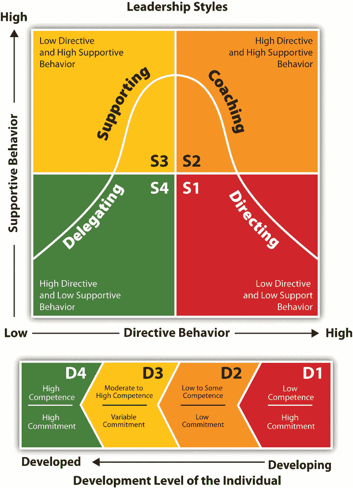

# 3 个经过现实世界测试的策略，将你的虚拟公司规模扩大到 100 万美元(甚至更多)

> 原文：<https://medium.com/swlh/3-real-world-tested-strategies-to-scale-your-virtual-company-to-1-million-and-beyond-ddfebfeae25b>

[Virtual Team](https://storj.io/img/cloud.png)

密歇根。北卡罗来纳州。田纳西。科罗拉多。加利福尼亚。乔治亚。佛罗里达。新泽西。牙买加。菲律宾。

这是我们的团队。 10 个地点，13 个人。都有任务在身。一起。主导健康和健身行业。改造数百万人的身体、思想和灵魂。

> 我们很幸运。我们每一个敬业的队友都很谦虚。勤劳。无戏剧性。值得信赖。在某些方面，我们比公司同事更像一家人。

我们联合在一起，作为一个 ***虚拟*力量**，成长为一个 7 位数的企业。这个项目已经影响到来自 100 多个国家的数百万人。

*这到底是怎么回事？在虚拟环境中，不多不少？*

**这不是偶然。这是故意的。**通过培养。通过犯错和从错误中学习。

你也可以这样做。该过程是可重复的。任何人。没有错误——如果你留意我下面的警告。

因为在当今快节奏、商品化的市场中，你团队的经验、技能、个性和文化——这才是你真正的竞争优势。

> 你的团队就是你超越自我的方式。

你是人类。有缺陷。有弱点。一天只有 24 小时。

你的马厩里需要比你更快、更强壮、在某些领域更有经验的纯种马。

但是，当你每天在工作中看不到他们本人时，你如何建立一个胜利者的虚拟团队呢？当你的公司总部位于万维网大道 123 号时。

一个词:

> 信任。

你必须信任你的团队。像对待自给自足的成年人一样对待他们。期待他们能完成工作，赶上最后期限，实现目标。

你需要放弃一些控制权。让你的团队掌权。**而是用*的策略*。**

对于企业家来说，这可能很难。你从最基本的创业元素中诞生了你的小公司。一个想法的脆弱的种子和一个坚持执行的蛋。

但战胜恐惧是值得的。穿越未知。通过怀疑。即使您的团队在 1000 英里之外做出业务决策。

因为这样你就可以过上自由和慈善的生活。

旅行的自由。休长假。去做其他有激情的项目。要在你的日程安排中有空的时间段，只需到 ***想*** 。

有一群忠诚的超级明星支持你的生活方式——以一种间接的方式。

你只需要信任。很多。不仅是团队中的每个人，还有他们工作的系统和操作。

否则，你将总是满怀期待地担心:

> “他们下一步会搞砸什么？”

这些年来，我学到了许多关于虚拟团队建设的惨痛教训。大部分，如果不是全部，都是可以避免的。我只是不知道我不知道什么。

请不要犯同样的错误。相反，只需应用下面揭示的 3 个现实世界中可行的策略，我用了过去六年的时间来建立我们的虚拟大师明星团队。

这些策略[几乎]保证你永远不会经历我在 2012 年第一个员工身上遇到的同样不合时宜的不幸事件。

一个事件，当它发生时，在我的脑海里播下了不信任的微妙种子。并在相当长的一段时间里形成了我对我们团队的控制。

# 一封员工邮件玷污了我们一生中最大的产品发布会

我不知道我们在想什么。

我们离生命中最大的产品发布会只有几天了，这是我们过去 4 年努力工作的顶峰。

**我们决定去出差。**为了一个主谋。我们全程都在笔记本电脑上工作。

我们没有意识到我们面前还有多少工作要做。

然而，我们在那里。肖恩，我的生意伙伴。还有我。周日从丹佛飞回家，像两个狂热的法庭记者一样敲着键盘。

我们有 100 多家分公司准备在午夜推销我们的新产品。倒计时钟的滴答声震耳欲聋。

**我们随后肾上腺素激增的恶作剧感觉就像首届互联网营销人员版的惊人比赛:**

**早上 6:45**—在酒店大堂见……*我们在工作。*
**早上 7:00**—乘坐弹力班车前往机场……*我们在工作。*
**早上 7 点 45 分**——穿过 TSA Charade 到大门… *我们在工作。*
**上午 9:00**——偷偷带走笔记本电脑，不被赶下飞机……*我们在工作。*
**下午 2:00**—在底特律机场降落，停在餐厅……*我们在工作。*
**下午 4:30**—跑到我家在厨房建立办公室……*我们在工作。*

这个故事持续了整整一夜…直到凌晨 4 点我们终于昏了过去。

刚过 8 点，我们都醒了。肖恩拖着自己的车回家。

无论我们成功还是失败，我们知道我们在球场上留下了每一盎司的鲜血、汗水和泪水。没有什么可以给的了。

我趴在笔记本电脑前，打开我们的电子商务账户，点击刷新。

> 销售像美国消费者新闻与商业频道不受限制的垂直股票行情自动收录器一样在屏幕上飞来飞去。

最初的发布结果显示这将是一个巨大的成功。感谢上帝。

然而，我灿烂的笑容是短暂的，当我一天中第一次打开电子邮件时，它很快就会变成狰狞的皱眉。

我从我们的客户支持人员 Henry 那里收到了一条意外的、不合时宜的消息。(为保护隐私，犯罪方的姓名已被更改):

> 瑞安，
> 
> 抱歉，我不能再为你工作了。我希望你能理解。
> 
> 真诚地
> 
> 亨利

**我的大脑因恐惧而爆炸。带着愤怒。惊讶地。**

> *什么？？！！我们的第一次重大发布才进行了几个小时，我们唯一的支持者就辞职了！？？*
> 
> 我应该知道不该相信他。

一旦我冷静下来，我意识到我需要尽快控制局面。

否则，我们将有成千上万的不高兴的，寻求退款的顾客。

***真正的真相？这个不幸的事件是我的错。***

我注意到，在发布会之前，有一些迹象表明亨利有点“不对劲”。只是不太对。

我应该处理得更好。由于我们是一家虚拟公司，他可以消失而不会引起任何个人反应或不舒服的感觉。

但是现在，随着成千上万的新客户涌入我们的业务，我们的客户支持资金肯定会从正常的涓涓细流变成汹涌的洪水。

我要做什么？…

## 由于我当时缺乏经验，我做了我唯一能想到的事情:

> **自己回答每一个客户支持票。我是我现在唯一可以信任的人。**

罚单出现在我们的支持系统中的速度比我还快。我回复了一张罚单，当我的浏览器刷新时，又有三张罚单到了。

> 我是。愤怒。在亨利。我觉得他让我失望了。

我说了几个精选的 4 个字母的单词，同时继续敲击键盘。

在回复了我的第 527 张罚单后，我意识到亨利可能需要更多的帮助。这对于一个人来说太难了。

但是他甚至还没有经历过发射。他在开始前就离开了。我会跳出来缓解一下。

谢天谢地，我完好无损地通过了我们的发射。

在短短的 5 天内，我们获得了 12，000 多名新客户。

所以收获是值得付出的。

然而，这个简单的事件严重打击了我在工作中信任他人的能力。

# 我现在只能 100%信任我自己，我自己，我…

生意场上的竞争一如既往地继续着。

我首先雇佣了一名新的客户支持代表，她在之前的公司为我工作。所以我和她建立了一点点信任。

除此之外，我继续独自处理我们运营和技术的方方面面。

电子邮件调度和交付、web 服务器维护、销售漏斗设置、对比测试配置、每日指标收集、每日财务(除记账和税收之外),等等

> 只要我自己做了这一切，我知道它会 100%正确。(我倾向于完美主义者，如果你说不出来的话。)

然而，随着我们成长为一家 7 位数的公司，我缺乏信任阻碍了我们的成长。

当技术和运营成为瓶颈时，营销和销售会显著放缓。你不能以足够快的速度进入市场。

所以肖恩和我同意了。这个团队需要扩大。我开始雇佣更多的人。

即使在那时，我的心态和策略也是有缺陷的。**他们仍然基于严重的*缺乏*的信任。**

我雇佣了非常没有经验的人。他们是勤奋和忠诚的人，但需要大量的教学和培训。

这意味着，最终，我可以*操纵*他们的一举一动。他们是马里奥和路易吉，我握着操纵杆。

我没有提拔领导人。我在创造追随者。用我自制的克隆机器。

这种领导方式抑制了增长。扼杀创新。也不会让你的公司成为一个令人兴奋的工作场所。

## **事实**:如果我们的业务规模要达到 7 位数到 8 位数，我必须学会如何有效地授权…

…尤其是因为我们没有在实际地点见面。

授权决策。战术。策略。我们公司的大量日常职能。

> **我不得不把信任作为我的*默认*选项。**即使可能赚不到。

你也应该这样做。

只是不要在没有流程的情况下将这些责任推给你的团队成员。没有计划。

现在，经过多年的指导、研究和实验，我使用了一套战略性的系统和流程，在整个组织中灌输了信任。

最重要的是，在 100%虚拟化的情况下，我们的收入和利润年复一年地增长。

# 将你的虚拟公司规模扩大到 100 万美元及以上的 3 个现实世界测试策略(外加:第四个奖金策略！)

## **1。使用无情的招聘战书**

> 信任始于你让谁进入你公司的大门。

对你来说，信任一个已经具备了个人职位和整个公司所需的个性特征、价值观、经验和知识的人要容易得多。

说实话，我们广泛的招聘过程值得自己的文章。也许有一天我会写出来。

与此同时，这里有几个关键点:

> 申请人必须使用特定的页面长度、字体和字号传真求职信和简历。

***滤镜:*** *它们能遵循基本的方向吗？此外，他们是否对这个角色感到足够兴奋而不感到不便？*

> 除了求职信和简历， ***应聘者还必须完成一些与职位相关的小任务。***

***筛选:*** *他们能为这个职位展示出至少一个基本的经验和知识水平吗？*

> *提交上述内容后，* ***他们填写一份为他们申请的角色配置的*** [***智力测试***](http://wonderlic.com)

****过滤器:*** *标准化测试结果与申请人迄今分享的结果相比如何？**

*所有这些信息都用于确定谁应该获得面试机会。*

> *在流程进行到这一步之前，我不会亲自与任何人交谈。*

*我们的运营总监安吉拉负责一切。*

*对于一些职位，她管理从职位发布到招聘决定的所有事情(看看我对他人的信任在过去几年里是如何发展的？)*

*最后，新员工要经过 90 天的试用期。*

*他们可能撑不过去的预期已经形成。或者，他们可能会发现我们公司不适合他们。*

> *无论哪种方式，你永远不知道某人在你的公司会有怎样的表现，除非他们有机会亲自动手生产。*

## ***2。建立会议节奏***

*我知道。会议。这个词也让我不寒而栗。在企业界，有多少时间是浪费在参加冗长而不必要的会议上的？ ***很多。****

*这仍然不会使它们贬值——如果它们做得对的话。*

*一致的、不可协商的会议节奏会让你的团队日复一日、周复一周地专注于与公司愿景和目标一致的优先事项和战略。*

*如果你的团队是 100%虚拟的，这种重复的会议节奏是至关重要的。*

*不是来看孩子的。不要手持。而是让每个人都朝着同样的结果前进。*

*像大多数公司一样，我们有年度和季度计划会议。这些是关键。然而，我想重点谈谈另外两个会议，特别是节奏更快的鼓点。*

***每周目标设定和回顾电话** —我们团队中的每个人每周都要和他们的直接经理进行 30 分钟的一对一通话。*

*这次通话的内容由**经理*和*员工指导。他们会在电话会议前拟定议程并提供给客户。***

> *这次谈话的主要目的是为他们提供资源并消除障碍，以便他们能够实现既定的季度目标。*

*这也给了经理几分钟时间与团队成员进行 ***个人*** 级别的检查。确保他们的身体、心理和精神处于健康的状态(基于他们可能想要或不想分享的任何东西)。*

***每日作战室**——这个简单的 15 到 30 分钟的每日通话将我们的虚拟公司变成了今天的样子。*

***这次通话只有一个目标:**确定我们团队在未来 24 小时内要完成的首要任务。*

> *基于当前的资源、知识、机会等，我们第二天可以完成的最大驱动力是什么，它将最大程度地推动业务向前发展。？*

*这个简单的电话让我们的虚拟团队每天都专注于最重要的事情。*

*否则，很容易被那些对公司发展影响不大的项目、任务和义务的清单所转移。*

## ***3。实施情境领导***

*你曾经有过这样的老板吗？他在一个特定的任务上给你很少的支持和指导——尽管你希望得到更多的帮助。*

*或者，一个老板对你执行的每一项任务都进行微观管理，即使你已经准备好获得更多的自主权和决策权？*

*情境领导通过*根据手头的个人任务调整*经理和员工的期望，消除了这两个非常常见的问题。*

*情境领导最初是由肯·布兰查德和保罗·赫西提出的，他带领团队成员和他的经理经历了 **4 个不同层次的领导:***

**

*作为经理，你的目标是将你的领导风格(从 S1 到 S4)与团队成员的发展水平(从 D1 到 D4)保持一致。*

*并且这些选择根据所执行的任务而变化。*

*例如，几个月前，我们雇佣了一名新的电子邮件营销专员。他是一个非常有技巧和经验的作家。然而，在直接回复电子邮件营销领域，他还是个新手。*

*因此，在他被雇用后，我和他开了一个**协调会议**，会上我们就他每周执行的任务的领导级别达成了一致。*

*从一开始，我们就决定用 D1 和 S1 的组合来搭配一切。*

*于是，我告诉他 ***确切地说*** 该怎么做，他就怎么做。我也花了很多个人时间来解释我的思考过程和我做出各种决定的背景。*

***然后，一周接一周(在我们一对一的通话中)，我们根据他在我们公司的虚拟渠道中的额外工作经验来确定这些领导级别是否可以改变**。*

*这种领导模式建立了具体的期望和适当的**信任度**。它还消除了经理和员工之间经常出现的沟通障碍。*

> ****一个人需要多少方向？*** 这完全取决于多种因素。情境领导确保你不会使用太多或太少的方向，而是恰到好处。*

*(在过去的几个月里，我们的电子邮件作者已经从 S1 的领导级别上升到了 2 级、3 级甚至一些 4 级。)*

## ***加成 4。为你的公司的存在培养一个更大的理由。***

*团队成员想知道**为什么**他们把宝贵的时间、注意力和精力投入到你的业务中。*

*是的，他们需要钱来支付抵押贷款和购买食物。那是必然的。*

*更重要的是，他们希望自己的工作有意义。还有意义。和目的，当他们敲键盘来提高你的底线。*

*这种“更大的原因”的心态并不新鲜。这是一个近年来在领导力书籍和热门视频中经常出现的概念。*

> *尽管如此，对于一家虚拟公司来说，你的理由更加重要。*

*你不会在办公室见面。从最实际的意义上来说，你们没有共同点。*

*这种面对面交流和经验的缺乏会扼杀文化和关系的建立。*

> *物理上的接近加强了个人联系。*

*这就是为什么很多异地恋失败的这么快。*

***以我的经验来看，一个更大的原因是*虚拟线程*将把一个业务团队长期维系在一起。***

*例如，我们公司的“surface why”是我们帮助 40 岁以上的男女减肥，成为身体上更健康的版的**T21。***

*虽然，这只是开始…*

***我们更大、更深的为什么是帮助各行各业的人提高*身体上的*、*精神上的*、*精神上的*。***

*您不必成为我们的客户，也可以和我们一起体验这一变化:*

*我们将每笔销售额的一定比例捐赠给国际活水组织。一个热爱福音的组织，为世界各地贫困的村庄提供新鲜清洁的水。*

*我们每年都参加儿童玩具慈善活动。(并飞我们团队去沃尔玛购物)。*

*我们通过国际慈善协会和印度的另一个部门资助了一群孩子。*

***我们参加了一年一度的宣教旅行，在一个贫困的村庄安装一口干净的水井。邀请我们团队的任何人参加。***

***我们定期制作文章和视频，帮助我们的追随者拥有更强大、健康、全面的生活。**(不卖东西。)*

*这个列表不是用来吹牛的。我个人认为所有这些祝福都来自上帝，而不是我们。*

*我的目标只是描述——用*细节*——我们如何在公司培养一个更大的理由。*

# ***信任。***

*通过有效的招聘培养。一致的会议节奏。情境领导。还有一个更重要的原因。*

*这就是你如何建立一个强大，有效的虚拟团队，可以帮助你达到 7 位数甚至更多，同时也给世界留下你独特的印记。*

> *当信任成为一切的核心时，你会惊讶于一个专注的、以使命为导向的团队所能取得的成就。*

*当然，生活中没有保证。你唯一的客户支持代表可能仍然会抛弃你。*

*但是，当你和应邀与你同桌吃饭的其他人一起分享时，商业成功的果实尝起来要甜得多。*

*即使那张桌子不是放在一栋办公楼里，而是分散在世界各地的不同家庭里。*

**

## *这篇文章发表在 [The Startup](https://medium.com/swlh) 上，这是 Medium 最大的创业刊物，有+ 381，862 人关注。*

## *在此订阅接收[我们的头条新闻](http://growthsupply.com/the-startup-newsletter/)。*

**