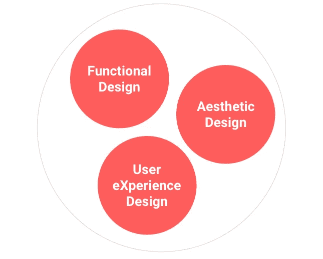
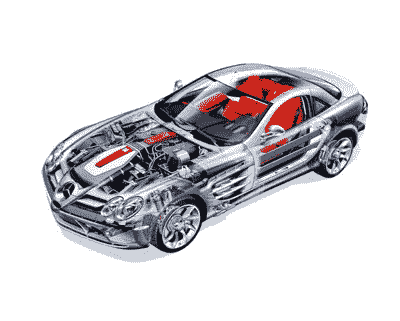
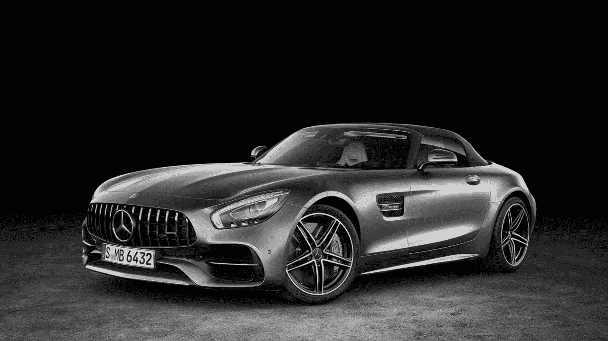
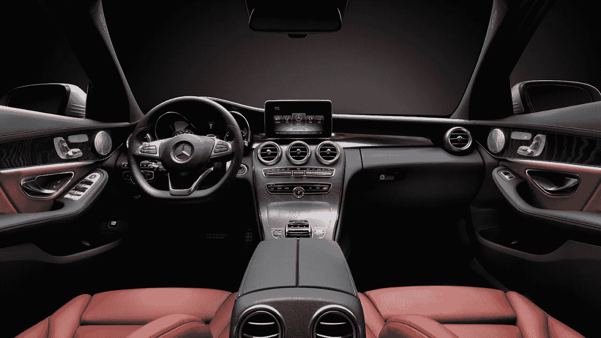
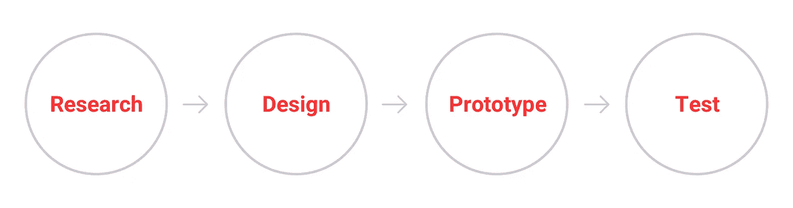
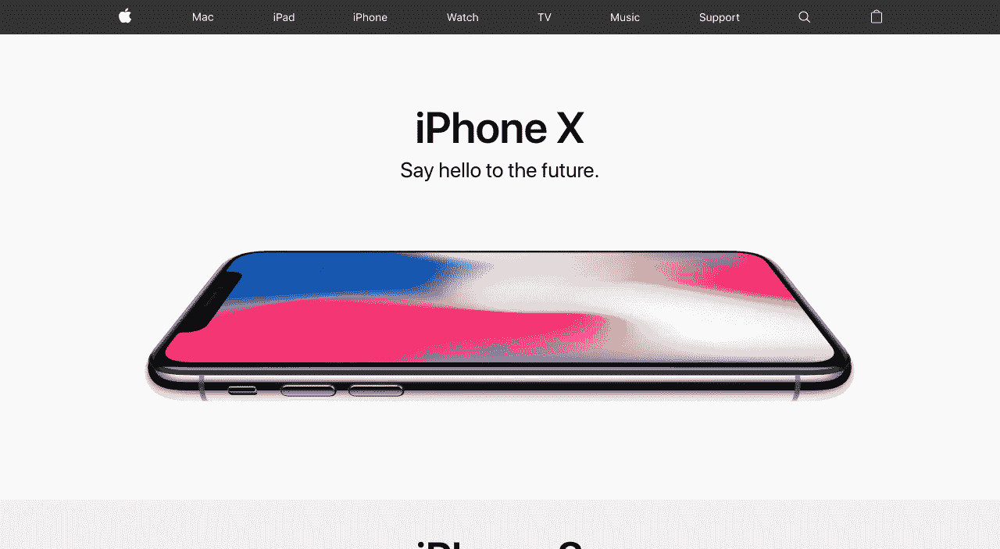
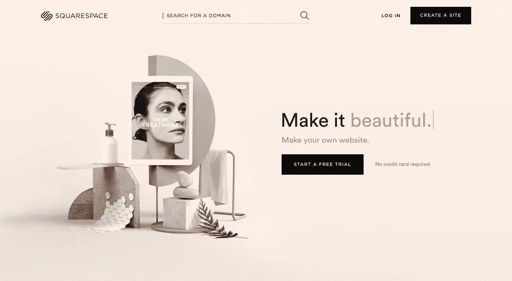
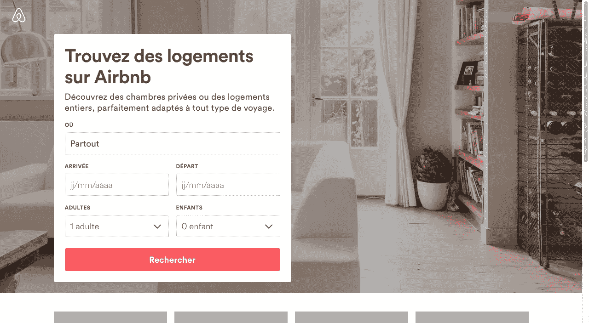

# 制造产品时不应该忽略用户体验的 3 个理由。

> 原文：<https://medium.com/swlh/3-reason-why-you-should-never-skip-user-experience-making-a-product-fd390a77d030>

用户体验是与你的产品体验相关的一切，如今这个术语被人们滥用，他们不知道自己在做什么，认为用户体验只是设计一个应用程序或网站，但真正的意义是你体验世界和一切的方式。

> "用户体验是使用产品、系统或服务的感觉."

因此，在制造产品时，你永远不应该忽略用户体验的三个原因是:

## **1:伟大的产品共有三样东西(什么)？**

制造产品时，我们需要知道有三层:

*   作用设计
*   美学设计
*   用户体验设计

所有这些层面一起工作(功能设计和美学设计是不够的)。

为了说明这一点，让我们用一辆汽车来解释:

首先，我们有“它是如何工作的”(功能设计)

其次，我们有“它看起来怎么样”(美学设计)

bbc.com

第三，我们有“使用这辆车的感觉”(用户体验设计)

mbusa.com

## **2:用户体验帮助你了解你的用户(如何)？**

> “想要你的用户爱上你的设计吗？爱上你的用户。”
> —丹娜·奇斯内尔

没有用户的用户体验不是用户体验，因为用户会给出反馈并验证假设，为此我们必须投资用户研究，这是制造好产品的重要部分。

为了做出好的产品，公司应该投入更多的时间与用户面对面，了解他们的需求，进行可用性测试。

用户研究帮助您发现:

*   他们期望做什么
*   为什么这对他们很重要
*   他们还有什么其他目标
*   他们还使用什么工具
*   等等…..

## **3:用户体验是制造伟大产品的完整过程**

过程不是一个激动人心的词，但 UX 如果不是一个过程就什么都不是，像苹果、奔驰、Airbnb 这样的公司也在认真遵循 UX 过程。

这是建造一辆汽车或一座建筑或一部电话或一把椅子或一所房子等的简单而逻辑的过程…

设计过程的好处是:

*   视野清晰
*   产品以高保真度可视化
*   过程有自然的结构
*   想法可以被廉价地重复
*   同等重要的三个成功因素

***好 UX 的例子:*** ——苹果

[https://www.apple.com/](https://www.apple.com/)

-方形空间

[https://www.squarespace.com/](https://www.squarespace.com/)

- Airbnb

[https://fr.airbnb.com/](https://fr.airbnb.com/)

-奔驰

Mercedes-Benz

# 结论

在设计方面，用户体验和视觉识别一样重要。说真的。如果人们不知道如何与之互动，你的网站或应用程序看起来如何并不重要，而且，他们需要享受这种互动。

## 这篇文章发表在 [The Startup](https://medium.com/swlh) 上，这是 Medium 最大的创业刊物，拥有 277，994+读者。

## 在此订阅接收[我们的头条新闻](http://growthsupply.com/the-startup-newsletter/)。

