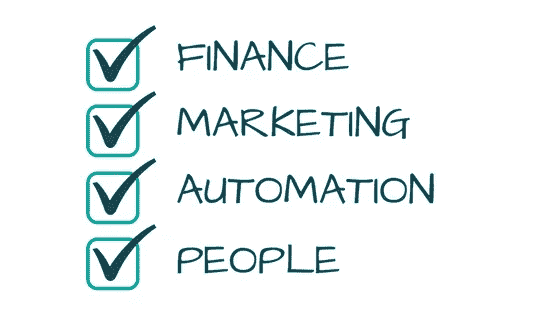

# 成功创业的 3 个简单步骤

> 原文：<https://medium.com/swlh/3-simple-steps-to-startup-success-a13465537461>

你知道每年有多少创业公司成立吗？

根据 [GEM 全球报告](http://www.gemconsortium.org/report)的发现，这个数字在 1 亿左右。

也就是说每小时有 11000 家新公司成立。

换句话说，新企业正以大约每秒钟 **3 家创业公司**的速度推出。

尽管有大量的新业务推出，但一个我们都太熟悉的统计数据向我们展示了这些创业公司中很少有人能成功**——令人震惊的是，90%的新企业都失败了。**

那么，你如何确保你的新创公司属于成功的那 10%呢？

尽管创业成功没有神奇的公式，否则每个人都会这么做，对吗？有三个简单的步骤会给你建立成功企业的最好机会。

# 1.正确使用您的产品

在你开始投资一个产品之前，有必要花时间确保它能为目标用户提供真正的价值。这是我能给任何寻求创业成功的人的最重要的建议——听起来很简单，但很多人都理解错了。

在一天结束的时候，你很可能会认为你提出的任何想法都是正确的产品。然而，重要的是**的目标受众**是否做**。**

因此，不要一有想法就马上进入“生产模式”,你需要做的第一件事是验证你的想法。

> “不要为你的产品找客户，要为你的客户找产品。”赛斯·戈丁

你如何联系他人并不重要——打电话、发电子邮件或面对面。只要确保你与你计划最终向其推销你的产品/服务的人交谈。你的产品/服务对他们有价值吗？这会让他们的生活更轻松吗？换句话说，你计划销售的产品/服务有需求吗？

一旦你确定你的产品可以填补市场上的空白，你就能够为你的创业建立一个坚实的基础，并在未来为自己的规模做准备。

# 2.摆正心态

不要被 Insta-entrepreneurs 和他们一夜创业的成功故事所迷惑。建立一个成功的企业并不容易，企业家的生活方式并不适合每个人。

你必须能够**激励自己**度过这一切，因为你不会有老板或主管来检查你。如果你不坚持到底，你就不会实现你的目标。

你必须**保持现实的期望**，因为你旅程的头几年会很艰难。在此期间，你需要找出有效的方法，不断完善你的产品/服务，以更好地满足客户的需求，并建立你的品牌。

你必须**投入工作**，因为旅程会让你放弃，重新开始，改变方向，调整产品，犯错，崩溃，然后重新建立。只要你准备好投入工作，你就有希望成功。

你必须从你的错误中学习，因为它们会给你机会去完善自己，为未来学习。如果你以正确的方式处理任何糟糕的选择，它们将只不过是漫长旅途中的一个小插曲。

你必须**坚持**因为，正如[罗布·卡琳](https://twitter.com/rokali?lang=en)所说，“发射一个东西的最后 10%消耗的能量和前 90%消耗的能量一样多”糟糕的日子(或几周，甚至几个月……)是正常的，但成功的关键是不断反弹并坚持下去。

最后，你必须**多才多艺**，因为在你的初创公司，你将成为从接待员到营销人员再到首席执行官的所有人。灵活性和多功能性是商业世界的救命稻草，在商业世界中，意想不到的挑战随时可能出现。

# 3.把握好时机

获得创业成功的另一个关键因素是时机，这一点经常被许多创业者忽略。这可以分为两个关键领域。

许多新企业犯的一个致命错误是没有正确选择它们的上市时间。无论你是过早投入还是为了另一个调整而不断推迟发布日期，错过那个理想的发布时间都会让你失败。

有些人没有计划好就匆忙行事，这导致了可以避免但代价高昂的错误。如果你的产品没有准备好，你的顾客会意识到。你只有一次机会留下好的第一印象，所以不要急。确保你创造的产品功能齐全，人们可以使用、理解和评价。一旦你得到了它，你就可以去市场。

这个硬币的另一面是那些等待太久，最终被另一个竞争者击败到终点线的人。请记住，你永远不会认为你得到了完美的产品。总会有更多你想添加的，或者改变的，或者调整的……抑制住不断改变你产品的冲动。达到你的最低可行产品，然后停止磨蹭。宝贵的市场时间损失是无法弥补的！

许多创业公司会犯的另一个时间错误是过早的缩放。你知道吗 [74%的创业失败是由于过早结垢](https://gallery.mailchimp.com/8c534f3b5ad611c0ff8aeccd5/files/Startup_Genome_Report_Extra_Premature_Scaling_version_2.1.pdf)？

如果你正在考虑发展你的业务，有许多你需要勾选的选项。

在你考虑将你的业务提升到一个新的水平之前，你必须覆盖四个关键领域的基础**:**

****

**首先，你必须考虑你的财务状况。您需要确保有足够的资源来扩展。如果没有，你必须在开始之前寻求额外的资金。否则，在这个过程中你很可能会花光所有的钱，这是一个大问题。**

**接下来，看看你的**营销**计划。在扩展的第一阶段，你将如何接触到人们？考虑媒介、营销类型、付费营销和有机营销。不要担心如何做到尽善尽美——为自己制定一个策略，当你从自己的经历中学习时，你可以采用这个策略。**

**第三步要考虑的是**自动化**。有这么多的程序可以帮助您自动执行任务，使扩展更容易、更高效。想想数据存储、营销自动化、CRM、[组织和时间管理](http://www.eisedo.com)。使用适合您业务的软件简化您的扩展。**

**最后，你需要确保你的团队是正确的。你周围的人可以成就或毁掉你的事业。你选择加入创业旅程的每一个人对你企业的成功都至关重要。他们的工作角色将会像你一样多样化，所以你需要确保他们开心，并且能够承担一个快节奏、不断变化的角色。**

## **现在你知道了。这没有什么神奇的公式，但是遵循这三个步骤会给你创业成功的最好机会！**

## **感谢阅读——请👏如果你喜欢我的帖子！**

**********************************************************************

**我是泽林，我写关于生产力和商业的文章。在 [*江户博客*](https://www.eisedo.com/blog) *上阅读更多我的作品。在推特上关注我*[*@ turkletonn*](https://www.twitter.com/turkletonn)**

*   *********************************************************************

****

## **这篇文章发表在 [The Startup](https://medium.com/swlh) 上，这是 Medium 最大的创业刊物，有 290，182+人关注。**

## **订阅接收[我们的头条新闻](http://growthsupply.com/the-startup-newsletter/)。**

****