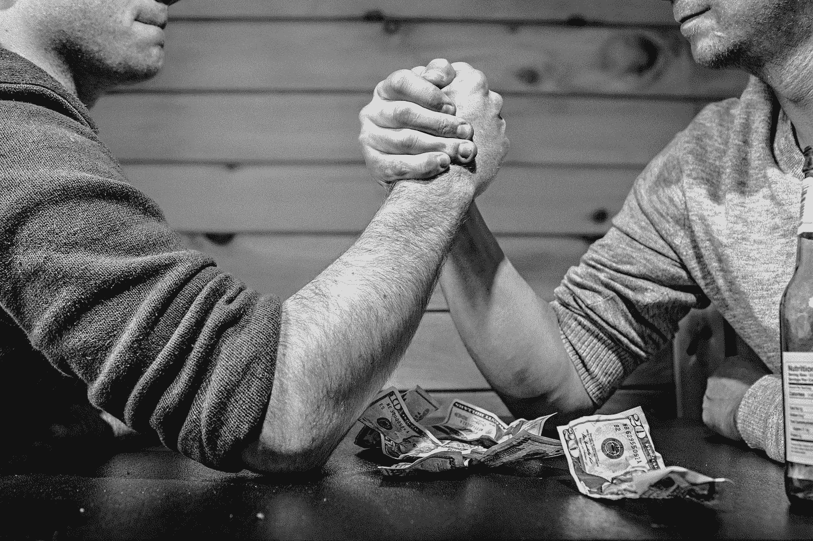
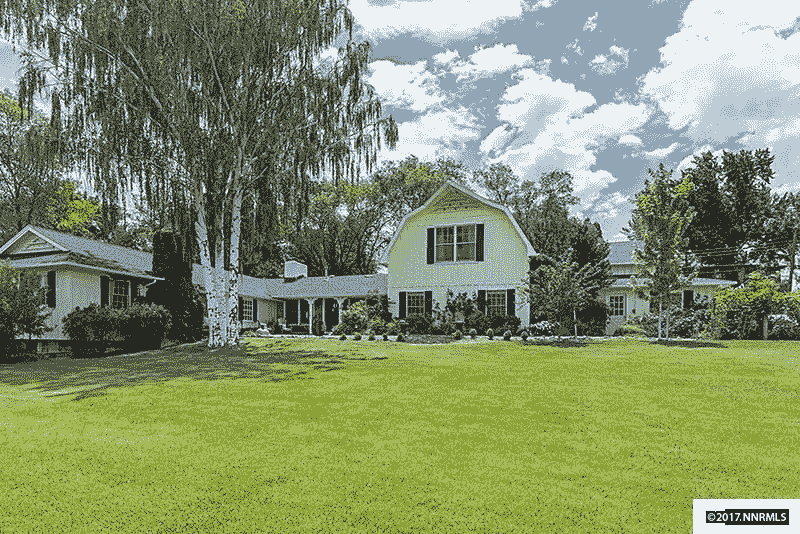

# 踢金钱停滞屁股的三个步骤。

> 原文：<https://medium.com/swlh/3-steps-to-kicking-money-stasis-in-the-ass-a13664aaf778>

## 与现状掰手腕。

你知道那些谈论减肥的人是如何谈论有一个设定点的吗？你的体重是多少就有多少，你可以上下浮动，但你的身体会为停滞而战。至少，理论上是这样。

这是一个关于这个主题的 TED 演讲，我发现它改变了我的生活。

我认为设定点的想法适用于各种情况。人类动物想要平衡和均衡，即使我们并没有主动寻求它。即使我们也真的想要巨大的，丰厚的，丰厚的改变。

最近，我和我的朋友 MaryEllen 谈论这个想法，因为它与金钱有关，我最终感觉自己的眼睛被睁开了——而我甚至不知道它们是闭着的。

我很确定这不是我编的。可能比我聪明得多的人已经说过了。我绝对没有告诉 MaryEllen 任何她不知道的事。但是，我已经处理了体重设定点的事情。我已经减掉了 120 磅。这个想法真的引起了我的共鸣。

 [## 我是这样变胖的

### 我在浏览上周参加的一个令人难以置信的作家会议的照片。当我浏览它们的时候，我…

thecoffeelicious.com](https://thecoffeelicious.com/heres-how-i-got-fat-715fbf58834c) 

我最喜欢的房子这周刚刚挂牌出售。我在网上看了一下，发现主人想要一百万美元。这是一个真正华丽的房子，建于 20 世纪 50 年代，充满了历史和古董真棒，只是唱给我的心。它是黄色的，这是我快乐的颜色。

我特意开车经过这所房子，只是为了能看到它。

但我对它可以出售的想法的反应是耸耸肩——它远远超出了我的价格范围，这有点像看着月亮，不在上面行走也无所谓。

所以，我和我的朋友聊了聊，我告诉了她房子的情况以及它的市场价格。一百万美元。我期望她和我一起笑。相反，她问我为什么我认为我不能有一栋那样的房子。

我是说，很明显我现在不能拥有它。我收入太低了。我的存款不存在了。我的信用分是 604。没有人会给我一百万美元的房屋贷款。

今天。

但是为什么我这么快就打消了*拥有一栋那样的房子的想法呢？*

去年，我的年收入从 20，000 美元增加到了 80，000 美元。那是 4X。我的收入增加了 4 倍，但是增加到能够买下那栋房子(或类似的房子)的想法对我来说是如此的荒谬，以至于我甚至没有真正考虑过。

就像有一堵墙在那里，停滞期想把我拉回到正常的世界，在那里，愚蠢的女孩们认为他们不能住在任何他们想要的老房子里。

> 我们有一个设定点，我们可以梦想稍微高于它，我们可以容忍稍微低于它，但很难(真的很难)超越它。跌入低谷是痛苦的(顺便说一句，即使其他人完全接受我们的现状。比方说，如果奥普拉有一天发现自己处于我的位置，她会不高兴的。)

我不是 100%确定如何处理这突发的灵感。我的意思是，体重设定点是生物性的。金钱的设定点是社会的或心理的，也可能是情感的。这是好消息。

也就是说，现在我意识到我可能正在筑起我自己的无形之墙，我应该能够冲破它们或者攀登它们，对吗？

我打算这样开始:

## 更加注意

我知道有些时候经济机会向我走来，我却错过了。有时候它看起来太大太吓人了。有时所涉及的工作似乎令人难以承受。我将努力积极地意识到这些机会，这样它们不会在我没有登记的情况下与我擦肩而过。

## 意识到布莱斯参与了

我是一名作家，布莱斯是我的内心编辑。她过去最喜欢的一件事就是通过在我的脑海里蹦出一个精彩的、明亮的、闪亮的新想法来分散我对工作的注意力。她也是我完美主义的倡导者。

真的，她是自我保护的。布莱斯知道写作是非常艰苦的工作，她试图给我尽可能多的机会。她在这方面也相当出色，因为她呕吐的原因看起来非常合理，我甚至可以在没有写下一个字的时候感觉到自己在写作。

> 事实证明，布莱斯并不喜欢我的作品。她在我耳边说我最喜欢的房子不适合我。她坚持认为，甚至想得到比我拥有的更多都是贪婪和恶心的。

她也是那个悄悄地坚持认为，我遇到的机会，或者我有增加收入的想法，都太难了。她小声说我真的不想花时间做这项工作。她说。。。当一切都很好的时候，为什么要这样做呢？

我已经很擅长驯服布莱斯了。我知道她想干什么，我能对付她。我想建议，也许你有自己的布莱斯，即使你不是一个作家。

## 启动我的创意泵

我已经在遵循詹姆斯·阿尔特彻的建议，每天列出十个想法。

 [## 如何成为一台该死的思想机器

### 詹姆斯·阿尔图里奇是我新的好朋友。

medium.com](/@shauntagrimes/becoming-an-idea-machine-171fcb1e8a9f) 

我会增加一点点，每天试着想一件事，我可以做些什么来改善我的生意。只有一件事可能会让我的收入增加百分之一。我不会担心它们是否是好主意，或者如何实现它们。

好主意会浮出水面，我会对它们和*如何*到来感到兴奋。

如果你喜欢这个故事，请用心去爱它。❤❤❤

> >在这里注册忍者作家简讯[。(](https://upscri.be/13bf3e/)[我在出任务](/the-mission/getting-to-100-000-subscribers-49273152bd5f)！)
> >或者来[脸书](https://www.facebook.com/groups/1582424518747057/)和忍者们一起闲逛。在我们的 [Patreon 页面](http://www.patreon.com/ninjawriters)上有一些非常棒的奖励。
> >你也可以免费下载我的中篇小说，[破碎的民族](https://instafreebie.com/free/UFtDf)。

***Shaunta Grimes****是作家兼教师。她和丈夫、三个超级巨星的孩子以及一只名叫美宝莲·斯科特的黄色救援犬住在里诺。她在推特上的*@ shauntagrames，*是* *《病毒国与叛逆国》的作者，原* [*忍者作家*](http://www.whatisaplot.com) *。*