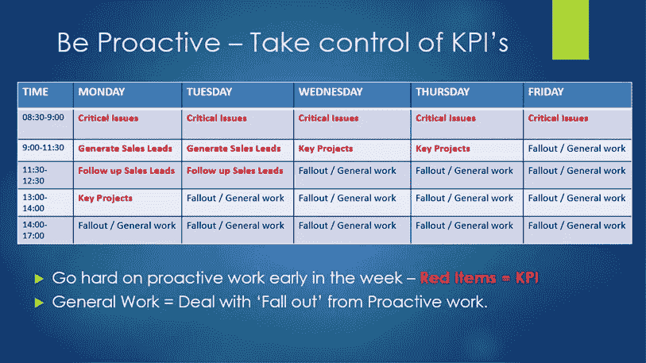

# 提高工作效率的 3 个步骤

> 原文：<https://medium.com/swlh/3-steps-to-workplace-efficiency-31d21d083f11>

Photo by [Glenn Carstens-Peters](https://unsplash.com/photos/RLw-UC03Gwc?utm_source=unsplash&utm_medium=referral&utm_content=creditCopyText) on [Unsplash](https://unsplash.com/search/photos/list?utm_source=unsplash&utm_medium=referral&utm_content=creditCopyText)

关于工作场所的效率和生产力，人们已经说了很多，也写了很多。这是有充分理由的，对于高绩效和雄心勃勃的公司来说，这也是一个至关重要的因素。

人们很容易被“噪音”分散注意力。我们通过各种平台获得源源不断的信息和建议。我们生活在一个充满机遇、战略和我们可以做的事情的世界。

但是我们必须记住在我们的工作任务中什么是 T2 最重要的。我们应该做些什么来实现我们的目标。

这里有 3 个步骤，可以应用到大多数学科，以提高工作效率。

**1)** **你的关键绩效指标是什么？**

令人惊讶的是，我们中有多少人忽略了这一点。你想达到什么目标？我被评判的依据是什么？通常你的 KPI 是由你的公司领导设定的，因此它们非常清晰明了。(销售目标、财务目标等。如果你是自己的老板或自由职业者，你必须明确在你的任务中取得进展的关键因素。弄清楚这些事情很重要，这样你就可以每天都采取行动。这些是你的首要任务，其他项目可能有价值，但关键绩效指标是必须关注的。

2) **分清轻重缓急**

大多数高绩效者都被机会和任务淹没了。因此，在每天/每周的开始，通过待办事项清单和/或时间表来组织你的工作是非常重要的。
 **把你的 KPI 放在第一位，变得积极主动**。不要只对支配你工作的新任务做出反应。

例如:
-如果你的基本 KPI 是销售目标，那么这应该是你放在第一位的项目。开始你的一天和一周，在这上面做积极的工作，并努力去做。所有其他项目可以等待。

让你的结构成为一种习惯。在一周的早些时候做积极的工作，在一周的晚些时候处理掉的/不太重要的项目。

3) **激光聚焦**——当你在处理任务，尤其是 KPI 任务时，排除一切杂念，全神贯注。

人类不是计算机，与普遍的看法相反，他们不能同时处理多项任务，我们一次只能处理一项任务。有些人擅长在任务之间切换，但不管怎样，这不是一种有效的工作方式。

在做一项重要的任务时，要“全力以赴”，全神贯注:

-关闭电脑上的其他窗口
-关闭通知
-没有社交媒体
-没有电子邮件
-与同事隔离(耳机，移动到另一个位置)

如果你 100%地关注某件事，你会对自己的进步感到惊讶。如果我们暴露在周围所有的干扰中，我们的注意力持续时间是非常脆弱和有限的。

**总结**

集中注意力，做好工作！如果你全神贯注，花费的时间会比你想象的少得多。

停止“忙碌”和承担所有的小任务，变得专注和有条理。

——确定你的关键绩效指标。
——分清重点任务的轻重缓急。
-排除杂念，集中注意力。

> **“主要的，就是保持主要的，主要的。”《高效人士的 7 个习惯》的作者斯蒂芬·柯维。**

## 这篇文章发表在 [The Startup](https://medium.com/swlh) 上，这是 Medium 最大的创业刊物，有 310，032+人关注。

## 在这里订阅接收[我们的头条新闻](http://growthsupply.com/the-startup-newsletter/)。

