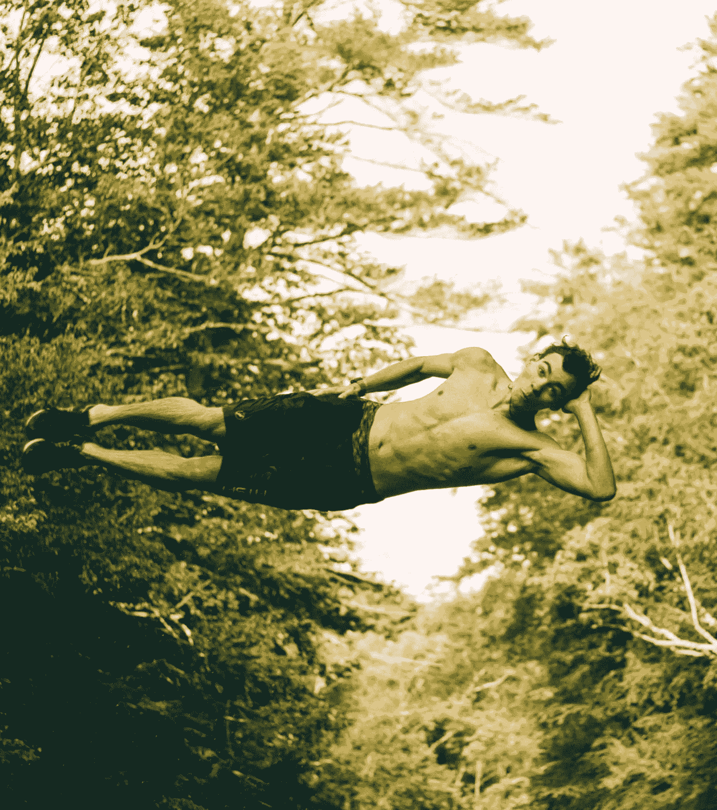
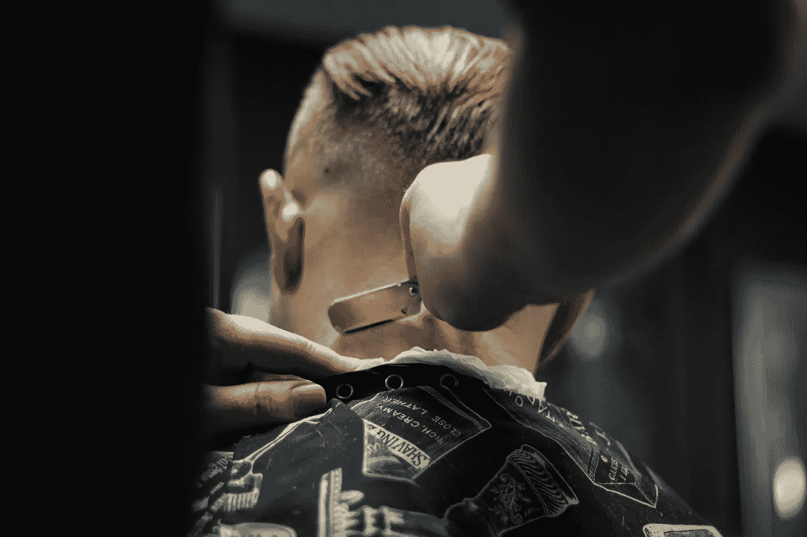

# 3 个愚蠢的简单习惯将有助于增强你的自信，拓展你的意识，提高你的效率。

> 原文：<https://medium.com/swlh/3-stupid-simple-habits-that-will-help-boost-your-confidence-expand-your-consciousness-and-453fd76cc7df>

Photo by [Peter Forster](https://unsplash.com/photos/XSmEMScAORY?utm_source=unsplash&utm_medium=referral&utm_content=creditCopyText) on [Unsplash](https://unsplash.com/search/photos/skydive?utm_source=unsplash&utm_medium=referral&utm_content=creditCopyText)

# ***用砍刀……***

你知道什么是 T4 制图员吗？

很多人都不知道。

由于没有更好的说法，制图员是地图制作者。

太多的人在应该扮演*冒险家*角色的时候却被**困在**扮演*制图员*角色。

## 现代意义上的*制图员*就是**策划人**:

*   他们正忙着把所有的零件组装起来，这样他们就可以起航了。
*   他们打算画一张地图，这样他们就知道该去哪里了。
*   他们正在规划一条几乎没有犯错余地的路线。

## 现代意义上的*冒险家*是**行动者:**

*   即使在他们之前没有人迈出第一步，他们也会迈出第一步。
*   他们不怕失败，不怕犯错，也不怕需要再试一次。
*   他们在未知和新发现的可能性中茁壮成长。

Photo by [Annie Spratt](https://unsplash.com/photos/kZO9xqmO_TA?utm_source=unsplash&utm_medium=referral&utm_content=creditCopyText) on [Unsplash](https://unsplash.com/search/photos/map?utm_source=unsplash&utm_medium=referral&utm_content=creditCopyText)

**行动者**没有绘制地图；她正拿着弯刀徒步砍断她面前茂密的丛林。当然，她可能会掉进流沙坑，被蛇咬，或者跋涉到一个死胡同。

然而，她却在前线，一次拿着砍刀在她面前砍下一小片财宝。

我们不再需要制图师了。当然，他们有他们的角色。但是你并不想扮演这个角色。

你正在寻找新的行业或机会。

> **制图** *孕育着更多细节的提炼，更多的不确定性，更多的计划和更多的时间浪费。*
> 
> 冒险孕育了更多的发现、更多的洞察力、更多的学习、更多的执行力和更多值得花的时间。

养成每天摆脱头脑并采取行动的习惯。当然你可能会摔倒。当然，你可能会从错误的起点出发。当然，你可能会把时间和资源花在不太理想的方向上。

但至少你在移动。

# ***磨快你的砍刀。***

Photo by [Chris Knight](https://unsplash.com/photos/vI3m5UnZ0aQ?utm_source=unsplash&utm_medium=referral&utm_content=creditCopyText) on [Unsplash](https://unsplash.com/search/photos/barber?utm_source=unsplash&utm_medium=referral&utm_content=creditCopyText)

我在厨房做了多年的厨师。

我记得我在厨房里学到的第一课。

我正在切西红柿，很难切到均匀、笔直的切片。

厨师走过来，从我手里夺过我的刀，骂了我一顿，

> “厨房里最重要的工具是一把锋利的刀。当你有一把钝刀子时，你就不能切你正在加工的原料。这也是非常不安全的。为了完成这项工作，你需要不断地修改。**永远保持你的刀锋利。**

我没有马上明白他的意思。

一把超级锋利的刀不会有危险吗？它很容易割伤人。

随着时间的推移，我意识到当你学会如何挥刀时，锋利是最重要的。

那么，作为**的行动者**，这有什么反映呢？用**弯刀**怎么平行？

当你以行动为基础时，你需要一直提高你的**敏锐度**。你需要成长，从你的错误中学习，并回到那里，不断清除你周围的不确定性。

你如何磨你的弯刀？

> *阅读。*

有许多冒险者有着和你正在寻找的相似的经历和成就。

人们说经验是最好的老师。可能是这样。

阅读模范人物的生活和故事一定是最好的老师。

> 通过阅读磨快你的弯刀。每天。

如果你想了解更多关于关系的知识，并且当你约别人出去的时候总是摔得头破血流，读一本关于关系的书吧。

如果你想更多地了解互联网和社交媒体营销，因为你一直在发送促销信息，但没有获得太多的牵引力，请阅读一本关于社交媒体营销的书。

养成每天磨利弯刀的习惯，这样你就能更好地装备自己，去揭露你所处的丛林的不确定性。

# ***擦干净你的砍刀。***

Photo by [Nik MacMillan](https://unsplash.com/photos/qyvm0zXdKYE?utm_source=unsplash&utm_medium=referral&utm_content=creditCopyText) on [Unsplash](https://unsplash.com/search/photos/clean?utm_source=unsplash&utm_medium=referral&utm_content=creditCopyText)

任何没有得到妥善保管的工具都将失去其原本的效用。

如果你没有好好照顾自己和你的弯刀，你会看到你的努力逐渐减弱。

在每天的基础上，你应该确保你得到适当的补充。

*   确保你没有用缺乏营养的食物来毁坏你的身体。
*   确保你正在进行适当的锻炼，为身体和大脑补充氧气。
*   确保你的“空间”整洁有序。你的空间是你思想的直接反映。你不能在杂乱的空间工作。
*   确保你对自己的健康采取更多的预防性措施，而不是反应性的 T21 措施。在战争中，如果你总是对敌人做出反应，他就牢牢地控制着你的一举一动(这里的敌人是健康状况不佳)。

干净的工具将有助于在你的习惯所建立的基于行动的生活中不断提高生产力。

*   行动减少不确定性。
*   行动增加信心。
*   行动增加工作产出。
*   行动教导。

所有这些特征都是有意识地决定首先**选择使用弯刀、磨快弯刀和清洁弯刀**的直接结果，所有这些都是习惯性的、定期的。

# 还有谁想自己当老板？

## 我提供给你一个经过测试和验证的 6 部分指南，它包含了强大的概念，可以帮助你识别、规划、成长和完成你的创造性追求。

# [> > >在此获得免费指南< < <](https://mailchi.mp/4b982beed325/free-6-step-course)

## 学到了什么？按住👏说“谢谢！”并帮助他人找到这篇文章。还评论！