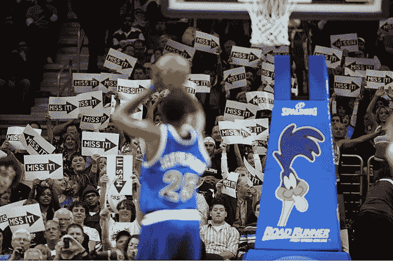
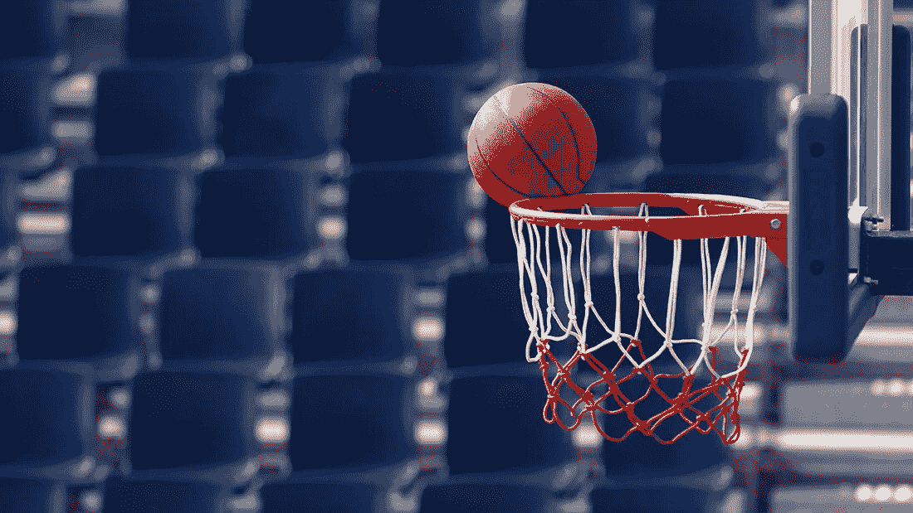
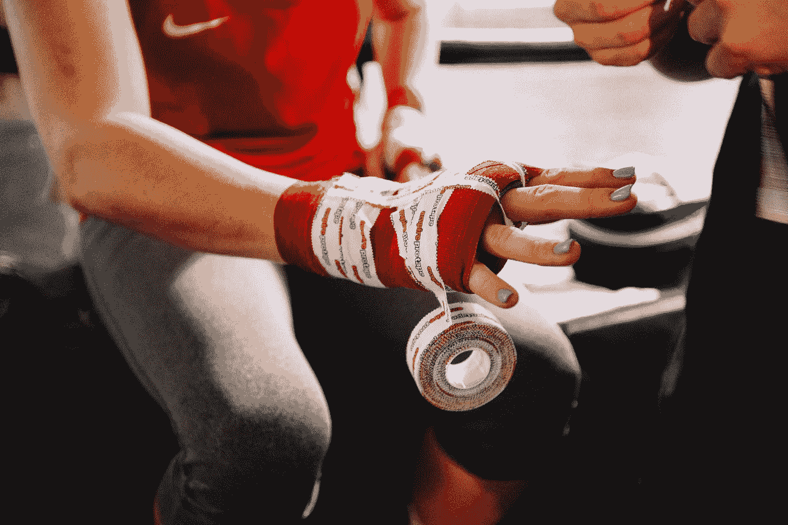

# 当有人骚扰你时，自我纠正的 3 个技巧。

> 原文：<https://medium.com/swlh/3-techniques-to-self-correct-when-someone-rattles-you-eb29bf0cb1f1>

基于一次不愉快的经历。

篮球是我最喜欢看的运动。不像在足球比赛中，球员的脸被遮住，也不像在棒球和足球比赛中，他们看起来像球场上的小眼镜，在篮球比赛中，你可以近距离、真实地看到球员脸上的表情。

我最喜欢的画面是一个 NBA 球员准备罚球时的眼神，因为手头的任务远不止是把球投进篮筐。他睡觉时也能做到。

> *他真正的任务是* ***不被弄得慌乱...***

…屏蔽掉除了他之外其他人的所有目光*、队友充满希望的目光、对手充满恶意的目光、观众充满愤怒的目光，以及向国内数百万观众转播的摄像机故意投来的目光。*

如果是季后赛，就像我们现在正在进行的那样，他还有一个额外的挑战，那就是淹没对手篮筐后面最吵闹的球迷，他们配备了充气噪音管和贬损海报，唯一的任务就是让他不安。

你和我可能不是 NBA 球员，但我们确实时不时地罚球，压力也在我们身上。一名员工在提出加薪要求时进行了尝试。一个企业家在向投资者推销时会出手。一个候选人在竞争一个职位的时候试一试。一个销售人员每一次打烊都要拍一张照片。

尽管我们的罚球看起来完全不同，但它们最终都会导致两种结果:我们要么投中，要么错过。而且很可能有各方投资，以确保它是一个失误。

It’s ok to miss.

最近上班要加紧罚球了。我在一家科技初创公司  工作，我的角色是“内部创业”我构思、构建、测试创新产品，并将其集成到我们的服务产品中。我从事的大部分工作都是探索性的想法，可能会有很大的影响，但以前从未被测试过。换句话说，在之后的*之前，我无法证明 ROI(投资回报),我已经说服公司的一个关键利益相关者投入资源让我测试。*

我为目前正在开发的产品制定了战略和执行计划。现在我所要做的就是把它呈现给公司的一个上级，并得到他的认可。到这个时候，我已经排练了很多次，就像肌肉记忆一样。我本可以在睡梦中发表演讲。但就在会议开始前，上级说:

> “我看到你在我的日历上安排了一次会议。我希望你不会再浪费我的时间了…”

啊啊啊啊！我的信心被打击了。我惊慌失措，心烦意乱。当我放映我的 powerpoint 幻灯片，分发我的幻灯片副本时，我实际上在场，但我的思想已经走神了，在过去的会议中穿梭，试图找出是什么让他这么说。如果他觉得我过去浪费了他的时间，他肯定直到现在才说出来…

我做了陈述，但是不可否认，我全神贯注于利益相关者的评论，我失去了平衡。我知道，他也知道。我仍然得到了他的认可，因为我的演讲内容很扎实。所以，从技术上来说，我做了比喻性的罚球，但球在篮筐周围反弹了一点。不理想。

在他离开会议室之前，这位利益相关者澄清说，他故意这么说是为了说明当有人攻击我时，我会明显失去信心。

这是一个具有教育意义的时刻，对此我心存感激。

利益相关者提醒我，虽然这次是故意的教训，但随着我职业生涯的发展，这样的情况会经常发生，他建议我找出如何自我纠正。他是对的。作为一名有抱负的企业家，我可能会发现自己试图向那些唯一目标是找到拒绝愿景的理由的人推销愿景。

**当这种情况发生时，我想出了 3 个技巧放在我的后兜里:**

第一步是认识到你已经慌乱了，然后花一点时间安静下来。沉默让人感觉不舒服，因为它看起来像是一种弱点，但实际上不是。*沉默是在疯狂的状态下召唤你的平静。*

就我个人而言，我能意识到自己慌乱的时候，因为我被一种防御能量所征服，然后觉得有必要发泄出来。点头表示同意？通过片刻的沉默，你可以避免潜在的混乱后果。你需要做的下一件事，是选择如何回应。

您可以:

# 1.把刺戳变成一个问题。

当我措手不及时，我觉得我失去了对谈话的控制，然后我的注意力从谈话本身转移到让我分心的东西上。但是，带着疑问，我可以收回方向盘。在这个例子中，我可以回答这样一个问题，“你能指出过去你觉得我浪费你时间的一个例子吗，这样我就可以在这次会议中避免犯同样的错误？”

这种方法的优点是利益相关者必须花一些时间来想出一个回应，很可能会让*他*放松警惕。我也可以利用他的回应来更好地引导这次对话。在本例中，如果利益相关方表示在上次会议中浏览议程是浪费时间，那么我会知道这次跳过议程幻灯片。

然而，另一方面，用一个问题来回答会让人感觉不舒服。所以这个要慎用。

# 2.张开双臂迎接刺拳。

我可以回答说，“看。你说得对。我承认我可能在过去的会议上浪费了你的时间，但我正在努力。”这种方法的好处是，承认他指出的弱点，并向他保证我会努力改进，这可能会安抚他。

然而，从另一方面来说，如果你试图在谈话中坚持自己的主导地位，承认自己的弱点可能是违反直觉的。当所有各方已经为同一个团队工作时，这种方法可能最有效，就像这个涉众和我是同事一样。

# 3.内心承认刺拳，但外表忽略它。

我可以假装我没有听到评论，像往常一样继续演讲，然后在下班回家后思考我的想法。这里最大的挑战是，如果你真的不受影响，假装你不受影响是很难做到的。这是我在这个例子中尝试的方法，它显然不起作用。利益相关者马上就能看出来，尽管我会说他非常精明。

然而，这次经历给了我两大教训。

Let’s GO. (Photo by [dylan nolte](https://unsplash.com/photos/qxYDhV0rBPk?utm_source=unsplash&utm_medium=referral&utm_content=creditCopyText) on [Unsplash](https://unsplash.com/search/photos/fight?utm_source=unsplash&utm_medium=referral&utm_content=creditCopyText))

# 第一课

光是练习，会带你从优秀走向伟大，但不会从伟大走向最伟大。一名 NBA 球员可以站在罚球线上，在每次训练中连续投进 100 个球，但如果他不能在比赛日的压力下表现，那就没有任何意义。为了实现从伟大到最伟大的飞跃，你必须在高压锅环境中练习表演，当**一些真实的东西处于危险之中。**

尽可能多地在比赛日拍照:在现实世界中，对一名员工来说，这意味着抓住每一个向利益相关者展示的机会。对于一个求职者来说，意味着要参加无数次面试。对于创始人来说，这意味着向尽可能多的投资者推销。而且不管你错过多少次，你都要继续多拿。

# 第二课

就像一名 NBA 球员例行回顾他的比赛录像一样，你也需要花时间剖析你的每一个最后动作，反思是什么影响了结果，并利用这种洞察力来沉下你的下一次投篮。

下一个镜头。

下一个镜头。

热烈欢迎您的想法和掌声，非常感谢您继续阅读！

Instagram: [@kaeyainc](https://www.instagram.com/kaeyainc/)

推特: [@kaeyainc](https://twitter.com/kaeyainc)

## 这篇文章发表在 [The Startup](https://medium.com/swlh) 上，这是 Medium 最大的创业刊物，有 328，729+人关注。

## 在这里订阅接收[我们的头条新闻](http://growthsupply.com/the-startup-newsletter/)。

