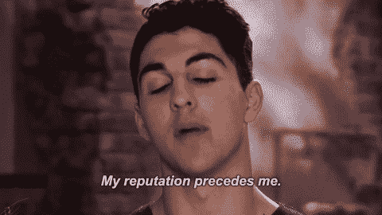

# 3 个经过检验的“声誉武器”每个品牌都需要赢得声誉

> 原文：<https://medium.com/swlh/3-tested-reputation-weapons-every-brand-needs-to-win-860efbf54b13>

## 为什么每个行业都有随之而来的「包袱」？甚至在我们开始对话之前就玷污了人们对我们的看法的包袱？以下是掌握主动权并回到驾驶位置的方法。

每个行业都有我们都知道的“T2”名声包袱。我们都知道的那种包袱，如历史、习惯、“代表”，最糟糕的是*在你出现之前先入为主的观念。*

这就像一个认识你的哥哥姐姐的人根据和你哥哥姐姐的经历(好的或坏的)来判断你、你的想法、你的价值观和你的价值。

每个行业都有这个。

每个工作岗位都有这个。

每个街区都有这个。

每个城市都有这个。

这就是为什么我在本周的*周三一分钟中提到这个话题。*

在这篇文章中，我只谈论你的职业——你选择的职业——以及你所选择的行业，它是你留下印记并在宇宙中留下印记的平台。

> 你的第一个障碍:你选择的行业的声誉。(正如任何职业所要求的那样，你需要做好应对障碍的准备，不要让它们成为借口。)

如果你选择成为一名厨师，并建立一个食品帝国，这个行业是有声誉的。

如果你选择成为一名设计师，或者时尚评论家，或者作家，或者艺术家，或者硅谷的“企业家”，这些行业中的每一个都有一个在你出现之前就已经存在的名声。

在你出现之前。

# 领导者用来避免继承行业包袱的三种武器

我已经和世界各地的客户和他们的品牌对这些“武器”进行了“路试”，它们决定了是世界在定义你的品牌故事，还是你在世界上定义你的品牌。

他们在这里:

1.  知道自己为什么进入这个行业。彻底了解它。
2.  记住，当人们试图把“其他人在你的行业中所做的(或习惯做的)”强加给你时，要准备好解决这个问题，并且
3.  总是给予(并包括在你的给予中)教育，让别人超越 ***过去发生的事情*** 去发现 ***现在可能发生的事情*** 既然你在这里。

换句话说，做一个运动。

正如我在这里解释的那样，做一场准备彻底改革一些老的“圣牛”的革命，这些“圣牛”准备被带去放牧。

不要让你的行业决定你在世界上的形象。

你和其他人不一样。为什么要被别人认为你是？

掌握主动权。

决定改变行业，扩大自己的势力范围。

准备好让你的品牌做以前的品牌没有做的事情。

不知道怎么样？给我写封短信。

## 从这篇文章中获得了价值？
然后鼓掌，分享，关注我，订阅我的 [YouTube 频道](https://www.youtube.com/user/headmusik)，每周都有新视频。需要一个品牌重塑或一个难忘的主题演讲人？在这里找到我。

## 这篇文章发表在 [The Startup](https://medium.com/swlh) 上，这是 Medium 最大的创业刊物，拥有+364，117 名读者。

## 在这里订阅接收[我们的头条新闻](http://growthsupply.com/the-startup-newsletter/)。

